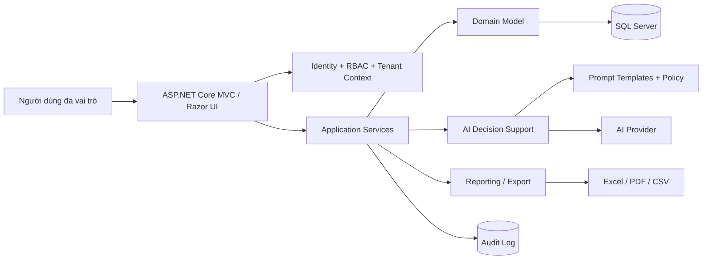
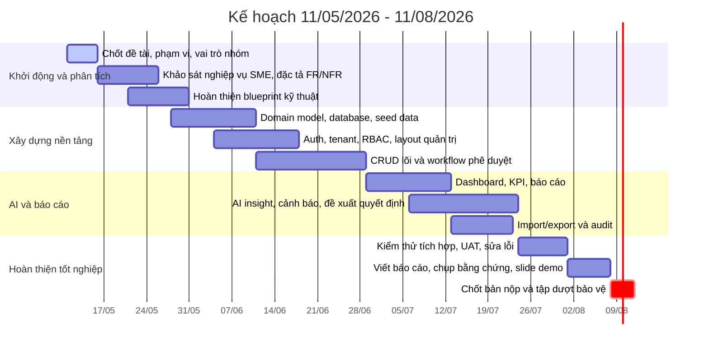

# OmniBizAI - Bộ tài liệu dự án tốt nghiệp

> Đề tài: **Hệ thống vận hành thông minh cho doanh nghiệp vừa và nhỏ, hỗ trợ quản lý đa cấp và đưa ra quyết định bằng AI**  
> Deadline dự kiến: **11/08/2026**  
> Giai đoạn triển khai chính tính đủ 3 tháng từ **11/05/2026 - 11/08/2026**.

## 1. Mục đích bộ tài liệu

Bộ tài liệu này được viết để nhóm có thể dùng song song cho ba việc:

| Tài liệu | Mục đích | Người dùng chính |
| --- | --- | --- |
| [01-Technical-Implementation-Blueprint.md](./01-Technical-Implementation-Blueprint.md) | Đủ rõ để chia task và code ngay: kiến trúc, dữ liệu, service, route, validation, test | Backend, frontend, tester, PM |
| [02-Graduation-Project-Report.md](./02-Graduation-Project-Report.md) | Khung báo cáo tốt nghiệp đầy đủ để nộp/trình bày, có chương mục học thuật | PM, BA, cả nhóm |
| [03-User-Guide.md](./03-User-Guide.md) | Hướng dẫn sử dụng hệ thống theo vai trò và luồng nghiệp vụ | Người dùng demo, giảng viên, tester |
| [04-Requirements-and-Use-Cases.md](./04-Requirements-and-Use-Cases.md) | Yêu cầu hệ thống, actor, use case diagram, use case description, FR/NFR | PM, BA, tester |
| [05-System-Design-and-Diagrams.md](./05-System-Design-and-Diagrams.md) | Catalog sơ đồ, architecture, class, sequence, activity, sitemap, deployment | Dev, PM, báo cáo |
| [06-Database-Design.md](./06-Database-Design.md) | ERD Code First 64 bảng, database diagram theo module, data dictionary lõi, ràng buộc, script SQL | Backend, database, tester |
| [07-Testing-Deployment-Maintenance.md](./07-Testing-Deployment-Maintenance.md) | Test plan, test case, bug report, deployment guide, maintenance guide | Tester, backend, PM |

## 2. Thông tin nhóm

| Vai trò | Thành viên | Trách nhiệm chính |
| --- | --- | --- |
| Giáo viên hướng dẫn | Thầy Khải | Định hướng phạm vi, góp ý nghiệp vụ, duyệt tiến độ |
| PM, BA, tài liệu | Quân | Quản lý tiến độ, phân tích yêu cầu, đặc tả, báo cáo, demo script |
| Frontend developer | Như | Razor UI, layout, dashboard, form nhập liệu, responsive |
| Frontend developer | Nhật | UI module nghiệp vụ, tương tác AJAX, biểu đồ, hướng dẫn sử dụng |
| Backend developer | An | Domain model, EF Core, tenant/RBAC, workflow service |
| Backend developer | Bảo | Module vận hành, báo cáo, import/export, tích hợp dữ liệu |
| Backend developer | Phong | AI decision support, audit log, notification, API nội bộ |
| Tester | Khánh | Test plan, test case, regression, UAT, bằng chứng kiểm thử |

## 3. Phạm vi hệ thống

OmniBizAI là hệ thống vận hành cho doanh nghiệp vừa và nhỏ theo mô hình nhiều cấp quản lý. Hệ thống phải cho phép doanh nghiệp cấu hình cơ cấu tổ chức, người dùng, phân quyền, quy trình phê duyệt, dữ liệu vận hành, báo cáo và trợ lý AI hỗ trợ ra quyết định.

### 3.1. Nhóm chức năng bắt buộc

| Nhóm | Chức năng |
| --- | --- |
| Quản trị hệ thống | Tenant, hồ sơ doanh nghiệp, cấu hình module, cấu hình AI, nhật ký hệ thống |
| Tổ chức đa cấp | Phòng ban, chức danh, nhân sự, tuyến báo cáo, sơ đồ phân quyền |
| Người dùng và phân quyền | Đăng nhập, vai trò, quyền chức năng, quyền theo phòng ban/dữ liệu |
| Vận hành nghiệp vụ | Khách hàng, nhà cung cấp, sản phẩm/dịch vụ, đơn yêu cầu, công việc, phê duyệt |
| Quản lý tài chính cơ bản | Yêu cầu thanh toán, ngân sách, chi phí, trạng thái duyệt |
| KPI và báo cáo | KPI cấp công ty/phòng ban/cá nhân, dashboard, báo cáo xuất file |
| AI hỗ trợ quyết định | Tóm tắt tình hình, cảnh báo rủi ro, đề xuất hành động, hỏi đáp dữ liệu |
| Import, thông báo, audit | Import staging, validate dữ liệu, notification, audit log, lịch sử thay đổi |
| Kiểm thử | Test case, bug report, bằng chứng nghiệm thu |

### 3.2. Nguyên tắc sản phẩm

- Không hard-code nghiệp vụ riêng của một doanh nghiệp vào controller/view.
- Hành vi có thể thay đổi theo doanh nghiệp phải đưa vào cấu hình: vai trò, quyền, trạng thái, form, workflow, dashboard widget, prompt AI.
- Tách rõ dữ liệu theo tenant.
- Quyền truy cập phải ảnh hưởng cả route/controller và menu/sidebar.
- Mọi thao tác quan trọng phải có validation, audit log và thông báo lỗi dễ hiểu.
- AI chỉ hỗ trợ quyết định, không tự thay người dùng phê duyệt nghiệp vụ có rủi ro.

## 4. Sơ đồ tổng quan tài liệu

```mermaid
flowchart TB
    A["Đề tài tốt nghiệp OmniBizAI"] --> B["Blueprint kỹ thuật"]
    A --> C["Báo cáo tốt nghiệp"]
    A --> D["Hướng dẫn sử dụng"]
    A --> E["Yêu cầu + Use Case"]
    A --> F["Sơ đồ thiết kế"]
    A --> G["Database + SQL"]
    A --> H["Test + Deploy"]

    B --> B1["Kiến trúc"]
    B --> B2["Domain model"]
    B --> B3["Route/UI/API"]
    B --> B4["AI + RBAC + Workflow"]
    B --> B5["Test plan"]

    C --> C1["Cơ sở lý thuyết"]
    C --> C2["Phân tích yêu cầu"]
    C --> C3["Thiết kế hệ thống"]
    C --> C4["Cài đặt + kiểm thử"]
    C --> C5["Đánh giá + kết luận"]

    D --> D1["Hướng dẫn theo vai trò"]
    D --> D2["Luồng thao tác"]
    D --> D3["FAQ + xử lý lỗi"]

    E --> E1["Actor"]
    E --> E2["FR/NFR"]
    E --> E3["Use Case Description"]

    F --> F1["Class Diagram"]
    F --> F2["Sequence Diagram"]
    F --> F3["Deployment Diagram"]

    G --> G1["ERD"]
    G --> G2["Data Dictionary"]
    G --> G3["SQL Script"]

    H --> H1["Test Case"]
    H --> H2["Bug Report"]
    H --> H3["Maintenance"]
```

## 5. Kiến trúc mục tiêu một màn hình

## 6. Mốc tiến độ 3 tháng

## 7. Definition of Done

| Hạng mục | Điều kiện hoàn thành |
| --- | --- |
| Code | Build thành công, không lỗi runtime ở luồng chính, không hard-code dữ liệu demo trong controller |
| Database | EF Core Code First rõ ràng, migration tạo được schema, seed chạy được, dữ liệu mẫu đủ cho demo |
| UI | Menu đúng quyền, form có validation, responsive ở desktop/tablet |
| AI | Có kiểm soát prompt, log kết quả, lỗi API được xử lý thân thiện |
| Test | Có test case, bằng chứng pass/fail, bug được phân loại |
| Báo cáo | Có hình/sơ đồ/bằng chứng, chương mục đầy đủ, nội dung khớp code |
| Demo | Có tài khoản demo, script demo, dữ liệu mẫu và phương án dự phòng |

## 8. Quy ước cập nhật tài liệu

- Khi đổi model/service/route, cập nhật [blueprint kỹ thuật](./01-Technical-Implementation-Blueprint.md) trước hoặc cùng PR.
- Khi đổi yêu cầu, actor, quyền hoặc use case, cập nhật [tài liệu yêu cầu và Use Case](./04-Requirements-and-Use-Cases.md).
- Khi đổi kiến trúc, controller, class/service hoặc luồng xử lý, cập nhật [thiết kế hệ thống và sơ đồ](./05-System-Design-and-Diagrams.md).
- Khi đổi bảng/cột/index/migration, cập nhật entity/mapping Code First trước, sau đó cập nhật [database design](./06-Database-Design.md) và script SQL sinh từ migration.
- Khi đổi luồng test, triển khai hoặc bảo trì, cập nhật [kiểm thử/triển khai/bảo trì](./07-Testing-Deployment-Maintenance.md).
- Khi có ảnh màn hình, test evidence, benchmark, cập nhật [báo cáo tốt nghiệp](./02-Graduation-Project-Report.md).
- Khi UI đổi luồng thao tác, cập nhật [hướng dẫn sử dụng](./03-User-Guide.md).
- Các phần chưa có bằng chứng thật phải để trạng thái `Cần bổ sung bằng chứng`, không viết như đã hoàn thành.

## 9. Checklist sơ đồ và hồ sơ nộp

| Hạng mục | File Markdown | Trạng thái |
| --- | --- | --- |
| Use Case Diagram | [04-Requirements-and-Use-Cases.md](./04-Requirements-and-Use-Cases.md) | Đã có |
| Use Case Description | [04-Requirements-and-Use-Cases.md](./04-Requirements-and-Use-Cases.md) | Đã có |
| ERD / Database Diagram | [06-Database-Design.md](./06-Database-Design.md) | Đã mở rộng thành 64 bảng Code First |
| Data Dictionary | [06-Database-Design.md](./06-Database-Design.md) | Đã có bản thiết kế |
| Class Diagram | [05-System-Design-and-Diagrams.md](./05-System-Design-and-Diagrams.md) | Đã có |
| Sequence Diagram | [05-System-Design-and-Diagrams.md](./05-System-Design-and-Diagrams.md) | Đã có 3 luồng |
| Activity Diagram | [05-System-Design-and-Diagrams.md](./05-System-Design-and-Diagrams.md) | Đã có |
| Architecture Diagram | [05-System-Design-and-Diagrams.md](./05-System-Design-and-Diagrams.md) | Đã có |
| Sitemap / Navigation | [05-System-Design-and-Diagrams.md](./05-System-Design-and-Diagrams.md) | Đã có |
| Deployment Diagram | [05-System-Design-and-Diagrams.md](./05-System-Design-and-Diagrams.md) | Đã có |
| Test Plan/Test Case/Bug Report | [07-Testing-Deployment-Maintenance.md](./07-Testing-Deployment-Maintenance.md) | Đã có bản khung |
| Deployment/Maintenance Guide | [07-Testing-Deployment-Maintenance.md](./07-Testing-Deployment-Maintenance.md) | Đã có bản khung |
| SQL Script | [sql/Create_Database.sql](./sql/Create_Database.sql) | Artifact sinh từ EF Core migration; script hiện tại là khung và cần generate lại khi migration ổn định |
