# OmniBizAI - Tài Liệu Tổng Hợp Triển Khai, Coding Và Hướng Dẫn Sử Dụng

> Phiên bản: 3.0  
> Ngày cập nhật: 2026-04-26  
> Mục đích: Là tài liệu trung tâm để nhóm có thể code, test, demo, bảo trì và xuất DOCX báo cáo thực tập.  
> Nguyên tắc bảo mật: Không ghi password thật, API key thật hoặc secret thật trong tài liệu này.

## Mục Lục Ngắn

1. Tóm tắt quyết định chính.
2. Phạm vi MVP và tính năng nổi bật.
3. Kiến trúc, chuẩn code và bộ sơ đồ hệ thống.
4. Chuẩn UX và giao diện.
5. Database blueprint.
6. Phân quyền và data scope.
7. Đặc tả module code-ready.
8. Route map MVC và JSON phụ trợ.
9. Seed data bắt buộc.
10. Phân công công việc cho 7 thành viên.
11. Testing và acceptance criteria.
12. DevOps và quy trình chạy dự án.
13. Hướng dẫn sử dụng hệ thống cho người không chuyên.
14. Đặc tả bổ sung để code không cần hỏi.
15. Checklist đủ điều kiện coding 100%.
16. Phụ lục xuất DOCX.
17. Khung báo cáo học thuật bổ sung.

## 1. Tóm Tắt Quyết Định Chính

### 1.1 Mục tiêu hệ thống

OmniBizAI là hệ thống vận hành doanh nghiệp thông minh cho doanh nghiệp vừa và nhỏ. Hệ thống giải quyết các vấn đề hiện nay của nhiều doanh nghiệp:

- Dữ liệu tài chính, KPI, nhân sự và phê duyệt bị rời rạc.
- Quy trình duyệt chi chậm, thiếu minh bạch, khó truy vết.
- Quản lý ngân sách chủ yếu phản ứng sau khi đã vượt chi.
- KPI/OKR dễ trở thành hình thức nếu không có check-in, cảnh báo và phân tích.
- Báo cáo thủ công mất thời gian, khó có góc nhìn điều hành kịp thời.
- AI trong nhiều hệ thống chỉ là chatbot hỏi đáp, chưa trở thành trợ thủ theo vai trò.

MVP phải chạy được, dễ dùng, đủ sâu kỹ thuật để bảo vệ đồ án và đủ rõ để code theo tài liệu mà không cần tự đoán nghiệp vụ.

### 1.2 Quy mô SME mục tiêu

Hệ thống được thiết kế cho doanh nghiệp vừa và nhỏ, không phải tập đoàn nhiều công ty con. Mọi dữ liệu seed, dashboard, workflow và test hiệu năng phải bám theo quy mô này để demo thực tế, dễ hiểu và không bị "quá tay" như hệ thống enterprise.

| Hạng mục | Quy mô MVP chuẩn |
|---|---:|
| Số công ty | 1 |
| Số phòng ban | 7 (6 phòng ban vận hành + Ban Giám Đốc) |
| Số nhân sự active | 45 |
| Số vai trò hệ thống | 6 |
| Số user đăng nhập demo | 12 |
| Số kỳ dữ liệu tài chính/KPI | 6 tháng gần nhất + quý hiện tại |
| Số ngân sách đang quản lý | 18 |
| Số đề nghị thanh toán mẫu | 36 |
| Số giao dịch mẫu | 120 |
| Số vendor mẫu | 15 |
| Số KPI mẫu | 36 |
| Số market insights mẫu | 24 |
| Số AI recommendations mẫu | 18 |

Giới hạn thiết kế cho MVP:

- Một database SQL Server duy nhất đủ cho demo và triển khai SME.
- Dashboard mặc định chỉ tải dữ liệu kỳ hiện tại; dữ liệu lịch sử tải theo bộ lọc.
- Danh sách luôn có phân trang 20 dòng/trang.
- Báo cáo mặc định theo tháng/quý, không tải toàn bộ lịch sử nếu người dùng chưa chọn.
- AI chỉ nhận dữ liệu đã tổng hợp, citation và top records liên quan; không nhồi toàn bộ database vào prompt.
- Seed data phải có tình huống thật: vượt ngân sách, KPI trễ, vendor tăng chi phí, PR bị từ chối, PR cần chỉnh sửa, giao dịch đã reverse.

### 1.3 Công nghệ chốt

| Hạng mục | Quyết định triển khai |
|---|---|
| Web framework | ASP.NET Core 10 MVC |
| View layer | Razor Views, Tag Helpers, ViewComponents |
| Architecture | Modular MVC Monolith, 1 project |
| ORM | Entity Framework Core 10 |
| Database | SQL Server, database `OmniBizDB` |
| Auth | ASP.NET Identity + cookie cho MVC; không dùng JWT/Bearer token trong MVP |
| Realtime | SignalR notification hub |
| Cache | Redis 7.x qua `ICacheService`; khi chạy unit test dùng in-memory fake |
| AI provider | Gemini |
| AI model | `gemini-1.5-flash` |
| Market intelligence | Dữ liệu thị trường curated do Admin/PM nhập, upload hoặc seed |
| UI framework | Bootstrap 5 + Bootstrap Icons |
| Chart library | Apache ECharts dùng trong Razor Views qua JavaScript |
| Validation | FluentValidation/DataAnnotations trong service/input model, unobtrusive validation cho Razor |
| Mapping | AutoMapper |
| PDF export | QuestPDF |
| Excel export | ClosedXML |
| File storage MVP | Local disk qua `IFileStorageService`, path `wwwroot/uploads` |
| Background jobs MVP | ASP.NET Core `BackgroundService` + bảng `background_jobs` |
| Testing | xUnit, Moq, Playwright, k6 MVC smoke; Testcontainers dùng sau nếu cần integration sâu |
| Export | PDF/XLSX cho báo cáo |

### 1.4 Cấu hình môi trường bắt buộc

Không ghi password thật vào tài liệu nộp báo cáo. `.env` hoặc user secrets sẽ giữ secret thật.

```env
ASPNETCORE_ENVIRONMENT=Development

ConnectionStrings__DefaultConnection=Server=(localdb)\mssqllocaldb;Database=OmniBizDB;Trusted_Connection=True;MultipleActiveResultSets=true;

AI__Provider=Gemini
AI__Model=gemini-1.5-flash
AI__ApiKey=***

Redis__ConnectionString=localhost:6379
AllowedHosts=localhost
```

Khi dùng SQL Server remote hoặc VPS, connection string thật đặt trong `.env`, user secrets hoặc cấu hình môi trường của host, không commit vào repository.

### 1.5 Thành viên và vai trò

| Thành viên | Vai trò chính | Trách nhiệm chính |
|---|---|---|
| Quân | PM | Quản lý scope, timeline, phân công, review tài liệu, demo script, báo cáo |
| Như | FE Dev | Layout, dashboard, chart, AI panel, responsive, UX polish |
| Nhật | FE Dev | Auth UI, form nghiệp vụ, KPI/workflow views, validation UX |
| An | BE Dev | Solution setup, Identity, RBAC, Organization, audit foundation |
| Bảo | BE Dev | Finance, budget, payment request, transaction, workflow integration |
| Phong | BE Dev | KPI/OKR, dashboard data, Gemini AI, market intelligence, notification |
| Khánh | Tester | Test plan, manual QA, E2E, bug tracking, regression, release checklist |

## 2. Phạm Vi MVP Và Tính Năng Nổi Bật

### 2.1 Module trong phạm vi

| Module | Mục tiêu |
|---|---|
| Authentication & Authorization | Đăng nhập, phân quyền, data scope, lockout, session |
| Organization/HR Basic | Công ty, phòng ban, chức vụ, nhân viên, lịch sử thay đổi |
| Finance | Ngân sách, đề nghị thanh toán, giao dịch, vendor, ví/tài khoản, danh mục |
| Workflow Engine | Template duyệt, step, condition, instance, approval action, escalation |
| KPI/OKR | Evaluation period, objective, key result, KPI, check-in, đánh giá |
| AI Assistant | Trợ lý theo vai trò, phân tích nội bộ, thị trường, đề xuất hành động |
| Market Intelligence | Dữ liệu thị trường curated, benchmark, tín hiệu thị trường |
| Dashboard | Dashboard theo vai trò, cảnh báo, pending approval, KPI, finance |
| Notification | In-app notification realtime, unread count, preferences |
| Report & Export | Báo cáo tài chính, KPI, phòng ban, AI summary, PDF/XLSX |
| Audit & System | Audit log, system settings, file uploads, background jobs |

### 2.2 Ngoài phạm vi MVP

- Mobile app native.
- Tự động duyệt hoặc tự động sửa dữ liệu bằng AI.
- Gọi live web/news realtime trong AI.
- Tích hợp ngân hàng thật.
- Payroll đầy đủ.
- Inventory/CRM nâng cao.
- Multi-tenant SaaS phức tạp.

### 2.3 Tính năng nâng cao bắt buộc để hệ thống nổi bật

| Tính năng | Vấn đề giải quyết | Cách thể hiện trong demo |
|---|---|---|
| AI Executive Copilot | Lãnh đạo thiếu phân tích nhanh từ dữ liệu thật | Director hỏi AI về rủi ro ngân sách và nhận câu trả lời có citation |
| Market Intelligence | Doanh nghiệp ra quyết định thiếu tín hiệu thị trường | AI kết hợp dữ liệu nội bộ với market notes do Admin nhập |
| Intelligent Spend Guardrail | Khoản chi rủi ro được phát hiện quá muộn | Khi Staff tạo PR, AI chấm risk score trước khi submit |
| Dynamic Approval Workflow | Quy trình duyệt cứng, khó thay đổi | PR số tiền lớn tự đi qua nhiều cấp duyệt |
| KPI/OKR Intelligence | KPI trễ không được phát hiện sớm | AI cảnh báo nhân viên/phòng ban tụt tiến độ |
| Role-Based Dashboard | Người dùng bị ngập dữ liệu không liên quan | Mỗi role thấy dữ liệu và hành động khác nhau |
| Audit & Compliance Center | Không truy vết được ai đã làm gì | Admin xem audit cho approval/export/AI query |

## 3. Kiến Trúc Và Chuẩn Code

### 3.1 Kiến trúc tổng thể

Triển khai theo Modular MVC Monolith trong một project được tạo bằng `dotnet new mvc`. Dự án vẫn giữ nguyên tắc controller mỏng, service chứa nghiệp vụ và Razor chỉ hiển thị ViewModel, nhưng không tách thành 4 class library.

```text
OmniBizAI/
├── Areas/
│   ├── Identity/
│   └── Admin/
├── Controllers/
├── Data/
│   ├── ApplicationDbContext.cs
│   ├── Configurations/
│   └── Migrations/
├── Models/
│   ├── Entities/
│   └── ErrorViewModel.cs
├── Services/
│   ├── Finance/
│   ├── Workflow/
│   ├── Kpi/
│   ├── Dashboard/
│   ├── AI/
│   ├── Notifications/
│   ├── Reports/
│   └── System/
├── ViewModels/
├── Views/
├── wwwroot/
└── tests/
    ├── OmniBizAI.UnitTests/
    ├── OmniBizAI.IntegrationTests/
    └── OmniBizAI.E2ETests/
```

### 3.2 Bộ sơ đồ hệ thống

Sử dụng Mermaid cho tài liệu tổng vì:

- Mermaid đọc được trực tiếp trong nhiều Markdown viewer và Git hosting.
- Cú pháp ngắn, dễ sửa bởi cả PM, dev và tester.
- Khi xuất DOCX có thể render Mermaid thành PNG/SVG rồi chèn vào vị trí placeholder.
- PlantText/PlantUML mạnh cho UML chi tiết, nhưng cần công cụ/server riêng nên kém thuận tiện hơn cho file báo cáo tổng.

Riêng **Use Case Diagram** và **Class Diagram** dùng PlantUML vì PlantUML thể hiện đúng ký pháp UML hơn Mermaid. Khi xuất DOCX, render các block `plantuml` bằng PlantText/PlantUML thành ảnh rồi chèn vào báo cáo.

#### 3.2.1 Bảng đối chiếu sơ đồ bắt buộc

| Loại sơ đồ | Công cụ | Vị trí trong tài liệu | Mục đích |
|---|---|---|---|
| Use Case Diagram | PlantUML | 3.2.2 | Cho biết từng vai trò dùng chức năng nào |
| Activity Diagram | PlantUML | 3.2.3 | Mô tả luồng hoạt động tạo và duyệt đề nghị thanh toán |
| Sequence Diagram | Mermaid | 3.2.10, 3.2.13 | Mô tả tương tác runtime giữa user, MVC, service, AI, DB |
| Architecture Diagram | Mermaid | 3.2.4, 3.2.5 | Mô tả context hệ thống và Modular MVC Monolith |
| Component Diagram | PlantUML | 3.2.6 | Mô tả các component chính và dependency |
| Deployment Diagram | Mermaid | 3.2.14 | Mô tả cách triển khai MVP |
| Class Diagram | PlantUML | 3.2.7 | Mô tả các class/entity/service cốt lõi để code |
| Database Diagram (ERD) | Mermaid | 3.2.9 | Mô tả quan hệ bảng database chính |
| Flowchart | Mermaid | 3.2.8, 3.2.11, 3.2.12, 3.2.15 | Mô tả module, workflow duyệt động, AI pipeline và phân công nhóm |

#### 3.2.2 Use Case Diagram

Sơ đồ này dùng để trình bày với giảng viên/người chấm: mỗi vai trò có quyền thao tác nhóm chức năng nào trong hệ thống.

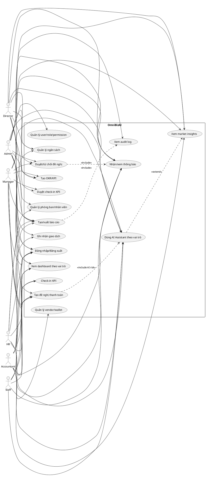

Nội dung liên quan:

- Admin là vai trò duy nhất xem audit log và quản lý permission toàn hệ thống.
- Director có quyền xem toàn công ty, duyệt cấp cao và dùng AI chiến lược.
- Manager chỉ thao tác theo phòng ban và phòng ban con.
- Staff chỉ thao tác dữ liệu cá nhân như PR, KPI, thông báo.
- AI Assistant luôn bị giới hạn bởi data scope của người đang đăng nhập.

#### 3.2.3 Activity Diagram - Luồng tạo và duyệt đề nghị thanh toán

Sơ đồ này dùng để code flow submit/approve và để tester viết test case E2E cho quy trình quan trọng nhất của hệ thống.

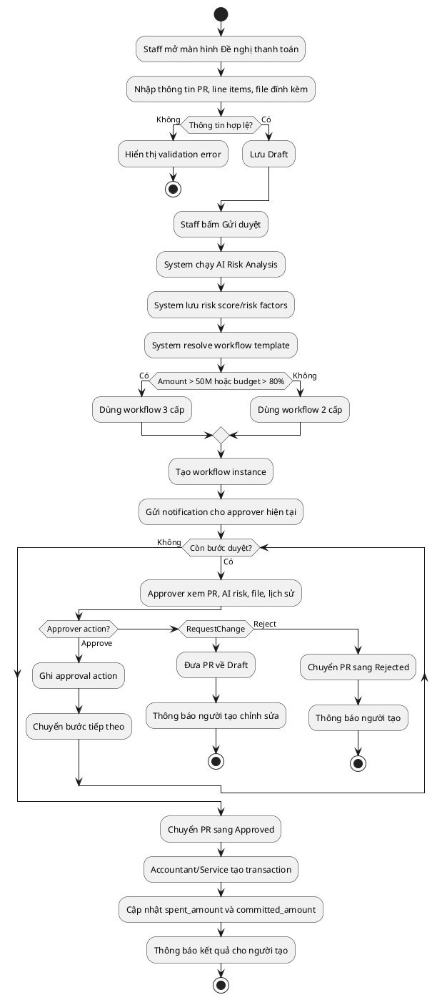

Nội dung liên quan:

- Activity chính gồm Draft, Submit, AI Risk, Workflow, Approval, Transaction.
- Validation lỗi dừng ngay ở form, không tạo workflow.
- RequestChange đưa PR về Draft để Staff sửa lại.
- Reject kết thúc workflow.
- Final Approve mới tạo transaction và cập nhật budget.

#### 3.2.4 Architecture Diagram - Context hệ thống

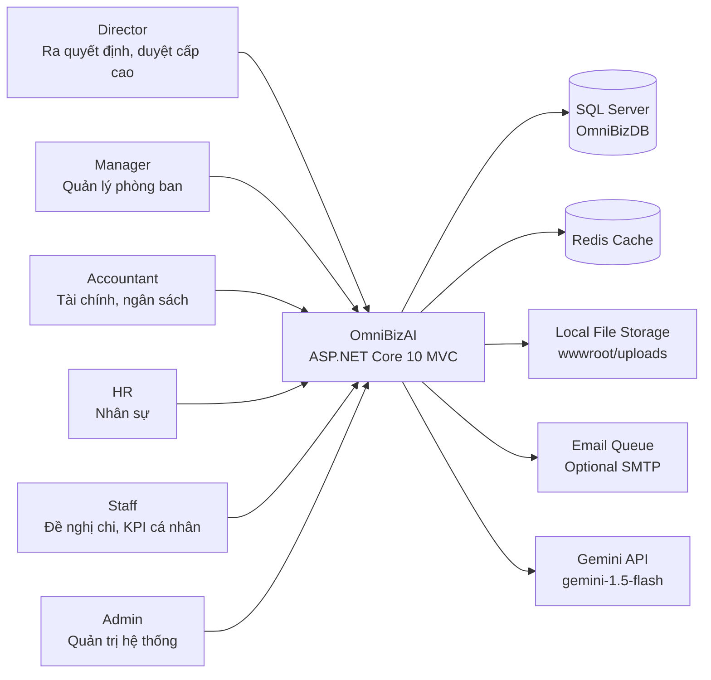

Nội dung liên quan:

- Người dùng chỉ thao tác qua ASP.NET Core MVC Web.
- Web app kết nối SQL Server `OmniBizDB`, Redis, local file storage và Gemini API.
- Email queue là optional, MVP vẫn chạy được với in-app notification.

#### 3.2.5 Architecture Diagram - Modular MVC Monolith

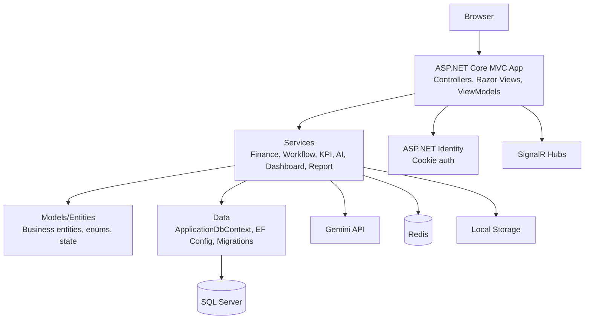

Quy tắc đọc sơ đồ: tất cả nằm trong một project MVC. Controller gọi service, service dùng entity và `ApplicationDbContext`, provider bên ngoài đi qua service wrapper. Razor View không gọi EF hoặc Gemini trực tiếp.

#### 3.2.6 Component Diagram

Sơ đồ này giúp dev hiểu component nào gọi component nào, tránh phá SRP khi code.

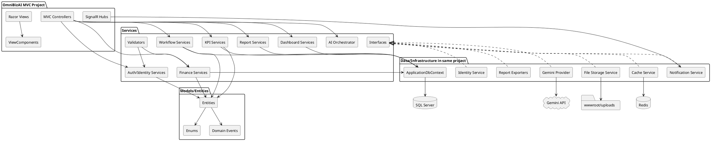

Nội dung liên quan:

- Controller không gọi `DbContext` hoặc Gemini trực tiếp.
- Service định nghĩa interface khi cần mock/test; implementation vẫn nằm trong cùng MVC project.
- View chỉ nhận ViewModel, không truy vấn EF.
- SignalR hub nhận dữ liệu từ NotificationService.

#### 3.2.7 Class Diagram - Class cốt lõi

Sơ đồ này không liệt kê toàn bộ 60+ entity, mà chốt các class cốt lõi để dev bám theo khi code module chính.

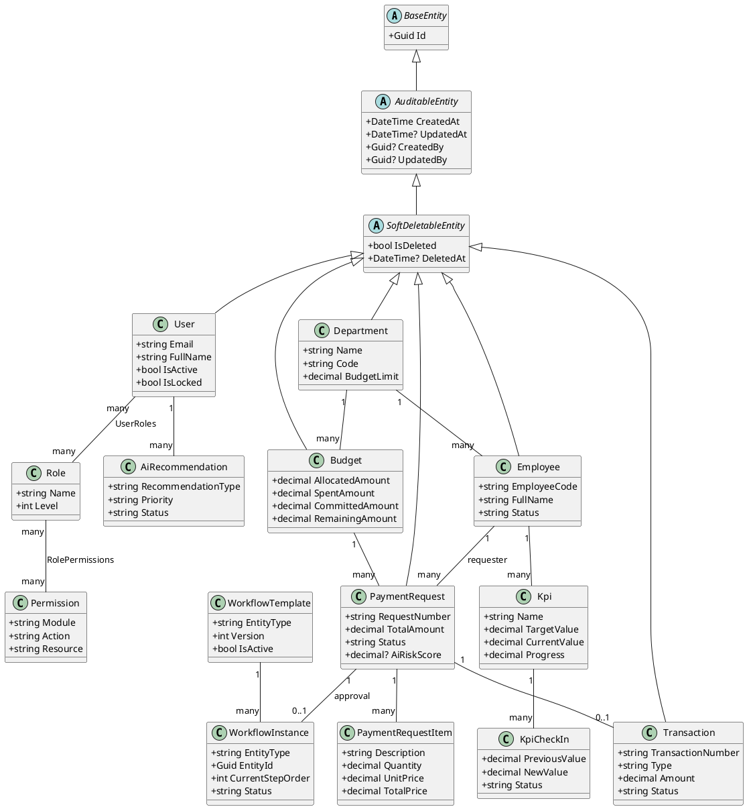

Nội dung liên quan:

- `PaymentRequest` là entity trung tâm của Finance + Workflow + AI risk.
- `Budget` giữ `spent_amount`, `committed_amount`, `remaining_amount`.
- `WorkflowInstance` gắn với entity qua `entity_type` và `entity_id`.
- `AiRecommendation` gắn theo user/role để cá nhân hóa trợ lý AI.

#### 3.2.8 Component/Module Flowchart - Sơ đồ module nghiệp vụ

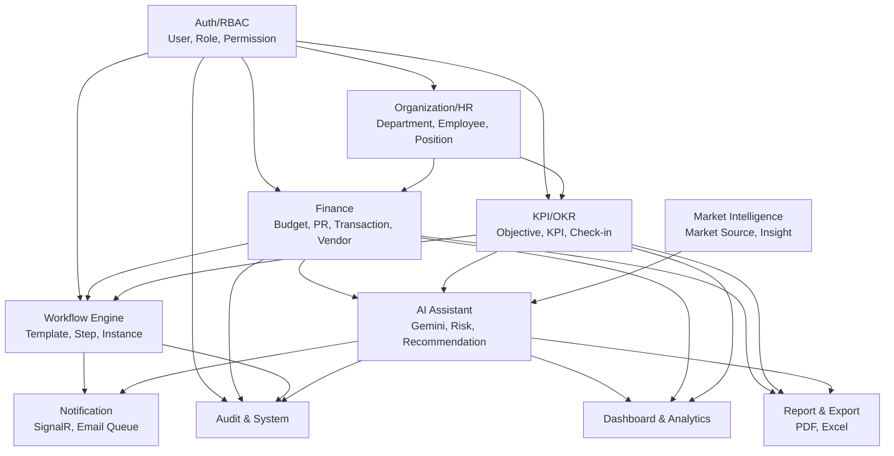

#### 3.2.9 Database Diagram (ERD) - Sơ đồ nhóm bảng database

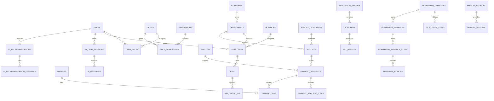

Nội dung liên quan:

- ERD nhóm theo module để dễ đọc trong báo cáo; chi tiết cột nằm ở Database Blueprint.
- Quan hệ Identity, Organization, Finance, KPI, Workflow, AI, Market đều có trong sơ đồ.
- Khi code EF Core cần tạo Fluent Configuration theo các quan hệ này.

#### 3.2.10 Sequence Diagram - Luồng đề nghị thanh toán

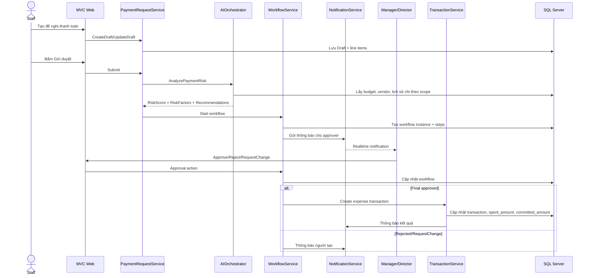

Nội dung liên quan:

- Sequence này là luồng E2E quan trọng nhất của Finance.
- Dev BE dùng để code service orchestration.
- Tester dùng để viết Playwright test "Payment Request full cycle".

#### 3.2.11 Flowchart - Workflow duyệt động

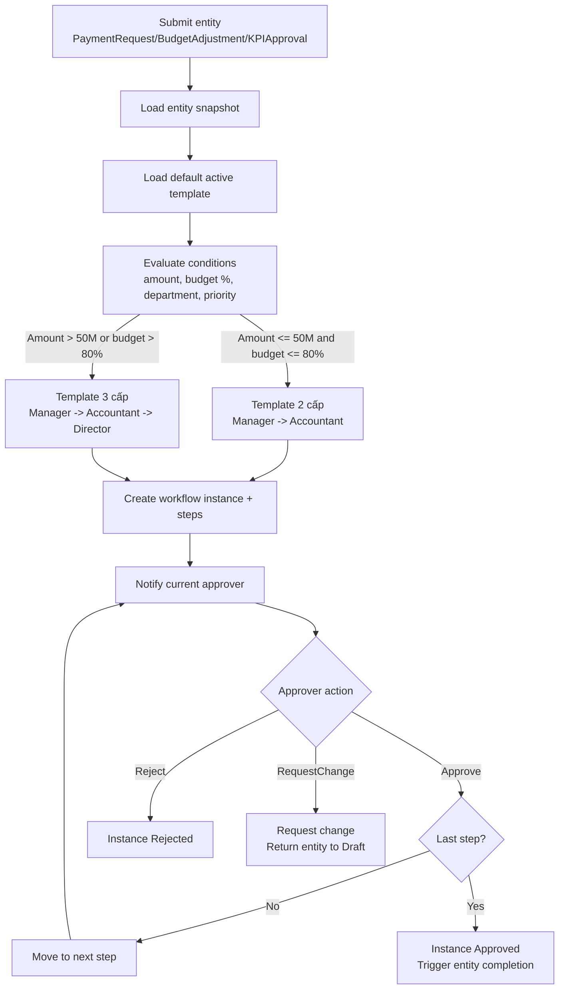

Nội dung liên quan:

- Flowchart này chốt logic route template theo amount và budget utilization.
- Workflow reject/request change là trạng thái kết thúc của lần submit hiện tại.
- Timeout/SLA/delegate không nằm trong scope bắt buộc của MVP; chỉ giữ chỗ trong schema nếu cần trình bày hướng mở rộng.

#### 3.2.12 Flowchart - AI Assistant theo vai trò và thị trường

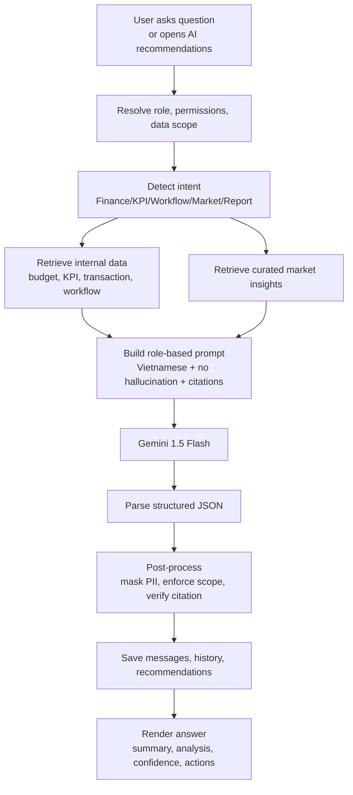

Nội dung liên quan:

- AI luôn đi qua data scope trước khi lấy dữ liệu.
- Market insights là dữ liệu curated, không phải live web.
- Response AI phải được parse JSON, mask dữ liệu nhạy cảm và kiểm citation.

#### 3.2.13 Sequence Diagram - KPI check-in

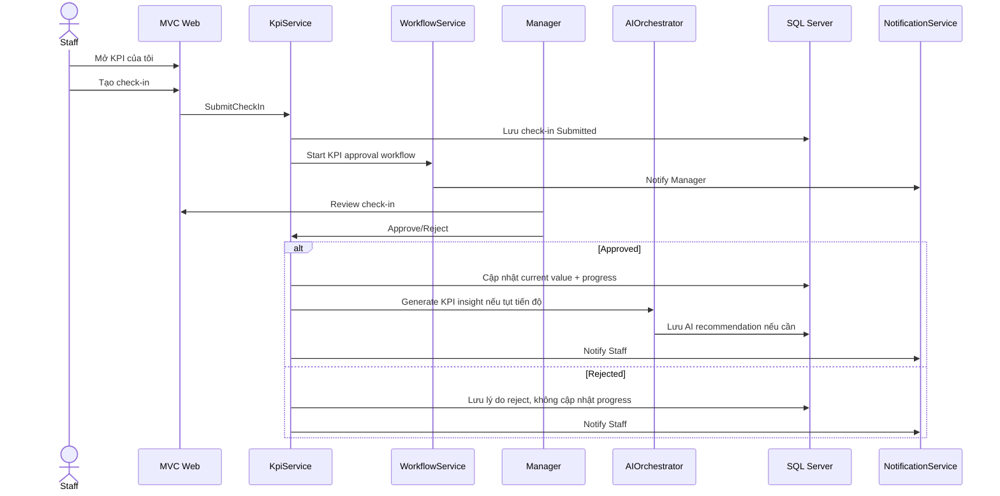

Nội dung liên quan:

- Check-in KPI chỉ cập nhật progress sau khi được duyệt.
- Reject không cập nhật current value.
- Nếu KPI tụt tiến độ, AI tạo recommendation cho Manager/Director.

#### 3.2.14 Deployment Diagram - Sơ đồ triển khai MVP

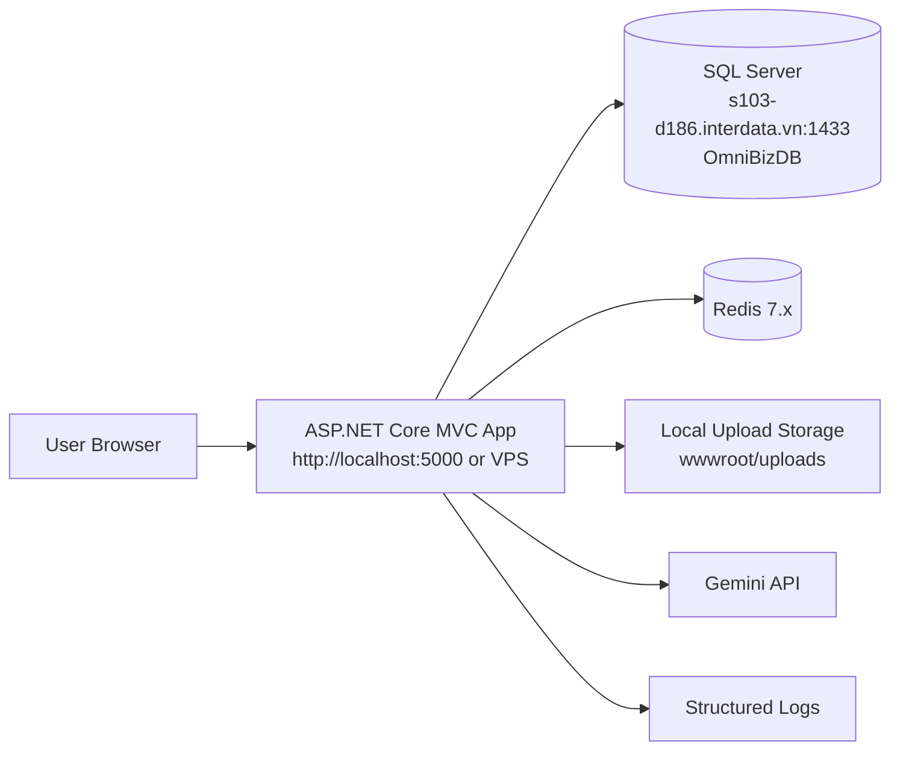

Nội dung liên quan:

- MVP dùng một ASP.NET Core MVC app, một SQL Server, Redis, local upload storage và Gemini API.
- Connection string thật nằm trong `.env`/user secrets, tài liệu chỉ dùng masked password.
- Triển khai VPS sau này vẫn giữ cấu trúc thành phần tương tự.

#### 3.2.15 Flowchart - Sơ đồ phân công nhóm

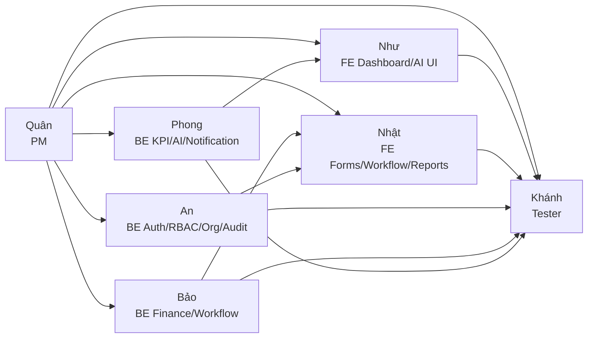

### 3.3 Quy tắc dependency

| Khu vực | Được chứa | Không được chứa |
|---|---|---|
| Controllers | Request/response, ModelState, redirect, View/JSON phụ trợ | Business rule phức tạp, truy vấn EF dài, gọi Gemini trực tiếp |
| Services | Use case nghiệp vụ, transaction boundary, data scope, interface cần mock | Razor markup, HTML layout |
| Models/Entities | Entity, enum, invariant đơn giản, state transition cơ bản | HTTP, Razor, provider bên ngoài |
| Data | DbContext, EF configuration, migrations, seed | UI logic, workflow rule phức tạp |
| Views/ViewModels | Hiển thị dữ liệu, input/display model cho MVC | EF entity trực tiếp, query DB |

### 3.4 Quy tắc SRP bắt buộc

- Controller chỉ nhận request, validate ModelState cơ bản, gọi service/use case, trả View/JSON.
- Service chỉ xử lý một nhóm nghiệp vụ rõ ràng.
- Repository là tùy chọn; MVP ưu tiên service dùng `ApplicationDbContext` trực tiếp cho đơn giản, nhưng không để query dài trong controller.
- Validator chỉ validate input, không gọi Gemini, không gửi email, không ghi DB.
- ViewModel chỉ phục vụ UI, không dùng trực tiếp EF entity trong Razor.
- AI Provider chỉ gọi Gemini; prompt building, retrieval, parsing và recommendation là service riêng.
- Workflow tách riêng: condition evaluator, approver resolver, instance builder, action handler.
- Không lặp business rule giữa UI và backend; backend là nguồn sự thật.

### 3.5 Cấu trúc thư mục chi tiết

```text
OmniBizAI/
├── Areas/
│   ├── Identity/
│   └── Admin/
├── Controllers/
├── Data/
│   ├── ApplicationDbContext.cs
│   ├── Configurations/
│   ├── Migrations/
│   └── Seeders/
├── Models/
│   ├── Common/
│   ├── Entities/
│   │   ├── Organization/
│   │   ├── Finance/
│   │   ├── Performance/
│   │   ├── Workflow/
│   │   ├── AI/
│   │   ├── Notification/
│   │   └── System/
│   └── Enums/
├── Services/
│   ├── Auth/
│   ├── Organization/
│   ├── Finance/
│   ├── Workflow/
│   ├── Kpi/
│   ├── AI/
│   ├── Dashboard/
│   ├── Notification/
│   ├── Report/
│   └── System/
├── Views/
├── ViewModels/
├── ViewComponents/
├── TagHelpers/
├── Filters/
├── Hubs/
└── wwwroot/
```

### 3.6 Interface nền tảng

```csharp
public interface IDataScopeService
{
    Task<DataScope> GetScopeAsync(Guid userId, CancellationToken cancellationToken = default);
    IQueryable<T> ApplyScope<T>(IQueryable<T> query, DataScope scope) where T : class;
    Task<bool> CanAccessEntityAsync(Guid userId, string entityType, Guid entityId, string action, CancellationToken cancellationToken = default);
}

public interface IAuditService
{
    Task LogAsync(AuditLogRequest request, CancellationToken cancellationToken = default);
    Task LogEntityChangeAsync<T>(Guid? userId, string action, T? oldValue, T? newValue, CancellationToken cancellationToken = default);
}

public interface INotificationService
{
    Task NotifyUserAsync(Guid userId, NotificationRequest request, CancellationToken cancellationToken = default);
    Task NotifyRoleAsync(string roleName, NotificationRequest request, CancellationToken cancellationToken = default);
    Task MarkReadAsync(Guid userId, Guid notificationId, CancellationToken cancellationToken = default);
}

public interface IFileStorageService
{
    Task<FileUploadResult> SaveAsync(FileUploadRequest request, CancellationToken cancellationToken = default);
    Task DeleteAsync(Guid fileId, Guid userId, CancellationToken cancellationToken = default);
}
```

### 3.7 Response, pagination và lỗi

```csharp
public sealed class ApiResponse<T>
{
    public bool Success { get; init; }
    public T? Data { get; init; }
    public string Message { get; init; } = string.Empty;
    public IReadOnlyList<ApiError> Errors { get; init; } = [];
    public PaginationMeta? Pagination { get; init; }
    public string? TraceId { get; init; }
}

public sealed class PagedRequest
{
    public int Page { get; init; } = 1;
    public int PageSize { get; init; } = 20;
    public string? Search { get; init; }
    public string? SortBy { get; init; }
    public string SortOrder { get; init; } = "desc";
}
```

Trong MVC MVP, `ApiResponse<T>` chỉ dùng cho JSON endpoint phụ trợ như chart, notification count hoặc AI chat. Các action render trang chính trả `View(...)`, `RedirectToAction(...)` hoặc `NotFound/Forbid` theo chuẩn MVC.

| HTTP code | Khi dùng |
|---|---|
| 200 | Thành công |
| 201 | Tạo mới thành công |
| 204 | Xóa thành công không cần body |
| 400 | Request sai định dạng |
| 401 | Chưa đăng nhập hoặc cookie/session lỗi |
| 403 | Không có quyền |
| 404 | Không tìm thấy |
| 409 | Xung đột trạng thái hoặc duplicate |
| 422 | Rule nghiệp vụ không hợp lệ |
| 429 | Vượt rate limit |
| 500 | Lỗi hệ thống |

### 3.8 Quy chuẩn implementation bắt buộc

Phần này là team contract để code đồng bộ. Khi có mâu thuẫn giữa mô tả module và phần này, ưu tiên phần này.

#### Service method convention

| Loại method | Naming | Return khi thành công | Khi fail |
|---|---|---|---|
| Query detail | `Get...Async` | DTO | Throw `NotFoundException` nếu không thấy hoặc ngoài scope |
| Query list | `Get...Async` | `PagedResult<T>`/list DTO | Trả list rỗng nếu không có dữ liệu |
| Create/update command | `Create...Async`, `Update...Async` | DTO sau khi lưu | Throw typed `AppException` |
| State transition | `SubmitAsync`, `ApproveAsync`, `RejectAsync`, `CancelAsync` | DTO trạng thái mới hoặc `void` | Throw typed `AppException` |
| Best-effort side effect | `Try...Async` | `Task`/nullable result | Không throw ra UI trừ lỗi cấu hình nghiêm trọng |

Không dùng kiểu mỗi service tự trả `bool`, `string message` hoặc anonymous object. Controller không tự quyết định business error; controller chỉ gọi service và render kết quả.

#### Exception chuẩn

```csharp
public abstract class AppException : Exception
{
    public string ErrorCode { get; }
    public int StatusCode { get; }
}

public sealed class ValidationAppException : AppException { } // 422
public sealed class ForbiddenAppException : AppException { }  // 403
public sealed class NotFoundAppException : AppException { }   // 404
public sealed class ConflictAppException : AppException { }   // 409
public sealed class RateLimitAppException : AppException { }  // 429
public sealed class ExternalServiceAppException : AppException { } // 503 for JSON
```

Mapping bắt buộc:

| Exception | MVC page behavior | JSON phụ trợ behavior |
|---|---|---|
| ValidationAppException | Trả lại View với ModelState/TempData error | 422 + `ApiResponse` |
| ForbiddenAppException | `Forbid()` hoặc trang 403 | 403 + `ApiResponse` |
| NotFoundAppException | `NotFound()` hoặc trang 404 | 404 + `ApiResponse` |
| ConflictAppException | Trả View/detail với toast conflict | 409 + `ApiResponse` |
| RateLimitAppException | Toast "thử lại sau" | 429 + `ApiResponse` |
| Exception không dự kiến | Trang lỗi chung, log correlation id | 500 + message chung |

Ứng dụng cần có global exception middleware/filter. Controller không bọc `try/catch` lặp lại, trừ khi cần map lỗi validation về đúng form cụ thể.

#### Validation layer

| Layer | Trách nhiệm |
|---|---|
| ViewModel/DataAnnotations | Required, length, range, file count, format cơ bản để UX phản hồi nhanh |
| Controller | Kiểm tra `ModelState`, lấy current user, gọi service |
| Service/FluentValidation | Rule nghiệp vụ và rule server-side only: status transition, ownership, data scope, budget closed, approver assigned |
| Database | Unique/index/foreign key/check constraint tối thiểu để chặn dữ liệu hỏng |

Rule bắt buộc chỉ được tin ở server: role/permission, data scope, amount recalculation, budget impact, workflow step hiện tại, file content validation, AI output validation.

#### Transaction boundary chung

Mọi command có từ hai thay đổi DB trở lên phải mở `BeginTransactionAsync`. External call như Gemini, email, SignalR push và file scan không được nằm trong DB transaction dài. Pattern chuẩn:

1. Load dữ liệu theo scope.
2. Validate input và state.
3. Tính toán deterministic trong memory.
4. Mở DB transaction.
5. Ghi entity chính, audit, notification record, workflow/budget impact.
6. Commit.
7. Sau commit mới push SignalR/email hoặc chạy best-effort external action.

Rollback toàn bộ transaction nếu bước ghi DB lỗi. Lỗi external best-effort sau commit phải ghi audit/log và hiển thị fallback, không làm hỏng trạng thái nghiệp vụ đã commit.

## 4. Chuẩn UX Và Giao Diện

### 4.1 Nguyên tắc thân thiện người dùng

Mọi màn hình nghiệp vụ phải có:

- Tiêu đề rõ ràng.
- Breadcrumb nếu màn hình nằm sâu.
- Action chính nổi bật.
- Empty state khi chưa có dữ liệu.
- Loading state khi đang tải.
- Error state dễ hiểu.
- Form label tiếng Việt rõ ràng.
- Validation message ngay gần field lỗi.
- Toast sau khi tạo, sửa, xóa, duyệt, từ chối, export.
- Search, filter, sort, pagination với các màn hình danh sách.
- Không hiển thị action nếu người dùng không có quyền.
- Nếu truy cập trực tiếp URL không có quyền, trả 403.

### 4.2 Layout chính

| Khu vực | Nội dung |
|---|---|
| Sidebar | Dashboard, Finance, KPI/OKR, Workflow, Organization, AI, Reports, Admin |
| Header | Search, notification bell, profile menu |
| Main content | Nội dung trang |
| AI Assistant | Panel bên phải hoặc modal fullscreen trên mobile |
| Toast area | Thông báo thao tác |

### 4.3 Design system

| Thành phần | Chuẩn |
|---|---|
| Font | Inter hoặc system sans-serif |
| Màu chính | Xanh cho action chính, đỏ cho lỗi/rủi ro cao, vàng/cam cho cảnh báo, xanh lá cho thành công |
| Card radius | 8px hoặc thấp hơn nếu dùng dashboard dày thông tin |
| Button | Primary, Secondary, Ghost, Danger, Icon |
| Badge | Draft, Pending, Approved, Rejected, Paid, Cancelled, Low/Medium/High/Critical |
| Table | Compact, sticky header nếu nhiều dữ liệu, action theo quyền |
| Chart | ECharts hoặc Chart.js, ưu tiên rõ số liệu hơn trang trí |

### 4.4 Responsive

| Viewport | Hành vi |
|---|---|
| Desktop >= 1280px | Sidebar đầy đủ, dashboard nhiều cột |
| Laptop 1024-1279px | Sidebar thu gọn hoặc có toggle |
| Tablet 768-1023px | Sidebar overlay |
| Mobile < 768px | Menu dạng drawer/bottom nav, bảng chuyển thành card list, AI fullscreen |

### 4.5 Checklist UI trước khi merge

| Mục | Bắt buộc |
|---|---|
| Form có validation client + server | Có |
| Không overflow text trên mobile | Có |
| Button disabled/loading khi submit | Có |
| Có empty/loading/error state | Có |
| Action theo đúng quyền | Có |
| Bảng có search/filter/pagination | Có |
| Có thông báo sau thao tác | Có |
| View không dùng EF entity trực tiếp | Có |

## 5. Database Blueprint

### 5.1 Quy ước chung

- Database: `OmniBizDB`.
- SQL Server.
- Identity scaffold dùng bảng mặc định `AspNetUsers`, `AspNetRoles`, `AspNetUserRoles` của ASP.NET Identity.
- Bảng nghiệp vụ dùng `snake_case` cho table/column nếu cấu hình bằng Fluent API.
- Entity C#: `PascalCase`.
- Thời gian lưu UTC, hiển thị theo local time ở UI.
- Soft delete cho entity chính: `is_deleted`, `deleted_at`.
- Audit fields: `created_at`, `updated_at`, `created_by`, `updated_by` nếu phù hợp.
- JSON linh hoạt dùng `nvarchar(max)` và validate ở application layer.

### 5.2 Tổng số bảng

| Module | Số bảng MVP | Bảng chính |
|---|---:|---|
| Identity | scaffold | AspNetUsers, AspNetRoles, AspNetUserRoles, AspNetUserClaims, AspNetRoleClaims |
| Organization | 4 | companies, departments, positions, employees |
| Finance | 10 | fiscal_periods, budget_categories, budgets, budget_adjustments, payment_requests, payment_request_items, payment_request_attachments, transactions, vendors, wallets |
| KPI/OKR | 5 | evaluation_periods, objectives, key_results, kpis, kpi_check_ins |
| Workflow | 5 | workflow_templates, workflow_steps, workflow_instances, workflow_instance_steps, approval_actions |
| AI | 4 | ai_chat_sessions, ai_messages, ai_risk_assessments, ai_recommendations |
| Market Intelligence | 2 | market_sources, market_insights |
| Notification | 2 | notifications, notification_preferences |
| Audit & System | 4 | audit_logs, system_settings, file_uploads, background_jobs |

Các bảng như refresh token, user session riêng, AI embeddings, prompt template nâng cao, email queue production và workflow condition designer được trì hoãn sau MVP. MVP ưu tiên demo end-to-end bằng Identity cookie, dữ liệu SME seed và các bảng nghiệp vụ cốt lõi.

### 5.3 Bảng bổ sung cho AI thị trường và đề xuất

#### `market_sources`

| Column | Type | Rule |
|---|---|---|
| id | uniqueidentifier | PK |
| name | nvarchar(200) | NOT NULL |
| source_type | nvarchar(50) | Report/News/Manual/Benchmark/Academic/Other |
| url | nvarchar(500) | Nullable |
| reliability_score | decimal(5,2) | 0-100 |
| owner_user_id | uniqueidentifier | FK Users |
| last_collected_at | datetime2 | Nullable |
| created_at | datetime2 | UTC |

#### `market_insights`

| Column | Type | Rule |
|---|---|---|
| id | uniqueidentifier | PK |
| source_id | uniqueidentifier | FK market_sources |
| industry | nvarchar(100) | Nullable |
| topic | nvarchar(100) | Finance/HR/KPI/Marketing/Vendor/Strategy |
| title | nvarchar(300) | NOT NULL |
| content | nvarchar(max) | NOT NULL |
| tags | nvarchar(max) | JSON array |
| period_label | nvarchar(50) | Ví dụ 2026-Q2 |
| confidence_score | decimal(5,2) | 0-100 |
| created_by | uniqueidentifier | FK Users |
| created_at | datetime2 | UTC |

#### `ai_recommendations`

| Column | Type | Rule |
|---|---|---|
| id | uniqueidentifier | PK |
| user_id | uniqueidentifier | Người nhận đề xuất |
| role_name | nvarchar(50) | Director/Manager/Accountant/HR/Staff/Admin |
| module | nvarchar(50) | Finance/KPI/Workflow/Market/Report/System |
| recommendation_type | nvarchar(50) | RiskAlert/Opportunity/StrategyRecommendation/CostOptimization/KpiIntervention/WorkflowSuggestion/ReportInsight |
| priority | nvarchar(20) | Low/Medium/High/Critical |
| title | nvarchar(300) | NOT NULL |
| summary | nvarchar(max) | NOT NULL |
| rationale | nvarchar(max) | Vì sao AI đề xuất |
| evidence_json | nvarchar(max) | Citation nội bộ và market insight |
| proposed_action | nvarchar(max) | Hành động đề xuất |
| status | nvarchar(20) | New/Accepted/Dismissed/ConvertedToTask |
| created_at | datetime2 | UTC |
| expires_at | datetime2 | Nullable |

#### `ai_recommendation_feedback`

| Column | Type | Rule |
|---|---|---|
| id | uniqueidentifier | PK |
| recommendation_id | uniqueidentifier | FK ai_recommendations |
| user_id | uniqueidentifier | FK Users |
| rating | int | 1-5 |
| decision | nvarchar(20) | Accepted/Dismissed/NeedsReview |
| comment | nvarchar(max) | Nullable |
| created_at | datetime2 | UTC |

### 5.4 Migration order

1. Identity scaffold từ `dotnet new mvc --auth Individual`.
2. Organization.
3. Finance base: fiscal periods, categories, vendors, wallets, budgets.
4. Finance workflow entities: payment requests, items, attachments, comments, transactions.
5. KPI/OKR.
6. Workflow.
7. AI base.
8. Market intelligence and AI recommendations.
9. Notification.
10. Audit and system.
11. Seed data.

### 5.5 JSON và index policy

`nvarchar(max)` cho JSON được phép trong MVP để lưu metadata linh hoạt, nhưng không được dùng thay thế schema cho field cần filter, join hoặc report.

| Loại dữ liệu | Cách lưu |
|---|---|
| Field hay filter/sort | Tách thành column riêng và tạo index |
| Evidence/citation list | Lưu JSON, đồng thời lưu `entity_type`, `entity_id`, `source_type` nếu cần lookup |
| Prompt/output AI raw | Lưu JSON/text đã mask, không query trực tiếp trong dashboard |
| Workflow condition MVP | Ưu tiên column rõ như amount threshold/template kind; JSON chỉ cho config mở rộng |
| Tags/search nhẹ | JSON được phép, nhưng search nâng cao để phase sau |

Index tối thiểu:

- `payment_requests`: `request_number`, `status`, `requester_id`, `department_id`, `budget_id`, `created_at`.
- `transactions`: `transaction_number`, `payment_request_id`, `budget_id`, `transaction_date`, `status`.
- `budgets`: `department_id`, `category_id`, `period_id`, `status`.
- `workflow_instances`: `entity_type`, `entity_id`, `status`, `current_step_order`.
- `approval_actions`: `workflow_instance_id`, `actor_user_id`, `action`, `created_at`.
- `kpis`: `assignee_id`, `department_id`, `period_id`, `status`.
- `notifications`: `user_id`, `is_read`, `created_at`.
- `ai_recommendations`: `user_id`, `role_name`, `module`, `recommendation_type`, `priority`, `status`, `created_at`.
- `market_insights`: `topic`, `industry`, `period_label`, `confidence_score`, `created_at`.

## 6. Phân Quyền Và Data Scope

### 6.1 Roles

| Role | Mô tả |
|---|---|
| Admin | Quản trị hệ thống, user, role, permission, settings, audit |
| Director | Xem toàn công ty, duyệt cấp cao, báo cáo, AI chiến lược |
| Manager | Quản lý phòng ban và phòng ban con |
| Accountant | Quản lý tài chính, ngân sách, giao dịch, vendor |
| HR | Quản lý nhân viên, phòng ban, chức vụ |
| Staff | Tạo đề nghị thanh toán, xem KPI và dữ liệu cá nhân |

### 6.2 Data scope

| Role | Scope |
|---|---|
| Admin | Toàn bộ công ty |
| Director | Toàn bộ công ty |
| Manager | Phòng ban của mình và phòng ban con |
| Accountant | Toàn bộ finance; dữ liệu ngoài finance theo scope cá nhân/phòng ban |
| HR | Toàn bộ employee/org; performance cá nhân theo quyền |
| Staff | Dữ liệu cá nhân: PR của mình, KPI của mình, thông báo của mình |

Rule enforce bắt buộc:

- Mọi query list/detail/mutation với entity nghiệp vụ phải đi qua `IDataScopeService.ApplyScope(...)` hoặc helper extension tương đương trước khi materialize bằng `ToListAsync`, `FirstOrDefaultAsync`, `CountAsync`.
- Không được viết trực tiếp `_context.PaymentRequests.ToListAsync()` trong service/controller.
- Query detail phải filter scope trong cùng query, không load entity trước rồi mới check quyền sau.
- Mutation phải kiểm tra cả permission chức năng và data scope entity.
- Code review phải reject PR nếu thấy query nghiệp vụ không áp scope, trừ seed/migration/background system job có comment rõ lý do.

### 6.3 Permission matrix cốt lõi

| Permission | Admin | Director | Manager | Accountant | HR | Staff |
|---|---:|---:|---:|---:|---:|---:|
| user:create | Có | Không | Không | Không | Có | Không |
| user:read | All | All | Dept | Không | All | Self |
| user:update | Có | Không | Không | Không | Có | Self |
| budget:create | Có | Có | Không | Có | Không | Không |
| budget:read | All | All | Dept | All | Không | Không |
| budget:update | Có | Có | Không | Có | Không | Không |
| payment_request:create | Có | Có | Có | Có | Có | Có |
| payment_request:approve | Có | Có | Có | Không | Không | Không |
| transaction:create | Có | Không | Không | Có | Không | Không |
| transaction:read | All | All | Dept | All | Không | Own |
| objective:create | Có | Có | Có | Không | Không | Không |
| kpi:read | All | All | Dept | Không | Không | Own |
| checkin:create | Có | Có | Có | Có | Có | Có |
| checkin:approve | Có | Có | Có | Không | Không | Không |
| workflow:manage | Có | Có | Không | Không | Không | Không |
| ai:chat | Có | Có | Có | Có | Có | Có |
| ai:market | Có | Có | Có | Có | Limited | Limited |
| report:export | Có | Có | Có | Có | Có | Không |
| audit:read | Có | Không | Không | Không | Không | Không |

## 7. Module Specification - Code Ready

Mỗi module bên dưới là hợp đồng triển khai. Dev không được đổi status, route, permission hoặc rule nếu chưa cập nhật tài liệu.

### 7.1 Authentication & Authorization

#### Mục tiêu

Đăng nhập an toàn, lockout khi sai nhiều lần, phân quyền theo role và permission, áp data scope cho mọi truy vấn.

#### Actors

| Actor | Quyền |
|---|---|
| Guest | Login, forgot password, reset password |
| Authenticated user | Logout, xem profile, đổi mật khẩu |
| Admin/HR | Tạo user, cập nhật user |
| Admin | Quản lý role, permission |

#### Status và rules

- Password tối thiểu 8 ký tự, có chữ hoa, chữ thường, số, ký tự đặc biệt.
- Sai password 5 lần liên tiếp: khóa tài khoản 15 phút.
- Không báo email tồn tại hay không tồn tại ở login; thông báo chung: "Email hoặc mật khẩu không đúng".
- MVP dùng Identity cookie. Refresh token chỉ triển khai sau này nếu có public API hoặc mobile client.
- Logout sign out cookie và kết thúc phiên MVC.

#### DTO/ViewModel

```csharp
public sealed class LoginRequest
{
    public string Email { get; init; } = string.Empty;
    public string Password { get; init; } = string.Empty;
    public bool RememberMe { get; init; }
}

public sealed class LoginResult
{
    public Guid UserId { get; init; }
    public string Email { get; init; } = string.Empty;
    public string FullName { get; init; } = string.Empty;
    public IReadOnlyList<string> Roles { get; init; } = [];
    public IReadOnlyList<string> Permissions { get; init; } = [];
    public Guid? DepartmentId { get; init; }
    public string RedirectUrl { get; init; } = "/Dashboard";
}
```

#### Service contract

```csharp
public interface IAuthService
{
    Task<LoginResult> LoginAsync(LoginRequest request, string ipAddress, string userAgent, CancellationToken cancellationToken = default);
    Task LogoutAsync(Guid userId, CancellationToken cancellationToken = default);
    Task ChangePasswordAsync(Guid userId, ChangePasswordRequest request, CancellationToken cancellationToken = default);
    Task<UserProfileDto> GetCurrentUserAsync(Guid userId, CancellationToken cancellationToken = default);
}

public interface IPermissionService
{
    Task<bool> HasPermissionAsync(Guid userId, string permission, CancellationToken cancellationToken = default);
    Task<IReadOnlyList<string>> GetPermissionsAsync(Guid userId, CancellationToken cancellationToken = default);
}
```

#### Controllers/views/JSON phụ trợ

| MVC | JSON phụ trợ | Mô tả |
|---|---|---|
| Identity UI `/Identity/Account/Login` GET/POST | Không bắt buộc | Đăng nhập bằng cookie |
| Identity UI `/Identity/Account/Logout` POST | Không bắt buộc | Đăng xuất |
| Identity UI `/Identity/Account/Manage` | Không bắt buộc | Hồ sơ và đổi mật khẩu |
| `Areas/Admin/Controllers/UsersController` | `/Admin/Users/SearchJson` nếu cần | Quản trị user |

#### Acceptance criteria

- Login đúng redirect theo role.
- Login sai 5 lần lock tài khoản.
- Staff truy cập `/Admin` bị 403.
- Menu ẩn các mục không có quyền.
- Audit log ghi login, failed login, logout, password change.

### 7.2 Organization/HR

#### Mục tiêu

Quản lý công ty, phòng ban, chức vụ, nhân viên, lịch sử thay đổi. Đây là dữ liệu nền cho data scope và workflow.

#### Entities

| Entity | Bảng | Ghi chú |
|---|---|---|
| Company | companies | Một công ty trong MVP |
| Department | departments | Hỗ trợ cây cha-con |
| Position | positions | Có level dùng cho workflow |
| Employee | employees | Link tới user account |
| EmployeeHistory | employee_history | Ghi lịch sử đổi phòng ban/chức vụ/status |

#### Rules

- Department code unique.
- Không xóa cứng phòng ban có nhân viên active; dùng soft delete hoặc deactivate.
- Employee code auto-generate dạng `EMP-0001`.
- Email nhân viên unique.
- Khi đổi phòng ban/chức vụ/quản lý/trạng thái, ghi `employee_history`.
- Nhân viên nghỉ việc: `status=Resigned`, `leave_date` có giá trị, user có thể bị deactivate.

#### Service contract

```csharp
public interface IOrganizationService
{
    Task<PagedResult<DepartmentDto>> GetDepartmentsAsync(DepartmentFilter filter, CancellationToken cancellationToken = default);
    Task<DepartmentDto> CreateDepartmentAsync(CreateDepartmentRequest request, Guid userId, CancellationToken cancellationToken = default);
    Task<DepartmentDto> UpdateDepartmentAsync(Guid id, UpdateDepartmentRequest request, Guid userId, CancellationToken cancellationToken = default);
    Task<PagedResult<EmployeeDto>> GetEmployeesAsync(EmployeeFilter filter, Guid userId, CancellationToken cancellationToken = default);
    Task<EmployeeDto> CreateEmployeeAsync(CreateEmployeeRequest request, Guid userId, CancellationToken cancellationToken = default);
    Task<EmployeeDto> UpdateEmployeeAsync(Guid id, UpdateEmployeeRequest request, Guid userId, CancellationToken cancellationToken = default);
    Task ChangeEmployeeStatusAsync(Guid id, ChangeEmployeeStatusRequest request, Guid userId, CancellationToken cancellationToken = default);
}
```

#### Controllers/views/JSON phụ trợ

| MVC | JSON phụ trợ | View |
|---|---|---|
| `DepartmentsController.Index` | `/Departments/TreeJson` | `Views/Departments/Index.cshtml` |
| `DepartmentsController.Create/Edit/Details` | Không bắt buộc | Form + detail |
| `EmployeesController.Index` | `/Employees/SearchJson` nếu cần | List nhân viên |
| `EmployeesController.Create/Edit/Details` | Không bắt buộc | Form + profile |
| `PositionsController` | Không bắt buộc | CRUD chức vụ |

#### Acceptance criteria

- HR tạo nhân viên mới thành công.
- Manager chỉ xem nhân viên trong phòng ban mình.
- Đổi phòng ban ghi lịch sử.
- Không xóa phòng ban đang có nhân viên active.

### 7.3 Finance

#### Mục tiêu

Quản lý ngân sách, đề nghị thanh toán, giao dịch, vendor, ví/tài khoản và cảnh báo chi phí.

#### State machine - Payment Request

| Từ trạng thái | Hành động | Đến trạng thái | Người thực hiện |
|---|---|---|---|
| Draft | Save draft | Draft | Creator |
| Draft | Submit | Submitted/PendingApproval | Creator |
| PendingApproval | Approve current step | PendingApproval/Approved | Approver |
| PendingApproval | Reject | Rejected | Approver |
| PendingApproval | Request change | Draft | Approver |
| Approved | Mark paid | Paid | Accountant/Admin |
| Draft/PendingApproval | Cancel | Cancelled | Creator/Admin |

#### Rules - Budget

- `remaining_amount = allocated_amount - spent_amount - committed_amount`.
- Utilization >= warning threshold: cảnh báo vàng.
- Utilization > 100%: cảnh báo đỏ.
- Budget closed/frozen không cho tạo PR mới nếu rule cấu hình bật strict mode.
- Điều chỉnh ngân sách phải ghi `budget_adjustments`, không sửa âm thầm số tiền cũ.

#### Rules - Payment Request

- Có ít nhất một line item.
- Total = tổng `quantity * unit_price + tax_amount`.
- File tối đa 5 file, mỗi file tối đa 10MB.
- File hợp lệ: PDF, JPG, PNG, XLSX, DOCX.
- Submit bắt buộc chạy AI risk analysis trước hoặc trong transaction submit.
- Vượt ngân sách không tự block trong MVP; AI flag và workflow có thể route lên Director.
- Vendor trùng trong 7 ngày tạo risk factor.
- Approved cuối cùng tự tạo transaction expense và cập nhật spent/committed.

#### Service contract

```csharp
public interface IBudgetService
{
    Task<PagedResult<BudgetDto>> GetBudgetsAsync(BudgetFilter filter, Guid userId, CancellationToken cancellationToken = default);
    Task<BudgetDto> CreateBudgetAsync(CreateBudgetRequest request, Guid userId, CancellationToken cancellationToken = default);
    Task<BudgetDto> AdjustBudgetAsync(Guid budgetId, AdjustBudgetRequest request, Guid userId, CancellationToken cancellationToken = default);
    Task<BudgetUtilizationDto> GetUtilizationAsync(Guid budgetId, Guid userId, CancellationToken cancellationToken = default);
}

public interface IPaymentRequestService
{
    Task<PagedResult<PaymentRequestListItemDto>> GetListAsync(PaymentRequestFilter filter, Guid userId, CancellationToken cancellationToken = default);
    Task<PaymentRequestDto> CreateDraftAsync(CreatePaymentRequestRequest request, Guid userId, CancellationToken cancellationToken = default);
    Task<PaymentRequestDto> UpdateDraftAsync(Guid id, UpdatePaymentRequestRequest request, Guid userId, CancellationToken cancellationToken = default);
    Task<PaymentRequestDto> SubmitAsync(Guid id, Guid userId, CancellationToken cancellationToken = default);
    Task CancelAsync(Guid id, CancelPaymentRequestRequest request, Guid userId, CancellationToken cancellationToken = default);
}

public interface ITransactionService
{
    Task<TransactionDto> CreateAsync(CreateTransactionRequest request, Guid userId, CancellationToken cancellationToken = default);
    Task ReverseAsync(Guid transactionId, ReverseTransactionRequest request, Guid userId, CancellationToken cancellationToken = default);
}
```

#### DTO chính

```csharp
public sealed class CreatePaymentRequestRequest
{
    public string Title { get; init; } = string.Empty;
    public string? Description { get; init; }
    public Guid DepartmentId { get; init; }
    public Guid CategoryId { get; init; }
    public Guid? VendorId { get; init; }
    public Guid? BudgetId { get; init; }
    public DateOnly? PaymentDueDate { get; init; }
    public string Priority { get; init; } = "Normal";
    public IReadOnlyList<PaymentRequestItemRequest> Items { get; init; } = [];
}

public sealed class PaymentRequestItemRequest
{
    public string Description { get; init; } = string.Empty;
    public decimal Quantity { get; init; }
    public string Unit { get; init; } = "Item";
    public decimal UnitPrice { get; init; }
    public decimal TaxRate { get; init; }
}
```

#### Controllers/views/JSON phụ trợ

| MVC | JSON phụ trợ | Mô tả |
|---|---|---|
| `BudgetsController` | `/Budgets/UtilizationJson` | CRUD ngân sách, utilization, adjust |
| `PaymentRequestsController` | `/PaymentRequests/RiskPreviewJson` | CRUD draft, submit, cancel, attachments |
| `TransactionsController` | Không bắt buộc | Giao dịch, reverse |
| `VendorsController` | `/Vendors/SearchJson` nếu cần | Vendor CRUD/rating |
| `WalletsController` | Không bắt buộc | Ví/tài khoản |
| `BudgetCategoriesController` | `/BudgetCategories/TreeJson` | Danh mục tree |

#### Acceptance criteria

- Staff tạo PR nháp, lưu, sửa, submit được.
- Submit PR tạo workflow instance và notification cho approver.
- AI risk score hiển thị trước/ở thời điểm submit.
- Approve step cuối tạo transaction và cập nhật budget.
- Reversed transaction rollback budget impact.

### 7.4 Workflow Engine

#### Mục tiêu

Cho phép phê duyệt đề nghị thanh toán theo hai template rõ ràng cho MVP: PR 2 cấp và PR 3 cấp. Engine phải đủ mở rộng sau này, nhưng sprint MVP không được biến thành workflow designer phức tạp.

#### Phạm vi MVP bắt buộc

| Capability | MVP | Sau MVP |
|---|---|---|
| Template PR 2 cấp | Bắt buộc | Giữ |
| Template PR 3 cấp | Bắt buộc | Giữ |
| Condition theo amount | Bắt buộc | Mở rộng thêm field khác |
| Condition theo budget utilization > 80% | Bắt buộc | Mở rộng theo category/vendor |
| Approval action approve/reject/request change | Bắt buộc | Giữ |
| Timeline duyệt | Bắt buộc | Giữ |
| Delegate | Không bắt buộc, chỉ có flag/schema nếu kịp | Làm UI/logic đầy đủ |
| Timeout/escalation | Không bắt buộc, chỉ seed/config placeholder | Background job xử lý |
| Workflow designer UI | Không làm MVP | Phase sau |

#### State machine

| Entity | Status |
|---|---|
| WorkflowInstance | Pending, InProgress, Approved, Rejected, Cancelled |
| WorkflowInstanceStep | Pending, InProgress, Approved, Rejected, Skipped |
| ApprovalAction | Approve, Reject, Comment, RequestChange |

#### Rules

- Mỗi entity type có một default active template.
- Conditions MVP chỉ gồm amount, budget utilization sau commit và priority.
- Nếu amount > 50,000,000 hoặc budget usage > 80%, chuyển sang template có Director.
- Snapshot metadata của entity lưu trong `workflow_instances.metadata`.
- Reject ở bất kỳ step nào làm instance `Rejected`.
- RequestChange đưa entity về Draft nếu entity hỗ trợ chỉnh sửa.
- Delegate/timeout/escalation chỉ là optional flag trong schema MVP, không bắt buộc UI hoặc background job.

#### Service contract

```csharp
public interface IWorkflowService
{
    Task<WorkflowInstanceDto> StartAsync(StartWorkflowRequest request, Guid userId, CancellationToken cancellationToken = default);
    Task<WorkflowInstanceDto> ApproveAsync(Guid instanceId, ApprovalRequest request, Guid userId, CancellationToken cancellationToken = default);
    Task<WorkflowInstanceDto> RejectAsync(Guid instanceId, ApprovalRequest request, Guid userId, CancellationToken cancellationToken = default);
    Task<WorkflowInstanceDto> RequestChangeAsync(Guid instanceId, ApprovalRequest request, Guid userId, CancellationToken cancellationToken = default);
    Task<PagedResult<ApprovalQueueItemDto>> GetApprovalQueueAsync(Guid userId, ApprovalQueueFilter filter, CancellationToken cancellationToken = default);
}

public interface IWorkflowConditionEvaluator
{
    Task<WorkflowTemplateDto> ResolveTemplateAsync(string entityType, Guid entityId, CancellationToken cancellationToken = default);
}

public interface IApproverResolver
{
    Task<IReadOnlyList<Guid>> ResolveApproversAsync(WorkflowStepDefinition step, WorkflowEntityContext context, CancellationToken cancellationToken = default);
}
```

#### Controllers/views/JSON phụ trợ

| MVC | JSON phụ trợ | Mô tả |
|---|---|---|
| `WorkflowTemplatesController` | Không bắt buộc | Quản lý template |
| `ApprovalQueueController.Index` | `/ApprovalQueue/UnreadJson` | Hàng chờ duyệt |
| `WorkflowInstancesController.Details` | Không bắt buộc | Chi tiết timeline |
| `WorkflowInstancesController.Approve/Reject/RequestChange` | POST MVC actions có anti-forgery | Hành động duyệt |

#### Acceptance criteria

- PR nhỏ đi template 2 cấp.
- PR lớn đi template 3 cấp.
- Người không phải approver không approve được.
- Timeline hiển thị đủ step, deadline, action history.

### 7.5 KPI/OKR & Performance

#### Mục tiêu

Quản lý mục tiêu, chỉ số đo lường, check-in, duyệt tiến độ và đánh giá hiệu suất.

#### Entities

| Entity | Mục đích |
|---|---|
| evaluation_periods | Kỳ đánh giá |
| objectives | Objective OKR |
| key_results | KR thuộc objective |
| kr_check_ins | Check-in KR |
| kpi_templates | Mẫu KPI |
| kpis | KPI cụ thể |
| kpi_check_ins | Check-in KPI |
| performance_evaluations | Đánh giá tổng |
| evaluation_scores | Điểm từng mục |

#### Rules

- Period cùng type không overlap.
- Objective progress = weighted average hoặc average KR progress theo cấu hình.
- Tổng weight KR trong một Objective = 100%.
- KR progress = `(CurrentValue - StartValue) / (TargetValue - StartValue) * 100`.
- Nếu TargetValue = StartValue, progress = 0.
- KPI có direction: IncreaseIsBetter hoặc DecreaseIsBetter.
- Tối đa một check-in/tuần/KPI trừ khi Manager cho phép.
- Check-in bị reject không cập nhật CurrentValue.
- Rating: A >= 90, B 70-89, C 50-69, D 30-49, E < 30.

#### State machine

| Entity | Status |
|---|---|
| EvaluationPeriod | Planning, Active, Closed |
| Objective | Draft, Active, Completed, Cancelled |
| KPI | Draft, Active, Paused, Completed, Cancelled |
| CheckIn | Draft, Submitted, Approved, Rejected |
| PerformanceEvaluation | Draft, Submitted, Reviewed, Finalized |

#### Service contract

```csharp
public interface IKpiService
{
    Task<ObjectiveDto> CreateObjectiveAsync(CreateObjectiveRequest request, Guid userId, CancellationToken cancellationToken = default);
    Task<KeyResultDto> CreateKeyResultAsync(CreateKeyResultRequest request, Guid userId, CancellationToken cancellationToken = default);
    Task<KpiDto> CreateKpiAsync(CreateKpiRequest request, Guid userId, CancellationToken cancellationToken = default);
    Task<CheckInDto> SubmitCheckInAsync(SubmitCheckInRequest request, Guid userId, CancellationToken cancellationToken = default);
    Task<CheckInDto> ApproveCheckInAsync(Guid checkInId, ReviewCheckInRequest request, Guid userId, CancellationToken cancellationToken = default);
    Task<CheckInDto> RejectCheckInAsync(Guid checkInId, ReviewCheckInRequest request, Guid userId, CancellationToken cancellationToken = default);
    Task<EmployeeScorecardDto> GetScorecardAsync(Guid employeeId, Guid periodId, Guid userId, CancellationToken cancellationToken = default);
}
```

#### Controllers/views/JSON phụ trợ

| MVC | JSON phụ trợ |
|---|---|
| `ObjectivesController` | Không bắt buộc |
| `KeyResultsController` | Không bắt buộc |
| `KpisController` | `/Kpis/ProgressJson` |
| `CheckInsController` | Không bắt buộc |
| `EvaluationsController` | Không bắt buộc |

#### Acceptance criteria

- Manager tạo KPI cho nhân viên trong phòng ban.
- Staff check-in KPI, Manager duyệt, progress cập nhật.
- Manager xem scorecard phòng ban.
- AI cảnh báo KPI tụt > 20% so với tiến độ kỳ.

### 7.6 AI Assistant, Market Intelligence Và Recommendation

#### Mục tiêu

AI không chỉ hỏi đáp thuần. AI là trợ thủ theo vai trò, phân tích dữ liệu nội bộ, dữ liệu thị trường curated, rủi ro, cơ hội và đề xuất phương án hợp lý. AI chỉ đề xuất, không tự thay đổi dữ liệu nghiệp vụ.

#### Capability theo vai trò

| Role | AI hỗ trợ |
|---|---|
| Director | Sức khỏe doanh nghiệp, rủi ro tài chính, chiến lược, thị trường, phòng ban ưu tiên |
| Manager | KPI phòng ban, nhân sự cần hỗ trợ, workload, đề xuất phân bổ nguồn lực |
| Accountant | Chi phí bất thường, vendor, cashflow, budget utilization, cost optimization |
| HR | Biến động nhân sự, hiệu suất, nhu cầu đào tạo, rủi ro nghỉ việc theo dữ liệu có sẵn |
| Staff | Việc cần làm, KPI cá nhân, trạng thái PR, gợi ý cải thiện tiến độ |
| Admin | Chất lượng dữ liệu, audit bất thường, cấu hình AI, nguồn market insight |

#### AI flow

1. User mở AI Assistant hoặc dashboard card.
2. System xác định user, role, permissions, data scope.
3. Intent detector xác định loại câu hỏi: Finance, KPI, Workflow, Market, Report, General.
4. Internal data retriever lấy số liệu theo data scope.
5. Market intelligence retriever lấy market insight liên quan.
6. Prompt builder tạo prompt cho Gemini.
7. Gemini `gemini-1.5-flash` trả kết quả.
8. Response parser ép kết quả về JSON an toàn.
9. Post-processor mask dữ liệu nhạy cảm, kiểm citation, format số liệu.
10. Lưu `ai_messages`, `ai_generation_history`, và nếu có đề xuất thì lưu `ai_recommendations`.
11. UI hiển thị summary, analysis, recommendation, confidence, citations.

#### JSON output bắt buộc từ AI

```json
{
  "summary": "Tóm tắt ngắn",
  "analysis": [
    {
      "title": "Nhận định",
      "details": "Giải thích",
      "evidence": [
        { "type": "internal", "entityType": "Budget", "entityId": "uuid", "label": "Budget Marketing T5" },
        { "type": "market", "entityType": "MarketInsight", "entityId": "uuid", "label": "Market note 2026-Q2" }
      ]
    }
  ],
  "recommendations": [
    {
      "type": "CostOptimization",
      "priority": "High",
      "title": "Giảm chi phí vendor quảng cáo",
      "rationale": "Chi phí tăng nhanh hơn hiệu quả KPI",
      "proposedAction": "Đàm phán lại hợp đồng hoặc chuyển 20% ngân sách sang kênh hiệu quả hơn"
    }
  ],
  "confidence": 78,
  "limitations": "Chỉ dùng dữ liệu nội bộ và nguồn thị trường đã nhập vào hệ thống"
}
```

#### Service contract

```csharp
public interface IAIProvider
{
    Task<AIProviderResponse> GenerateAsync(AIProviderRequest request, CancellationToken cancellationToken = default);
}

public interface IAIOrchestrator
{
    Task<AIChatResponse> ChatAsync(AIChatRequest request, Guid userId, CancellationToken cancellationToken = default);
    Task<AIRiskAssessmentDto> AnalyzePaymentRiskAsync(Guid paymentRequestId, Guid userId, CancellationToken cancellationToken = default);
    Task<IReadOnlyList<AIRecommendationDto>> GenerateRoleRecommendationsAsync(Guid userId, string roleName, CancellationToken cancellationToken = default);
    Task<AIReportDto> GenerateReportAsync(GenerateAIReportRequest request, Guid userId, CancellationToken cancellationToken = default);
}

public interface IMarketIntelligenceService
{
    Task<MarketInsightDto> CreateInsightAsync(CreateMarketInsightRequest request, Guid userId, CancellationToken cancellationToken = default);
    Task<IReadOnlyList<MarketInsightDto>> SearchRelevantInsightsAsync(MarketInsightQuery query, CancellationToken cancellationToken = default);
}

public interface IAIRecommendationService
{
    Task<IReadOnlyList<AIRecommendationDto>> GetRecommendationsAsync(Guid userId, RecommendationFilter filter, CancellationToken cancellationToken = default);
    Task MarkAcceptedAsync(Guid recommendationId, Guid userId, CancellationToken cancellationToken = default);
    Task DismissAsync(Guid recommendationId, Guid userId, string? reason, CancellationToken cancellationToken = default);
    Task RateAsync(Guid recommendationId, RecommendationFeedbackRequest request, Guid userId, CancellationToken cancellationToken = default);
}
```

#### Prompt rules

- System prompt luôn nêu: chỉ dùng dữ liệu được cung cấp, không bịa số liệu.
- Nếu thiếu dữ liệu, AI phải nói rõ thiếu dữ liệu.
- AI phải trả lời bằng tiếng Việt.
- AI không được tiết lộ dữ liệu ngoài quyền người dùng.
- AI không được tự quyết định duyệt, xóa, sửa hoặc tạo giao dịch.
- AI phải phân biệt dữ liệu nội bộ và dữ liệu thị trường.
- Mọi số liệu quan trọng phải có citation.

#### Controllers/views/JSON phụ trợ

| MVC | JSON phụ trợ | Mô tả |
|---|---|---|
| `AIController.Index` | `/AI/ChatJson` | Chat theo role |
| `AIController.Sessions` | `/AI/SessionsJson` nếu cần | Lịch sử chat |
| `AIController.RiskAnalysis` | `/AI/RiskAnalysisJson` | Phân tích risk |
| `AIController.GenerateReport` | `/AI/GenerateReportJson` | Báo cáo AI |
| `AIController.Recommendations` | `/AI/RecommendationsJson` | Đề xuất theo role |
| `MarketInsightsController` | `/MarketInsights/SearchJson` | Quản lý dữ liệu thị trường |

#### Acceptance criteria

- Staff không thể dùng AI để xem số liệu toàn công ty.
- Director hỏi về rủi ro thị trường nhận phân tích có internal + market evidence.
- AI risk analysis tạo risk score, factor, recommendation và lưu DB.
- Khi Gemini lỗi, UI báo lỗi thân thiện và không crash.

### 7.7 Dashboard & Analytics

#### Mục tiêu

Dashboard là màn hình điều hành theo role, không phải trang thống kê chung chung. Mỗi role thấy số liệu cần hành động.

#### Dashboard theo role

| Role | Widget bắt buộc |
|---|---|
| Director | Revenue/expense, budget utilization, KPI average, pending approvals, top risks, market signals, AI recommendations |
| Manager | Department budget, department KPI, pending approvals, check-ins waiting, staff needing support |
| Accountant | Budget warnings, unpaid approved PRs, transaction summary, vendor cost trend, cashflow |
| HR | Employee count, department movement, new hires, resigned employees, profile updates |
| Staff | My PRs, my KPIs, tasks, notifications, AI personal suggestions |
| Admin | System health, users, audit alerts, data quality, AI usage |

#### Service contract

```csharp
public interface IDashboardService
{
    Task<DashboardOverviewDto> GetOverviewAsync(Guid userId, DashboardFilter filter, CancellationToken cancellationToken = default);
    Task<IReadOnlyList<RiskAlertDto>> GetRiskAlertsAsync(Guid userId, DashboardFilter filter, CancellationToken cancellationToken = default);
    Task<IReadOnlyList<PendingApprovalDto>> GetPendingApprovalsAsync(Guid userId, CancellationToken cancellationToken = default);
}
```

#### MVC route/JSON phụ trợ

| Route | Mô tả |
|---|---|
| `GET /Dashboard` | Trang dashboard theo vai trò |
| `GET /Dashboard/OverviewJson` | Dữ liệu tổng quan cho widget |
| `GET /Dashboard/FinancialSummaryJson` | Thu/chi |
| `GET /Dashboard/KpiSummaryJson` | KPI |
| `GET /Dashboard/PendingApprovalsJson` | Việc chờ duyệt |
| `GET /Dashboard/RiskAlertsJson` | Rủi ro |
| `GET /Dashboard/DepartmentPerformanceJson` | So sánh phòng ban |

### 7.8 Notification

#### Mục tiêu

Thông báo realtime cho approval, KPI deadline, budget warning, AI alert, report ready.

#### Triggers

| Trigger | Người nhận |
|---|---|
| PR submitted | Approver hiện tại |
| PR approved/rejected/request change | Creator |
| KPI check-in submitted | Manager |
| KPI check-in approved/rejected | Submitter |
| Budget warning | Accountant, Manager, Director |
| AI high risk | Người liên quan theo scope |
| Report generated | Người yêu cầu |

#### SignalR hub

Hub: `/hubs/notification`

| Event | Payload |
|---|---|
| `ReceiveNotification` | `{ id, title, message, type, entityType, entityId, actionUrl }` |
| `ApprovalStatusChanged` | `{ instanceId, status, entityType, entityId }` |
| `DashboardDataUpdated` | `{ updateType }` |

### 7.9 Reporting & Export

#### Mục tiêu

Tạo báo cáo tài chính, KPI, phòng ban, AI summary và xuất PDF/XLSX theo quyền.

#### Report types

| Report | Người dùng |
|---|---|
| Financial monthly/quarterly | Director, Accountant |
| Budget utilization | Director, Manager, Accountant |
| KPI scorecard | Director, Manager, HR |
| Department performance | Director, Manager |
| AI executive summary | Director |
| AI department summary | Manager |

#### Service contract

```csharp
public interface IReportService
{
    Task<ReportPreviewDto> PreviewAsync(ReportRequest request, Guid userId, CancellationToken cancellationToken = default);
    Task<FileExportResult> ExportAsync(ExportReportRequest request, Guid userId, CancellationToken cancellationToken = default);
}
```

#### Rules

- Export phải ghi audit log.
- Report chỉ chứa dữ liệu trong data scope.
- PDF dùng cho đọc/nộp, XLSX dùng cho phân tích tiếp.
- AI summary phải có nhãn "AI-generated draft" trong UI.

### 7.10 Audit, System Settings, File Upload

#### Audit

Ghi log cho:

- Login, logout, failed login.
- Create/update/delete.
- Approve/reject/request change.
- Export.
- AI query, AI report generation, AI recommendation accepted/dismissed.
- Setting change, role change, permission change.

Audit log immutable. Không tạo UI sửa/xóa audit log.

#### File upload

Rules:

- Max 10MB/file cho attachment nghiệp vụ.
- Max 5 file/payment request.
- Allowed content types: PDF, JPG, PNG, XLSX, DOCX.
- Validate cả extension, declared content type và file signature/magic bytes; không tin `Content-Type` từ browser.
- MVP chưa bắt buộc antivirus thật, nhưng phải có `IFileScanService` interface trả `Clean/Suspicious/Failed`; implementation dev có thể là no-op có log.
- File `Suspicious` hoặc scan `Failed` theo strict mode không được gắn vào PR.
- File path không dùng filename gốc trực tiếp; tạo tên an toàn bằng GUID.
- File upload lưu ngoài web-executable path hoặc cấu hình static file chỉ cho phép download qua action đã authorize.
- UI chỉ hiển thị file theo quyền entity liên quan.

### 7.11 Security hardening MVP

| Chủ đề | Quy định MVP |
|---|---|
| CSRF | Mọi POST/PUT/PATCH/DELETE MVC form dùng anti-forgery token; JSON mutation gửi header anti-forgery hoặc bị chặn |
| Authorization | Dùng policy/role trên action và check data scope trong service |
| Cookie | Identity cookie `HttpOnly`, `SameSite=Lax/Strict`, Secure khi chạy HTTPS |
| AI rate limit | Limit theo user: 10 chat/minute, 60 chat/hour; risk analysis theo PR không spam được |
| Upload | Giới hạn size/type/signature, tên file GUID, không execute uploaded file |
| Logging | Không log password, API key, token, full bank account, raw prompt chứa dữ liệu nhạy cảm |
| Security headers | Production bật HSTS, X-Content-Type-Options, frame protection/CSP cơ bản |
| Admin actions | Role/permission change, setting change và audit view phải ghi audit |

## 8. Route Map MVC Và JSON Phụ Trợ

MVC route là giao diện chính của hệ thống. JSON endpoint chỉ dùng cho AJAX/chart/notification/AI trong Razor Views, không phải public REST API.

| Module | MVC route chính |
|---|---|
| Auth | `/Identity/Account/Login`, `/Identity/Account/Logout`, `/Identity/Account/Manage` |
| Organization | `/Departments`, `/Employees`, `/Positions` |
| Finance | `/Budgets`, `/PaymentRequests`, `/Transactions`, `/Vendors`, `/Wallets` |
| Workflow | `/WorkflowTemplates`, `/WorkflowInstances`, `/ApprovalQueue` |
| KPI/OKR | `/Objectives`, `/KeyResults`, `/Kpis`, `/CheckIns`, `/Evaluations` |
| AI | `/AI`, `/AI/ChatJson`, `/AI/RiskAnalysisJson`, `/AI/RecommendationsJson` |
| Market | `/MarketSources`, `/MarketInsights` |
| Dashboard | `/Dashboard`, `/Dashboard/OverviewJson`, `/Dashboard/RiskAlertsJson`, `/Dashboard/PendingApprovalsJson` |
| Notification | `/Notifications`, `/Notifications/UnreadCountJson`, `/Notifications/ReadAllJson`, `/Notifications/Preferences` |
| Report | `/Reports`, `/Reports/Financial`, `/Reports/KpiScorecard`, `/Reports/Export` |
| Admin | `/Admin/Users`, `/Admin/Roles`, `/Admin/AuditLogs`, `/Admin/SystemSettings`, `/Admin/HealthJson` |

### 8.1 Traceability matrix Requirement - Use Case - Route - DB - Test

Bảng này dùng khi bảo vệ đồ án để chứng minh mỗi yêu cầu quan trọng đều có luồng sử dụng, route MVC/JSON phụ trợ, entity lưu trữ và test case tương ứng. Khi thêm requirement mới, nhóm phải cập nhật bảng này cùng lúc với route map và test plan.

| Requirement | Use Case | Route | Entity/DB | Test |
|---|---|---|---|---|
| REQ-AUTH-01: User đăng nhập, đăng xuất và xem thông tin cá nhân | Đăng nhập/đăng xuất | `/Identity/Account/Login`, `/Identity/Account/Logout`, `/Identity/Account/Manage` | `AspNetUsers`, `AspNetRoles`, `audit_logs` | INT-001, unit Auth |
| REQ-RBAC-01: Mọi dữ liệu phải áp quyền và data scope theo role | Xem dashboard/danh sách theo vai trò | Các route list/detail của Finance, KPI, Dashboard, Report | `role_permissions`, `employees`, `departments`, entity có `company_id/department_id/requester_id` | INT-007, GWT-AI-002 |
| REQ-FIN-01: Quản lý ngân sách và cảnh báo vượt ngưỡng | Quản lý ngân sách | `/Budgets`, `/Budgets/Details/{id}`, `/Budgets/Adjust`, `/Budgets/UtilizationJson` | `budgets`, `budget_categories`, `budget_adjustments`, `transactions` | GWT-PR-003, unit Finance |
| REQ-FIN-02: Tạo và gửi đề nghị thanh toán có AI risk | Tạo PR, Submit PR | `/PaymentRequests/Create`, `/PaymentRequests/Submit/{id}`, `/AI/RiskAnalysisJson` | `payment_requests`, `payment_request_items`, `payment_request_attachments`, `ai_risk_assessments` | INT-002, INT-003, GWT-PR-001, GWT-PR-002 |
| REQ-WF-01: Workflow duyệt động theo số tiền và tình trạng ngân sách | Duyệt/từ chối/yêu cầu chỉnh sửa PR | `/ApprovalQueue`, `/WorkflowInstances/Approve/{id}`, `/WorkflowInstances/Reject/{id}` | `workflow_templates`, `workflow_steps`, `workflow_instances`, `approval_actions` | INT-003, INT-004, GWT-PR-004, GWT-PR-005 |
| REQ-FIN-03: Duyệt cuối tạo transaction và cập nhật ngân sách | Final approve PR | `/WorkflowInstances/Approve/{id}`, `/Transactions/CreateFromPaymentRequest/{id}` | `payment_requests`, `transactions`, `budgets`, `audit_logs` | INT-005, GWT-PR-006, GWT-PR-007 |
| REQ-KPI-01: Tạo KPI/OKR, check-in và duyệt tiến độ | KPI check-in, duyệt check-in | `/Kpis`, `/CheckIns/Create`, `/CheckIns/Approve/{id}` | `objectives`, `key_results`, `kpis`, `kpi_check_ins`, `performance_evaluations` | INT-006, GWT-KPI-001, GWT-KPI-002, GWT-KPI-003 |
| REQ-AI-01: AI Assistant trả lời theo scope, có citation và confidence | Dùng AI Assistant theo vai trò | `/AI`, `/AI/ChatJson`, `/AI/RecommendationsJson` | `ai_chat_sessions`, `ai_messages`, `ai_generation_history`, `ai_recommendations`, `ai_prompt_templates` | INT-008, GWT-AI-001, GWT-AI-002, GWT-AI-003 |
| REQ-MARKET-01: Market insight curated dùng cho phân tích AI | Xem/nhập market insight | `/MarketInsights`, `/MarketSources` | `market_sources`, `market_insights`, `ai_generation_history` | INT-009 |
| REQ-DASH-01: Dashboard theo vai trò hiển thị KPI, finance, pending approval và risk | Xem dashboard theo vai trò | `/Dashboard`, `/Dashboard/RiskAlertsJson`, `/Dashboard/PendingApprovalsJson` | `dashboard_snapshots/cache`, `payment_requests`, `budgets`, `kpis`, `notifications` | INT-007, E2E role-based dashboard |
| REQ-NOTI-01: Notification realtime và unread count | Nhận/xem thông báo | `/Notifications`, `/Notifications/UnreadCountJson`, `/Notifications/ReadAllJson` | `notifications`, `notification_preferences`, SignalR groups | GWT-KPI-001, integration Notification |
| REQ-REPORT-01: Tạo/xuất báo cáo PDF/XLSX và ghi audit | Export report | `/Reports/Financial`, `/Reports/KpiScorecard`, `/Reports/Export` | `report_exports`, `audit_logs`, `background_jobs` | INT-010, GWT-REPORT-001 |
| REQ-AUDIT-01: Audit log cho hành động nhạy cảm | Xem audit log | `/Admin/AuditLogs` | `audit_logs`, `AspNetUsers`, entity snapshot/diff JSON | INT-010, unit Audit |

## 9. Seed Data Bắt Buộc

Seed data phải mô phỏng một doanh nghiệp SME thật, đủ dữ liệu để test dashboard, workflow, AI phân tích thị trường và báo cáo, nhưng không tạo khối lượng dữ liệu phi thực tế. Bộ seed dùng bối cảnh công ty dịch vụ công nghệ/quản trị doanh nghiệp quy mô khoảng 45 nhân sự.

### 9.1 Hồ sơ công ty seed

| Thuộc tính | Giá trị seed |
|---|---|
| Tên công ty | OmniBiz Solutions |
| Ngành | Dịch vụ công nghệ và tư vấn vận hành SME |
| Quy mô | 45 nhân sự active |
| Tiền tệ mặc định | VND |
| Năm tài chính | Tháng 1 - tháng 12 |
| Kỳ demo chính | 6 tháng gần nhất và quý hiện tại |
| Doanh thu tháng mẫu | 1.2 - 1.8 tỷ VND |
| Chi phí tháng mẫu | 750 triệu - 1.35 tỷ VND |
| Mục tiêu demo | Có đủ dữ liệu bình thường, dữ liệu cảnh báo và dữ liệu bất thường để AI phân tích |

### 9.2 Phòng ban và nhân sự seed

| Phòng ban | Mã | Số nhân sự | Vai trò nghiệp vụ | Quản lý seed |
|---|---|---:|---|---|
| Ban Giám Đốc | BOD | 2 | Điều hành, duyệt cấp cao | director@omnibiz.ai |
| Tài Chính - Kế Toán | FIN | 5 | Ngân sách, giao dịch, vendor, báo cáo | accountant@omnibiz.ai |
| Nhân Sự - Hành Chính | HR | 4 | Nhân viên, phòng ban, hồ sơ | hr@omnibiz.ai |
| Kinh Doanh | SALES | 10 | Doanh thu, khách hàng, đề nghị chi bán hàng | manager.sales@omnibiz.ai |
| Marketing | MKT | 8 | Chi phí quảng cáo, chiến dịch, KPI lead | manager.mkt@omnibiz.ai |
| Sản Phẩm - IT | IT | 9 | Vận hành hệ thống, sản phẩm, hạ tầng | manager.it@omnibiz.ai |
| Chăm Sóc Khách Hàng | CS | 7 | Hỗ trợ khách hàng, giữ chân khách hàng | manager.cs@omnibiz.ai |

Tổng nhân sự seed: 45. Trong đó tối thiểu 12 user có thể đăng nhập, các nhân sự còn lại dùng để dashboard, KPI, data scope và báo cáo có dữ liệu thật.

### 9.3 Test accounts

| Email | Role | Department | Mục đích test |
|---|---|---|---|
| admin@omnibiz.ai | Admin | - | Quản trị user, role, audit, settings |
| director@omnibiz.ai | Director | Ban Giám Đốc | Dashboard toàn công ty, duyệt cấp cao, AI chiến lược |
| manager.sales@omnibiz.ai | Manager | Kinh Doanh | Dashboard phòng ban, KPI sales |
| manager.mkt@omnibiz.ai | Manager | Marketing | PR quảng cáo, budget marketing |
| manager.it@omnibiz.ai | Manager | Sản Phẩm - IT | PR phần mềm/hạ tầng, KPI vận hành |
| manager.cs@omnibiz.ai | Manager | Chăm Sóc Khách Hàng | KPI CS, workload hỗ trợ |
| accountant@omnibiz.ai | Accountant | Tài Chính - Kế Toán | Budget, transaction, vendor, report |
| accountant.junior@omnibiz.ai | Accountant | Tài Chính - Kế Toán | Ghi nhận giao dịch, không có quyền xóa budget |
| hr@omnibiz.ai | HR | Nhân Sự - Hành Chính | Employee, department, position |
| staff.mkt@omnibiz.ai | Staff | Marketing | Tạo PR, check-in KPI cá nhân |
| staff.sales@omnibiz.ai | Staff | Kinh Doanh | PR công tác phí, KPI doanh số |
| staff.it@omnibiz.ai | Staff | Sản Phẩm - IT | PR license phần mềm, KPI xử lý ticket |

Password demo không ghi vào bản nộp công khai; nhóm cấu hình trong seed/dev secret.

### 9.4 Khối lượng dữ liệu seed theo module

| Entity | Số lượng bắt buộc | Ghi chú phù hợp SME |
|---|---:|---|
| Company | 1 | OmniBiz Solutions, một công ty SME |
| Departments | 7 | 6 phòng ban vận hành + Ban Giám Đốc |
| Positions | 12 | Director, Manager, Accountant, HR Executive, Senior/Junior Staff |
| Employees | 45 | 12 login users + 33 employees không cần login |
| Fiscal Periods | 7 | 6 tháng gần nhất + quý hiện tại |
| Budget Categories | 18 | Marketing, Sales, IT, HR, Office, Vendor, Training, Travel |
| Budgets | 18 | 3 budget chính/tháng hoặc theo phòng ban/danh mục quan trọng |
| Budget Adjustments | 5 | Có tăng, giảm, transfer |
| Vendors | 15 | Cloud, quảng cáo, văn phòng, đào tạo, outsource |
| Vendor Ratings | 12 | Đủ để AI phân tích vendor |
| Wallets | 3 | Tiền mặt, tài khoản ngân hàng chính, ví online |
| Payment Requests | 36 | Đủ Draft, Pending, Approved, Rejected, Paid, Cancelled |
| Payment Request Items | 80 | Mỗi PR 1-4 dòng |
| Attachments | 25 | File metadata mẫu, không cần file thật lớn |
| Transactions | 120 | Thu/chi 6 tháng, gồm 5 giao dịch reversed/cancelled |
| Objectives | 12 | Công ty + phòng ban |
| Key Results | 36 | Trung bình 3 KR/objective |
| KPIs | 36 | Theo phòng ban và cá nhân |
| Check-ins | 72 | 2 check-in/KPI cho kỳ demo |
| Performance Evaluations | 12 | Đủ để HR/Manager xem scorecard |
| Workflow Templates | 4 | PR thường, PR lớn, budget adjustment, KPI approval |
| Workflow Instances | 30 | Tạo từ PR/check-in/adjustment |
| Notifications | 60 | Approval, KPI, budget warning, AI alert |
| Market Sources | 6 | Báo cáo ngành, ghi chú thị trường, benchmark nội bộ |
| Market Insights | 24 | 4 insight/topic cho 6 topic chính |
| AI Recommendations | 18 | Mỗi role có 2-4 đề xuất |
| Audit Logs | 150 | Login, CRUD, approval, export, AI query |

### 9.5 Kịch bản dữ liệu seed bắt buộc

| Kịch bản | Dữ liệu cần có | Mục đích test/demo |
|---|---|---|
| Marketing gần vượt ngân sách | Budget Marketing 300 triệu, spent 245 triệu, committed 40 triệu | Dashboard cảnh báo vàng/đỏ, AI đề xuất tối ưu |
| PR quảng cáo rủi ro cao | PR 85 triệu cho vendor quảng cáo, trùng vendor trong 7 ngày | AI Spend Guardrail + workflow 3 cấp |
| PR văn phòng phẩm bình thường | PR 8 triệu, budget còn đủ | Workflow 2 cấp, luồng nhanh |
| PR bị từ chối | Thiếu hóa đơn hoặc lý do chi không hợp lệ | Notification, comment, status Rejected |
| PR yêu cầu chỉnh sửa | Sai danh mục hoặc thiếu file | RequestChange về Draft |
| Giao dịch reversed | Transaction expense 12 triệu bị hủy | Kiểm tra rollback budget impact |
| KPI Marketing tụt tiến độ | KPI lead đạt 55% trong khi kỳ đã qua 75% | AI KPI Insight |
| KPI Sales vượt mục tiêu | Doanh số đạt 110% target | Dashboard achievement |
| Nhân viên đổi phòng ban | Employee từ Sales sang Marketing | Employee history, data scope |
| Vendor tăng chi phí | Vendor cloud tăng 25% trong 3 tháng | AI cost optimization |
| Market insight bất lợi | Chi phí quảng cáo ngành tăng 15% | AI kết hợp nội bộ + thị trường |
| Market insight cơ hội | Nhu cầu automation SME tăng | AI đề xuất chiến lược Director |

### 9.6 Giá trị seed tài chính gợi ý

| Hạng mục | Khoảng giá trị |
|---|---:|
| Doanh thu tháng | 1.2 - 1.8 tỷ VND |
| Tổng ngân sách tháng | 800 triệu - 1.2 tỷ VND |
| Marketing budget tháng | 250 - 350 triệu VND |
| Sales budget tháng | 120 - 180 triệu VND |
| IT/Product budget tháng | 180 - 260 triệu VND |
| HR/Admin budget tháng | 80 - 130 triệu VND |
| PR nhỏ | 2 - 20 triệu VND |
| PR trung bình | 20 - 50 triệu VND |
| PR lớn | 50 - 150 triệu VND |
| Ngưỡng workflow 3 cấp | Trên 50 triệu hoặc budget utilization trên 80% |

### 9.7 Quy tắc seed để AI phân tích tốt

- Mỗi dữ liệu AI trả lời phải có entity thật để citation.
- Market insights phải có source, reliability score và topic.
- Không seed dữ liệu quá sạch; phải có rủi ro, lỗi, trễ hạn, từ chối, reverse.
- Không seed dữ liệu quá lớn; dashboard phải tải nhanh và người chấm dễ hiểu.
- Các con số tài chính dùng VND và phù hợp doanh nghiệp 45 nhân sự.
- Seed phải idempotent: chạy nhiều lần không tạo duplicate.

## 10. Phân Công Công Việc Cho 7 Thành Viên

### 10.1 Phân công theo milestone

| Milestone | Quân PM | Như FE | Nhật FE | An BE | Bảo BE | Phong BE | Khánh Test |
|---|---|---|---|---|---|---|---|
| W1-W2 Analysis/Setup | Scope, backlog, report | UI layout spec | Form UX spec | Solution setup | Finance design | AI/KPI design | Test plan |
| W3-W5 Core | Review progress | Layout, dashboard shell | Auth/form pages | Identity, RBAC, Org | Finance CRUD | KPI CRUD | Unit/service tests |
| W6-W7 Workflow/Dashboard | Sprint control | Dashboard charts | Workflow views | Audit/data scope | Workflow integration | Dashboard JSON phụ trợ | Integration tests |
| W8-W9 AI | Demo script AI | AI panel UI | AI recommendation UI | AI security review | Risk hooks | Gemini, market, recommendations | AI mock/E2E |
| W10-W11 Hardening | Scope freeze | UX polish | Responsive fixes | Bug fixes | Bug fixes | Bug fixes | Regression, security |
| W12 Demo/Report | Final report | Screenshots/UI demo | User manual screenshots | Technical defense | Finance demo | AI demo | Test evidence |

### 10.2 Ownership chi tiết

| Thành viên | Module sở hữu | Deliverables |
|---|---|---|
| Quân | PM/Docs | Backlog, timeline, RACI, report, demo flow, acceptance sign-off |
| Như | Dashboard/UI system | Shared layout, sidebar, cards, charts, AI panel shell, responsive |
| Nhật | Business UI | Auth pages, PR form, KPI form, workflow queue, report screens |
| An | Identity/Org/Audit | Domain base, Identity, RBAC, data scope, org module, audit service |
| Bảo | Finance/Workflow | Budget, PR, transaction, vendor, workflow approval for PR |
| Phong | KPI/AI/Notification | KPI/OKR, Gemini provider, market intelligence, recommendations, SignalR |
| Khánh | QA | Test case, test data validation, manual regression, Playwright critical flows |

## 11. Testing Và Acceptance Criteria

### 11.1 Unit test bắt buộc

| Module | Test chính |
|---|---|
| Auth | Login đúng/sai, lockout, permission check, data scope |
| Finance | Budget remaining, utilization, PR total, submit rule, transaction budget impact |
| Workflow | Template resolution, condition amount > 50M, approve advance, reject stop |
| KPI | KR progress, KPI direction, check-in approve/reject, rating |
| AI | Prompt builder theo role, parser JSON, mask PII, recommendation status |
| Dashboard | Aggregate theo role/scope |
| Notification | Trigger đúng người nhận |

### 11.2 Integration test bắt buộc

| ID | Scenario |
|---|---|
| INT-001 | Login với user seed |
| INT-002 | Staff tạo PR và submit |
| INT-003 | Submit PR tạo workflow instance |
| INT-004 | Manager approve PR cập nhật workflow step |
| INT-005 | Final approve tạo transaction và cập nhật budget |
| INT-006 | KPI check-in approve cập nhật progress |
| INT-007 | Dashboard trả dữ liệu đúng role |
| INT-008 | AI chat dùng mock Gemini và giữ data scope |
| INT-009 | Market insight được dùng trong recommendation |
| INT-010 | Export report ghi audit log |

### 11.3 E2E test bắt buộc

1. Payment Request full cycle: Staff tạo PR -> AI risk -> Submit -> Manager approve -> Director approve -> Transaction created.
2. KPI check-in cycle: Staff check-in -> Manager approve -> Dashboard KPI updated.
3. Budget overspend warning: PR lớn tạo cảnh báo -> Director thấy risk alert.
4. Role-based dashboard: Director/Manager/Staff thấy dữ liệu khác nhau.
5. AI Assistant: Director hỏi câu chiến lược -> trả lời có internal evidence + market signal.
6. Report export: Accountant tạo báo cáo tài chính và xuất PDF/XLSX.

### 11.4 Non-functional acceptance

| Tiêu chí | Mục tiêu |
|---|---|
| Page load chính | < 3 giây với seed data |
| JSON phụ trợ P95 | < 500ms cho endpoint không gọi AI |
| AI response | < 10 giây trong demo |
| Concurrent demo users | 50 |
| Critical bugs | 0 P0 trước demo |
| Backend unit coverage | >= 70% cho service nghiệp vụ |
| Security | Không có MVC action mutation thiếu authorization và anti-forgery |

### 11.5 Non-functional validation thực nghiệm

Mục tiêu của phần này là có bằng chứng đo được, không chỉ ghi NFR trên giấy. Kết quả đo phải lưu lại trong thư mục evidence của báo cáo: summary JSON, screenshot console và ngày giờ chạy test.

| NFR | Tool | Dữ liệu chạy | Command mẫu | Pass criteria |
|---|---|---|---|---|
| MVC page smoke < 3s | k6 | Route thật của MVC, mặc định `/` và `/Home/Privacy` khi mới scaffold | `k6 run --summary-export docs/test-evidence/k6-mvc-summary.json docs/perf/k6-nfr-smoke.js` | `http_req_duration{scenario:mvc_page_smoke} p(95) < 3000ms`, fail rate < 1% |
| JSON phụ trợ P95 < 500ms | k6 | Sau khi có route JSON như `/Dashboard/OverviewJson`, `/Notifications/UnreadCountJson` | `k6 run -e ROUTES="/Dashboard/OverviewJson,/Notifications/UnreadCountJson" docs/perf/k6-nfr-smoke.js` | Không lỗi 5xx, route không trả 404, p95 theo từng route đạt mục tiêu |
| 50 concurrent users | k6 | 50 VUs đọc dashboard, PR list, KPI list, notification count bằng cookie demo | `k6 run -e VUS=50 -e DURATION=3m -e AUTH_COOKIE="..." docs/perf/k6-nfr-smoke.js` | Không lỗi 5xx, CPU/RAM không vượt mức demo machine |
| Page load < 3s | Playwright | 3 role chính: Director, Manager, Staff | `npx playwright test --grep @performance` | `domcontentloaded < 3000ms` cho dashboard chính |

Script k6 mẫu:

```javascript
import http from 'k6/http';
import { check, sleep } from 'k6';

const BASE_URL = __ENV.BASE_URL || 'http://localhost:5000';
const VUS = Number(__ENV.VUS || 20);
const DURATION = __ENV.DURATION || '1m';
const AUTH_COOKIE = __ENV.AUTH_COOKIE || '';
const ROUTES = (__ENV.ROUTES || '/,/Home/Privacy')
  .split(',')
  .map((route) => route.trim())
  .filter(Boolean);

export const options = {
  scenarios: {
    mvc_page_smoke: {
      executor: 'constant-vus',
      vus: VUS,
      duration: DURATION,
    },
  },
  thresholds: {
    'http_req_duration{scenario:mvc_page_smoke}': ['p(95)<3000'],
    'http_req_failed{scenario:mvc_page_smoke}': ['rate<0.01'],
    checks: ['rate>0.99'],
  },
};

function requestParams(route) {
  const headers = {
    Accept: 'text/html,application/xhtml+xml,application/xml;q=0.9,*/*;q=0.8',
  };

  if (AUTH_COOKIE) {
    headers.Cookie = AUTH_COOKIE;
  }

  return {
    headers,
    tags: {
      route,
      name: `mvc:${route}`,
    },
  };
}

export default function mvcPageSmoke() {
  const responses = http.batch(
    ROUTES.map((route) => ['GET', `${BASE_URL}${route}`, null, requestParams(route)])
  );

  responses.forEach((res) => {
    check(res, {
      'MVC route returns a usable response': (r) => [200, 302].includes(r.status),
      'MVC route duration under 3s': (r) => r.timings.duration < 3000,
      'MVC route is not a missing page': (r) => r.status !== 404,
      'MVC route is not a server error': (r) => r.status < 500,
    });
  });

  sleep(1);
}
```

Ghi chú triển khai:

- Với route cần đăng nhập, truyền cookie phiên demo qua `AUTH_COOKIE`; không đo thời gian login trong bài latency smoke.
- AI response nên đo riêng bằng Playwright hoặc script riêng sau khi `/AI/ChatJson` ổn định vì SLA AI khác SLA MVC page.
- Kết quả đo phải ghi rõ cấu hình máy, database seed, ngày giờ chạy, commit/build được test và mode AI thật hay mock/cached.

## 12. DevOps Và Quy Trình Chạy Dự Án

### 12.1 Lần đầu setup

1. Cài .NET SDK 10.
2. Cài SQL Server tools hoặc dùng SQL Server remote đã cấp.
3. Clone repository.
4. Tạo `.env` hoặc user secrets theo template bảo mật.
5. Restore package.
6. Chạy migration.
7. Chạy seed data.
8. Start ứng dụng MVC.
9. Đăng nhập bằng tài khoản demo.

### 12.2 Commands dự kiến

```powershell
dotnet restore
dotnet build
dotnet ef database update
dotnet run --urls http://localhost:5000
dotnet test
```

### 12.3 Logging

- Dùng structured logging.
- Môi trường dev dùng Console/Debug logging; không phụ thuộc Windows Event Log để tránh lỗi thiếu quyền trên máy cá nhân.
- Không log password, token, API key, connection string đầy đủ, bank account đầy đủ.
- Log correlation id/trace id cho request lỗi.
- AI log chỉ lưu prompt summary và metadata cần thiết; không lưu secret.

## 13. Hướng Dẫn Sử Dụng Hệ Thống

Phần này dành cho người không cần biết lập trình, database hay AI.

### 13.1 Bắt đầu sử dụng

#### Mở hệ thống

Mục đích: Truy cập vào OmniBizAI để bắt đầu làm việc.

Ai được dùng: Tất cả người dùng có tài khoản.

1. Mở trình duyệt Chrome, Edge hoặc Firefox.
2. Nhập địa chỉ hệ thống do nhóm triển khai cung cấp.
3. Chờ trang đăng nhập hiển thị.
4. Nếu trang không mở được, kiểm tra internet hoặc liên hệ Admin.

Kết quả mong đợi: Màn hình đăng nhập hiển thị.

[Ảnh minh họa: Màn hình đăng nhập hệ thống]

#### Đăng nhập

1. Nhập email.
2. Nhập mật khẩu.
3. Bấm "Đăng nhập".
4. Nếu thông tin đúng, hệ thống đưa bạn vào dashboard theo vai trò.
5. Nếu thông tin sai, đọc thông báo và nhập lại.

Ghi chú bảo mật:

- Không chia sẻ mật khẩu.
- Đăng xuất sau khi dùng trên máy lạ.
- Nhập sai nhiều lần có thể bị khóa tạm thời.

#### Đăng xuất

1. Bấm ảnh đại diện hoặc tên người dùng ở góc trên.
2. Chọn "Đăng xuất".
3. Chờ hệ thống quay về màn hình đăng nhập.

#### Đổi mật khẩu

1. Bấm ảnh đại diện hoặc tên người dùng.
2. Chọn "Hồ sơ cá nhân".
3. Chọn "Đổi mật khẩu".
4. Nhập mật khẩu hiện tại.
5. Nhập mật khẩu mới.
6. Nhập lại mật khẩu mới.
7. Bấm "Lưu thay đổi".

### 13.2 Vai trò nào làm được gì

| Chức năng | Director | Manager | Accountant | HR | Staff | Admin |
|---|---:|---:|---:|---:|---:|---:|
| Xem dashboard công ty | Có | Không | Một phần | Không | Không | Có |
| Xem dashboard phòng ban | Có | Có | Một phần | Một phần | Không | Có |
| Tạo đề nghị thanh toán | Có | Có | Có | Có | Có | Có |
| Duyệt đề nghị thanh toán | Có | Có | Không | Không | Không | Có |
| Tạo/sửa ngân sách | Có | Không | Có | Không | Không | Có |
| Ghi nhận giao dịch | Không | Không | Có | Không | Không | Có |
| Quản lý nhân viên | Không | Một phần | Không | Có | Không | Có |
| Tạo/sửa KPI/OKR | Có | Có | Không | Không | Không | Có |
| Check-in KPI | Có | Có | Có | Có | Có | Có |
| Duyệt check-in KPI | Có | Có | Không | Không | Không | Có |
| Dùng AI Assistant | Có | Có | Có | Có | Có | Có |
| Xem phân tích thị trường | Có | Có | Có | Một phần | Giới hạn | Có |
| Xuất báo cáo | Có | Có | Có | Có | Không | Có |
| Quản lý tài khoản/phân quyền | Không | Không | Không | Một phần | Không | Có |
| Xem audit log | Không | Không | Không | Không | Không | Có |

### 13.3 Hướng dẫn theo vai trò

#### Director

1. Đăng nhập bằng tài khoản Director.
2. Vào "Dashboard".
3. Chọn kỳ cần xem.
4. Xem tổng thu, tổng chi, ngân sách còn lại, KPI trung bình và pending approvals.
5. Mở "Cảnh báo rủi ro" để xem vấn đề ưu tiên.
6. Bấm "AI Assistant" để hỏi thêm về chiến lược, thị trường hoặc phương án xử lý.
7. Vào "Hàng chờ duyệt" để duyệt các đề nghị cấp cao.

[Ảnh minh họa: Dashboard Director]

#### Manager

1. Vào "Dashboard phòng ban".
2. Xem ngân sách, KPI và việc chờ duyệt của phòng ban.
3. Vào "Hàng chờ duyệt" để xử lý PR.
4. Vào "KPI/OKR" để xem nhân viên chậm tiến độ.
5. Dùng AI để hỏi cách hỗ trợ nhân viên hoặc tối ưu nguồn lực.

[Ảnh minh họa: Dashboard Manager]

#### Accountant

1. Vào "Ngân sách" để xem mức sử dụng ngân sách.
2. Vào "Giao dịch" để ghi nhận thu/chi.
3. Vào "Nhà cung cấp" để quản lý vendor.
4. Vào "Báo cáo" để tạo báo cáo tài chính.
5. Dùng AI để tìm chi phí bất thường hoặc đề xuất tối ưu chi.

[Ảnh minh họa: Màn hình ngân sách của Accountant]

#### HR

1. Vào "Nhân viên".
2. Tìm nhân viên cần cập nhật.
3. Mở hồ sơ, bấm "Chỉnh sửa".
4. Cập nhật phòng ban, chức vụ, quản lý trực tiếp hoặc trạng thái.
5. Bấm "Lưu".
6. Kiểm tra lịch sử thay đổi nếu cần.

[Ảnh minh họa: Màn hình hồ sơ nhân viên]

#### Staff

1. Vào "Dashboard cá nhân".
2. Xem việc cần làm và thông báo.
3. Vào "Đề nghị thanh toán" để tạo đề nghị mới.
4. Vào "KPI của tôi" để check-in tiến độ.
5. Dùng AI để hỏi cách cải thiện KPI hoặc tóm tắt việc cần làm.

[Ảnh minh họa: Dashboard cá nhân của Staff]

#### Admin

1. Vào "Admin".
2. Quản lý user, role, permission.
3. Xem audit log.
4. Cấu hình system settings.
5. Nhập hoặc upload dữ liệu thị trường cho AI.
6. Theo dõi health check và chất lượng dữ liệu.

[Ảnh minh họa: Màn hình quản lý người dùng]

### 13.4 Quy trình nghiệp vụ chính

#### Tạo đề nghị thanh toán

1. Vào "Tài chính".
2. Chọn "Đề nghị thanh toán".
3. Bấm "Tạo mới".
4. Nhập tiêu đề, phòng ban, danh mục, vendor và mô tả.
5. Thêm từng dòng chi tiết: mô tả, số lượng, đơn giá.
6. Đính kèm hóa đơn/báo giá nếu có.
7. Bấm "Lưu nháp" nếu chưa gửi.
8. Xem AI Risk Analysis.
9. Bấm "Gửi duyệt" khi đã kiểm tra xong.

Kết quả mong đợi: De nghị vào workflow duyệt và người duyệt nhận thông báo.

[Ảnh minh họa: Màn hình tạo đề nghị thanh toán]

#### Xem AI Risk Analysis

1. Mở đề nghị thanh toán.
2. Tìm khu vực "AI Risk Analysis".
3. Đọc risk score, risk level, risk factors.
4. Đọc recommendation.
5. Nếu rủi ro cao, bổ sung giải trình hoặc chỉnh sửa trước khi gửi.

Ghi nhớ: AI chỉ cảnh báo và đề xuất, không tự chặn hoặc tự duyệt.

[Ảnh minh họa: Khu vực AI Risk Analysis trong form đề nghị thanh toán]

#### Duyệt/từ chối/yêu cầu chỉnh sửa

1. Vào "Hàng chờ duyệt".
2. Mở đề nghị cần xử lý.
3. Đọc thông tin, file đính kèm, AI risk và lịch sử.
4. Bấm "Duyệt" nếu đồng ý.
5. Bấm "Từ chối" nếu không đồng ý và nhập lý do.
6. Bấm "Yêu cầu chỉnh sửa" nếu cần người tạo bổ sung.

[Ảnh minh họa: Màn hình duyệt đề nghị thanh toán]

#### Tạo và điều chỉnh ngân sách

1. Vào "Ngân sách".
2. Bấm "Tạo ngân sách".
3. Chọn kỳ, phòng ban, danh mục.
4. Nhập số tiền phân bổ và ngưỡng cảnh báo.
5. Bấm "Lưu".
6. Khi cần điều chỉnh, mở ngân sách và bấm "Điều chỉnh".
7. Chọn tăng, giảm hoặc chuyển ngân sách.
8. Nhập lý do và gửi/lưu theo quyền.

[Ảnh minh họa: Màn hình tạo ngân sách]

#### Tạo OKR/KPI và check-in

1. Vào "KPI/OKR".
2. Tạo Objective.
3. Thêm Key Result.
4. Tạo KPI nếu cần đo riêng.
5. Người được giao KPI vào "KPI của tôi".
6. Bấm "Check-in".
7. Nhập giá trị mới, ghi chú và bằng chứng.
8. Gửi cho Manager duyệt.

[Ảnh minh họa: Màn hình tạo OKR và KPI]

#### Dùng AI Assistant

1. Bấm "AI Assistant".
2. Chọn câu hỏi gợi ý hoặc nhập câu hỏi.
3. Ghi rõ thời gian, phòng ban, mục tiêu nếu có.
4. Bấm "Gửi".
5. Đọc summary, analysis, recommendation, confidence và citation.
6. Kiểm chứng thông tin quan trọng trước khi hành động.

Ví dụ:

- "Tháng này phòng ban nào có nguy cơ vượt ngân sách cao nhất?"
- "Quý sau nên ưu tiên giảm chi phí nào?"
- "Dựa trên xu hướng thị trường, phòng Marketing nên điều chỉnh ngân sách ra sao?"

[Ảnh minh họa: Màn hình AI Assistant]

#### Xem Market Signals và AI Recommended Actions

1. Vào dashboard hoặc AI Assistant.
2. Mở "Market Signals".
3. Chọn chủ đề: tài chính, nhân sự, marketing, vendor, KPI.
4. Đọc tín hiệu thị trường.
5. Đọc tác động đến doanh nghiệp.
6. Đọc đề xuất hành động.
7. Chọn Accept/Dismiss nếu UI có hỗ trợ.

[Ảnh minh họa: Market Signals và AI Recommended Actions]

#### Tạo báo cáo và xuất PDF/Excel

1. Vào "Báo cáo".
2. Chọn loại báo cáo.
3. Chọn kỳ và phạm vi.
4. Bấm "Xem trước".
5. Kiểm tra số liệu.
6. Bấm "Tạo tóm tắt AI" nếu cần.
7. Bấm "Xuất PDF" hoặc "Xuất Excel".

[Ảnh minh họa: Màn hình tạo và xuất báo cáo]

#### Xem thông báo

1. Bấm biểu tượng chuông.
2. Xem thông báo mới.
3. Bấm vào thông báo để mở chi tiết.
4. Bấm "Đánh dấu đã đọc" hoặc "Đánh dấu tất cả đã đọc".

[Ảnh minh họa: Bảng thông báo]

#### Tìm kiếm, lọc, sắp xếp, phân trang

1. Vào một màn hình danh sách.
2. Nhập từ khóa vào ô tìm kiếm.
3. Chọn bộ lọc trạng thái, phòng ban, kỳ hoặc ngày.
4. Bấm "Áp dụng".
5. Bấm tên cột để sắp xếp.
6. Dùng phân trang ở cuối bảng.

[Ảnh minh họa: Tìm kiếm và bộ lọc danh sách]

### 13.5 AI cho người không chuyên

AI có thể:

- Giải thích số liệu.
- Tóm tắt tình hình.
- Phát hiện rủi ro.
- Gợi ý hành động.
- Viết bản nháp báo cáo.
- Kết hợp dữ liệu nội bộ và dữ liệu thị trường đã nhập.

AI không thể:

- Tự duyệt đề nghị.
- Tự sửa ngân sách, KPI, giao dịch.
- Xem dữ liệu ngoài quyền của bạn.
- Đảm bảo mọi đề xuất đúng tuyệt đối.
- Thay thế quyết định của con người.

Cách hỏi tốt:

1. Nêu thời gian.
2. Nêu phạm vi.
3. Nêu mục tiêu.
4. Yêu cầu AI đưa lý do và nguồn.

Ví dụ tốt:

- "Trong tháng 5/2026, phòng ban nào có nguy cơ vượt ngân sách cao nhất và vì sao?"
- "Dựa trên KPI quý này, nhân viên nào trong phòng Marketing cần được hỗ trợ trước?"
- "Đề xuất 3 cách giảm chi phí vendor trong tháng tới, dựa trên dữ liệu giao dịch hiện có."

### 13.6 FAQ và lỗi thường gặp

| Tình huống | Nguyên nhân có thể | Cách xử lý |
|---|---|---|
| Không đăng nhập được | Sai email/mật khẩu | Kiểm tra và nhập lại |
| Tài khoản bị khóa | Sai mật khẩu nhiều lần | Chờ mở khóa hoặc liên hệ Admin |
| Không thấy nút thao tác | Không có quyền | Hỏi quản lý/Admin nếu cần cấp quyền |
| Không xem được dữ liệu phòng khác | Data scope giới hạn | Đây là hành vi bảo mật đúng |
| Upload file lỗi | File quá lớn hoặc sai định dạng | Dùng PDF/JPG/PNG/XLSX/DOCX dưới giới hạn |
| Báo cáo không xuất được | Không có quyền hoặc lỗi tạm thời | Kiểm tra quyền, thử lại, báo Admin |
| AI không trả lời | AI lỗi, hết rate limit hoặc câu hỏi ngoài phạm vi | Thử lại sau hoặc đặt câu hỏi rõ hơn |
| AI nói thiếu dữ liệu | Chưa có đủ dữ liệu trong hệ thống | Chọn lại bộ lọc hoặc bổ sung dữ liệu |
| Dashboard chưa cập nhật | Cache/realtime chậm | Tải lại trang hoặc chờ vài phút |

## 14. Đặc Tả Bổ Sung Để Code Không Cần Hỏi

Phần này đóng các khoảng trống còn lại để backend, frontend và tester không phải tự suy đoán khi triển khai.

### 14.1 Quy trình phát triển phần mềm

Áp dụng Agile/Scrum rút gọn trong 12 tuần, phù hợp nhóm tốt nghiệp 7 thành viên.

| Nội dung | Quy định |
|---|---|
| Sprint length | 2 tuần/sprint |
| Daily sync | 10-15 phút/ngày, cập nhật blockers |
| Sprint planning | Đầu sprint, PM chốt backlog và owner |
| Sprint review | Cuối sprint, demo tính năng chạy được |
| Sprint retrospective | Cuối sprint, ghi vấn đề và cải tiến |
| Definition of Ready | Task có mô tả, owner, acceptance criteria, data/route liên quan |
| Definition of Done | Code build pass, test pass, có UI state, có audit/security nếu cần, cập nhật tài liệu khi đổi nghiệp vụ |
| Branch model | `main`, `develop`, `feature/<module>-<short-name>`, `fix/<short-name>` |
| Review rule | Ít nhất 1 dev khác review; task AI/Finance/Workflow cần PM hoặc tester xem acceptance |

Sprint plan:

| Sprint | Tuần | Mục tiêu |
|---|---|---|
| Sprint 1 | W1-W2 | Chốt tài liệu, setup solution, DB base, seed base |
| Sprint 2 | W3-W4 | Auth/RBAC, Organization, layout, dashboard shell |
| Sprint 3 | W5-W6 | Finance CRUD, Payment Request, Workflow base |
| Sprint 4 | W7-W8 | KPI/OKR, dashboard data, notification, report preview |
| Sprint 5 | W9-W10 | Gemini AI, market insight, AI risk, AI recommendations |
| Sprint 6 | W11-W12 | Hardening, E2E, regression, screenshot, báo cáo/demo |

### 14.2 Non-functional requirements

| Nhóm | Yêu cầu | Acceptance |
|---|---|---|
| Performance | Dashboard chính tải dưới 3 giây với seed SME | Playwright/k6 đo trên seed 45 nhân sự |
| JSON latency | JSON phụ trợ không gọi AI P95 dưới 500ms | Integration/performance test |
| AI latency | AI response dưới 10 giây trong demo | Mock fallback nếu Gemini lỗi |
| Security | Không có MVC action mutation thiếu authorization/anti-forgery | Test Staff gọi route Admin/Finance sensitive phải 403 |
| Data scope | Mọi list/detail áp scope theo role | Staff không xem dữ liệu phòng khác |
| Reliability | Submit PR là transaction nhất quán | Workflow fail thì PR không chuyển PendingApproval |
| Maintainability | Controller không chứa business rule phức tạp | Code review SRP |
| Auditability | Export, approval, AI query đều ghi audit | Integration test audit log |
| Usability | Form có validation rõ, empty/loading/error state | UI checklist pass |
| Scalability SME | Hoạt động tốt với 50 concurrent users | k6/Artillery smoke test |

### 14.3 Use case textual description

| Use case | Actor | Tiền điều kiện | Luồng chính | Luồng lỗi/ngoại lệ | Kết quả |
|---|---|---|---|---|---|
| Đăng nhập | Tất cả user | Có tài khoản active | Nhập email/password -> validate -> vào dashboard | Sai 5 lần khóa 15 phút; user inactive trả lỗi chung | Session hợp lệ, menu theo quyền |
| Tạo PR | Staff/Manager/Accountant/HR/Director | Đã đăng nhập, có department/category | Mở form -> nhập line items -> lưu Draft | Thiếu item/amount <= 0/file sai định dạng -> validation error | PR Draft |
| Submit PR | Creator | PR Draft hợp lệ | Submit -> AI risk -> workflow -> notify approver | Budget null vẫn cho submit nếu PR không chọn budget nhưng ghi warning; workflow fail rollback status | PR PendingApproval |
| Duyệt PR | Manager/Director/Admin/approver | Có workflow step assigned | Mở queue -> xem detail -> approve | Không phải approver -> 403; PR không ở PendingApproval -> 409 | Step approved hoặc PR Approved |
| Từ chối PR | Manager/Director/Admin/approver | Có workflow step assigned | Nhập lý do -> Reject | Không nhập lý do -> validation error | PR Rejected, creator nhận notification |
| KPI check-in | Staff/assignee | KPI Active | Nhập value/note/evidence -> submit | Quá 1 check-in/tuần -> 409 nếu không có override | Check-in Submitted |
| Duyệt KPI check-in | Manager/Director/Admin | Check-in Submitted | Review -> Approve/Reject | Reject không có comment -> validation error | KPI progress cập nhật nếu approved |
| AI Assistant | Tất cả user | Đăng nhập | Hỏi tiếng Việt -> lấy data scope -> Gemini -> trả lời có citation | Gemini lỗi -> fallback message; output sai schema -> retry rồi báo lỗi thân thiện | AI answer/history/recommendation |
| Market insight | Admin/Director/Manager/Accountant | Có quyền market | Xem hoặc nhập insight curated | Source reliability thiếu -> validation error | Market insight dùng cho AI |
| Export report | Director/Manager/Accountant/HR/Admin | Có quyền export | Chọn report/kỳ -> preview -> export | Không có dữ liệu -> empty report; không quyền -> 403 | File PDF/XLSX, audit log |

### 14.4 Field-level schema cho entity trọng tâm

Quy ước cho tất cả entity chính:

- `id`: `uniqueidentifier`, PK, default `NEWID()`.
- `created_at`: `datetime2`, default UTC.
- `updated_at`: `datetime2`, nullable.
- `created_by`, `updated_by`: `uniqueidentifier`, nullable FK Users nếu entity có thao tác người dùng.
- Soft delete dùng `is_deleted bit default 0`, `deleted_at datetime2 null` cho entity nghiệp vụ chính.
- Enum/status lưu `nvarchar(20-50)` và validate bằng application validator; nếu tạo SQL check constraint thì dùng đúng danh sách trong bảng dưới.

#### 14.4.1 `payment_requests`

| Column | C# type | SQL type | Required | Rule |
|---|---|---|---:|---|
| id | Guid | uniqueidentifier | Có | PK |
| company_id | Guid | uniqueidentifier | Có | FK companies |
| request_number | string | nvarchar(20) | Có | Unique, format `PR-yyyy-0001` |
| title | string | nvarchar(300) | Có | 3-300 chars |
| description | string? | nvarchar(max) | Không | Trim, no script |
| department_id | Guid | uniqueidentifier | Có | FK departments, scope check |
| requester_id | Guid | uniqueidentifier | Có | FK employees |
| vendor_id | Guid? | uniqueidentifier | Không | FK vendors |
| budget_id | Guid? | uniqueidentifier | Không | FK budgets |
| category_id | Guid | uniqueidentifier | Có | FK budget_categories |
| total_amount | decimal | decimal(18,2) | Có | > 0, calculated from items |
| currency | string | nvarchar(3) | Có | Default `VND` |
| payment_method | string? | nvarchar(30) | Không | Cash/BankTransfer/Card |
| payment_due_date | DateOnly? | date | Không | >= today nếu nhập mới |
| priority | string | nvarchar(20) | Có | Low/Normal/High/Urgent |
| status | string | nvarchar(20) | Có | Draft/Submitted/PendingApproval/Approved/Rejected/Paid/Cancelled |
| ai_risk_score | decimal? | decimal(5,2) | Không | 0-100 |
| ai_risk_level | string? | nvarchar(20) | Không | Low/Medium/High/Critical |
| ai_risk_flags | string? | nvarchar(max) | Không | JSON array |
| submitted_at | DateTime? | datetime2 | Không | Set khi submit |
| approved_at | DateTime? | datetime2 | Không | Set khi final approve |
| paid_at | DateTime? | datetime2 | Không | Set khi paid |
| rejected_at | DateTime? | datetime2 | Không | Set khi rejected |
| rejection_reason | string? | nvarchar(max) | Không | Required khi reject |
| notes | string? | nvarchar(max) | Không | Internal note |
| created_at/updated_at/is_deleted/deleted_at | - | - | Có | Common fields |

Indexes:

- Unique `IX_payment_requests_request_number`.
- `IX_payment_requests_status_created_at`.
- `IX_payment_requests_department_status`.
- `IX_payment_requests_requester_id`.

#### 14.4.2 `payment_request_items`

| Column | C# type | SQL type | Required | Rule |
|---|---|---|---:|---|
| id | Guid | uniqueidentifier | Có | PK |
| payment_request_id | Guid | uniqueidentifier | Có | FK payment_requests |
| description | string | nvarchar(500) | Có | 3-500 chars |
| quantity | decimal | decimal(10,2) | Có | > 0 |
| unit | string | nvarchar(20) | Có | Default Item |
| unit_price | decimal | decimal(18,2) | Có | >= 0 |
| total_price | decimal | decimal(18,2) | Có | quantity * unit_price + tax_amount |
| tax_rate | decimal | decimal(5,2) | Có | 0-20 for MVP |
| tax_amount | decimal | decimal(18,2) | Có | calculated |
| sort_order | int | int | Có | >= 0 |

#### 14.4.3 `budgets`

| Column | C# type | SQL type | Required | Rule |
|---|---|---|---:|---|
| id | Guid | uniqueidentifier | Có | PK |
| company_id | Guid | uniqueidentifier | Có | FK companies |
| fiscal_period_id | Guid | uniqueidentifier | Có | FK fiscal_periods |
| department_id | Guid | uniqueidentifier | Có | FK departments |
| category_id | Guid | uniqueidentifier | Có | FK budget_categories |
| name | string | nvarchar(200) | Có | Unique theo department/category/period |
| allocated_amount | decimal | decimal(18,2) | Có | > 0 |
| spent_amount | decimal | decimal(18,2) | Có | >= 0 |
| committed_amount | decimal | decimal(18,2) | Có | >= 0 |
| remaining_amount | decimal | decimal(18,2) | Có | allocated - spent - committed |
| utilization_pct | decimal | decimal(5,2) | Có | spent / allocated * 100 |
| warning_threshold | decimal | decimal(5,2) | Có | Default 80 |
| status | string | nvarchar(20) | Có | Active/Frozen/Closed |
| notes | string? | nvarchar(max) | Không | |

Indexes:

- Unique `IX_budgets_dept_category_period`.
- `IX_budgets_status`.

#### 14.4.4 `transactions`

| Column | C# type | SQL type | Required | Rule |
|---|---|---|---:|---|
| id | Guid | uniqueidentifier | Có | PK |
| transaction_number | string | nvarchar(20) | Có | Unique, format `TXN-yyyy-0001` |
| type | string | nvarchar(20) | Có | Income/Expense |
| amount | decimal | decimal(18,2) | Có | > 0 |
| wallet_id | Guid | uniqueidentifier | Có | FK wallets |
| department_id | Guid? | uniqueidentifier | Không | Required với Expense |
| category_id | Guid | uniqueidentifier | Có | FK budget_categories |
| budget_id | Guid? | uniqueidentifier | Không | FK budgets |
| payment_request_id | Guid? | uniqueidentifier | Không | Unique nullable nếu tạo từ PR |
| vendor_id | Guid? | uniqueidentifier | Không | FK vendors |
| transaction_date | DateOnly | date | Có | <= today + 1 day |
| status | string | nvarchar(20) | Có | Pending/Completed/Cancelled/Reversed |
| reconciled | bool | bit | Có | Default false |
| reversed_from_transaction_id | Guid? | uniqueidentifier | Không | FK transactions |

#### 14.4.5 `workflow_conditions`

| Column | C# type | SQL type | Required | Rule |
|---|---|---|---:|---|
| id | Guid | uniqueidentifier | Có | PK |
| template_id | Guid | uniqueidentifier | Có | FK workflow_templates |
| condition_group | int | int | Có | OR group |
| field | string | nvarchar(100) | Có | amount/budget_percentage/department/priority |
| operator | string | nvarchar(10) | Có | gt/lt/eq/gte/lte/in/not_in |
| value | string | nvarchar(500) | Có | Store raw value |
| value_type | string | nvarchar(20) | Có | number/string/array |
| then_action | string | nvarchar(20) | Có | AddStep/SkipStep/UseTemplate |
| then_step_order | int? | int | Không | Required for AddStep/SkipStep |
| then_template_id | Guid? | uniqueidentifier | Không | Required for UseTemplate |
| priority | int | int | Có | Lower first |
| is_active | bool | bit | Có | Default true |

#### 14.4.6 `ai_recommendations`

| Column | C# type | SQL type | Required | Rule |
|---|---|---|---:|---|
| id | Guid | uniqueidentifier | Có | PK |
| user_id | Guid | uniqueidentifier | Có | FK users |
| role_name | string | nvarchar(50) | Có | Role nhận đề xuất |
| module | string | nvarchar(50) | Có | Finance/KPI/Workflow/Market/Report/System |
| recommendation_type | string | nvarchar(50) | Có | RiskAlert/Opportunity/StrategyRecommendation/CostOptimization/KpiIntervention/WorkflowSuggestion/ReportInsight |
| priority | string | nvarchar(20) | Có | Low/Medium/High/Critical |
| title | string | nvarchar(300) | Có | 5-300 chars |
| summary | string | nvarchar(max) | Có | |
| rationale | string | nvarchar(max) | Có | Vì sao đề xuất |
| evidence_json | string | nvarchar(max) | Có | JSON array citation |
| proposed_action | string | nvarchar(max) | Có | |
| status | string | nvarchar(20) | Có | New/Accepted/Dismissed/ConvertedToTask |
| expires_at | DateTime? | datetime2 | Không | Optional |

### 14.5 DTO contract đầy đủ cho Payment Request

```csharp
public sealed class UpdatePaymentRequestRequest
{
    public string Title { get; init; } = string.Empty;
    public string? Description { get; init; }
    public Guid DepartmentId { get; init; }
    public Guid CategoryId { get; init; }
    public Guid? VendorId { get; init; }
    public Guid? BudgetId { get; init; }
    public DateOnly? PaymentDueDate { get; init; }
    public string Priority { get; init; } = "Normal";
    public IReadOnlyList<PaymentRequestItemRequest> Items { get; init; } = [];
}

public sealed class PaymentRequestDto
{
    public Guid Id { get; init; }
    public string RequestNumber { get; init; } = string.Empty;
    public string Title { get; init; } = string.Empty;
    public string? Description { get; init; }
    public Guid DepartmentId { get; init; }
    public string DepartmentName { get; init; } = string.Empty;
    public Guid RequesterId { get; init; }
    public string RequesterName { get; init; } = string.Empty;
    public Guid? VendorId { get; init; }
    public string? VendorName { get; init; }
    public Guid? BudgetId { get; init; }
    public string? BudgetName { get; init; }
    public Guid CategoryId { get; init; }
    public string CategoryName { get; init; } = string.Empty;
    public decimal TotalAmount { get; init; }
    public string Currency { get; init; } = "VND";
    public string Priority { get; init; } = "Normal";
    public string Status { get; init; } = "Draft";
    public AIRiskAssessmentDto? AiRisk { get; init; }
    public IReadOnlyList<PaymentRequestItemDto> Items { get; init; } = [];
    public IReadOnlyList<FileAttachmentDto> Attachments { get; init; } = [];
    public WorkflowSummaryDto? Workflow { get; init; }
    public DateTime CreatedAt { get; init; }
    public DateTime? SubmittedAt { get; init; }
    public DateTime? ApprovedAt { get; init; }
}

public sealed class PaymentRequestListItemDto
{
    public Guid Id { get; init; }
    public string RequestNumber { get; init; } = string.Empty;
    public string Title { get; init; } = string.Empty;
    public string RequesterName { get; init; } = string.Empty;
    public string DepartmentName { get; init; } = string.Empty;
    public decimal TotalAmount { get; init; }
    public string Priority { get; init; } = "Normal";
    public string Status { get; init; } = "Draft";
    public string RiskLevel { get; init; } = "Low";
    public DateTime CreatedAt { get; init; }
    public DateTime? SubmittedAt { get; init; }
}

public sealed class PaymentRequestFilter : PagedRequest
{
    public string? Status { get; init; }
    public Guid? DepartmentId { get; init; }
    public Guid? RequesterId { get; init; }
    public Guid? VendorId { get; init; }
    public DateOnly? DateFrom { get; init; }
    public DateOnly? DateTo { get; init; }
}
```

### 14.6 MVC action contract chi tiết cho Payment Request

#### `POST /PaymentRequests/Create`

Form/ViewModel input:

```json
{
  "title": "Thanh toán chi phí quảng cáo tháng 5",
  "description": "Chi phí chạy chiến dịch lead generation",
  "departmentId": "00000000-0000-0000-0000-000000000001",
  "categoryId": "00000000-0000-0000-0000-000000000002",
  "vendorId": "00000000-0000-0000-0000-000000000003",
  "budgetId": "00000000-0000-0000-0000-000000000004",
  "paymentDueDate": "2026-05-30",
  "priority": "High",
  "items": [
    {
      "description": "Google Ads campaign",
      "quantity": 1,
      "unit": "Campaign",
      "unitPrice": 85000000,
      "taxRate": 0
    }
  ]
}
```

Kết quả MVC:

- Nếu hợp lệ: tạo Draft, ghi audit, redirect tới `/PaymentRequests/Details/{id}` hoặc trả JSON phụ trợ khi request AJAX.
- Nếu lỗi validation: trả lại View với ModelState error.

JSON phụ trợ mẫu nếu dùng AJAX:

```json
{
  "success": true,
  "message": "Tạo đề nghị thanh toán thành công",
  "data": {
    "id": "uuid",
    "requestNumber": "PR-2026-0001",
    "status": "Draft",
    "totalAmount": 85000000
  }
}
```

#### `POST /PaymentRequests/Submit/{id}`

Kết quả MVC:

- Nếu hợp lệ: chạy AI risk/fallback, tạo workflow, redirect tới `/PaymentRequests/Details/{id}`.
- Nếu lỗi trạng thái/quyền: trả `Forbid`, `NotFound`, hoặc View với thông báo thân thiện.

JSON phụ trợ mẫu nếu submit bằng AJAX:

```json
{
  "success": true,
  "message": "Đã gửi đề nghị vào luồng duyệt",
  "data": {
    "id": "uuid",
    "status": "PendingApproval",
    "aiRisk": {
      "riskScore": 82,
      "riskLevel": "High",
      "riskFactors": [
        {
          "code": "BUDGET_OVER_80",
          "message": "Khoản chi làm ngân sách Marketing vượt ngưỡng 80%"
        }
      ]
    },
    "workflow": {
      "instanceId": "uuid",
      "currentStepOrder": 1,
      "totalSteps": 3
    }
  }
}
```

Error response mẫu:

```json
{
  "success": false,
  "message": "Không thể gửi đề nghị thanh toán",
  "errors": [
    {
      "field": "status",
      "message": "Chỉ đề nghị ở trạng thái Draft mới được gửi duyệt"
    }
  ],
  "traceId": "trace-id"
}
```

### 14.7 Workflow condition formalized as code

```csharp
public sealed class WorkflowRoutingPolicy
{
    public const decimal LargeAmountThreshold = 50_000_000m;
    public const decimal BudgetHighUsageThreshold = 80m;

    public WorkflowTemplateKind Resolve(PaymentRequestContext context)
    {
        if (context.TotalAmount > LargeAmountThreshold ||
            context.BudgetUtilizationAfterCommit > BudgetHighUsageThreshold ||
            context.Priority is "Urgent")
        {
            return WorkflowTemplateKind.PaymentRequestThreeLevel;
        }

        return WorkflowTemplateKind.PaymentRequestTwoLevel;
    }
}

public enum WorkflowTemplateKind
{
    PaymentRequestTwoLevel,
    PaymentRequestThreeLevel,
    BudgetAdjustment,
    KpiApproval
}
```

Routing rules:

| Điều kiện | Template |
|---|---|
| Amount <= 50M và utilization sau commit <= 80% | PR 2 cấp |
| Amount > 50M | PR 3 cấp |
| Utilization sau commit > 80% | PR 3 cấp |
| Priority = Urgent | PR 3 cấp |
| BudgetAdjustment bất kỳ | Budget adjustment template |
| KPI check-in | KPI approval template |

### 14.8 AI prompt contract, schema validation và fallback

AI call bắt buộc đi qua `IAIOrchestrator`, không gọi Gemini trực tiếp từ Controller.

Prompt contract:

```text
Bạn là OmniBizAI Assistant cho vai trò {roleName}.
Chỉ dùng dữ liệu trong INTERNAL_CONTEXT và MARKET_CONTEXT.
Không bịa số liệu. Nếu thiếu dữ liệu, nói rõ thiếu dữ liệu.
Trả lời bằng tiếng Việt.
Mọi số liệu quan trọng phải có citation.
Output bắt buộc là JSON hợp lệ theo schema đã cho.
Không tự quyết định duyệt, xóa, sửa hoặc tạo giao dịch.
```

Schema enforcement:

```csharp
public sealed class AIStructuredResponse
{
    public string Summary { get; init; } = string.Empty;
    public IReadOnlyList<AIAnalysisItem> Analysis { get; init; } = [];
    public IReadOnlyList<AIRecommendationItem> Recommendations { get; init; } = [];
    public int Confidence { get; init; }
    public string Limitations { get; init; } = string.Empty;
}
```

Fallback strategy:

| Tình huống | Xử lý |
|---|---|
| Gemini timeout | Retry 1 lần sau 1 giây; nếu vẫn lỗi, trả fallback response có kiểm soát |
| Gemini trả non-JSON | Gọi repair prompt 1 lần; nếu fail, lưu raw output vào log nội bộ và trả lỗi thân thiện |
| JSON thiếu field bắt buộc | Validation fail -> retry 1 lần |
| Citation trỏ dữ liệu ngoài scope | Loại citation, giảm confidence, nếu không còn evidence thì trả "không đủ dữ liệu" |
| Rate limit | Trả 429 UI message: "AI đang quá tải, vui lòng thử lại sau" |
| Không có market insight liên quan | AI vẫn phân tích nội bộ và ghi limitation |
| Không có đủ internal evidence | Không gọi Gemini hoặc bỏ qua kết quả, trả fallback "không đủ dữ liệu để kết luận" |

Retry policy:

- Max attempts: 2.
- Timeout mỗi call: 20 giây.
- Không retry với lỗi 401/403 API key.
- Ghi audit log cho AI query dù thành công hay thất bại.
- Cache last successful response theo `userId + capability + normalized question + dataVersion` là optional cho demo, TTL tối đa 24 giờ.
- Cached response phải hiển thị marker `cached=true` và thời điểm tạo, không giả vờ là kết quả realtime.

Fallback response chuẩn:

```json
{
  "summary": "AI hiện không thể tạo phân tích mới.",
  "analysis": [],
  "recommendations": [],
  "confidence": 0,
  "limitations": "Không đủ dữ liệu hoặc nhà cung cấp AI đang lỗi. Hệ thống chưa thay đổi dữ liệu nghiệp vụ.",
  "fallback": true,
  "cached": false
}
```

Với Submit PR, Gemini explanation là best-effort. Deterministic risk score từ dữ liệu nội bộ mới là nguồn sự thật để route workflow. Gemini fail không được chặn submit nếu các rule nghiệp vụ khác hợp lệ.

### 14.9 Error handling scenario cụ thể

| Scenario | Expected behavior |
|---|---|
| Submit PR không có budget | Cho submit nếu category/department hợp lệ, AI thêm warning "không gắn budget"; workflow vẫn chạy |
| Submit PR budget đã Closed | Trả 422, message "Ngân sách đã đóng, không thể gửi đề nghị" |
| Submit PR không có line items | Trả 422 validation |
| Submit PR file attachment bị xóa | Submit vẫn được nếu file không bắt buộc; ghi warning trong audit nếu metadata orphan |
| Workflow template không tồn tại | Rollback PR về Draft, trả 500/422 theo cấu hình, log critical |
| Approver không còn active | Resolve approver thay thế là manager cấp trên; nếu không có thì notify Admin |
| Approver approve sai step | Trả 409 "Bước duyệt hiện tại đã thay đổi" |
| Transaction tạo thất bại sau final approve | Rollback toàn bộ approve transaction; workflow không chuyển Approved |
| Reverse transaction đã reversed | Trả 409 |
| KPI check-in ngoài kỳ active | Trả 422 |
| Export report không có data | Trả report rỗng có empty state, không coi là lỗi |
| AI service down | UI hiển thị fallback, không chặn user thao tác nghiệp vụ |

### 14.10 Test case Given-When-Then bắt buộc

| ID | Given | When | Then |
|---|---|---|---|
| GWT-PR-001 | PR Draft tổng 8 triệu, budget còn đủ | Staff submit | Workflow có 2 step, status PendingApproval |
| GWT-PR-002 | PR Draft tổng 85 triệu | Staff submit | Workflow có 3 step, AI risk >= Medium |
| GWT-PR-003 | PR làm budget utilization > 80% | Staff submit | Workflow route 3 cấp và dashboard có warning |
| GWT-PR-004 | PR status Approved | Creator submit lại | MVC trả 409 hoặc validation error |
| GWT-PR-005 | Approver không assigned | User gọi approve action | MVC trả 403 |
| GWT-PR-006 | Final approver approve | Approve step cuối | Transaction được tạo, budget spent tăng |
| GWT-PR-007 | Transaction đã reversed | Reverse lần nữa | MVC trả 409 hoặc validation error |
| GWT-KPI-001 | KPI Active, chưa check-in tuần này | Staff submit check-in | Check-in Submitted, Manager nhận notification |
| GWT-KPI-002 | Manager approve check-in | Approve | KPI current value/progress cập nhật |
| GWT-KPI-003 | Manager reject check-in | Reject có comment | KPI không đổi, Staff nhận notification |
| GWT-AI-001 | Director hỏi rủi ro ngân sách | AI trả lời | Có citation nội bộ và confidence |
| GWT-AI-002 | Staff hỏi dữ liệu toàn công ty | AI xử lý | Không trả dữ liệu ngoài scope |
| GWT-AI-003 | Gemini trả non-JSON | Orchestrator parse | Retry/repair 1 lần, fail thì báo lỗi thân thiện |
| GWT-REPORT-001 | Accountant export financial report | Export | File được tạo và audit log có action Export |

### 14.11 UI mockup/screenshot design checklist

Vì chưa có UI thật, tài liệu dùng placeholder ảnh. Khi code xong phải chụp screenshot thật thay vào các vị trí này trước khi nộp DOCX.

| Màn hình | Screenshot bắt buộc | Ghi chú |
|---|---|---|
| Login | Có | Thể hiện form, validation |
| Director Dashboard | Có | Thể hiện card, chart, risk, AI recommendation |
| Payment Request Form | Có | Thể hiện line items và AI risk |
| Approval Queue | Có | Thể hiện timeline duyệt |
| KPI Check-in | Có | Thể hiện progress và evidence |
| AI Assistant | Có | Thể hiện citation/confidence/recommendation |
| Market Signals | Có | Thể hiện source và đề xuất |
| Report Export | Có | Thể hiện preview và nút export |

### 14.12 Risk, limitation và phương án xử lý

| Risk/Limitation | Tác động | Mitigation |
|---|---|---|
| AI hallucination | Đề xuất sai hoặc thiếu căn cứ | Bắt buộc citation, confidence, limitation, không cho AI tự sửa dữ liệu |
| Gemini rate limit/API down | AI không trả lời | Mock/fallback demo, retry policy, cache response |
| Không dùng live web | Market insight không realtime | Curated market data có source và reliability score |
| Không tích hợp ngân hàng thật | Transaction nhập tay | Accountant nhập/seed giao dịch, export báo cáo |
| Một database duy nhất | Chưa phải SaaS multi-tenant | Phù hợp SME MVP, có company_id để mở rộng |
| Team thiếu kinh nghiệm .NET 10 | Chậm tiến độ | Pair programming, code review, module ownership rõ |
| Workflow phức tạp | Dễ bug | Bắt đầu template 2/3 cấp, test Given-When-Then |
| Seed thiếu tình huống rủi ro | Demo AI kém thuyết phục | Seed bắt buộc các kịch bản ở mục 9.5 |

#### 14.12.1 Demo fallback runbook

Runbook này dùng riêng cho buổi demo/bảo vệ. Mục tiêu là nếu một thành phần hỏng, nhóm vẫn chứng minh được nghiệp vụ chính bằng dữ liệu chuẩn bị trước, đồng thời nói rõ đây là fallback chứ không che lỗi.

| Sự cố khi demo | Dấu hiệu nhận biết | Fallback ngay tại chỗ | Chuẩn bị trước demo | Owner |
|---|---|---|---|---|
| Gemini/API AI fail hoặc quá 10 giây | AI panel loading lâu, HTTP timeout/rate limit | Bật `AI__Mode=CachedDemo` hoặc `AI__UseMock=true`, trả cached response có citation từ seed data | Lưu sẵn 5 câu hỏi/response: budget risk, KPI delay, vendor cost, market signal, executive summary | Phong |
| AI hallucination hoặc thiếu citation | Response không có citation hợp lệ/confidence thấp | Hiển thị "không đủ dữ liệu" và mở cached explanation đã qua kiểm tra | Seed `ai_generation_history` và `ai_recommendations` cho các case demo chính | Phong, Khánh |
| SignalR notification fail | Không thấy badge/unread count cập nhật realtime | UI tự chuyển sang polling `/Notifications/UnreadCountJson` mỗi 15 giây | Có feature flag `Notification__RealtimeEnabled=false`; test polling trước demo | Phong |
| SQL Server remote chậm/down | Login/list bị timeout, migration/seed không chạy | Chuyển sang local SQL Server/LocalDB đã restore backup seed | Backup `.bak` hoặc script seed chạy được offline; connection string local trong `.env.demo` | An |
| Redis/cache không chạy | Dashboard chậm hoặc cache exception | Dùng in-memory cache fallback, không rollback nghiệp vụ | `Cache__Provider=Memory` và health check cache không chặn app start | An, Phong |
| Export PDF/XLSX fail | Bấm export lỗi hoặc quá 10 giây | Mở file mẫu đã export từ cùng seed data và chỉ ra audit log export cũ | Chuẩn bị sẵn PDF/XLSX: Finance Summary, KPI Summary, AI Executive Summary | Bảo, Khánh |
| Browser/network phòng demo không ổn định | App local khó truy cập qua mạng | Chạy trực tiếp trên máy demo localhost; nếu vẫn lỗi dùng video demo 3-5 phút | Video quay full flow PR, KPI, AI, report; screenshot các màn hình bắt buộc | Quân, Như |
| Tài khoản demo bị khóa/quên password | Login báo lỗi hoặc lockout | Admin reset password hoặc dùng tài khoản backup cùng role | 2 tài khoản backup cho Director/Manager/Staff; password giữ trong secret nội bộ, không đưa vào báo cáo | An |
| Workflow route sai do seed thiếu config | PR không vào đúng approver | Dùng workflow template backup đã seed và PR mẫu đã biết kết quả | Checklist seed: PR 8M đi 2 cấp, PR 85M đi 3 cấp, PR vượt 80% tạo warning | Bảo, Khánh |
| Chart/dashboard không render | Card có data nhưng chart trống | Chuyển sang table summary dưới chart để vẫn đọc được số liệu | Mọi dashboard widget có empty/error/table fallback | Như, Nhật |

Checklist 30 phút trước demo:

1. Chạy login cho 4 role: Admin, Director, Manager, Staff.
2. Mở sẵn các tab: dashboard Director, tạo PR, approval queue, AI Assistant, report export, audit log.
3. Chạy health check DB, AI provider mode, Redis/cache mode và SignalR connection.
4. Xác nhận cached AI response, PDF/XLSX mẫu và video demo fallback mở được trên máy demo.
5. Không dùng password/API key thật trong slide, log hoặc file báo cáo.

### 14.13 Finance code contracts bổ sung

#### 14.13.1 Enum chuẩn Finance

```csharp
public enum PaymentRequestStatus
{
    Draft,
    PendingApproval,
    Approved,
    Rejected,
    Paid,
    Cancelled
}

public enum PaymentPriority
{
    Low,
    Normal,
    High,
    Urgent
}

public enum TransactionType
{
    Income,
    Expense
}

public enum TransactionStatus
{
    Pending,
    Completed,
    Cancelled,
    Reversed
}

public enum BudgetStatus
{
    Active,
    Frozen,
    Closed
}
```

#### 14.13.2 Entity schema bổ sung cho Finance

`payment_request_attachments`:

| Column | C# type | SQL type | Required | Rule |
|---|---|---|---:|---|
| id | Guid | uniqueidentifier | Có | PK |
| payment_request_id | Guid | uniqueidentifier | Có | FK payment_requests |
| file_name | string | nvarchar(300) | Có | Tên lưu trên server, dùng GUID |
| original_name | string | nvarchar(300) | Có | Tên file người dùng upload |
| file_path | string | nvarchar(500) | Có | Relative path |
| file_size | long | bigint | Có | <= 10MB |
| content_type | string | nvarchar(100) | Có | PDF/JPG/PNG/XLSX/DOCX |
| uploaded_by | Guid | uniqueidentifier | Có | FK Users |
| uploaded_at | DateTime | datetime2 | Có | UTC |

`payment_request_comments`:

| Column | C# type | SQL type | Required | Rule |
|---|---|---|---:|---|
| id | Guid | uniqueidentifier | Có | PK |
| payment_request_id | Guid | uniqueidentifier | Có | FK payment_requests |
| user_id | Guid | uniqueidentifier | Có | FK Users |
| comment | string | nvarchar(max) | Có | Required for reject/request change |
| comment_type | string | nvarchar(20) | Có | Comment/Approval/Rejection/RequestChange/System |
| created_at | DateTime | datetime2 | Có | UTC |

`budget_adjustments`:

| Column | C# type | SQL type | Required | Rule |
|---|---|---|---:|---|
| id | Guid | uniqueidentifier | Có | PK |
| budget_id | Guid | uniqueidentifier | Có | FK budgets |
| adjustment_type | string | nvarchar(20) | Có | Increase/Decrease/Transfer |
| amount | decimal | decimal(18,2) | Có | > 0 |
| previous_amount | decimal | decimal(18,2) | Có | Snapshot trước chỉnh |
| new_amount | decimal | decimal(18,2) | Có | Snapshot sau chỉnh |
| transfer_to_budget_id | Guid? | uniqueidentifier | Không | Required khi Transfer |
| reason | string | nvarchar(max) | Có | 10 chars minimum |
| status | string | nvarchar(20) | Có | Pending/Approved/Rejected |
| requested_by | Guid | uniqueidentifier | Có | FK Users |
| approved_by | Guid? | uniqueidentifier | Không | FK Users |

`vendors`:

| Column | C# type | SQL type | Required | Rule |
|---|---|---|---:|---|
| id | Guid | uniqueidentifier | Có | PK |
| company_id | Guid | uniqueidentifier | Có | FK companies |
| name | string | nvarchar(300) | Có | 2-300 chars |
| tax_code | string? | nvarchar(20) | Không | Unique nếu có |
| vendor_type | string? | nvarchar(50) | Không | Supplier/Contractor/Service |
| email | string? | nvarchar(255) | Không | Email format |
| phone | string? | nvarchar(20) | Không | 10-15 digits |
| rating | decimal? | decimal(3,2) | Không | 0-5 |
| total_transactions | int | int | Có | Derived/cache |
| total_amount | decimal | decimal(18,2) | Có | Derived/cache |
| status | string | nvarchar(20) | Có | Active/Inactive/Blocked |

`wallets`:

| Column | C# type | SQL type | Required | Rule |
|---|---|---|---:|---|
| id | Guid | uniqueidentifier | Có | PK |
| company_id | Guid | uniqueidentifier | Có | FK companies |
| name | string | nvarchar(200) | Có | Unique per company |
| type | string | nvarchar(20) | Có | Cash/BankAccount/EWallet/CreditCard |
| balance | decimal | decimal(18,2) | Có | Updated by transaction |
| currency | string | nvarchar(3) | Có | VND |
| bank_name | string? | nvarchar(200) | Không | |
| account_number_masked | string? | nvarchar(30) | Không | Masked in UI |
| is_active | bool | bit | Có | Default true |

#### 14.13.3 Budget impact table

Chốt quy tắc cập nhật ngân sách:

| Event | `committed_amount` | `spent_amount` | Ghi chú |
|---|---:|---:|---|
| Create Draft PR | 0 | 0 | Không ảnh hưởng budget |
| Submit PR có budget | +TotalAmount | 0 | Giữ chỗ ngân sách khi vào workflow |
| RequestChange | -TotalAmount | 0 | Trả về Draft, giải phóng committed |
| Reject PR | -TotalAmount | 0 | Giải phóng committed |
| Cancel Pending PR | -TotalAmount | 0 | Nếu PR đã submit |
| Final Approve | -TotalAmount | +TotalAmount | Tạo transaction expense cùng transaction DB |
| Mark Paid | 0 | 0 | Chỉ cập nhật `paid_at/status`, không đổi budget |
| Reverse transaction | 0 | -Amount | Tạo transaction reverse và rollback spent |
| Budget adjustment Increase | 0 | 0 | Tăng allocated_amount |
| Budget adjustment Decrease | 0 | 0 | Giảm allocated_amount nếu remaining đủ |

Nếu PR không gắn budget, không cập nhật budget nhưng AI thêm warning `NO_BUDGET_LINKED`.

#### 14.13.4 Transaction boundary cho `SubmitAsync`

`SubmitAsync` phải dùng transaction boundary thống nhất, không gọi Gemini bên trong DB transaction dài.

Phase A - pre-check ngoài transaction:

1. Load PR with items by id and scope bằng query đã apply data scope.
2. Validate status `Draft`.
3. Recalculate total from items ở server, không tin total từ form.
4. Validate budget status nếu có budget.
5. Tính deterministic risk score từ budget/vendor/history nội bộ.
6. Resolve workflow template bằng rule MVP: PR 2 cấp hoặc 3 cấp.

Phase B - DB transaction:

1. Mở `BeginTransactionAsync`.
2. Save AI risk assessment deterministic với `provider_status = NotCalled`.
3. Increase budget `committed_amount` nếu PR có budget.
4. Create workflow instance and current steps.
5. Update PR status `PendingApproval`, set `submitted_at`.
6. Create notification record cho approver.
7. Write audit log.
8. Commit.

Phase C - after commit best-effort:

1. Push SignalR notification.
2. Try Gemini explanation tối đa 2 attempts theo AI retry policy.
3. Nếu Gemini thành công, update AI explanation/citation trong transaction nhỏ riêng.
4. Nếu Gemini fail, set `ai_risk_provider_status = Failed` hoặc giữ deterministic result; không rollback PR.

Rollback:

- Lỗi Phase A: không ghi DB, trả typed exception.
- Lỗi Phase B: rollback toàn bộ, PR vẫn `Draft`, budget/workflow/notification/audit không được ghi nửa chừng.
- Lỗi Phase C: không rollback nghiệp vụ, chỉ log/audit fallback.

Retry:

- Không retry toàn bộ `SubmitAsync` tự động nếu Phase B fail do conflict/concurrency; trả 409 để user reload.
- Chỉ retry Gemini best-effort theo policy AI, không retry DB transaction mù.

#### 14.13.5 Finance DTO bổ sung

```csharp
public sealed class BudgetDto
{
    public Guid Id { get; init; }
    public string Name { get; init; } = string.Empty;
    public Guid DepartmentId { get; init; }
    public string DepartmentName { get; init; } = string.Empty;
    public Guid CategoryId { get; init; }
    public string CategoryName { get; init; } = string.Empty;
    public decimal AllocatedAmount { get; init; }
    public decimal SpentAmount { get; init; }
    public decimal CommittedAmount { get; init; }
    public decimal RemainingAmount { get; init; }
    public decimal UtilizationPct { get; init; }
    public string Status { get; init; } = "Active";
}

public sealed class BudgetUtilizationDto
{
    public Guid BudgetId { get; init; }
    public decimal AllocatedAmount { get; init; }
    public decimal SpentAmount { get; init; }
    public decimal CommittedAmount { get; init; }
    public decimal RemainingAmount { get; init; }
    public decimal UtilizationPct { get; init; }
    public string WarningLevel { get; init; } = "Normal";
}

public sealed class TransactionDto
{
    public Guid Id { get; init; }
    public string TransactionNumber { get; init; } = string.Empty;
    public string Type { get; init; } = "Expense";
    public decimal Amount { get; init; }
    public string Status { get; init; } = "Completed";
    public DateOnly TransactionDate { get; init; }
    public Guid? PaymentRequestId { get; init; }
}

public sealed class VendorDto
{
    public Guid Id { get; init; }
    public string Name { get; init; } = string.Empty;
    public string? TaxCode { get; init; }
    public string Status { get; init; } = "Active";
    public decimal? Rating { get; init; }
}

public sealed class WalletDto
{
    public Guid Id { get; init; }
    public string Name { get; init; } = string.Empty;
    public string Type { get; init; } = "BankAccount";
    public decimal Balance { get; init; }
    public string Currency { get; init; } = "VND";
}
```

### 14.14 Workflow Engine code contracts bổ sung

#### 14.14.1 `WorkflowConditionDefinition` JSON schema

Schema này là hướng mở rộng sau MVP. Trong MVP, implementer chỉ bắt buộc hard-code/config hai rule: `amount > 50M` hoặc `budget_utilization_after_commit > 80%` thì dùng PR 3 cấp; ngược lại dùng PR 2 cấp. Không xây workflow designer hoặc condition editor trong sprint MVP.

```json
{
  "logic": "OR",
  "conditions": [
    {
      "field": "TotalAmount",
      "operator": "GreaterThan",
      "valueType": "number",
      "value": 50000000
    },
    {
      "field": "BudgetUsagePercent",
      "operator": "GreaterThan",
      "valueType": "number",
      "value": 80
    }
  ],
  "then": {
    "action": "UseTemplate",
    "templateCode": "PR_THREE_LEVEL"
  }
}
```

Allowed fields: `TotalAmount`, `BudgetUsagePercent`, `DepartmentCode`, `Priority`, `RequesterPositionLevel`.

Allowed operators: `Equals`, `NotEquals`, `GreaterThan`, `GreaterThanOrEqual`, `LessThan`, `LessThanOrEqual`, `In`, `NotIn`.

#### 14.14.2 Approver resolver rule table

| Step | Approver source | Rule |
|---|---|---|
| DepartmentManager | Manager của `payment_requests.department_id` | Nếu không có, dùng manager trực tiếp của requester |
| DirectManager | `employees.manager_id` của requester | Nếu null, fallback DepartmentManager |
| Accountant | User active có role Accountant | Nếu nhiều người, chọn accountant chính trong Finance hoặc tất cả theo group |
| Director | User active có role Director | Nếu nhiều người, chọn role Director level thấp nhất hoặc tất cả Director |
| SpecificUser | `workflow_steps.approver_user_id` | User phải active |
| Position | Employee có position id/level tương ứng | Chỉ lấy user active |

Nếu resolve không ra approver, workflow không được start; trả lỗi `WORKFLOW_APPROVER_NOT_FOUND` và rollback submit.

#### 14.14.3 Concurrency rule

- `workflow_instances`, `workflow_instance_steps`, `payment_requests`, `kpi_check_ins` phải có `row_version rowversion`.
- Approve/Reject dùng optimistic concurrency.
- Nếu 2 approver bấm cùng lúc, action commit trước thắng.
- Action commit sau nhận `409 Conflict` với message "Bước duyệt đã được xử lý".
- Reject sau approve không được ghi nếu step đã Approved.

#### 14.14.4 Re-submit policy

- RequestChange đưa PR về Draft và giải phóng committed budget.
- Staff sửa PR và submit lại sẽ tạo workflow instance mới.
- Workflow instance cũ giữ status `Cancelled` hoặc `RequestChanged` trong metadata, không xóa.
- AI risk chạy lại vì amount/vendor/budget có thể thay đổi.
- Audit log liên kết cả instance cũ và instance mới qua `entity_id`.

#### 14.14.5 Workflow seed templates

| Template code | Entity | Steps |
|---|---|---|
| `PR_TWO_LEVEL` | PaymentRequest | DepartmentManager -> Accountant |
| `PR_THREE_LEVEL` | PaymentRequest | DepartmentManager -> Accountant -> Director |
| `BUDGET_ADJUSTMENT` | BudgetAdjustment | Accountant -> Director |
| `KPI_APPROVAL` | KpiCheckIn | DirectManager hoặc DepartmentManager |

### 14.15 AI/Market code contracts bổ sung

#### 14.15.1 Prompt templates

Finance risk prompt:

```text
SYSTEM:
Bạn là AI kiểm soát rủi ro chi phí cho SME. Chỉ dùng dữ liệu được cung cấp.
Output JSON theo schema RiskAnalysisResponse. Không bịa số liệu.

USER:
Vai trò người dùng: {roleName}
Payment request: {paymentRequestJson}
Budget context: {budgetContextJson}
Vendor history: {vendorHistoryJson}
Market context: {marketContextJson}
Hãy phân tích rủi ro, giải thích lý do và đề xuất hành động.
```

KPI insight prompt:

```text
SYSTEM:
Bạn là AI phân tích KPI/OKR cho quản lý SME. Chỉ dùng dữ liệu trong context.
Output JSON theo schema KpiInsightResponse.

USER:
Role: {roleName}
KPI context: {kpiContextJson}
Period progress: {periodProgress}
Hãy phát hiện KPI tụt tiến độ, thành tích tốt và hành động đề xuất.
```

Market insight prompt:

```text
SYSTEM:
Bạn là AI phân tích thị trường cho doanh nghiệp SME. Dữ liệu thị trường là curated, không phải live web.
Output JSON theo schema MarketRecommendationResponse.

USER:
Internal summary: {internalSummaryJson}
Market insights: {marketInsightsJson}
Role: {roleName}
Hãy nêu tác động đến doanh nghiệp và phương án đề xuất.
```

Report summary prompt:

```text
SYSTEM:
Bạn là AI viết bản nháp báo cáo quản trị bằng tiếng Việt, văn phong rõ ràng, có căn cứ.
Output Markdown ngắn gọn kèm citation IDs.

USER:
Report type: {reportType}
Period: {period}
Report data: {reportDataJson}
Risks: {riskJson}
Recommendations: {recommendationJson}
```

#### 14.15.2 JSON schemas theo capability

Risk analysis:

```json
{
  "riskScore": 0,
  "riskLevel": "Low|Medium|High|Critical",
  "riskFactors": [
    {
      "code": "BUDGET_OVER_80",
      "score": 20,
      "message": "string",
      "citationIds": ["Budget:uuid"]
    }
  ],
  "recommendations": [
    {
      "priority": "High",
      "action": "string",
      "rationale": "string"
    }
  ],
  "citations": ["Budget:uuid", "Vendor:uuid"],
  "confidence": 0
}
```

KPI insight:

```json
{
  "insightType": "Warning|Suggestion|Achievement",
  "message": "string",
  "affectedEntities": ["Kpi:uuid"],
  "recommendedActions": ["string"],
  "citations": ["Kpi:uuid"],
  "confidence": 0
}
```

#### 14.15.3 Context provider contracts

```csharp
public interface IAIFinanceContextProvider
{
    Task<AIFinanceContext> BuildAsync(Guid userId, FinanceIntent intent, CancellationToken cancellationToken = default);
}

public interface IAIKpiContextProvider
{
    Task<AIKpiContext> BuildAsync(Guid userId, KpiIntent intent, CancellationToken cancellationToken = default);
}

public interface IAIMarketContextProvider
{
    Task<AIMarketContext> SearchAsync(Guid userId, MarketIntent intent, CancellationToken cancellationToken = default);
}

public interface IAIPromptBuilder
{
    string Build(AIPromptBuildRequest request);
}

public interface IAIResponseParser
{
    Task<T> ParseAsync<T>(string rawOutput, CancellationToken cancellationToken = default);
}

public interface IAISafetyGuard
{
    Task<AISafetyResult> ValidateAsync(AIStructuredResponse response, AIContext context, CancellationToken cancellationToken = default);
}
```

#### 14.15.4 Deterministic risk scoring

AI risk score dùng hybrid scoring: rule nội bộ tạo base score, Gemini chỉ giải thích và đề xuất.

| Rule | Score |
|---|---:|
| PR không gắn budget | +10 |
| Amount > 50M | +20 |
| Budget utilization sau submit > 80% | +20 |
| Budget utilization sau submit > 100% | +35 |
| Vendor trùng trong 7 ngày | +15 |
| Amount cao hơn trung bình category 3 tháng > 50% | +15 |
| Category không thường dùng bởi phòng ban | +10 |
| Vendor rating < 3 | +10 |
| File đính kèm thiếu với PR > 20M | +10 |

Risk level:

| Score | Level |
|---:|---|
| 0-29 | Low |
| 30-59 | Medium |
| 60-79 | High |
| 80-100 | Critical |

Final score clamp 0-100.

#### 14.15.5 Citation verification và token limit

- Context provider tạo danh sách `AllowedCitationIds`.
- AI chỉ được cite ID trong `AllowedCitationIds`.
- Parser loại citation không tồn tại.
- Nếu response có số liệu nhưng không có citation, giảm confidence tối thiểu 30 điểm.
- Nếu không còn citation hợp lệ cho nhận định chính, response bị reject và trả "không đủ dữ liệu".
- Context tối đa 12 internal records + 8 market insights + summary aggregates.
- Prompt tối đa khoảng 12,000 tokens; nếu vượt, ưu tiên aggregate, risk records và top recent records.

### 14.16 KPI/OKR code contracts bổ sung

#### 14.16.1 Formula đầy đủ

```text
IncreaseIsBetter:
RawProgress = (CurrentValue - StartValue) / (TargetValue - StartValue) * 100

DecreaseIsBetter:
RawProgress = (StartValue - CurrentValue) / (StartValue - TargetValue) * 100

Boolean:
RawProgress = CurrentValue == TargetValue ? 100 : 0

DisplayProgress = clamp(RawProgress, 0, 100)
```

RawProgress được lưu để phân tích vượt mục tiêu; DisplayProgress dùng cho UI progress bar.

#### 14.16.2 Ownership rule

| Actor | Quyền KPI |
|---|---|
| Director | Tạo objective/KPI cấp công ty, phòng ban, xem toàn công ty |
| Manager | Tạo KPI cho nhân viên thuộc phòng ban mình |
| Staff | Không tự tạo KPI; chỉ check-in KPI được giao |
| HR | Xem scorecard phục vụ nhân sự nếu có permission `kpi.evaluation.read` |
| Admin | Full management |

#### 14.16.3 Check-in validation matrix

| Field/Rule | Validation |
|---|---|
| NewValue | Cho phép âm chỉ khi `MetricType` cho phép; mặc định không âm |
| CheckInDate | Không được ở tương lai quá 1 ngày |
| Note | Required, 10-1000 chars |
| Evidence | Optional nếu KPI thường; required nếu Manager cấu hình hoặc thay đổi > 30% |
| Frequency | Tối đa 1 check-in/tuần/KPI nếu không có override |
| RejectReason | Required khi reject |
| KPI status | Chỉ KPI Active được check-in |

#### 14.16.4 KPI DTO chính

```csharp
public sealed class KpiDto
{
    public Guid Id { get; init; }
    public string Name { get; init; } = string.Empty;
    public Guid AssigneeId { get; init; }
    public decimal StartValue { get; init; }
    public decimal TargetValue { get; init; }
    public decimal CurrentValue { get; init; }
    public decimal RawProgress { get; init; }
    public decimal DisplayProgress { get; init; }
    public string Direction { get; init; } = "IncreaseIsBetter";
    public string Status { get; init; } = "Active";
}

public sealed class SubmitCheckInRequest
{
    public Guid KpiId { get; init; }
    public decimal NewValue { get; init; }
    public string Note { get; init; } = string.Empty;
    public IReadOnlyList<Guid> EvidenceFileIds { get; init; } = [];
}
```

### 14.17 Auth/RBAC/Data Scope code contracts bổ sung

#### 14.17.1 Permission naming convention

Dùng format thống nhất: `<module>.<resource>.<action>`.

| Permission | Mô tả |
|---|---|
| `auth.user.create` | Tạo user |
| `auth.user.read` | Xem user |
| `auth.role.manage` | Quản lý role/permission |
| `org.employee.read` | Xem nhân viên |
| `org.employee.update` | Cập nhật nhân viên |
| `finance.budget.create` | Tạo ngân sách |
| `finance.budget.adjust` | Điều chỉnh ngân sách |
| `finance.payment_request.create` | Tạo PR |
| `finance.payment_request.approve` | Duyệt PR |
| `finance.transaction.create` | Tạo giao dịch |
| `kpi.kpi.create` | Tạo KPI |
| `kpi.checkin.create` | Tạo check-in |
| `kpi.checkin.approve` | Duyệt check-in |
| `workflow.template.manage` | Quản lý workflow template |
| `ai.chat.use` | Dùng AI chat |
| `ai.market.read` | Xem market insight |
| `report.export` | Export report |
| `audit.log.read` | Xem audit log |

Policy mapping:

```csharp
options.AddPolicy("Finance.PaymentRequest.Create",
    policy => policy.RequireClaim("permission", "finance.payment_request.create"));
```

#### 14.17.2 Scoped entity interfaces

```csharp
public interface ICompanyScoped
{
    Guid CompanyId { get; }
}

public interface IDepartmentScoped
{
    Guid DepartmentId { get; }
}

public interface IOwnerScoped
{
    Guid CreatedBy { get; }
}

public interface IRequesterScoped
{
    Guid RequesterId { get; }
}
```

Rule:

- Finance list dùng `ICompanyScoped` + permission + role scope.
- Manager filter theo `IDepartmentScoped`.
- Staff filter theo `IRequesterScoped` hoặc `IOwnerScoped`.
- Admin/Director bỏ department filter nhưng vẫn theo company.
- Data scope phải áp trước pagination/sort để không leak tổng số dòng ngoài quyền.
- AI context provider chỉ được nhận `IQueryable` đã scope hoặc DTO đã lọc; không truyền raw `_context` vào prompt builder.
- Report/export dùng cùng scope helper như màn hình list, không viết query riêng bỏ qua scope.

Extension method khuyến nghị:

```csharp
public static class ScopedQueryExtensions
{
    public static IQueryable<T> ApplyDataScope<T>(
        this IQueryable<T> query,
        DataScope scope,
        ClaimsPrincipal user)
        where T : class
    {
        // Delegate to IDataScopeService in real implementation.
        // Extension này tồn tại để code review dễ phát hiện query chưa scope.
        return query;
    }
}
```

Pattern đúng:

```csharp
var query = _context.PaymentRequests
    .AsNoTracking()
    .ApplyDataScope(scope, user)
    .Where(x => x.Status == filter.Status);
```

### 14.18 Organization/HR code contracts bổ sung

#### 14.18.1 Department hierarchy validation

- Cho phép tối đa 3 cấp: company -> department -> sub-department.
- Không cho parent là chính nó.
- Không cho chuyển parent tạo cycle.
- Department có active employees không được hard delete.
- `manager_id` lưu ở `departments.manager_id`, phải là employee active thuộc department đó hoặc department cha.

#### 14.18.2 Employee-user lifecycle

| Event | Behavior |
|---|---|
| HR tạo employee có `CreateLogin=true` | Tạo User linked với Employee |
| HR tạo employee không login | Chỉ tạo Employee |
| Tạo user mới | Role mặc định Staff trừ khi HR/Admin chọn role |
| Password | Không ghi trong tài liệu; seed/dev secret cấu hình |
| Employee OnLeave | User vẫn active |
| Employee Resigned/Terminated | Deactivate user ngay, sign out/revoke active sessions nếu có |
| Rehire | Tạo employee history và có thể reactivate user |

#### 14.18.3 Position level rule

| Level | Ví dụ | Dùng trong workflow |
|---:|---|---|
| 1 | Director/CEO | Duyệt cấp cao |
| 2 | Head/Manager | Duyệt phòng ban |
| 3 | Senior Specialist | Có thể review chuyên môn |
| 4 | Staff | Người tạo/check-in |

Employee status enum: `Active`, `OnLeave`, `Resigned`, `Terminated`.

### 14.19 Dashboard & Analytics code contracts bổ sung

#### 14.19.1 Dashboard widget per role

| Role | Widget |
|---|---|
| Director | Company budget, revenue/expense trend, KPI health, high-risk PR, pending approvals, market signals, AI recommendations |
| Manager | Department budget, department KPI, team pending check-ins, team PR, staff needing support |
| Accountant | Budget utilization, unpaid approved PR, transaction trend, vendor cost trend, cashflow snapshot |
| HR | Employee count, department movement, new hires, resigned employees, performance summary |
| Staff | My PR, my KPI, my notifications, AI personal suggestions |
| Admin | User count, failed logins, audit alerts, AI usage, system health |

#### 14.19.2 Dashboard DTO và chart format

```csharp
public sealed class DashboardWidgetDto
{
    public string WidgetKey { get; init; } = string.Empty;
    public string Title { get; init; } = string.Empty;
    public string State { get; init; } = "Loaded"; // Loading/Loaded/Empty/Error
    public object? Data { get; init; }
    public ChartDto? Chart { get; init; }
}

public sealed class ChartDto
{
    public string Type { get; init; } = "bar"; // bar/line/donut/gauge
    public IReadOnlyList<string> Labels { get; init; } = [];
    public IReadOnlyList<ChartSeriesDto> Series { get; init; } = [];
}

public sealed class ChartSeriesDto
{
    public string Name { get; init; } = string.Empty;
    public IReadOnlyList<decimal> Values { get; init; } = [];
}
```

Cache strategy:

- Director dashboard: 5 phút, invalidated by transaction/PR/KPI update.
- Manager dashboard: 3 phút, invalidated by department scoped events.
- Staff dashboard: 1 phút.
- AI recommendations widget: 10 phút hoặc refresh thủ công.

### 14.20 Notification code contracts bổ sung

#### 14.20.1 Notification type enum

```csharp
public enum NotificationType
{
    PaymentRequestSubmitted,
    PaymentRequestApproved,
    PaymentRequestRejected,
    PaymentRequestRequestChange,
    KpiCheckInSubmitted,
    KpiCheckInApproved,
    KpiCheckInRejected,
    BudgetWarning,
    AiRecommendationCreated,
    ReportReady,
    SystemAlert
}
```

Payload schema:

```json
{
  "type": "PaymentRequestSubmitted",
  "title": "Có đề nghị thanh toán chờ duyệt",
  "message": "PR-2026-0001 cần bạn duyệt",
  "entityType": "PaymentRequest",
  "entityId": "uuid",
  "actionUrl": "/PaymentRequests/Details/uuid",
  "priority": "High"
}
```

Delivery rules:

- In-app notification bắt buộc và luôn lưu DB.
- SignalR group: `user_{userId}` và `role_{roleName}`.
- SignalR fail không rollback nghiệp vụ.
- Email optional theo user preference.
- Mark read chỉ ảnh hưởng notification của user hiện tại.

### 14.21 Report & Export code contracts bổ sung

#### 14.21.1 Report catalog

| Report | Filter | Format | Role |
|---|---|---|---|
| Finance Summary | month, department, category | PDF/XLSX | Director, Accountant |
| Budget Utilization | period, department | PDF/XLSX | Director, Manager, Accountant |
| KPI Summary | period, department | PDF/XLSX | Director, Manager, HR |
| Department Performance | period, department | PDF | Director, Manager |
| AI Executive Summary | period | PDF | Director |
| Vendor Cost Analysis | month, vendor/category | XLSX | Accountant, Director |

PDF layout:

- Header: logo, company name, report title, period.
- Body: summary cards, table, charts, AI summary nếu có.
- Footer: generated by, generated at, page number.
- Watermark nhỏ nếu có nội dung AI: `AI-generated draft - cần kiểm tra trước khi nộp`.

File naming:

```text
{ReportCode}_{Period}_{Scope}_{yyyyMMddHHmm}.pdf
{ReportCode}_{Period}_{Scope}_{yyyyMMddHHmm}.xlsx
```

Export behavior:

- MVP export sync vì seed SME nhỏ.
- Nếu export > 10 giây, tạo background job `ReportGeneration`.
- Mọi export ghi audit event `Report.Exported`.

### 14.22 Audit & System code contracts bổ sung

#### 14.22.1 Audit event catalog

| Event | Khi ghi |
|---|---|
| `Auth.LoginSuccess` | Login thành công |
| `Auth.LoginFailed` | Login thất bại |
| `Auth.Logout` | Logout |
| `PaymentRequest.Created` | Tạo PR |
| `PaymentRequest.Submitted` | Submit PR |
| `PaymentRequest.Updated` | Sửa PR |
| `Workflow.Approved` | Approve step |
| `Workflow.Rejected` | Reject step |
| `Workflow.RequestChange` | Yêu cầu chỉnh sửa |
| `Transaction.Created` | Tạo transaction |
| `Transaction.Reversed` | Reverse transaction |
| `Kpi.CheckInSubmitted` | Submit check-in |
| `Kpi.CheckInApproved` | Approve check-in |
| `AI.ChatRequested` | User hỏi AI |
| `AI.RecommendationCreated` | AI tạo recommendation |
| `Report.Exported` | Export report |
| `User.PermissionChanged` | Đổi role/permission |
| `System.SettingChanged` | Đổi cấu hình |

Old/new value policy:

- Lưu diff JSON cho update.
- Lưu snapshot tối thiểu cho create/delete.
- Mask fields: password, token, API key, bank account full, tax code full, connection string.
- Luôn lưu `ip_address`, `user_agent`, `request_path`, `request_method`, `response_status`, `duration_ms`.

Background job schema:

| Field | Rule |
|---|---|
| job_type | EmbeddingSync/ReportGeneration/DataCleanup/EmailDigest |
| status | Pending/Running/Completed/Failed |
| retry_count | Default 0 |
| max_retries | Default 3 |
| input_data | JSON masked |
| output_data | JSON masked |
| error_message | Last error |
| started_at/completed_at | UTC |

System setting keys MVP:

| Key | Type | Default |
|---|---|---|
| `Finance.LargeAmountThreshold` | number | 50000000 |
| `Finance.BudgetWarningThreshold` | number | 80 |
| `AI.Provider` | string | Gemini |
| `AI.Model` | string | gemini-1.5-flash |
| `AI.MaxPromptTokens` | number | 12000 |
| `Workflow.DefaultTimeoutHours` | number | 48 |
| `Upload.MaxFileSizeMb` | number | 10 |
| `Report.EnableAiSummary` | boolean | true |

Admin audit UI filters:

- Date range.
- User email.
- Action/event.
- Entity type.
- Entity id.
- Response status.
- Text search in changes summary.

### 14.23 Ưu tiên bổ sung trước khi code theo sprint

| Thời điểm | Bắt buộc hoàn tất |
|---|---|
| Trước Sprint 1 | Entity/schema Finance/Workflow/KPI/AI, enum chuẩn, permission catalog, seed SME, GWT test |
| Trước Sprint 2 | JSON phụ trợ contract, workflow condition schema, AI prompt/fallback, dashboard DTO, report catalog |
| Có thể sau Sprint 2 | Email queue chi tiết, background job nâng cao, AI feedback nâng cao, export template polish |

## 15. Checklist Đủ Điều Kiện Coding 100%

### 15.1 Kết luận kiểm tra

Tài liệu này đã đủ để bắt đầu coding theo module vì đã chốt:

- Stack, provider AI, model AI và cấu hình môi trường.
- Kiến trúc, cấu trúc project, dependency direction.
- Chuẩn SRP, clean code, UX và review.
- Roles, permission, data scope.
- Database blueprint, bảng cốt lõi và bảng AI nâng cao.
- Field-level schema cho entity trọng tâm, index, enum/status và validation rule.
- Quy mô SME mục tiêu và seed data bám doanh nghiệp 45 nhân sự.
- State machine cho Payment Request, Workflow, KPI.
- Business rules cho các module chính.
- Service contracts, DTO chính và MVC action/JSON phụ trợ mẫu cho luồng quan trọng.
- MVC controller, view, route map và error response convention.
- Traceability matrix nối Requirement -> Use Case -> Route -> DB -> Test case.
- Workflow condition đã formalize thành code rule.
- AI prompt contract, schema validation, retry và fallback strategy.
- Error handling scenario cho các case dễ vỡ runtime.
- Test plan unit, integration, E2E, Given-When-Then test case và kịch bản đo NFR bằng k6/Playwright.
- Quy trình phát triển phần mềm, non-functional requirements, risk/limitation và demo fallback runbook.
- Finance budget impact, transaction boundary và DTO đầy đủ hơn.
- Workflow condition JSON schema, approver resolver, concurrency và re-submit policy.
- AI prompt templates, context provider contracts, deterministic risk scoring và citation verification.
- KPI formula edge cases, ownership, validation matrix và DTO.
- Permission catalog, policy mapping và scoped entity interfaces.
- Organization hierarchy, employee-user lifecycle và position level rule.
- Dashboard widgets/DTO/chart/cache, notification schema, report catalog, audit event catalog.
- Seed data và phân công 7 thành viên.
- Hướng dẫn sử dụng cho người không chuyên.

### 15.2 Những việc dev vẫn phải tự làm khi coding

Các việc này là triển khai kỹ thuật, không phải quyết định nghiệp vụ mới:

- Viết chi tiết EF Core Fluent Configuration cho từng column/index.
- Viết từng Razor View cụ thể theo layout đã định.
- Tạo migration thật theo entity code.
- Tạo prompt text cuối cùng và tinh chỉnh bằng test.
- Chụp screenshot thật để thay placeholder ảnh khi xuất DOCX.

### 15.3 Checklist trước khi bắt đầu code

| Mục | Trạng thái |
|---|---|
| Đã đọc tài liệu tổng | [ ] |
| Đã chia module theo owner | [ ] |
| Đã tạo MVC 1 project structure | [ ] |
| Đã cấu hình `.env`/user secrets an toàn | [ ] |
| Đã tạo DB connection | [ ] |
| Đã seed role/permission/user demo | [ ] |
| Đã thống nhất branch naming | [ ] |
| Đã tạo test project | [ ] |
| Đã tạo backlog theo module | [ ] |
| Đã áp dụng service method convention và typed exception | [ ] |
| Đã xác định transaction boundary cho command nhiều bước | [ ] |
| Đã xác định validation rule ở ViewModel/Service/DB | [ ] |
| Đã kiểm tra mọi query nghiệp vụ có data scope | [ ] |
| Đã có anti-forgery cho mutation action | [ ] |
| Đã có upload/rate-limit/fallback rule nếu module liên quan | [ ] |

### 15.4 Không được làm khi code

- Không hard-code password, API key, connection string thật.
- Không bỏ qua data scope.
- Không materialize query nghiệp vụ trước khi apply data scope.
- Không tự phát minh kiểu return lỗi riêng ngoài typed `AppException`.
- Không gọi external provider trong DB transaction dài.
- Không gọi Gemini trực tiếp từ Controller.
- Không viết business rule trong Razor View.
- Không dùng entity EF làm ViewModel.
- Không export dữ liệu ngoài quyền.
- Không để AI trả dữ liệu không có citation khi nói về số liệu.
- Không xóa audit log.

## 16. Phụ Lục Xuất DOCX

### 16.1 Ảnh nên chèn sau khi có UI thật

1. Màn hình đăng nhập.
2. Dashboard Director.
3. Dashboard Manager.
4. Màn hình tạo đề nghị thanh toán.
5. Khu vực AI Risk Analysis.
6. Màn hình duyệt đề nghị thanh toán.
7. Màn hình ngân sách và cảnh báo vượt chi.
8. Màn hình tạo OKR/KPI.
9. Màn hình check-in KPI.
10. Màn hình AI Assistant.
11. Market Signals và Recommended Actions.
12. Màn hình tạo/xuất báo cáo.
13. Bảng thông báo.
14. Màn hình tìm kiếm và bộ lọc.

### 16.2 Nguyên tắc cập nhật tài liệu

- Mọi thay đổi nghiệp vụ phải cập nhật tài liệu trước hoặc cùng PR code.
- Mọi enum/status mới phải cập nhật state machine.
- Mọi route/action mới phải cập nhật route map.
- Mọi bảng mới phải cập nhật Database Blueprint.
- Mọi tính năng AI mới phải cập nhật prompt rule, data scope và test case.
- Mọi màn hình mới phải có hướng dẫn sử dụng nếu người dùng cuối thao tác trực tiếp.

## 17. Khung Báo Cáo Học Thuật Bổ Sung

Mục này dùng để chuyển tài liệu kỹ thuật thành nội dung báo cáo học thuật/đồ án. Khi xuất DOCX, có thể đặt chương này sau phần mở đầu và trước phần triển khai chi tiết; các mục kỹ thuật phía trên vẫn giữ vai trò phụ lục triển khai.

### 17.1 Lý do chọn đề tài và vấn đề nghiên cứu

#### 17.1.1 Lý do chọn đề tài

Trong bối cảnh chuyển đổi số, nhiều doanh nghiệp vừa và nhỏ có nhu cầu quản trị tài chính, nhân sự, KPI và quy trình phê duyệt trên cùng một nền tảng. Tuy nhiên, thực tế vận hành thường phụ thuộc vào bảng tính, email, tin nhắn nội bộ hoặc các phần mềm rời rạc. Điều này làm dữ liệu bị phân tán, giảm khả năng kiểm soát ngân sách, kéo dài thời gian phê duyệt và gây khó khăn khi lãnh đạo cần ra quyết định nhanh dựa trên số liệu.

Đề tài OmniBizAI được lựa chọn vì kết hợp được ba hướng có tính ứng dụng cao:

- Quản trị nguồn lực doanh nghiệp ở quy mô SME thông qua các module tài chính, nhân sự, KPI và báo cáo.
- Tự động hóa quy trình nghiệp vụ bằng workflow động, phân quyền theo vai trò và cơ chế audit.
- Ứng dụng AI Assistant để hỗ trợ phân tích, cảnh báo rủi ro và đề xuất hành động dựa trên dữ liệu nội bộ có kiểm soát.

Về mặt học thuật, đề tài có đủ không gian để áp dụng các kiến thức về phân tích yêu cầu, thiết kế hệ thống, cơ sở dữ liệu, kiến trúc phần mềm, kiểm thử, bảo mật và đánh giá phi chức năng. Về mặt thực tiễn, hệ thống hướng đến bài toán gần với hoạt động hằng ngày của doanh nghiệp: duyệt chi, kiểm soát ngân sách, theo dõi KPI, nhận cảnh báo và xuất báo cáo.

#### 17.1.2 Vấn đề nghiên cứu

Vấn đề nghiên cứu chính của đề tài là: **Làm thế nào để xây dựng một hệ thống quản trị vận hành cho doanh nghiệp vừa và nhỏ, có khả năng tích hợp dữ liệu tài chính, KPI, workflow và AI Assistant trong một kiến trúc dễ bảo trì, an toàn và có thể kiểm thử được?**

Từ vấn đề chính, đề tài tập trung trả lời các câu hỏi nghiên cứu sau:

| Mã | Câu hỏi nghiên cứu | Nội dung cần làm rõ |
|---|---|---|
| RQ1 | Làm thế nào để quản lý dữ liệu vận hành SME một cách tập trung? | Thiết kế database, module tài chính, KPI, nhân sự, dashboard |
| RQ2 | Làm thế nào để quy trình phê duyệt minh bạch và dễ truy vết? | Workflow template, workflow instance, approval action, audit log |
| RQ3 | Làm thế nào để phân quyền đúng vai trò và đúng phạm vi dữ liệu? | RBAC, data scope, policy-based authorization |
| RQ4 | Làm thế nào để AI hỗ trợ ra quyết định nhưng không vượt quyền hoặc bịa số liệu? | AI context provider, citation, fallback, audit AI query |
| RQ5 | Làm thế nào để hệ thống có thể bảo trì và mở rộng theo module? | Modular MVC Monolith, rule tách trách nhiệm, test strategy |
| RQ6 | Làm thế nào để đánh giá hệ thống bằng bằng chứng thực nghiệm? | Unit/integration/E2E test, k6 performance smoke test, screenshot UI thật |

### 17.2 Mục tiêu nghiên cứu

#### 17.2.1 Mục tiêu tổng quát

Xây dựng hệ thống OmniBizAI hỗ trợ doanh nghiệp vừa và nhỏ quản trị tài chính, workflow phê duyệt, KPI/OKR, dashboard điều hành, báo cáo và AI Assistant theo vai trò; đồng thời đảm bảo hệ thống có kiến trúc rõ ràng, phân quyền an toàn, dữ liệu có thể truy vết và có bằng chứng kiểm thử/thực nghiệm.

#### 17.2.2 Mục tiêu cụ thể

| Mã | Mục tiêu cụ thể | Kết quả cần đạt |
|---|---|---|
| O1 | Phân tích nghiệp vụ SME | Xác định actor, use case, chức năng, dữ liệu và quy trình chính |
| O2 | Thiết kế kiến trúc hệ thống | Áp dụng Modular MVC Monolith 1 project, định nghĩa rule tách trách nhiệm |
| O3 | Thiết kế cơ sở dữ liệu | Xây dựng ERD, schema theo module, migration order và seed data |
| O4 | Xây dựng phân quyền | Thiết kế role, permission, data scope và policy cho từng nhóm chức năng |
| O5 | Xây dựng workflow duyệt chi | Hỗ trợ tạo, submit, approve, reject, request change và audit action |
| O6 | Xây dựng KPI/OKR | Cho phép tạo mục tiêu, key result, check-in, duyệt check-in và cảnh báo tiến độ |
| O7 | Xây dựng AI Assistant | AI trả lời theo vai trò, dùng dữ liệu tổng hợp, có citation/fallback và audit |
| O8 | Xây dựng dashboard/report | Hiển thị số liệu theo vai trò, biểu đồ, cảnh báo và xuất PDF/XLSX |
| O9 | Kiểm thử và đo hiệu năng | Có unit test, integration test, E2E test, k6 smoke test và evidence |
| O10 | Đánh giá kết quả | Nêu ưu điểm, hạn chế, hướng phát triển và kết luận đề tài |

### 17.3 Cơ sở lý thuyết

#### 17.3.1 ERP

ERP (Enterprise Resource Planning) là hệ thống tích hợp các hoạt động quản trị cốt lõi của doanh nghiệp như tài chính, nhân sự, vận hành, mua hàng và báo cáo. Đối với OmniBizAI, khái niệm ERP được vận dụng ở mức phù hợp với SME: không xây dựng toàn bộ ERP enterprise, mà tập trung vào các phân hệ có giá trị demo và giá trị quản trị cao gồm Finance, Organization/HR Basic, KPI/OKR, Workflow, Dashboard và Report.

Đặc điểm ERP được áp dụng trong đề tài:

- Dữ liệu tập trung thay vì phân tán ở nhiều file hoặc công cụ.
- Các module dùng chung danh mục phòng ban, nhân viên, vai trò và kỳ báo cáo.
- Giao dịch nghiệp vụ có trạng thái, lịch sử và audit.
- Báo cáo tổng hợp lấy dữ liệu từ nhiều phân hệ.

#### 17.3.2 BI

BI (Business Intelligence) là tập hợp phương pháp và công cụ giúp chuyển dữ liệu thô thành thông tin hỗ trợ ra quyết định. Trong OmniBizAI, BI được thể hiện qua dashboard theo vai trò, biểu đồ tài chính, chỉ số KPI, cảnh báo ngân sách, báo cáo PDF/XLSX và dữ liệu tổng hợp cung cấp cho AI Assistant.

Các nguyên tắc BI áp dụng:

- Dữ liệu báo cáo phải có nguồn gốc từ bảng nghiệp vụ rõ ràng.
- Dashboard cần ưu tiên chỉ số hành động được, không chỉ hiển thị số liệu.
- Bộ lọc thời gian, phòng ban và phạm vi quyền phải nhất quán.
- Số liệu nhạy cảm phải tuân theo data scope của người dùng hiện tại.

#### 17.3.3 Workflow

Workflow là mô hình biểu diễn chuỗi bước xử lý nghiệp vụ, trong đó mỗi bước có người thực hiện, điều kiện chuyển trạng thái và kết quả hành động. Trong đề tài, workflow được dùng cho quy trình duyệt đề nghị thanh toán và có thể mở rộng cho KPI check-in hoặc các quy trình nội bộ khác.

Các thành phần lý thuyết được ánh xạ vào hệ thống:

| Khái niệm | Ánh xạ trong OmniBizAI |
|---|---|
| Workflow template | Mẫu quy trình duyệt theo loại nghiệp vụ |
| Workflow step | Bước duyệt như Manager, Accountant, Director |
| Workflow condition | Điều kiện theo số tiền, phòng ban, loại chi phí |
| Workflow instance | Một lần chạy workflow cho một đề nghị cụ thể |
| Approval action | Approve, Reject, RequestChange |
| Escalation | Cảnh báo/quá hạn xử lý |

#### 17.3.4 RBAC

RBAC (Role-Based Access Control) là mô hình phân quyền dựa trên vai trò. Người dùng được gán một hoặc nhiều vai trò, mỗi vai trò có tập quyền tương ứng. OmniBizAI dùng RBAC để kiểm soát chức năng được phép truy cập và kết hợp data scope để kiểm soát dữ liệu được phép xem/sửa.

Các vai trò chính gồm Admin, Director, Manager, Accountant, HR và Staff. Ngoài quyền chức năng, hệ thống cần kiểm soát phạm vi dữ liệu:

- Staff chỉ thao tác dữ liệu của bản thân hoặc đề nghị do mình tạo.
- Manager xem dữ liệu thuộc phòng ban phụ trách.
- Director xem dữ liệu cấp toàn công ty.
- Accountant thao tác dữ liệu tài chính theo quyền nghiệp vụ.
- Admin quản trị hệ thống nhưng vẫn phải ghi audit với hành động nhạy cảm.

#### 17.3.5 AI Assistant

AI Assistant trong đề tài không được xem là chatbot tự do, mà là thành phần hỗ trợ phân tích nghiệp vụ theo vai trò. AI chỉ nhận dữ liệu đã được tổng hợp, lọc theo quyền người dùng và có citation đến nguồn dữ liệu liên quan.

Nguyên tắc thiết kế AI Assistant:

- Không gửi secret, password, token hoặc dữ liệu ngoài quyền vào prompt.
- Không để AI tự quyết định duyệt/từ chối nghiệp vụ.
- Câu trả lời về số liệu phải có citation hoặc fallback rõ ràng.
- Mọi yêu cầu AI cần được ghi audit để phục vụ truy vết.
- Khi provider lỗi hoặc timeout, hệ thống trả fallback có kiểm soát.

#### 17.3.6 Modular MVC Monolith

Modular MVC Monolith là cách tổ chức một ứng dụng ASP.NET Core MVC trong một project duy nhất nhưng chia rõ trách nhiệm theo module nghiệp vụ. Cách này phù hợp với đồ án SME vì giảm chi phí thiết lập, dễ debug, dễ demo, nhưng vẫn giữ nguyên tắc controller mỏng và service chứa business rule.

Áp dụng trong OmniBizAI:

| Khu vực | Vai trò |
|---|---|
| Controllers | Nhận request MVC, gọi service, trả View/Redirect/JSON phụ trợ |
| Services | Use case nghiệp vụ, validation, authorization/data scope, transaction boundary |
| Models/Entities | Entity, enum, state/invariant nghiệp vụ |
| Data | EF Core DbContext, configuration, migration, seed |
| Views/ViewModels | Razor View và model hiển thị/input cho UI |

Quy tắc chính: Controller không chứa business rule phức tạp; Razor không truy vấn EF trực tiếp; Gemini, file storage, notification và export đều đi qua service; route MVC là giao diện chính, JSON chỉ phụ trợ cho UI.

### 17.4 Phân tích yêu cầu theo format học thuật

#### 17.4.1 Tác nhân hệ thống

| Actor | Mô tả | Nhu cầu chính |
|---|---|---|
| Admin | Quản trị hệ thống | Quản lý user, role, permission, audit, cấu hình |
| Director | Ban giám đốc | Xem dashboard toàn công ty, duyệt khoản lớn, dùng AI phân tích |
| Manager | Trưởng phòng | Theo dõi ngân sách/KPI phòng ban, duyệt đề nghị của nhân viên |
| Accountant | Kế toán | Quản lý ngân sách, giao dịch, vendor, đối soát và báo cáo tài chính |
| HR | Nhân sự | Quản lý nhân viên, phòng ban, chức vụ và hỗ trợ KPI |
| Staff | Nhân viên | Tạo đề nghị thanh toán, check-in KPI, xem thông báo |

#### 17.4.2 Yêu cầu chức năng

| Mã | Tên yêu cầu | Mô tả học thuật | Actor chính | Mức ưu tiên | Tiêu chí chấp nhận |
|---|---|---|---|---|---|
| FR-01 | Xác thực người dùng | Hệ thống cho phép người dùng đăng nhập, đăng xuất, khóa tài khoản khi đăng nhập sai nhiều lần | Tất cả | Cao | Người dùng hợp lệ đăng nhập được; tài khoản sai bị từ chối; sự kiện đăng nhập được audit |
| FR-02 | Phân quyền theo vai trò | Hệ thống kiểm soát quyền truy cập theo role và permission | Admin | Cao | Người dùng không có quyền truy cập route/action nhạy cảm nhận 403 |
| FR-03 | Quản lý tổ chức | Hệ thống quản lý phòng ban, nhân viên, chức vụ và liên kết user-employee | HR/Admin | Cao | HR tạo/sửa nhân viên; lịch sử thay đổi được lưu |
| FR-04 | Quản lý ngân sách | Hệ thống cho phép tạo ngân sách theo kỳ, phòng ban, danh mục và theo dõi tỷ lệ sử dụng | Accountant/Director | Cao | Khi chi vượt ngưỡng, dashboard hiển thị cảnh báo |
| FR-05 | Tạo đề nghị thanh toán | Nhân viên tạo đề nghị thanh toán kèm danh mục, số tiền, mô tả và file đính kèm | Staff | Cao | PR ở trạng thái Draft/Submitted đúng state machine |
| FR-06 | Duyệt đề nghị thanh toán | Hệ thống định tuyến PR qua các bước duyệt theo workflow động | Manager/Director/Accountant | Cao | Người duyệt hợp lệ approve/reject/request change; action được audit |
| FR-07 | Ghi nhận giao dịch | Kế toán tạo giao dịch sau khi PR được duyệt đầy đủ | Accountant | Cao | Giao dịch làm tăng actual spend và cập nhật ngân sách |
| FR-08 | Quản lý KPI/OKR | Hệ thống cho phép tạo objective, key result, KPI và kỳ đánh giá | Manager/HR/Director | Cao | KPI có owner, target, actual, progress và status |
| FR-09 | Check-in KPI | Nhân viên cập nhật tiến độ KPI và gửi duyệt | Staff/Manager | Trung bình | Check-in được lưu, có trạng thái chờ duyệt và lịch sử |
| FR-10 | Dashboard theo vai trò | Hệ thống hiển thị dashboard phù hợp với role và data scope | Tất cả | Cao | Director thấy toàn công ty; Manager chỉ thấy phòng ban; Staff thấy dữ liệu cá nhân |
| FR-11 | AI Assistant | Hệ thống cho phép hỏi AI về rủi ro, KPI, ngân sách và gợi ý hành động | Director/Manager/Staff | Cao | Câu trả lời có citation/fallback; không lộ dữ liệu ngoài quyền |
| FR-12 | Market Intelligence | Hệ thống quản lý tín hiệu thị trường curated phục vụ phân tích | Admin/Director | Trung bình | Market note có nguồn, thời gian, tag và liên kết phân tích |
| FR-13 | Notification | Hệ thống gửi thông báo khi có approval, KPI, cảnh báo hoặc report | Tất cả | Trung bình | Người nhận thấy unread count và notification realtime nếu SignalR hoạt động |
| FR-14 | Báo cáo và xuất file | Hệ thống xuất báo cáo tài chính/KPI/AI summary ra PDF/XLSX | Director/Accountant/Manager | Trung bình | File có header, filter, người tạo, thời gian tạo và audit export |
| FR-15 | Audit log | Hệ thống ghi nhận hành động quan trọng để phục vụ truy vết | Admin | Cao | Audit có user, event, entity, thời gian, IP, dữ liệu đã mask |

#### 17.4.3 Yêu cầu phi chức năng

| Mã | Nhóm yêu cầu | Mô tả học thuật | Chỉ số đo | Phương pháp kiểm chứng |
|---|---|---|---|---|
| NFR-01 | Hiệu năng | Dashboard và JSON phụ trợ phổ biến phải phản hồi đủ nhanh với dữ liệu seed SME | JSON phụ trợ p95 < 500ms, page load < 3s | k6, Playwright performance test |
| NFR-02 | Khả năng chịu tải | Hệ thống đáp ứng phiên demo với nhiều người dùng đồng thời | 50 concurrent users, fail rate < 1% | k6 constant-vus |
| NFR-03 | Bảo mật | MVC action mutation phải có authorization, anti-forgery và kiểm tra data scope | 100% action nhạy cảm có policy | Unit/integration authorization test |
| NFR-04 | Bảo mật AI | AI không được nhận secret hoặc dữ liệu ngoài quyền | Prompt không chứa field nhạy cảm | Prompt inspection test, audit review |
| NFR-05 | Tính tin cậy | Lỗi AI/SignalR/export không làm hỏng giao dịch nghiệp vụ chính | Có fallback/transaction boundary | Integration test và chaos case thủ công |
| NFR-06 | Khả dụng | Người dùng vẫn thao tác nghiệp vụ cốt lõi khi AI provider không sẵn sàng | Core flow không phụ thuộc AI | E2E test với AI mock/fallback |
| NFR-07 | Dễ bảo trì | Mã nguồn phải tách layer và module rõ ràng | Không vi phạm dependency rule | Architecture test/code review |
| NFR-08 | Khả năng mở rộng SME | Có thể bổ sung module/report/workflow mới mà không phá module cũ | Module mới thêm theo interface | Review thiết kế và integration test |
| NFR-09 | Truy vết | Hành động quan trọng phải có audit log | 100% event trong audit catalog được ghi | Integration test audit |
| NFR-10 | Dễ sử dụng | Giao diện phải phù hợp người dùng không chuyên | Flow chính không quá nhiều bước, form có validation rõ | Manual UX checklist, screenshot evidence |

#### 17.4.4 Ràng buộc và giả định

| Loại | Nội dung |
|---|---|
| Ràng buộc công nghệ | ASP.NET Core MVC, SQL Server, EF Core, Bootstrap, ECharts, Gemini |
| Ràng buộc dữ liệu | MVP dùng một công ty, 7 phòng ban, 45 nhân sự active và seed data có tình huống nghiệp vụ |
| Ràng buộc bảo mật | Không đưa secret thật vào tài liệu, repository hoặc prompt AI |
| Ràng buộc phạm vi | Không triển khai mobile native, payroll đầy đủ, banking integration hoặc multi-tenant phức tạp |
| Giả định nghiệp vụ | SME có quy trình duyệt chi theo cấp quản lý và cần báo cáo tháng/quý |

### 17.5 Thiết kế hệ thống

Các sơ đồ thiết kế chi tiết đã được chuẩn hóa ở mục 3.2. Khi đưa vào báo cáo học thuật, nên trình bày theo thứ tự từ nghiệp vụ đến kỹ thuật để người đọc không bị nhảy tầng trừu tượng.

| Loại thiết kế | Vị trí sơ đồ trong tài liệu | Nội dung trình bày trong báo cáo |
|---|---|---|
| Use case diagram | Mục 3.2.2 | Actor và chức năng chính của từng vai trò |
| Activity diagram | Mục 3.2.3 | Luồng tạo, phân tích rủi ro và duyệt đề nghị thanh toán |
| Sequence diagram - Payment Request | Mục 3.2.10 | Tương tác giữa user, MVC, application service, workflow, AI risk và database |
| Flowchart - AI Assistant | Mục 3.2.12 | Luồng lấy context, gọi provider, kiểm tra citation và trả fallback |
| Sequence diagram - KPI check-in | Mục 3.2.13 | Tương tác giữa Staff, Web, KPI service, Workflow, Manager, AI và database |
| Class diagram | Mục 3.2.7 | Entity/service/interface cốt lõi của Finance, Workflow, KPI, AI và Audit |
| ERD | Mục 3.2.9 | Quan hệ bảng theo module: Identity, Organization, Finance, Workflow, KPI, AI, Report, Audit |
| Deployment diagram | Mục 3.2.14 | Thành phần chạy khi demo/triển khai MVP |

#### 17.5.1 Use case

Use case của hệ thống tập trung vào sáu actor: Admin, Director, Manager, Accountant, HR và Staff. Các chức năng có tính liên module như dashboard, notification, audit và AI Assistant được thiết kế theo vai trò để đảm bảo mỗi actor chỉ nhìn thấy dữ liệu cần thiết.

Khi đưa vào báo cáo, phần mô tả use case nên gồm:

- Tên use case.
- Actor chính/phụ.
- Tiền điều kiện.
- Luồng chính.
- Luồng thay thế/lỗi.
- Hậu điều kiện.
- Liên kết với yêu cầu chức năng.

#### 17.5.2 Activity

Activity diagram quan trọng nhất là luồng đề nghị thanh toán. Luồng này thể hiện rõ giá trị của đề tài vì kết hợp nhiều thành phần: nhập form, validate, AI risk scoring, chọn workflow, duyệt nhiều cấp, ghi transaction, cập nhật ngân sách, gửi notification và audit.

#### 17.5.3 Sequence

Sequence diagram dùng để chứng minh thiết kế runtime không đặt business rule ở View/Controller. Controller chỉ nhận request và gọi Application Service; Application Service điều phối Domain rule, Repository, Workflow Service, Notification Service, AI Service và Audit Service.

#### 17.5.4 Class

Class diagram thể hiện các entity và service cốt lõi. Khi bảo vệ đồ án, nên nhấn mạnh rằng entity nghiệp vụ không phụ thuộc trực tiếp vào UI hoặc provider bên ngoài; các tích hợp như Gemini, Redis, file storage, PDF export nằm ở Infrastructure thông qua interface.

#### 17.5.5 ERD

ERD được chia theo nhóm bảng để dễ đọc:

- Identity/RBAC: user, role, permission, user_role.
- Organization: department, position, employee.
- Finance: budget, payment_request, transaction, vendor, wallet/category.
- Workflow: workflow_template, workflow_step, workflow_instance, approval_action.
- KPI/OKR: evaluation_period, objective, key_result, kpi, kpi_check_in.
- AI/Market: ai_conversation, ai_message, ai_recommendation, market_insight.
- Audit/Report/System: audit_log, notification, report_export, system_setting.

### 17.6 Kết quả thực nghiệm và bằng chứng đánh giá

Phần này chỉ được hoàn tất sau khi có ứng dụng chạy thật. Không sử dụng ảnh mockup hoặc số liệu ước lượng làm kết quả thực nghiệm. Nếu chưa có evidence, ghi rõ trạng thái "Chưa thực hiện" và kế hoạch thu thập.

#### 17.6.1 Ảnh giao diện thật cần chèn

| Mã ảnh | Màn hình | Mục đích minh chứng | Đường dẫn evidence đề xuất |
|---|---|---|---|
| UI-01 | Đăng nhập | Hệ thống có xác thực người dùng | `docs/test-evidence/screenshots/ui-01-login.png` |
| UI-02 | Director dashboard | Dashboard điều hành, biểu đồ, cảnh báo tổng quan | `docs/test-evidence/screenshots/ui-02-director-dashboard.png` |
| UI-03 | Manager dashboard | Data scope theo phòng ban | `docs/test-evidence/screenshots/ui-03-manager-dashboard.png` |
| UI-04 | Tạo đề nghị thanh toán | Form nghiệp vụ, validation, file đính kèm | `docs/test-evidence/screenshots/ui-04-create-payment-request.png` |
| UI-05 | AI Risk Analysis | AI hỗ trợ đánh giá rủi ro trước khi submit | `docs/test-evidence/screenshots/ui-05-ai-risk.png` |
| UI-06 | Duyệt đề nghị thanh toán | Workflow approve/reject/request change | `docs/test-evidence/screenshots/ui-06-approval.png` |
| UI-07 | Ngân sách | Budget utilization và cảnh báo vượt ngưỡng | `docs/test-evidence/screenshots/ui-07-budget.png` |
| UI-08 | KPI/OKR | Objective, key result, KPI progress | `docs/test-evidence/screenshots/ui-08-kpi.png` |
| UI-09 | AI Assistant | Câu trả lời có citation/fallback | `docs/test-evidence/screenshots/ui-09-ai-assistant.png` |
| UI-10 | Báo cáo/export | Xuất PDF/XLSX và audit export | `docs/test-evidence/screenshots/ui-10-report-export.png` |

Yêu cầu khi chụp ảnh:

- Chụp từ ứng dụng chạy thật, có URL môi trường demo hoặc localhost.
- Không hiển thị password, API key, connection string, token hoặc dữ liệu cá nhân nhạy cảm.
- Ảnh phải thể hiện được dữ liệu seed có ý nghĩa: vượt ngân sách, KPI trễ, PR đang chờ duyệt, AI có citation.
- Mỗi ảnh trong báo cáo cần có chú thích: tên màn hình, vai trò đăng nhập, tình huống minh chứng.

#### 17.6.2 Kết quả kiểm thử chức năng

| Nhóm test | Công cụ | Số lượng test | Passed | Failed | Evidence |
|---|---|---:|---:|---:|---|
| Unit test | xUnit + Moq | TBD | TBD | TBD | `docs/test-evidence/unit-test-results.trx` |
| Integration test | xUnit + Testcontainers SQL Server | TBD | TBD | TBD | `docs/test-evidence/integration-test-results.trx` |
| E2E test | Playwright | TBD | TBD | TBD | `docs/test-evidence/playwright-report/` |
| Manual regression | Checklist QA | TBD | TBD | TBD | `docs/test-evidence/manual-regression.xlsx` |

Các luồng bắt buộc có test evidence:

- Đăng nhập và kiểm tra quyền theo role.
- Staff tạo PR, submit, Manager/Director duyệt, Accountant ghi transaction.
- Staff không được xem/sửa PR của người khác ngoài quyền.
- Manager chỉ xem dữ liệu phòng ban của mình.
- KPI check-in được submit và duyệt đúng trạng thái.
- AI Assistant trả citation/fallback và không lộ dữ liệu ngoài quyền.
- Export report tạo file và ghi audit.

#### 17.6.3 Kết quả đo hiệu năng

| Chỉ số | Công cụ | Mục tiêu | Kết quả đo | Trạng thái | Evidence |
|---|---|---:|---:|---|---|
| JSON phụ trợ p95 latency | k6 | < 500ms | TBD | TBD | `docs/test-evidence/k6-mvc-summary.json` |
| MVC/JSON fail rate | k6 | < 1% | TBD | TBD | `docs/test-evidence/k6-mvc-summary.json` |
| Concurrent users | k6 | 50 VUs/3 phút | TBD | TBD | `docs/test-evidence/k6-console.png` |
| AI p95 latency | k6 | < 10s | TBD | TBD | `docs/test-evidence/k6-ai-summary.json` |
| Dashboard page load | Playwright | < 3s | TBD | TBD | `docs/test-evidence/playwright-performance.json` |

Command đo hiệu năng tham chiếu:

```powershell
k6 run --summary-export docs/test-evidence/k6-mvc-summary.json docs/perf/k6-nfr-smoke.js
k6 run -e VUS=50 -e DURATION=3m --summary-export docs/test-evidence/k6-50vus-summary.json docs/perf/k6-nfr-smoke.js
k6 run -e AUTH_COOKIE="..." -e ROUTES="/Dashboard,/PaymentRequests,/Kpis" --summary-export docs/test-evidence/k6-authenticated-summary.json docs/perf/k6-nfr-smoke.js
```

Khi ghi vào báo cáo cuối cùng, không để `TBD`. Nếu test chưa đạt, ghi rõ nguyên nhân, ảnh hưởng và hướng khắc phục.

#### 17.6.4 Mẫu nhận xét kết quả thực nghiệm

Sau khi có số liệu thật, viết nhận xét theo cấu trúc:

1. Môi trường thử nghiệm: máy chạy, database, seed data, số user, thời gian chạy.
2. Kết quả chức năng: số test pass/fail và các luồng đã được xác nhận.
3. Kết quả hiệu năng: p95 latency, fail rate, page load, AI latency.
4. Phân tích: chỉ số nào đạt, chỉ số nào chưa đạt, nguyên nhân dự kiến.
5. Kết luận thực nghiệm: hệ thống có đáp ứng mục tiêu MVP hay không.

### 17.7 Đánh giá hệ thống

#### 17.7.1 Ưu điểm

- Hệ thống tích hợp nhiều phân hệ vận hành quan trọng của SME trong một kiến trúc thống nhất.
- Modular MVC Monolith giúp tách business rule khỏi UI trong khi vẫn đơn giản, thuận lợi cho nhóm triển khai và demo.
- Workflow động giúp mô phỏng quy trình duyệt thực tế, có thể mở rộng theo điều kiện nghiệp vụ.
- RBAC kết hợp data scope giúp kiểm soát cả quyền chức năng và quyền dữ liệu.
- AI Assistant được thiết kế có kiểm soát: theo vai trò, có citation, fallback và audit.
- Dashboard/report hỗ trợ lãnh đạo theo dõi ngân sách, KPI và rủi ro nhanh hơn thao tác thủ công.
- Có kế hoạch kiểm thử chức năng, bảo mật, hiệu năng và bằng chứng thực nghiệm rõ ràng.

#### 17.7.2 Hạn chế

- MVP chỉ hỗ trợ một công ty, chưa có multi-tenant SaaS đầy đủ.
- Dữ liệu thị trường là curated/manual, chưa tích hợp nguồn dữ liệu thị trường realtime.
- AI phụ thuộc provider bên ngoài nên cần fallback khi timeout, quota hoặc lỗi mạng.
- Chưa có mobile app native; trải nghiệm di động dựa trên responsive web.
- Payroll, inventory, CRM nâng cao và tích hợp ngân hàng thật nằm ngoài phạm vi.
- Một số báo cáo nâng cao cần dữ liệu lịch sử dài hơn để đánh giá xu hướng chính xác.

#### 17.7.3 Hướng phát triển

| Hướng phát triển | Mô tả |
|---|---|
| Multi-tenant | Hỗ trợ nhiều công ty, phân vùng dữ liệu và cấu hình riêng theo tenant |
| Workflow designer UI | Cho phép Admin thiết kế workflow bằng giao diện kéo thả hoặc form cấu hình |
| AI recommendation lifecycle | Theo dõi đề xuất AI từ lúc tạo đến khi được xử lý, bỏ qua hoặc chuyển thành task |
| RAG nâng cao | Dùng vector search cho tài liệu nội bộ, chính sách, quy định và tri thức doanh nghiệp |
| Tích hợp ngân hàng/kế toán | Đồng bộ giao dịch, hóa đơn và đối soát tự động |
| Mobile/PWA | Tối ưu duyệt đề nghị, check-in KPI và nhận thông báo trên thiết bị di động |
| Advanced BI | Thêm drill-down, forecast, anomaly detection và dashboard tùy biến |
| Security hardening | Bổ sung 2FA, secret rotation, rate limit, security headers và audit dashboard nâng cao |

### 17.8 Kết luận

Đề tài OmniBizAI đã xác định được bài toán quản trị vận hành phổ biến trong doanh nghiệp vừa và nhỏ: dữ liệu phân tán, quy trình phê duyệt thiếu minh bạch, khó kiểm soát ngân sách, KPI chưa được theo dõi liên tục và báo cáo còn thủ công. Trên cơ sở đó, đề tài đề xuất một hệ thống tích hợp các phân hệ Finance, Workflow, KPI/OKR, Dashboard, Report, RBAC và AI Assistant trong mô hình Modular MVC Monolith bằng ASP.NET Core MVC.

Về mặt thiết kế, hệ thống có đầy đủ actor, use case, activity, sequence, class diagram và ERD để mô tả từ góc nhìn nghiệp vụ đến kỹ thuật. Về mặt triển khai, tài liệu đã chốt công nghệ, kiến trúc, database blueprint, route map MVC, seed data, phân quyền, test strategy và tiêu chí nghiệm thu phi chức năng. Về mặt đánh giá, đề tài yêu cầu bằng chứng thực nghiệm gồm ảnh giao diện thật, kết quả test và số liệu hiệu năng thay vì chỉ mô tả lý thuyết.

Kết quả kỳ vọng của đề tài là một MVP có thể demo end-to-end: người dùng đăng nhập theo vai trò, tạo và duyệt đề nghị thanh toán, theo dõi ngân sách/KPI, nhận cảnh báo, hỏi AI có citation và xuất báo cáo. Dù còn các hạn chế về phạm vi như chưa có multi-tenant, chưa tích hợp dữ liệu thị trường realtime và chưa có mobile native, hệ thống vẫn đáp ứng mục tiêu nghiên cứu ban đầu và tạo nền tảng rõ ràng để mở rộng trong các giai đoạn tiếp theo.
