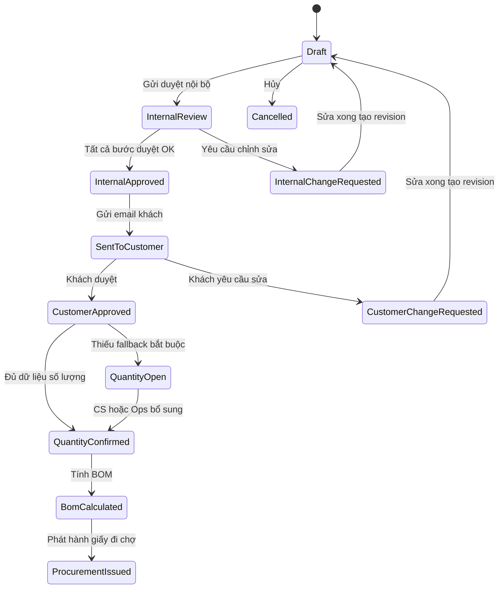
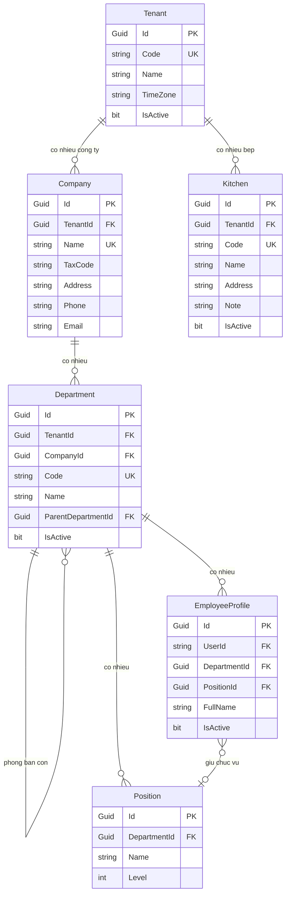
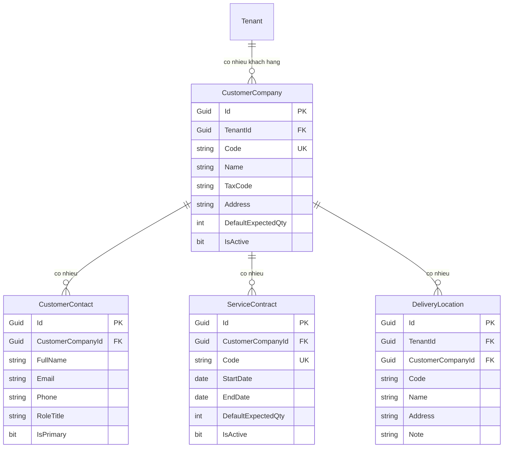
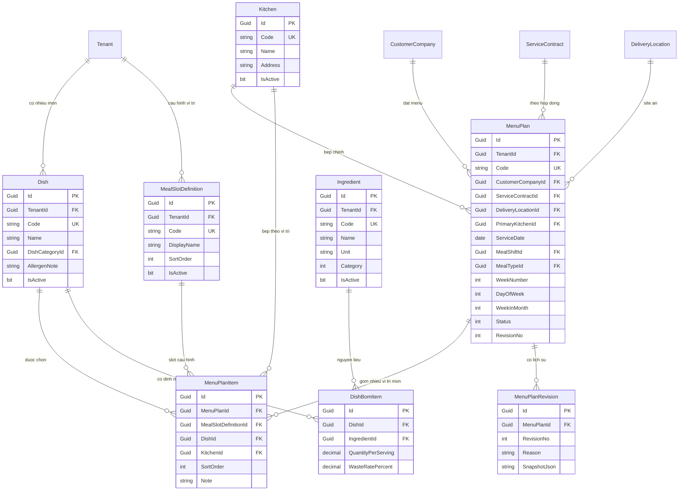
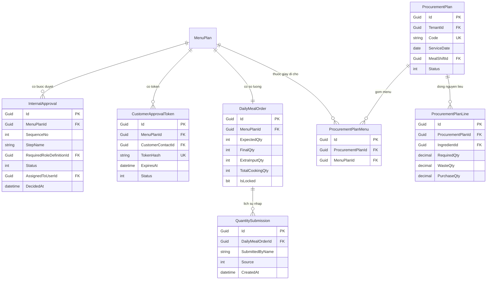

# OmniBizAI - Tài Liệu Kỹ Thuật Triển Khai

> Ngày cập nhật: 2026-04-30
> Tên đề tài cố định: **"Hệ thống vận hành thông minh cho doanh nghiệp vừa và nhỏ, hỗ trợ quản lý đa cấp và đưa ra quyết định bằng AI"**
> Phạm vi triển khai: **OmniBizAI SME Operations Platform** - nền tảng vận hành doanh nghiệp có Work Management và workflow nghiệp vụ có thể cấu hình; Bizen Catering Services là tenant/case study đầu tiên.
> Công nghệ chốt Sprint 1: .NET 10, ASP.NET Core MVC, Razor Views, Entity Framework Core 10, SQL Server.

## 1. Mục Tiêu Và Phạm Vi MVP

### 1.1 Mục tiêu nghiệp vụ

Hệ thống hỗ trợ doanh nghiệp SME quản lý công việc phòng ban và các workflow vận hành có phê duyệt, dashboard và AI advisory. Bizen Catering Services được dùng làm tenant đầu tiên để kiểm chứng workflow suất ăn bằng dữ liệu Lark thật:

1. Lập và xuất thực đơn theo ngày, ca ăn, khách hàng hoặc hợp đồng.
2. Nội bộ kiểm duyệt thực đơn trước khi gửi khách hàng.
3. Khách hàng nhận email gồm dashboard thực đơn đã duyệt nội bộ và các form công khai: góp ý menu, nhập số lượng dự kiến, nhập số lượng chốt trước 09:00 ngày phục vụ và nhập số lượng phát sinh sau khi chốt.
4. Khách hàng cung cấp số lượng dự kiến, số lượng chốt và số lượng phát sinh theo từng công ty/site/ca/loại suất.
5. Hệ thống áp dụng rule tự động nếu khách hàng không nhập đủ số lượng: dự kiến lấy từ cùng kỳ tuần trước, chốt mặc định bằng dự kiến, phát sinh có thể điều chỉnh tăng/giảm hoặc ghi đè tổng chính xác.
6. Hệ thống dùng BOM định mức nguyên vật liệu của từng món để tính nhu cầu nguyên liệu.
7. Hệ thống xuất giấy đi chợ chi tiết theo ngày/ca/khách hàng, có dashboard và export Excel/PDF để in.
8. AI hỗ trợ phát hiện bất thường, tóm tắt nhu cầu nguyên liệu và gợi ý quyết định cho quản lý.

### 1.2 Cách giữ đúng tên đề tài và hướng thương mại hóa

Tên đề tài đã cố định và không đổi. Cách diễn giải trong đồ án:

- "Doanh nghiệp vừa và nhỏ" là nhóm SME cần quản lý công việc, workflow, phê duyệt và ra quyết định; Bizen là doanh nghiệp đầu tiên để triển khai mẫu trong ngành suất ăn.
- "Quản lý đa cấp" là quản lý theo tenant, công ty, phòng ban, vai trò và các cấp duyệt: người lập thực đơn, quản lý vận hành, bếp/QA, khách hàng.
- "Đưa ra quyết định bằng AI" là lớp AI advisory: cảnh báo số lượng tăng bất thường, cảnh báo thiếu BOM, gợi ý gom mua nguyên liệu, tóm tắt giấy đi chợ và hỗ trợ quản lý ra quyết định.
- "Có thể bán dự án" nghĩa là nghiệp vụ riêng của từng khách hàng được đưa vào cấu hình và import mapping, không hard-code vào code lõi.

### 1.3 Design contract: không hard-code nghiệp vụ

Nguyên tắc bắt buộc: **không hard-code bất kỳ dữ liệu, nhãn, rule hoặc luồng nghiệp vụ nào có thể thay đổi theo tenant/khách hàng**. Code lõi chỉ chứa engine, invariant kỹ thuật và contract ổn định; mọi biến thể nghiệp vụ nằm trong database/config/import profile.

| Không được hard-code                                         | Cách làm đúng                                                                    |
| ---------------------------------------------------------------- | ------------------------------------------------------------------------------------ |
| Tên công ty, mã khách, mã site, tên bếp, người duyệt   | Bảng tenant/master data/import mapping                                              |
| Role nghiệp vụ như Ops, QA, KitchenLead, Purchasing           | `RoleDefinition`, `PermissionDefinition`, `RolePermission` theo tenant         |
| Policy/controller permission theo role cố định                | `RoutePermissionRule` hoặc permission handler đọc DB/cache                      |
| Phòng ban, chức vụ, cấp duyệt                               | `Department`, `Position`, `ApprovalWorkflowConfig`                             |
| Ca ăn, alias ca, loại suất                                    | `MealShift`, `MealType`                                                          |
| Vị trí món, thứ tự hiển thị, bắt buộc/không bắt buộc | `MealSlotDefinition`, `MealTypeSlotRule`                                         |
| Nhóm món, nhóm nguyên liệu, đơn vị                       | `DishCategory`, `IngredientCategory`, `UnitDefinition`, `UnitConversionRule` |
| Rule số lượng, ngưỡng cảnh báo, cách fallback            | `QuantityRuleConfig`, `AnomalyRuleConfig`                                        |
| Bếp theo site/loại suất/vị trí món                         | `KitchenAssignmentRule`                                                            |
| Form khách hàng, field nhập liệu, validation                 | `FormDefinition`, `FormFieldDefinition`, `ValidationRuleConfig`                |
| Email, thông báo, export, dashboard, AI prompt                 | Template/config theo tenant                                                          |

Ngoại lệ được phép trong code:

- Invariant kỹ thuật của engine như `Draft`, `Locked`, `Issued`, `Cancelled` nếu được dùng để bảo toàn transaction/state machine.
- Interface/service contract, migration, route name kỹ thuật và feature flag key.
- Mã permission kỹ thuật có thể seed lần đầu, nhưng tên hiển thị, mapping role-permission và quyền theo route phải cấu hình được.

Mọi ngoại lệ phải được ghi rõ trong tài liệu hoặc comment code. Nếu một giá trị có thể khác giữa Bizen và khách hàng thứ hai, giá trị đó không được nằm trong enum/constant C#.

### 1.4 Hai lớp sản phẩm

OmniBizAI không chỉ là một hệ thống catering. Sản phẩm được thiết kế theo hai lớp:

1. **Quản lý quy trình vận hành toàn công ty**: workflow nghiệp vụ, phê duyệt đa cấp, dashboard, audit và AI advisory. Bizen Catering là workflow triển khai đầu tiên.
2. **Quản lý công việc theo phòng ban**: board/list/card kiểu Trello/Jira/Asana để giao việc hằng ngày, theo dõi deadline, checklist, comment, file, workload và rủi ro trễ hạn.

Các workflow nghiệp vụ như thực đơn/BOM/giấy đi chợ có thể sinh hoặc liên kết với task để phòng ban theo dõi thực thi. Ví dụ một menu bị khách yêu cầu sửa có thể tạo task cho bộ phận thực đơn; một giấy đi chợ đã phát hành có thể tạo task mua nguyên liệu cho Purchasing.

### 1.5 Module trong MVP

| Module                      |             Bắt buộc | Mục tiêu                                                                                            |
| --------------------------- | ---------------------: | ----------------------------------------------------------------------------------------------------- |
| Authentication & RBAC       |                    Có | Đăng nhập, phân quyền nhân viên nội bộ                                                       |
| Tenant & Company Management |                    Có | Quản lý tenant, công ty vận hành, phòng ban, team, chức vụ, nhân sự                         |
| Work Management Core        |                    Có | Board/List/Card theo phòng ban, giao việc, deadline, checklist, comment, file đính kèm, My Tasks |
| Configuration Center        |    Có mức nền tảng | Sprint 1 đọc JSON/import profile qua service; UI cấu hình nâng cao để giai đoạn sau          |
| Customer Management         |                    Có | Quản lý khách hàng doanh nghiệp, người liên hệ, địa điểm giao                            |
| Menu Management             |                    Có | Tạo thực đơn, món ăn, ca ăn, xuất menu                                                        |
| Internal Approval           |                    Có | Nội bộ kiểm duyệt thực đơn và ghi lịch sử duyệt                                            |
| Customer Email Forms        |                    Có | Gửi email dashboard thực đơn, khách hàng góp ý và nhập số lượng bằng token              |
| Quantity Management         |                    Có | Nhập dự kiến/chốt/phát sinh, tự fallback dự kiến theo tuần trước và chốt trước 09:00   |
| BOM & Ingredients           |                    Có | Định mức nguyên vật liệu theo món và khẩu phần                                              |
| Procurement Plan            |                    Có | Tính số lượng nguyên liệu và xuất giấy đi chợ                                              |
| Lark/CSV Import             |       Có mức staging | Nhập dữ liệu thật qua staging, validation, mapping trước khi commit                             |
| Dashboard & Reports         |                    Có | Dashboard vận hành, báo cáo menu/số lượng/nguyên liệu                                        |
| Audit & Notification        |                    Có | Nhật ký hành động, thông báo nội bộ                                                          |
| AI Decision Support         | Có mức mock/fallback | Cảnh báo và gợi ý cho vận hành catering và task, không tự thực thi                         |

### 1.6 Module loại khỏi MVP

Không triển khai trong 1 tuần đầu:

- Finance/Payment Request, ngân sách kế toán, giao dịch thu chi.
- KPI/OKR nhân sự đầy đủ; Sprint 1 chỉ cần số liệu task cơ bản như quá hạn/đúng hạn.
- Market Intelligence độc lập.
- Payroll, CRM nâng cao, POS, hóa đơn điện tử.
- Inventory nâng cao theo lô/hạn dùng/đối soát kho đầy đủ.
- Supplier order tự động.
- SOP/document repository có versioning đầy đủ.
- Calendar, Timeline/Gantt và Workload nâng cao; Sprint 1 ưu tiên Kanban/List/My Tasks.
- Mobile app native.
- Self-service SaaS phức tạp: billing, subscription, marketplace, provisioning tự động.
- Workflow designer kéo thả.
- RAG/vector search hoặc training AI riêng.

Lưu ý thương mại hóa: MVP vẫn phải có `TenantId`, tenant configuration và import staging. Phần bị loại chỉ là lớp SaaS tự phục vụ/billing, không phải khả năng triển khai nhiều khách hàng.

Sprint 1 implementation cutline nằm ở [06-Sprint-1-Implementation-Cutline.md](06-Sprint-1-Implementation-Cutline.md). Khi code trong 7 ngày, ưu tiên Must-have trong cutline; các configuration UI nâng cao chỉ làm nếu core flow đã chạy ổn.

## 2. Kiến Trúc Kỹ Thuật

### 2.1 Mô hình tổng thể

```text
Browser
  |
  v
ASP.NET Core MVC + Razor Views
  |
  +-- Controllers: nhận request, authorize, map ViewModel
  |
  +-- Services: business rules, transaction, email, calculation, AI advisory
  |
  +-- EF Core DbContext
  |
  v
SQL Server
```

Nguyên tắc:

- MVC-first, không xây public REST API trong MVP.
- JSON endpoint chỉ dùng phụ trợ cho autocomplete, preview BOM, AI chat và dashboard widget.
- Controller mỏng; nghiệp vụ nằm trong service.
- Razor View chỉ bind ViewModel, không truy vấn DbContext trực tiếp.
- Mọi action thay đổi dữ liệu phải có authorization, anti-forgery và audit log.
- Mọi truy vấn nghiệp vụ phải chạy trong tenant context; không để người dùng tenant này thấy dữ liệu tenant khác.
- Dữ liệu Lark/CSV đi qua staging và validation trước khi ghi vào master/transaction table.

### 2.2 Cấu trúc thư mục đề xuất

```text
Controllers/
  TenantsController.cs
  CompanyController.cs
  ConfigurationController.cs
  DepartmentsController.cs
  EmployeesController.cs
  KitchensController.cs
  CustomersController.cs
  MenuPlansController.cs
  InternalApprovalsController.cs
  CustomerApprovalsController.cs
  QuantityOrdersController.cs
  IngredientsController.cs
  BomController.cs
  ProcurementPlansController.cs
  DashboardController.cs
  AiAssistantController.cs
  ReportsController.cs
  ImportsController.cs

Models/
  Entities/
    Platform/
    Organization/
    Configuration/
    Customers/
    Menus/
    Approvals/
    Quantities/
    Bom/
    Procurement/
    Imports/
    Ai/
    Audit/
  Enums/

ViewModels/
  Company/
  Customers/
  MenuPlans/
  QuantityOrders/
  Procurement/
  Dashboard/
  Ai/

Services/
  Organization/
  Customers/
  MenuPlans/
  Approvals/
  Email/
  Quantities/
  Bom/
  Procurement/
  Ai/
  Audit/
```

### 2.3 Công nghệ chốt

| Hạng mục    | Quyết định                                                         |
| ------------- | --------------------------------------------------------------------- |
| Runtime       | .NET 10, target framework `net10.0`                                 |
| Web framework | ASP.NET Core MVC                                                      |
| View          | Razor Views, Tag Helpers, Bootstrap 5                                 |
| ORM           | Entity Framework Core 10                                              |
| Database      | SQL Server                                                            |
| Auth          | ASP.NET Core Identity cookie                                          |
| Email MVP     | SMTP abstraction; dev mode ghi email ra database/log                  |
| AI MVP        | Provider abstraction, mock/fallback trước; có thể nối Gemini sau |
| Export        | HTML print, PDF và XLSX cho giấy đi chợ/dashboard số lượng     |
| Test          | xUnit cho service, Playwright smoke cho UI, manual QA checklist       |

## 3. Vai Trò, Phòng Ban Và Quyền

### 3.1 Template phòng ban cho tenant vận hành

| Mã     | Phòng ban                 | Nhiệm vụ chính                                              |
| ------- | -------------------------- | -------------------------------------------------------------- |
| BOD     | Ban giám đốc            | Theo dõi dashboard, duyệt ngoại lệ, ra quyết định       |
| OPS     | Vận hành                 | Điều phối lịch menu, khách hàng, số lượng, giao nhận |
| MENU    | Kế hoạch thực đơn/R&D | Lập menu, quản lý món ăn, định mức BOM                 |
| KITCHEN | Bếp sản xuất            | Xác nhận khả năng nấu, đọc giấy đi chợ               |
| QA      | Kiểm soát chất lượng  | Kiểm duyệt món, dị ứng, tiêu chuẩn an toàn             |
| PUR     | Thu mua                    | Xử lý giấy đi chợ, nhà cung cấp, số lượng cần mua   |
| CS      | Chăm sóc khách hàng    | Gửi menu, theo dõi khách phản hồi và nhập số lượng   |
| ADMIN   | Quản trị hệ thống      | Tài khoản, phân quyền, cấu hình                          |

Các phòng ban trên chỉ là template cấu hình ban đầu cho tenant Bizen, được seed từ JSON/import profile. Khi triển khai cho khách hàng khác, admin có thể đổi tên, thêm/bớt phòng ban và ánh xạ quyền mà không sửa code.

### 3.2 Role và permission cấu hình theo tenant

| Role template     | Mục tiêu                                                                        |
| ----------------- | --------------------------------------------------------------------------------- |
| Admin             | Quản lý toàn hệ thống                                                        |
| Director          | Xem toàn công ty, duyệt ngoại lệ                                             |
| OperationsManager | Duyệt vận hành, xem dashboard toàn bộ quy trình                             |
| DepartmentManager | Quản lý phòng ban, board, workload và task thuộc phòng                      |
| TeamLead          | Quản lý team, giao việc và theo dõi tiến độ team                          |
| Employee          | Xử lý task được giao, comment, cập nhật checklist                          |
| MenuPlanner       | Tạo/sửa menu, món ăn, BOM                                                     |
| KitchenLead       | Kiểm tra khả năng sản xuất, xem BOM và giấy đi chợ                       |
| QAReviewer        | Kiểm duyệt chất lượng thực đơn                                            |
| PurchasingStaff   | Xem và xử lý giấy đi chợ                                                    |
| CustomerService   | Quản lý khách, gửi email dashboard/form, theo dõi phản hồi và số lượng |

Khách hàng không cần tài khoản trong MVP. Khách dùng link email có token để xem dashboard menu, góp ý và nhập số lượng.

Không dùng `AppRoles` constants để khóa nghiệp vụ. Role là dữ liệu:

| Entity | Field chính | Ghi chú |
|---|---|
| RoleDefinition | TenantId, Code, DisplayName, Description, IsSystem, IsActive | Role theo tenant; code có thể đổi qua admin nếu không phải system |
| PermissionDefinition | Code, DisplayName, Module, Description, IsSystem | Capability kỹ thuật có thể seed, nhưng mapping không cố định |
| RolePermission | TenantId, RoleDefinitionId, PermissionDefinitionId, IsAllowed | Tenant quyết định role nào có quyền nào |
| UserRoleAssignment | TenantId, UserId, RoleDefinitionId, ScopeType, ScopeId | Gán role theo tenant/site/phòng ban nếu cần |
| RoutePermissionRule | TenantId, Area, Controller, Action, HttpMethod, RequiredPermissionCode, IsActive | Authorization theo route đọc từ DB/cache |

Permission template ban đầu:

| Permission code               | Mục tiêu                                                                      |
| ----------------------------- | ------------------------------------------------------------------------------- |
| `company.manage`            | Quản lý công ty/phòng ban/nhân sự                                         |
| `customer.manage`           | Quản lý khách hàng/contact/site                                             |
| `config.manage`             | Quản lý cấu hình tenant                                                     |
| `work.board.manage`         | Tạo/sửa board, column, label theo phòng ban                                  |
| `work.task.create`          | Tạo task/card                                                                  |
| `work.task.edit`            | Sửa nội dung, deadline, checklist, file, comment trong phạm vi được phép |
| `work.task.assign`          | Giao việc và đổi người phụ trách                                        |
| `work.task.move`            | Kéo thả/chuyển trạng thái task                                             |
| `work.task.view_department` | Xem task trong phạm vi phòng ban/team                                         |
| `menu.edit`                 | Tạo/sửa thực đơn                                                           |
| `approval.decide`           | Duyệt hoặc yêu cầu sửa                                                     |
| `customer_approval.send`    | Gửi link dashboard/form cho khách                                             |
| `quantity.edit`             | Nhập/sửa số lượng                                                          |
| `procurement.manage`        | Preview/tạo/phát hành giấy đi chợ                                         |
| `audit.view`                | Xem audit log                                                                   |

### 3.3 Permission matrix

Ma trận dưới đây là template Bizen để seed ban đầu, không phải rule hard-code. Tenant admin có thể sửa mapping trong Configuration Center.

| Chức năng                    | Admin | Director |     Dept Manager |      Team Lead |        Employee |    Ops |   Menu | Purchasing |     CS |
| ------------------------------ | ----: | -------: | ---------------: | -------------: | --------------: | -----: | -----: | ---------: | -----: |
| Quản lý phòng ban/nhân sự |   Có |      Xem | Xem phòng mình | Xem team mình |          Không | Không | Không |     Không | Không |
| Quản lý board phòng ban     |   Có |      Xem |              Có | Có trong team |          Không |    Có | Không |     Không | Không |
| Tạo/sửa/giao task            |   Có |      Xem |              Có |            Có | Task của mình |    Có |    Có |        Có |    Có |
| Xem My Tasks                   |   Có |      Có |              Có |            Có |             Có |    Có |    Có |        Có |    Có |
| Quản lý khách hàng         |   Có |      Xem |      Theo quyền |         Không |          Không |    Có | Không |     Không |    Có |
| Tạo/sửa món ăn/BOM         |   Có |      Xem |      Theo quyền |         Không |          Không |    Xem |    Có |        Xem | Không |
| Tạo thực đơn               |   Có |      Xem |      Theo quyền |         Không |          Không |    Có |    Có |     Không | Không |
| Duyệt nội bộ                |   Có |      Có |    Theo workflow |  Theo workflow |          Không |    Có | Không |     Không | Không |
| Gửi email khách              |   Có |      Có |      Theo quyền |         Không |          Không |    Có | Không |     Không |    Có |
| Nhập/sửa số lượng         |   Có |      Có |      Theo quyền |         Không |          Không |    Có | Không |     Không |    Có |
| Tính BOM/giấy đi chợ       |   Có |      Xem |      Theo quyền |         Không |          Không |    Có |    Có |        Có |    Xem |
| Chốt giấy đi chợ           |   Có |      Có |      Theo quyền |         Không |          Không |    Có | Không |        Có | Không |
| Dùng AI advisory              |   Có |      Có |              Có |            Có | Task của mình |    Có |    Có |        Có |    Có |
| Xem audit                      |   Có |      Có |    Theo phạm vi |         Không |          Không | Không | Không |     Không | Không |

## 4. State Machine Nghiệp Vụ

### 4.1 Trạng thái MenuPlan

| Status                  | Ý nghĩa                                            |                      Cho phép sửa |
| ----------------------- | ---------------------------------------------------- | ----------------------------------: |
| Draft                   | Đang soạn thực đơn                              |                                 Có |
| InternalReview          | Đã gửi nội bộ duyệt                            | Không, trừ khi bị yêu cầu sửa |
| InternalChangeRequested | Nội bộ yêu cầu chỉnh sửa                       |                                 Có |
| InternalApproved        | Nội bộ đã duyệt                                 |                              Không |
| SentToCustomer          | Đã gửi email cho khách                           |                              Không |
| CustomerChangeRequested | Khách yêu cầu chỉnh sửa                         |                                 Có |
| CustomerApproved        | Khách đã xác nhận hoặc không có góp ý menu |                              Không |
| QuantityOpen            | Đang chờ/nhận số lượng                         |               Chỉ sửa số lượng |
| QuantityConfirmed       | Số lượng đã chốt                               |       Không, trừ quyền Ops/Admin |
| BomCalculated           | Đã tính BOM                                       |                              Không |
| ProcurementIssued       | Đã xuất giấy đi chợ                            |                              Không |
| Cancelled               | Hủy                                                 |                              Không |

### 4.2 Luồng chuẩn

```text
Draft
  -> InternalReview
  -> InternalApproved
  -> SentToCustomer
  -> CustomerApproved
  -> QuantityOpen
  -> QuantityConfirmed
  -> BomCalculated
  -> ProcurementIssued
```

Quyết định MVP để tránh mơ hồ: email gửi khách không gộp mọi thao tác vào một form duy nhất. Email chứa dashboard thực đơn đã qua duyệt nội bộ và 4 form/link theo template Bizen:

- `menu_feedback`: khách góp ý hoặc yêu cầu chỉnh sửa menu.
- `expected_quantity`: khách nhập số lượng dự kiến cho các ngày gần tới; hệ thống vẫn tự seed dự kiến theo tuần trước để đề phòng khách không nhập.
- `final_quantity`: khách nhập số lượng chốt trước 09:00 theo timezone tenant vào ngày phục vụ.
- `extra_quantity`: khách nhập phát sinh sau khi đã chốt, theo mode điều chỉnh tăng/giảm hoặc ghi đè tổng chính xác.

Khi khách gửi form:

- Nếu khách đồng ý menu hoặc không có góp ý, menu giữ trạng thái `SentToCustomer`/`CustomerApproved` tùy action cấu hình; số lượng vẫn được resolve độc lập theo các form số lượng.
- Nếu khách yêu cầu chỉnh sửa, hệ thống chuyển `SentToCustomer -> CustomerChangeRequested`.
- Nếu form số lượng resolve đủ dữ liệu, hệ thống tạo/cập nhật `DailyMealOrder`, chuyển menu sang `QuantityConfirmed`.
- Nếu thiếu dữ liệu fallback bắt buộc, ví dụ không có dữ liệu tuần trước và hợp đồng không có default, hệ thống chuyển `QuantityOpen` để CS/Ops nhập bổ sung.

`BomCalculated` là trạng thái sau khi đã tạo ít nhất một `ProcurementPlan` draft từ menu. `ProcurementIssued` là trạng thái sau khi giấy đi chợ được phát hành.

Luồng trả về sửa:

```text
InternalReview -> InternalChangeRequested -> Draft
SentToCustomer -> CustomerChangeRequested -> Draft
```

Luồng duyệt nội bộ là workflow template trong dữ liệu cấu hình MVP. Với tenant Bizen, bước duyệt chính là **Chị Nga duyệt**; tên người duyệt và tài khoản được seed/config theo tenant, không viết cứng trong controller/service:

| Sequence | StepName        | RequiredRoleDefinition                               | Bắt buộc | Kết quả                                                                   |
| -------: | --------------- | ---------------------------------------------------- | ---------: | --------------------------------------------------------------------------- |
|        1 | Chị Nga duyệt | OperationsManager hoặc QAReviewer theo config Bizen |        Có | Kiểm tra thực đơn nội bộ, yêu cầu sửa hoặc chốt để gửi khách |

Tenant khác có thể thay template này bằng nhiều bước, ví dụ QA Review, Kitchen Review và Operations Approval, mà không sửa code lõi.

Các bước chạy tuần tự. Nếu một bước `ChangeRequested`, toàn bộ menu quay về `InternalChangeRequested`; người lập menu chỉnh sửa, tạo revision và gửi lại từ đầu.

Trạng thái không dùng enum C# cố định. Hệ thống nạp `StateDefinition` và `StateTransitionConfig` theo tenant/state machine. Code lõi chỉ gọi state machine engine với `StateMachine`, `CurrentStateCode` và `ActionCode`, sau đó engine kiểm tra permission, guard rule và trạng thái đích.

State template cho tenant đầu tiên gồm các code như `draft`, `internal_review`, `internal_approved`, `sent_to_customer`, `quantity_confirmed`, `bom_calculated`, `procurement_issued`, `cancelled`. Tenant khác có thể đổi nhãn, ẩn action hoặc thêm trạng thái trung gian nếu guard rule hỗ trợ.

### 4.2.1 Sơ đồ trạng thái MenuPlan



### 4.3 Rule khóa dữ liệu

- Menu đã gửi nội bộ duyệt không được sửa món trực tiếp.
- Menu đã gửi khách không được thay đổi nội dung nếu chưa tạo revision mới.
- Menu đã gửi khách và không có yêu cầu sửa chỉ được nhập số lượng, không đổi món.
- Giấy đi chợ đã phát hành chỉ được hủy và tạo bản mới nếu có quyền Ops/Admin.

## 5. Database Blueprint

### 5.1 Quy ước chung

- Primary key: `Guid Id`.
- Audit fields: `CreatedAt`, `CreatedByUserId`, `UpdatedAt`, `UpdatedByUserId`.
- Soft delete cho dữ liệu master: `IsDeleted`.
- Concurrency cho bảng quan trọng: `byte[] RowVersion`.
- Tiền tệ chưa cần trong MVP; nếu có giá nguyên liệu thì dùng `decimal(18,2)`.
- Số lượng nguyên liệu dùng `decimal(18,3)` để hỗ trợ gram, kg, lít, cái, thùng, chai và các đơn vị thực tế từ Lark.
- Bảng nghiệp vụ thuộc khách hàng triển khai phải có `TenantId`. Không dùng dữ liệu global trừ bảng lookup kỹ thuật.
- Bảng import phải lưu `SourceSystem`, `SourceTable`, `SourceRecordId`, `RawJson` hoặc `RawCsvLine` để đối soát dữ liệu thật.

### 5.2 Entity tổ chức

| Entity          | Field chính                                                                       | Ghi chú                                                                         |
| --------------- | ---------------------------------------------------------------------------------- | -------------------------------------------------------------------------------- |
| Tenant          | Code, Name, Slug, TimeZone, DefaultLocale, IsActive                                | Mỗi doanh nghiệp triển khai là một tenant; Bizen là tenant đầu tiên     |
| Company         | TenantId, Name, TaxCode, Address, Phone, Email                                     | Công ty vận hành trong tenant                                                 |
| Department      | TenantId, CompanyId, Code, Name, ParentDepartmentId, IsActive                      | Hỗ trợ quản lý đa cấp                                                      |
| Team            | TenantId, DepartmentId, Code, Name, TeamLeadUserId, IsActive                       | Nhóm nhỏ trong phòng ban, ví dụ Sales B2B hoặc Content Team                |
| Position        | DepartmentId, Name, Level                                                          | Chức vụ nội bộ                                                               |
| EmployeeProfile | UserId, DepartmentId, TeamId, PositionId, ManagerUserId, FullName, Phone, IsActive | Gắn IdentityUser với nghiệp vụ, cấp trên trực tiếp và team              |
| Kitchen         | TenantId, Code, Name, Address, Note, IsActive                                      | Bếp sản xuất; seed từ dữ liệu thực tế theo tenant                        |
| MealShift       | TenantId, Code, Name, AliasNames, Note, SortOrder, IsActive                        | Ca ăn (Ca 1, Ca 2, Ca 3, ca gãy...); entity vì tên ca khác nhau theo khách |
| MealType        | TenantId, Code, Name, CustomerCompanyId, SeatPosition, IsActive                    | Loại suất ăn (Suất mặn, chay, nước, VP, tăng ca, mì sữa...)            |

### 5.2.1 Entity cấu hình tenant

| Entity                      | Field chính                                                                                                                                       | Ghi chú                                                                                 |
| --------------------------- | -------------------------------------------------------------------------------------------------------------------------------------------------- | ---------------------------------------------------------------------------------------- |
| TenantSetting               | TenantId, Key, Value, ValueType                                                                                                                    | Cấu hình linh hoạt: timezone, email sender, feature flag                              |
| RoleDefinition              | TenantId, Code, DisplayName, Description, IsSystem, IsActive                                                                                       | Role theo tenant                                                                         |
| PermissionDefinition        | Code, DisplayName, Module, Description, IsSystem                                                                                                   | Capability kỹ thuật có thể seed                                                      |
| RolePermission              | TenantId, RoleDefinitionId, PermissionDefinitionId, IsAllowed                                                                                      | Mapping quyền theo tenant                                                               |
| UserRoleAssignment          | TenantId, UserId, RoleDefinitionId, ScopeType, ScopeId                                                                                             | Gán role theo tenant/site/phòng ban                                                    |
| RoutePermissionRule         | TenantId, Area, Controller, Action, HttpMethod, RequiredPermissionCode, IsActive                                                                   | Rule authorization đọc DB/cache                                                        |
| StateDefinition             | TenantId, StateMachine, Code, DisplayName, Category, SortOrder, IsTerminal, IsActive                                                               | Trạng thái menu/approval/procurement cấu hình được                                |
| StateTransitionConfig       | TenantId, StateMachine, FromStateCode, ActionCode, ToStateCode, RequiredPermissionCode, GuardRuleJson, IsActive                                    | Đồ thị chuyển trạng thái cấu hình được                                        |
| ActionDefinition            | TenantId, StateMachine, Code, DisplayName, ButtonStyle, ConfirmationTemplate, IsActive                                                             | Action hiển thị theo trạng thái                                                      |
| MealSlotDefinition          | TenantId, Code, DisplayName, GroupName, SortOrder, IsRequiredByDefault, IsActive                                                                   | Vị trí món cấu hình theo tenant, thay cho enum cứng                                |
| MealTypeSlotRule            | TenantId, MealTypeId, MealSlotDefinitionId, IsVisible, IsRequired, DefaultQuantityRatio, SortOrder                                                 | Tenant quyết định loại suất nào dùng slot nào                                    |
| DishCategory                | TenantId, Code, DisplayName, SortOrder, IsActive                                                                                                   | Nhóm món cấu hình theo tenant, không dùng enum cứng                               |
| IngredientCategory          | TenantId, Code, DisplayName, SortOrder, IsActive                                                                                                   | Nhóm nguyên liệu thay cho enum nghiệp vụ cứng                                      |
| UnitDefinition              | TenantId, Code, DisplayName, UnitKind, DecimalPlaces, IsActive                                                                                     | Danh sách đơn vị được phép theo tenant                                           |
| KitchenAssignmentRule       | TenantId, DeliveryLocationId, MealTypeId, MealSlotDefinitionId, KitchenId, Priority, IsActive                                                      | Ánh xạ bếp theo site/loại suất/vị trí món                                        |
| ApprovalWorkflowConfig      | TenantId, WorkflowType, StepNo, StepName, RequiredRoleDefinitionId, IsRequired, IsActive                                                           | Cấu hình duyệt nội bộ theo tenant                                                   |
| QuantityRuleConfig          | TenantId, CustomerCompanyId, DeliveryLocationId, MealTypeId, PriorityOrderJson, ExpectedFallbackMode, FinalCutoffLocalTime, RequireManualIfMissing | Cấu hình fallback số lượng, ví dụ `previous_week_same_weekday` và cutoff 09:00 |
| QuantitySourceDefinition    | TenantId, Code, DisplayName, IsSystem, IsActive                                                                                                    | Nguồn số lượng để audit/giao diện                                                 |
| ExtraQuantityModeDefinition | TenantId, Code, DisplayName, FormulaJson, IsActive                                                                                                 | Cách xử lý phát sinh, ví dụ điều chỉnh tăng/giảm hoặc ghi đè tổng         |
| BomRuleConfig               | TenantId, CustomerCompanyId, MealTypeId, IngredientCategoryId, WasteRatePercent, RoundingMode, IsActive                                            | Cấu hình hao hụt/làm tròn BOM                                                       |
| ImportMappingProfile        | TenantId, SourceSystem, SourceTable, TargetEntity, MappingJson, IsActive                                                                           | Mapping CSV/API Lark hoặc nguồn khác                                                  |
| FormDefinition              | TenantId, Code, Name, TargetWorkflow, IsPublic, IsActive                                                                                           | Form nội bộ/khách hàng theo tenant                                                   |
| FormFieldDefinition         | FormDefinitionId, FieldKey, Label, DataType, IsRequired, OptionsJson, SortOrder                                                                    | Field động cho form                                                                    |
| ValidationRuleConfig        | TenantId, TargetType, FieldKey, RuleType, RuleJson, ErrorMessage                                                                                   | Validation có thể đổi theo tenant                                                    |
| EmailTemplate               | TenantId, Code, SubjectTemplate, BodyTemplate, Locale, IsActive                                                                                    | Email duyệt, email báo số lượng, nhắc việc                                        |
| ExportTemplate              | TenantId, Code, OutputType, TemplateJson, IsActive                                                                                                 | Mẫu in menu/giấy đi chợ/báo cáo                                                    |
| DashboardWidgetConfig       | TenantId, RoleDefinitionId, WidgetCode, SettingsJson, SortOrder, IsActive                                                                          | Dashboard khác nhau theo role/tenant                                                    |
| AiPromptTemplate            | TenantId, Code, SystemPrompt, UserPromptTemplate, CitationPolicyJson, IsActive                                                                     | Prompt AI cấu hình, không hard-code câu lệnh                                        |

### 5.2.2 Entity Work Management Core

Mục tiêu của module này là tạo lớp công việc chung cho mọi phòng ban, không đóng khung theo catering. Các module nghiệp vụ có thể liên kết task qua `LinkedEntityType`/`LinkedEntityId`.

| Entity                  | Field chính                                                                                                                                                                                                                            | Ghi chú                                                                              |
| ----------------------- | --------------------------------------------------------------------------------------------------------------------------------------------------------------------------------------------------------------------------------------- | ------------------------------------------------------------------------------------- |
| WorkBoard               | TenantId, DepartmentId, TeamId, OwnerUserId, Name, Description, VisibilityCode, SortOrder, IsArchived                                                                                                                                   | Board theo phòng ban/dự án                                                         |
| WorkColumn              | WorkBoardId, Name, StatusCode, SortOrder, WipLimit, IsDoneColumn                                                                                                                                                                        | Cột Kanban/List; status đọc từ config                                             |
| WorkTask                | TenantId, WorkBoardId, WorkColumnId, DepartmentId, TeamId, Title, Description, PriorityCode, StartDate, DueDate, SlaDueAt, RiskScore, CreatedByUserId, ReporterUserId, LinkedWorkflowCode, LinkedEntityType, LinkedEntityId, RowVersion | Card/task chính                                                                      |
| WorkTaskAssignee        | WorkTaskId, UserId, AssignmentRoleCode                                                                                                                                                                                                  | Người phụ trách chính/phối hợp/người theo dõi                               |
| WorkTaskChecklistItem   | WorkTaskId, Title, IsDone, SortOrder, DoneByUserId, DoneAt                                                                                                                                                                              | Checklist nhỏ trong task                                                             |
| WorkTaskComment         | WorkTaskId, UserId, Body, CreatedAt, UpdatedAt                                                                                                                                                                                          | Trao đổi trong task                                                                 |
| WorkTaskAttachment      | WorkTaskId, FileName, ContentType, StorageKey, UploadedByUserId, UploadedAt                                                                                                                                                             | File đính kèm; MVP lưu local/private storage hoặc DB metadata                    |
| WorkTaskLabel           | TenantId, WorkBoardId, Name, ColorHex                                                                                                                                                                                                   | Nhãn màu theo board                                                                 |
| WorkTaskLabelAssignment | WorkTaskId, WorkTaskLabelId                                                                                                                                                                                                             | Gán nhãn cho task                                                                   |
| WorkTaskDependency      | WorkTaskId, DependsOnWorkTaskId, DependencyTypeCode                                                                                                                                                                                     | Phụ thuộc task trước/sau                                                          |
| WorkTaskActivity        | WorkTaskId, ActorUserId, ActionCode, OldValuesJson, NewValuesJson, CreatedAt                                                                                                                                                            | Lịch sử thay đổi để audit task                                                  |
| WorkAutomationRule      | TenantId, WorkBoardId, TriggerJson, ConditionJson, ActionJson, IsActive                                                                                                                                                                 | Automation cấu hình được; Sprint 1 có thể chỉ seed rule quá hạn/thông báo |

Board view trong MVP gồm Kanban, List và My Tasks. Calendar, Timeline/Gantt, Workload heatmap, KPI/OKR đầy đủ và SOP/document repository là roadmap sau Sprint 1.

### 5.3 Entity khách hàng

| Entity           | Field chính                                                                                | Ghi chú                   |
| ---------------- | ------------------------------------------------------------------------------------------- | -------------------------- |
| CustomerCompany  | TenantId, Code, Name, TaxCode, Address, DefaultExpectedQty, SourceExternalId, IsActive      | Khách hàng doanh nghiệp |
| CustomerContact  | CustomerCompanyId, FullName, Email, Phone, RoleTitle, IsPrimary                             | Người nhận email duyệt |
| ServiceContract  | CustomerCompanyId, Code, StartDate, EndDate, DefaultMealShift, DefaultExpectedQty, IsActive | Hợp đồng suất ăn      |
| DeliveryLocation | TenantId, CustomerCompanyId, Code, Name, Address, Note, SourceExternalId                    | Địa điểm giao/site ăn |

### 5.4 Entity menu và món ăn

| Entity           | Field chính                                                                                                                                                                                                                                                 | Ghi chú                                                                                              |
| ---------------- | ------------------------------------------------------------------------------------------------------------------------------------------------------------------------------------------------------------------------------------------------------------ | ----------------------------------------------------------------------------------------------------- |
| Dish             | TenantId, Code, Name, DishCategoryId, Description, AllergenNote, SourceExternalId, IsActive                                                                                                                                                                  | Món ăn dùng lại nhiều menu                                                                       |
| MenuPlan         | TenantId, Code, CustomerCompanyId, ServiceContractId, DeliveryLocationId, PrimaryKitchenId, ServiceDate, MealShiftId, MealTypeId, WeekNumber, DayOfWeek, MonthNumber, WeekInMonth, Status, RevisionNo, ImportBatchId, InternalApprovedAt, CustomerApprovedAt | Thực đơn theo ngày/tuần/ca/khách/site/loại suất;`PrimaryKitchenId` có thể null khi import |
| MenuPlanItem     | MenuPlanId, MealSlotDefinitionId, DishId, KitchenId, SortOrder, Note                                                                                                                                                                                         | Mỗi dòng là một vị trí món;`KitchenId` optional để hỗ trợ bếp theo nhóm món           |
| MenuPlanRevision | MenuPlanId, RevisionNo, Reason, SnapshotJson                                                                                                                                                                                                                 | Lưu lịch sử khi sửa sau khi bị yêu cầu                                                         |

Giải thích các trường thời gian trên MenuPlan:

| Field       | Type     | Ý nghĩa                     | Ví dụ       |
| ----------- | -------- | ----------------------------- | ------------- |
| ServiceDate | DateOnly | Ngày phục vụ               | 2026-05-01    |
| WeekNumber  | int      | Tuần trong năm (ISO 8601)   | 18            |
| DayOfWeek   | int      | Thứ trong tuần (1=T2, 7=CN) | 4 (Thứ Năm) |
| MonthNumber | int      | Tháng                        | 5             |
| WeekInMonth | int      | Thứ tự tuần trong tháng   | 1             |

Các trường `WeekNumber`, `DayOfWeek`, `MonthNumber`, `WeekInMonth` được tính tự động từ `ServiceDate` khi tạo/sửa menu. Mục đích lưu trữ: hỗ trợ lọc, báo cáo và hiển thị lịch thực đơn theo tuần/tháng mà không cần tính lại.

MealShift, MealType, MealSlotDefinition, DishCategory và IngredientCategory là entity cấu hình (không phải enum) vì tên ca ăn, loại suất, vị trí món và nhóm dữ liệu thay đổi theo tenant/khách hàng. Xem mục 5.2 và 5.2.1.

### 5.4.1 MealSlotDefinition — Vị trí món cấu hình theo tenant

Mỗi thực đơn (MenuPlan) bao gồm nhiều vị trí món. Vị trí món không được hard-code bằng enum vì dữ liệu Lark và khách hàng sau này có thể thêm/bớt slot. Hệ thống nạp bộ slot template cho tenant đầu tiên từ seed/import profile, nhưng admin có thể tắt, đổi tên, đổi thứ tự hoặc tạo slot mới.

Bộ slot template dựa trên export Lark:

| Nhóm         | Code template              | Hiển thị template  |
| ------------- | -------------------------- | -------------------- |
| Món mặn     | MAIN_MEAT_1..MAIN_MEAT_6   | Món mặn 1..6       |
| Món chay     | VEGETARIAN_1..VEGETARIAN_3 | Món chay 1..3       |
| Món nước   | LIQUID_1..LIQUID_3         | Món nước 1..3     |
| Canh          | SOUP_1                     | Món canh 1          |
| Rau           | VEGETABLE_1..VEGETABLE_2   | Món xào/luộc 1..2 |
| Tráng miệng | DESSERT_1                  | Món tráng miệng 1 |
| Buffet        | BUFFET_1                   | Món buffet          |
| Cơm          | WHITE_RICE_1               | Cơm trắng          |
| Cháo         | PORRIDGE_1                 | Món cháo           |
| Ăn sáng     | BREAKFAST_1                | Món ăn sáng       |
| Mì sữa      | NOODLE_MILK_1              | Món mì/sữa        |

Tổng cộng có 21 slot trong template Bizen. Export Lark hiện có cột cho tối đa 6 món mặn và 2 món xào/luộc; không phải tenant nào cũng dùng đủ các slot này.

```csharp
public sealed class MealSlotDefinition
{
    public Guid Id { get; set; }
    public Guid TenantId { get; set; }
    public string Code { get; set; } = "";
    public string DisplayName { get; set; } = "";
    public string GroupName { get; set; } = "";
    public int SortOrder { get; set; }
    public bool IsRequiredByDefault { get; set; }
    public bool IsActive { get; set; } = true;
}
```

Quy tắc:

- Một `MenuPlanItem` có duy nhất một `MealSlotDefinitionId` và một `DishId`.
- Unique constraint: `(MenuPlanId, MealSlotDefinitionId)` — mỗi vị trí trong một menu chỉ có một món.
- Không phải tất cả vị trí đều bắt buộc; requirement theo tenant nằm trong `MealSlotDefinition` hoặc rule riêng theo `MealType`.
- `MealSlotDefinition` giúp hệ thống hiển thị/in/xuất thực đơn theo cấu trúc riêng của từng khách hàng.

### 5.5 Entity phê duyệt

| Entity                | Field chính                                                                                                                              | Ghi chú                                              |
| --------------------- | ----------------------------------------------------------------------------------------------------------------------------------------- | ----------------------------------------------------- |
| InternalApproval      | MenuPlanId, SequenceNo, StepName, RequiredRoleDefinitionId, IsRequired, StatusCode, AssignedToUserId, DecidedByUserId, DecidedAt, Comment | Bước duyệt nội bộ                                |
| CustomerApprovalToken | MenuPlanId, CustomerContactId, SentToEmail, TokenHash, ExpiresAt, UsedAt, SubmittedAt, StatusCode, CustomerComment                        | Link public từ email cho dashboard/form khách hàng |
| ApprovalTimeline      | EntityType, EntityId, Action, ActorType, ActorName, Comment, CreatedAt                                                                    | Timeline hiển thị cho người dùng                 |

Approval status cũng dùng `StateDefinition`/`StateTransitionConfig` với `StateMachine = approval`. Nhãn hiển thị và action button theo từng status nằm trong cấu hình UI/workflow, không hard-code trong Razor.

### 5.6 Entity số lượng suất ăn

| Entity             | Field chính                                                                                                                                                                                                                                                 | Ghi chú                                                                                                         |
| ------------------ | ------------------------------------------------------------------------------------------------------------------------------------------------------------------------------------------------------------------------------------------------------------ | ---------------------------------------------------------------------------------------------------------------- |
| DailyMealOrder     | TenantId, MenuPlanId, CustomerCompanyId, ServiceContractId, DeliveryLocationId, ServiceDate, MealShiftId, MealTypeId, ExpectedQty, ExpectedQtySourceCode, FinalQty, FinalQtySourceCode, ExtraInputQty, ExtraModeCode, TotalCookingQty, ResolveNote, IsLocked | Một dòng số lượng chính cho menu;`ExtraInputQty` là số điều chỉnh có dấu khi mode là tăng/giảm |
| QuantitySubmission | DailyMealOrderId, SubmittedByName, SubmittedByEmail, SourceCode, ExpectedQtyInput, FinalQtyInput, ExtraQtyInput, ExtraModeCode, Note, CreatedAt                                                                                                              | Lịch sử nhập từ form dự kiến/chốt/phát sinh hoặc nội bộ                                               |

Quantity source/mode là dữ liệu cấu hình qua `QuantitySourceDefinition` và `ExtraQuantityModeDefinition`. Tenant cấu hình thứ tự ưu tiên fallback bằng `QuantityRuleConfig`, không thêm logic bằng enum mới.

### 5.7 Entity BOM và nguyên liệu

| Entity              | Field chính                                                                                                         | Ghi chú                                                                                                            |
| ------------------- | -------------------------------------------------------------------------------------------------------------------- | ------------------------------------------------------------------------------------------------------------------- |
| Ingredient          | TenantId, Code, Name, UnitDefinitionId, NormalizedUnitDefinitionId, IngredientCategoryId, SourceExternalId, IsActive | Gạo, thịt, rau, gia vị; giữ unit gốc và unit chuẩn hóa                                                      |
| UnitConversionRule  | TenantId, FromUnitDefinitionId, ToUnitDefinitionId, Factor, IngredientCategoryId, IsActive                           | Quy đổi đơn vị có kiểm soát; MVP có thể chỉ cảnh báo nếu thiếu rule                                  |
| DishBomItem         | TenantId, DishId, IngredientId, QuantityPerServing, WasteRatePercent, SourceExternalId, Note                         | Định mức cho 1 suất;`WasteRatePercent` lấy từ cấu hình tenant, có thể là 0 nếu nguồn Lark không có |
| ProcurementPlan     | TenantId, Code, ServiceDate, MealShiftId, StatusCode, GeneratedAt, GeneratedByUserId, Note                           | Giấy đi chợ tổng                                                                                                |
| ProcurementPlanMenu | ProcurementPlanId, MenuPlanId                                                                                        | Một giấy đi chợ gom nhiều menu cùng ngày/ca                                                                  |
| ProcurementPlanLine | ProcurementPlanId, IngredientId, RequiredQty, WasteQty, PurchaseQty, Unit, SourceSummary                             | Dòng nguyên liệu cần mua                                                                                        |

Procurement status dùng `StateDefinition`/`StateTransitionConfig` với `StateMachine = procurement`.

Nhóm nguyên liệu và đơn vị không dùng enum. Tất cả được cấu hình trong `IngredientCategory`, `UnitDefinition` và `UnitConversionRule` vì dữ liệu Lark thực tế có nhiều đơn vị như gram, cái, thùng, chai, hộp, bịch, bao, ly.

### 5.7.1 Entity import dữ liệu thật

| Entity                | Field chính                                                                                  | Ghi chú                                                   |
| --------------------- | --------------------------------------------------------------------------------------------- | ---------------------------------------------------------- |
| ImportBatch           | TenantId, SourceSystem, SourceTable, FileName, Status, StartedAt, FinishedAt, CreatedByUserId | Một lần import CSV/API                                   |
| ImportStagingRow      | ImportBatchId, RowNumber, SourceRecordId, RawJson, NormalizedJson, Status                     | Giữ dữ liệu gốc để đối soát                       |
| ImportValidationIssue | ImportBatchId, ImportStagingRowId, Severity, FieldName, Message, SuggestedFix                 | Lỗi thiếu khóa, trùng mã, thiếu unit, thiếu mapping |
| ImportCommitLog       | ImportBatchId, TargetEntity, TargetId, Action, SourceRecordId                                 | Truy vết staging row đã tạo/cập nhật dữ liệu nào  |

Rule bắt buộc: không ghi dữ liệu Lark thẳng vào bảng vận hành. Import luôn chạy theo 3 bước `staging -> validate/normalize -> commit`.

### 5.8 Entity AI, audit và notification

| Entity            | Field chính                                                                                 | Ghi chú                 |
| ----------------- | -------------------------------------------------------------------------------------------- | ------------------------ |
| AiDecisionInsight | TenantId, ContextType, ContextId, Severity, Summary, Recommendation, CitationJson, CreatedAt | Lưu gợi ý AI/fallback |
| AiRequestLog      | TenantId, UserId, PromptType, InputHash, OutputSummary, IsFallback, CreatedAt                | Audit sử dụng AI       |
| AuditLog          | TenantId, UserId, Action, EntityType, EntityId, OldValuesJson, NewValuesJson, CreatedAt      | Nhật ký thay đổi     |
| Notification      | UserId, Title, Message, EntityType, EntityId, IsRead, CreatedAt                              | Thông báo nội bộ     |

### 5.9 Schema chi tiết tối thiểu để migration

| Entity                | Field                                                                       | Type                                            |   Required | Constraint/Index                                                                                                          |
| --------------------- | --------------------------------------------------------------------------- | ----------------------------------------------- | ---------: | ------------------------------------------------------------------------------------------------------------------------- |
| Tenant                | Code                                                                        | nvarchar(50)                                    |        Có | Unique                                                                                                                    |
| Company               | TenantId, Name                                                              | mixed                                           |        Có | Unique `(TenantId, Name)`                                                                                               |
| Department            | TenantId, Code                                                              | mixed                                           |        Có | Unique `(TenantId, Code)`                                                                                               |
| Department            | ParentDepartmentId                                                          | uniqueidentifier                                |     Không | FK self-reference                                                                                                         |
| Team                  | TenantId, DepartmentId, Code                                                | mixed                                           |        Có | Unique `(TenantId, DepartmentId, Code)`                                                                                 |
| EmployeeProfile       | UserId                                                                      | nvarchar(450)                                   |        Có | Unique, FK `AspNetUsers`                                                                                                |
| EmployeeProfile       | TeamId, ManagerUserId                                                       | uniqueidentifier                                |     Không | FK `Teams`, FK `AspNetUsers`                                                                                          |
| Position              | DepartmentId                                                                | uniqueidentifier                                |        Có | FK `Departments`                                                                                                        |
| Position              | Name                                                                        | nvarchar(100)                                   |        Có | Index `(DepartmentId, Name)`                                                                                            |
| Position              | Level                                                                       | int                                             |        Có | Dùng sắp xếp thứ bậc                                                                                                 |
| CustomerCompany       | TenantId, Code                                                              | mixed                                           |        Có | Unique `(TenantId, Code)`                                                                                               |
| CustomerCompany       | Name                                                                        | nvarchar(200)                                   |        Có | Index `(TenantId, Name)`                                                                                                |
| CustomerCompany       | DefaultExpectedQty                                                          | int                                             |     Không | `>= 0`                                                                                                                  |
| CustomerContact       | Email                                                                       | nvarchar(256)                                   |        Có | Index `(CustomerCompanyId, Email)`                                                                                      |
| ServiceContract       | Code                                                                        | nvarchar(50)                                    |        Có | Unique `(CustomerCompanyId, Code)`                                                                                      |
| DeliveryLocation      | Name                                                                        | nvarchar(150)                                   |        Có | Index `(CustomerCompanyId, Name)`                                                                                       |
| WorkBoard             | TenantId, DepartmentId, Name                                                | mixed                                           |        Có | Index `(TenantId, DepartmentId, IsArchived)`                                                                            |
| WorkColumn            | WorkBoardId, SortOrder                                                      | mixed                                           |        Có | Unique `(WorkBoardId, SortOrder)`                                                                                       |
| WorkTask              | WorkBoardId, WorkColumnId, Title                                            | mixed                                           |        Có | Index `(WorkBoardId, WorkColumnId, DueDate, PriorityCode)`                                                              |
| WorkTask              | DepartmentId, TeamId, DueDate                                               | mixed                                           |     Không | Index dashboard/workload                                                                                                  |
| WorkTaskAssignee      | WorkTaskId, UserId, AssignmentRoleCode                                      | mixed                                           |        Có | Unique `(WorkTaskId, UserId, AssignmentRoleCode)`                                                                       |
| WorkTaskChecklistItem | WorkTaskId, SortOrder                                                       | mixed                                           |        Có | Index                                                                                                                     |
| WorkTaskComment       | WorkTaskId, CreatedAt                                                       | mixed                                           |        Có | Index timeline                                                                                                            |
| WorkTaskAttachment    | WorkTaskId, StorageKey                                                      | mixed                                           |        Có | Không lưu file public không kiểm soát                                                                                |
| WorkTaskDependency    | WorkTaskId, DependsOnWorkTaskId                                             | uniqueidentifier                                |        Có | Chặn self-dependency                                                                                                     |
| Dish                  | TenantId, Code                                                              | mixed                                           |        Có | Unique `(TenantId, Code)`                                                                                               |
| Dish                  | Name                                                                        | nvarchar(200)                                   |        Có | Index `(TenantId, Name)`                                                                                                |
| Ingredient            | TenantId, Code                                                              | mixed                                           |        Có | Unique `(TenantId, Code)`                                                                                               |
| Ingredient            | Unit                                                                        | nvarchar(30)                                    |        Có | Giữ đơn vị gốc; chỉ quy đổi nếu có rule                                                                         |
| DishBomItem           | DishId, IngredientId                                                        | uniqueidentifier                                |        Có | Unique `(DishId, IngredientId)`                                                                                         |
| DishBomItem           | QuantityPerServing                                                          | decimal(18,3)                                   |        Có | `> 0`                                                                                                                   |
| DishBomItem           | WasteRatePercent                                                            | decimal(5,2)                                    |        Có | `0 <= value <= 100`, default 0                                                                                          |
| MealSlotDefinition    | TenantId, Code                                                              | mixed                                           |        Có | Unique `(TenantId, Code)`                                                                                               |
| Kitchen               | TenantId, Code                                                              | mixed                                           |        Có | Unique `(TenantId, Code)`                                                                                               |
| Kitchen               | Name                                                                        | nvarchar(150)                                   |        Có | Index `(TenantId, Name)`                                                                                                |
| MenuPlan              | TenantId, Code                                                              | mixed                                           |        Có | Unique `(TenantId, Code)`                                                                                               |
| MenuPlan              | PrimaryKitchenId                                                            | uniqueidentifier                                |     Không | FK `Kitchens`; nullable khi import hoặc bếp theo slot                                                                 |
| MenuPlan              | CustomerCompanyId, DeliveryLocationId, ServiceDate, MealShiftId, MealTypeId | FK/date                                         | Có/Không | Index cho danh sách và duplicate check                                                                                  |
| MenuPlan              | WeekNumber, DayOfWeek, MonthNumber, WeekInMonth                             | int                                             |        Có | Tính từ ServiceDate; index cho lọc tuần/tháng                                                                        |
| MenuPlanItem          | MenuPlanId, MealSlotDefinitionId                                            | uniqueidentifier                                |        Có | Unique `(MenuPlanId, MealSlotDefinitionId)`                                                                             |
| MenuPlanItem          | DishId                                                                      | uniqueidentifier                                |        Có | FK `Dishes`                                                                                                             |
| InternalApproval      | MenuPlanId, SequenceNo                                                      | uniqueidentifier/int                            |        Có | Unique `(MenuPlanId, SequenceNo)`                                                                                       |
| CustomerApprovalToken | TokenHash                                                                   | nvarchar(128)                                   |        Có | Unique, không lưu token raw                                                                                             |
| CustomerApprovalToken | ExpiresAt                                                                   | datetimeoffset                                  |        Có | Index                                                                                                                     |
| DailyMealOrder        | MenuPlanId                                                                  | uniqueidentifier                                |        Có | Unique                                                                                                                    |
| DailyMealOrder        | CustomerCompanyId, DeliveryLocationId, ServiceDate, MealShiftId, MealTypeId | mixed                                           | Có/Không | Index cho fallback cùng thứ/ca/loại suất của tuần trước                                                           |
| DailyMealOrder        | ExpectedQty, FinalQty, ExtraInputQty, TotalCookingQty                       | int                                             |        Có | `ExpectedQty`, `FinalQty`, `TotalCookingQty >= 0`; `ExtraInputQty` được âm khi mode điều chỉnh tăng/giảm |
| ProcurementPlan       | TenantId, Code                                                              | mixed                                           |        Có | Unique `(TenantId, Code)`                                                                                               |
| ProcurementPlan       | TenantId, ServiceDate, MealShiftId, Status                                  | mixed                                           |        Có | Index dashboard                                                                                                           |
| ProcurementPlanLine   | ProcurementPlanId, IngredientId, Unit                                       | mixed                                           |        Có | Unique `(ProcurementPlanId, IngredientId, Unit)`                                                                        |
| AuditLog              | EntityType, EntityId, CreatedAt                                             | nvarchar(100), uniqueidentifier, datetimeoffset |        Có | Index                                                                                                                     |

`RowVersion` nên thêm cho `MenuPlan`, `DailyMealOrder`, `DishBomItem`, `ProcurementPlan` và `WorkTask` để tránh ghi đè khi nhiều người thao tác.

### 5.10 ERD — Nhóm Tổ chức



### 5.11 ERD — Nhóm Khách hàng



### 5.12 ERD — Nhóm Menu và BOM



### 5.13 ERD — Nhóm Duyệt, Số lượng và Giấy đi chợ



## 6. Rule Tính Số Lượng

### 6.1 Input từ khách hàng

Khách hàng nhận các form riêng trong email:

- Form góp ý menu: comment/yêu cầu chỉnh sửa nếu khách chưa đồng ý thực đơn.
- Form số lượng dự kiến: `ExpectedQty` cho từng ngày gần tới theo công ty/site/ca/loại suất.
- Form số lượng chốt: `FinalQty`, chỉ nhận như dữ liệu chốt chính thức trước `FinalCutoffLocalTime` mặc định 09:00 ngày phục vụ.
- Form phát sinh: `ExtraInputQty` và `ExtraModeCode`, nhận sau khi đã có số lượng chốt.

Các form public dùng token bảo mật, nhưng audit phải phân biệt nguồn: khách nhập dự kiến, khách nhập chốt, khách nhập phát sinh hoặc nội bộ nhập thay khách.

### 6.2 Rule fallback

Nếu khách hàng không nhập số lượng dự kiến:

1. Hệ thống đọc `QuantityRuleConfig` theo tenant/khách/site/loại suất.
2. Nếu rule ưu tiên khách nhập và khách có nhập, dùng số lượng khách nhập.
3. Nếu thiếu, tìm `DailyMealOrder` của cùng khách hàng, cùng địa điểm, cùng ca ăn/loại suất và cùng thứ trong tuần ở tuần trước (`ServiceDate - 7 ngày`).
4. Nếu có, lấy `TotalCookingQty` của ngày tương ứng tuần trước làm `ExpectedQty`.
5. Nếu không có dữ liệu tuần trước, lấy `ServiceContract.DefaultExpectedQty`.
6. Nếu hợp đồng không có default, bắt buộc nội bộ nhập thủ công.

Rule này được chạy theo batch cho cả tuần thực đơn để hệ thống tự điền dự kiến cho tuần mới. Nếu khách nhập dự kiến sau đó, dữ liệu khách nhập ghi đè giá trị máy tính.

Nếu khách hàng không nhập số lượng chốt:

- `FinalQty = ExpectedQty`.
- Nếu khách nhập `FinalQty` trước 09:00 ngày phục vụ, dùng dữ liệu khách nhập.
- Nếu khách nhập sau 09:00, hệ thống không ghi đè `FinalQty`; khách phải dùng form phát sinh hoặc CS/Ops nhập thay với ghi chú audit.

Nếu khách hàng không nhập phát sinh:

- `ExtraModeCode = none`, `TotalCookingQty = FinalQty`.

Nếu khách hàng nhập phát sinh:

- `ExtraModeCode = adjust_final`: `ExtraInputQty` là số điều chỉnh có dấu. Ví dụ thêm 30 là `+30`, bớt 20 là `-20`.
- `ExtraModeCode = override_total`: `ExtraInputQty` là tổng suất chính xác thay cho số chốt.

### 6.3 Công thức

```text
ExpectedQty =
  CustomerExpectedQty
  ?? PreviousWeekSameWeekday.TotalCookingQty
  ?? Contract.DefaultExpectedQty

FinalQty =
  CustomerFinalQtyBefore09h
  ?? ExpectedQty

TotalCookingQty =
  if ExtraModeCode == none            => FinalQty
  if ExtraModeCode == adjust_final    => FinalQty + ExtraInputQty
  if ExtraModeCode == override_total  => ExtraInputQty
```

Validation:

- `ExpectedQty`, `FinalQty` và `TotalCookingQty` phải là số nguyên không âm.
- `ExtraInputQty` được âm khi `ExtraModeCode = adjust_final`, nhưng kết quả `FinalQty + ExtraInputQty` không được âm.
- `ExpectedQty` và `FinalQty` phải lớn hơn 0 khi chốt.
- `OverrideTotal` yêu cầu `ExtraInputQty > 0`.
- Nếu `OverrideTotal` nhỏ hơn `FinalQty`, hệ thống cho phép nhưng bắt buộc nhập lý do.
- Khi số lượng tăng/giảm hơn 20% so với cùng ngày tuần trước hoặc so với `ExpectedQty`, tạo cảnh báo AI/fallback cho Ops.

Mapping dữ liệu Lark:

- `Số lượng khách hàng dự kiến` map vào `CustomerExpectedQty`.
- `Số lượng chốt ngày liền trước` giữ làm dữ liệu đối soát/legacy từ Lark; rule Bizen mới ưu tiên fallback cùng ngày trong tuần trước khi khách không nhập dự kiến.
- `Số lượng máy tính dự kiến` map vào system-computed expected quantity để đối soát.
- `Tổng số lượng phần ăn để đặt hàng` map vào `TotalCookingQty`.
- `Số lượng được phê duyệt` hiện có thể trống; không dùng làm field bắt buộc khi import.

### 6.4 Service contract

```csharp
public sealed class ResolveQuantityRequest
{
    public Guid MenuPlanId { get; init; }
    public int? ExpectedQtyInput { get; init; }
    public int? FinalQtyInput { get; init; }
    public int? ExtraInputQty { get; init; }
    public string ExtraModeCode { get; init; } = "";
    public string? Note { get; init; }
}

public sealed class ResolvedQuantityResult
{
    public int ExpectedQty { get; init; }
    public string ExpectedQtySourceCode { get; init; } = "";
    public int FinalQty { get; init; }
    public string FinalQtySourceCode { get; init; } = "";
    public int ExtraInputQty { get; init; }
    public string ExtraModeCode { get; init; } = "";
    public int TotalCookingQty { get; init; }
    public IReadOnlyList<string> Warnings { get; init; } = [];
}

public interface IQuantityResolutionService
{
    Task<ResolvedQuantityResult> ResolveAsync(
        ResolveQuantityRequest request,
        CancellationToken cancellationToken = default);

    Task<DailyMealOrder> ConfirmAsync(
        ResolveQuantityRequest request,
        string actorUserId,
        CancellationToken cancellationToken = default);
}
```

### 6.5 Transaction khi khách submit từ email

Các form public từ email xử lý theo transaction riêng để không làm mất dữ liệu giữa góp ý menu, dự kiến, chốt và phát sinh:

1. Validate token hash, expiry, status `Pending`.
2. Load `MenuPlan` đúng tenant/khách/site/ca/loại suất.
3. Nếu form là `menu_feedback` và khách yêu cầu sửa, lưu comment, set `CustomerChangeRequested`, ghi timeline/audit.
4. Nếu form là `expected_quantity`, lưu `QuantitySubmission`, cập nhật `ExpectedQty` và source khách nhập.
5. Nếu form là `final_quantity`, chỉ nhận là chốt chính thức khi thời điểm submit trước cutoff 09:00 theo timezone tenant; nếu quá cutoff thì trả hướng dẫn dùng form phát sinh.
6. Nếu form là `extra_quantity`, áp dụng mode `adjust_final` hoặc `override_total`, cập nhật `TotalCookingQty`.
7. Sau mỗi submit số lượng, gọi `IQuantityResolutionService.ResolveAsync`; nếu đủ dữ liệu thì set `QuantityConfirmed`, nếu thiếu fallback bắt buộc thì set `QuantityOpen`.
8. Ghi audit và notification; token form số lượng có thể dùng nhiều lần trong thời hạn nếu tenant cho phép cập nhật, nhưng mỗi lần phải tạo `QuantitySubmission`.

DTO:

```csharp
public sealed class CustomerApprovalSubmitRequest
{
    public string Token { get; init; } = "";
    public string FormCode { get; init; } = "";
    public string? DecisionActionCode { get; init; }
    public int? ExpectedQtyInput { get; init; }
    public int? FinalQtyInput { get; init; }
    public int? ExtraInputQty { get; init; }
    public string ExtraModeCode { get; init; } = "";
    public string? Comment { get; init; }
}
```

`FormCode` lấy từ `FormDefinition`: `menu_feedback`, `expected_quantity`, `final_quantity` hoặc `extra_quantity`. `DecisionActionCode` chỉ dùng cho form góp ý menu, ví dụ `approve` hoặc `request_change` trong template Bizen.

## 7. Rule Tính BOM Và Giấy Đi Chợ

### 7.1 Công thức BOM

Với mỗi món trong menu:

```text
RequiredQty = QuantityPerServing * TotalCookingQty
WasteQty = RequiredQty * WasteRatePercent / 100
PurchaseQty = RequiredQty + WasteQty
```

Nếu một nguyên liệu xuất hiện ở nhiều món, hệ thống cộng dồn theo `IngredientId` và `Unit`.
Nếu dữ liệu nguồn không có `WasteRatePercent` như một số export Lark hiện tại, hệ thống dùng giá trị từ `BomRuleConfig`/tenant setting, có thể là 0%. Không được tự sinh hao hụt mà không ghi rõ nguồn rule.

### 7.2 Ví dụ

Menu trưa ngày 2026-05-01 có 550 suất:

| Món     | Nguyên liệu | Định mức/suất | Hao hụt |  Cần mua |
| -------- | ------------- | ----------------: | -------: | --------: |
| Cơm gà | Gạo          |          0.120 kg |       3% | 67.980 kg |
| Cơm gà | Thịt gà     |          0.160 kg |       8% | 95.040 kg |
| Canh rau | Rau cải      |          0.070 kg |      10% | 42.350 kg |

### 7.3 Service contract

```csharp
public sealed class GenerateProcurementPlanRequest
{
    public Guid TenantId { get; init; }
    public DateOnly ServiceDate { get; init; }
    public Guid MealShiftId { get; init; }
    public IReadOnlyList<Guid> MenuPlanIds { get; init; } = [];
}

public sealed class ProcurementLineDto
{
    public Guid IngredientId { get; init; }
    public string IngredientName { get; init; } = "";
    public string Unit { get; init; } = "";
    public decimal RequiredQty { get; init; }
    public decimal WasteQty { get; init; }
    public decimal PurchaseQty { get; init; }
    public string SourceSummary { get; init; } = "";
}

public interface IProcurementPlanService
{
    Task<IReadOnlyList<ProcurementLineDto>> PreviewAsync(
        GenerateProcurementPlanRequest request,
        CancellationToken cancellationToken = default);

    Task<ProcurementPlan> GenerateAsync(
        GenerateProcurementPlanRequest request,
        string actorUserId,
        CancellationToken cancellationToken = default);

    Task IssueAsync(Guid procurementPlanId, string actorUserId, CancellationToken cancellationToken = default);
}
```

### 7.4 Validation BOM

- Không cho phát hành giấy đi chợ nếu menu có món chưa có BOM.
- Không cho phát hành nếu số lượng chưa chốt.
- Nếu BOM thiếu đơn vị hoặc định mức <= 0, hiển thị lỗi tại món tương ứng.
- Nếu nguyên liệu có nhiều đơn vị khác nhau, MVP chỉ quy đổi khi có `UnitConversionRule`; nếu không có rule thì yêu cầu chuẩn hóa Unit trước.
- Nếu dòng import thiếu món, thiếu nguyên liệu, thiếu unit hoặc mã trùng, chặn commit và ghi `ImportValidationIssue`.

## 8. Route Map MVC

| Route                                       | Method   | Quyền                                    | Mục tiêu                                                        |
| ------------------------------------------- | -------- | ----------------------------------------- | ----------------------------------------------------------------- |
| `/Company`                                | GET      | Admin, Director                           | Xem thông tin công ty                                           |
| `/Departments`                            | GET      | Admin, Director                           | Danh sách phòng ban                                             |
| `/Departments/Create`                     | GET/POST | Admin                                     | Tạo phòng ban                                                   |
| `/Employees`                              | GET      | Admin, Director, Ops                      | Danh sách nhân sự                                              |
| `/MyTasks`                                | GET      | Nội bộ                                  | Công việc cá nhân theo deadline/trạng thái                  |
| `/WorkBoards`                             | GET      | Nội bộ                                  | Danh sách board theo phòng ban/team                             |
| `/WorkBoards/Create`                      | GET/POST | Admin, Dept Manager, Team Lead            | Tạo board công việc                                            |
| `/WorkBoards/Details/{id}`                | GET      | Thành viên board                        | Kanban/List board                                                 |
| `/WorkColumns/Create`                     | POST     | Board manager                             | Tạo cột trạng thái                                            |
| `/WorkTasks/Create`                       | GET/POST | Người có quyền tạo task              | Tạo card/task                                                    |
| `/WorkTasks/Details/{id}`                 | GET      | Người có quyền xem task               | Chi tiết task, checklist, comment, file, lịch sử               |
| `/WorkTasks/Move/{id}`                    | POST     | Người có quyền move task              | Kéo thả/chuyển cột                                            |
| `/WorkTasks/Assign/{id}`                  | POST     | Người có quyền giao việc             | Gán người phụ trách/phối hợp                               |
| `/WorkTasks/Comment/{id}`                 | POST     | Người có quyền xem task               | Thêm comment                                                     |
| `/WorkTasks/Attachment/{id}`              | POST     | Người có quyền edit task              | Upload file đính kèm                                           |
| `/Kitchens`                               | GET      | Admin, Director, Ops                      | Danh sách bếp sản xuất                                        |
| `/Kitchens/Create`                        | GET/POST | Admin                                     | Tạo bếp                                                         |
| `/Customers`                              | GET      | Admin, Ops, CS                            | Danh sách khách hàng                                           |
| `/Customers/Create`                       | GET/POST | Admin, Ops, CS                            | Tạo khách hàng                                                 |
| `/MenuPlans`                              | GET      | Nội bộ                                  | Danh sách thực đơn; lọc tuần/tháng/khách/bếp             |
| `/MenuPlans/Create`                       | GET/POST | Admin, Ops, MenuPlanner                   | Tạo thực đơn chọn khách/site/bếp/ca/vị trí món          |
| `/MenuPlans/Details/{id}`                 | GET      | Nội bộ                                  | Chi tiết menu, timeline, số lượng                             |
| `/MenuPlans/SubmitInternal/{id}`          | POST     | Admin, Ops, MenuPlanner                   | Gửi duyệt nội bộ                                              |
| `/InternalApprovals/Queue`                | GET      | Người duyệt                            | Hàng chờ duyệt                                                 |
| `/InternalApprovals/Approve/{id}`         | POST     | Người duyệt                            | Duyệt nội bộ                                                   |
| `/InternalApprovals/RequestChange/{id}`   | POST     | Người duyệt                            | Yêu cầu sửa                                                    |
| `/CustomerApprovals/Send/{menuPlanId}`    | POST     | Admin, Ops, CS                            | Gửi email duyệt                                                 |
| `/CustomerApprovals/Review/{token}`       | GET      | Public token                              | Khách xem dashboard menu đã duyệt nội bộ và các link form |
| `/CustomerApprovals/MenuFeedback/{token}` | GET/POST | Public token                              | Khách góp ý/yêu cầu chỉnh sửa menu                         |
| `/QuantityOrders/PublicExpected/{token}`  | GET/POST | Public token                              | Khách nhập số lượng dự kiến                                |
| `/QuantityOrders/PublicFinal/{token}`     | GET/POST | Public token                              | Khách nhập số lượng chốt trước 09:00                      |
| `/QuantityOrders/PublicExtra/{token}`     | GET/POST | Public token                              | Khách nhập phát sinh tăng/giảm hoặc tổng mới              |
| `/QuantityOrders/Edit/{menuPlanId}`       | GET/POST | Admin, Ops, CS                            | Nhập số lượng nội bộ                                        |
| `/Bom/Dishes/{dishId}`                    | GET/POST | Admin, MenuPlanner                        | Quản lý BOM món                                                |
| `/ProcurementPlans`                       | GET      | Admin, Director, Ops, Kitchen, Purchasing | Danh sách giấy đi chợ                                         |
| `/ProcurementPlans/Preview`               | POST     | Admin, Ops, Purchasing                    | Xem trước nguyên liệu                                         |
| `/ProcurementPlans/Generate`              | POST     | Admin, Ops, Purchasing                    | Tạo giấy đi chợ                                               |
| `/ProcurementPlans/Issue/{id}`            | POST     | Admin, Ops, Purchasing                    | Phát hành giấy đi chợ                                        |
| `/ProcurementPlans/Export/{id}`           | GET      | Admin, Director, Ops, Purchasing          | Export giấy đi chợ PDF/XLSX                                    |
| `/Dashboard`                              | GET      | Nội bộ                                  | Dashboard theo vai trò                                           |
| `/AiAssistant/Ask`                        | POST     | Nội bộ                                  | AI advisory JSON                                                  |
| `/Reports/MenuDaily`                      | GET      | Nội bộ                                  | Báo cáo menu/số lượng                                        |

## 9. ViewModel Và DTO Chính

### 9.1 MenuPlanCreateViewModel

```csharp
public sealed class MenuPlanCreateViewModel
{
    public Guid CustomerCompanyId { get; set; }
    public Guid? ServiceContractId { get; set; }
    public Guid? DeliveryLocationId { get; set; }
    public Guid? PrimaryKitchenId { get; set; }
    public DateOnly ServiceDate { get; set; }
    public Guid MealShiftId { get; set; }
    public Guid? MealTypeId { get; set; }
    public string? Note { get; set; }

    // Danh sách vị trí món — mỗi vị trí gán một Dish
    public List<MenuPlanItemInput> Items { get; set; } = [];

    // Computed từ ServiceDate khi lưu
    public int WeekNumber { get; set; }
    public int DayOfWeek { get; set; }
    public int MonthNumber { get; set; }
    public int WeekInMonth { get; set; }
}

public sealed class MenuPlanItemInput
{
    public Guid MealSlotDefinitionId { get; set; }
    public Guid? DishId { get; set; }
    public Guid? KitchenId { get; set; }
    public string? Note { get; set; }
}
```

Ví dụ tạo menu trưa cho ABC Factory:

| Vị trí            | Món được chọn   |
| ------------------- | -------------------- |
| Món mặn 1         | Cơm gà sốt nấm   |
| Món mặn 2         | Thịt kho trứng     |
| Món chay 1         | Đậu hũ sốt cà   |
| Món nước 1       | Canh bí đỏ        |
| Món rau xào/luộc | Rau cải xào        |
| Món tráng miệng  | Chuối tráng miệng |
| Cơm trắng         | Cơm trắng          |

### 9.2 CustomerApprovalReviewViewModel

```csharp
public sealed class CustomerApprovalReviewViewModel
{
    public string Token { get; set; } = "";
    public string CustomerName { get; set; } = "";
    public DateOnly ServiceDate { get; set; }
    public string MealShiftName { get; set; } = "";
    public IReadOnlyList<string> DishNames { get; set; } = [];
    public string MenuFeedbackUrl { get; set; } = "";
    public string ExpectedQuantityUrl { get; set; } = "";
    public string FinalQuantityUrl { get; set; } = "";
    public string ExtraQuantityUrl { get; set; } = "";
    public TimeOnly FinalCutoffLocalTime { get; set; }
    public DailyMealOrderSummaryDto? QuantitySummary { get; set; }
}
```

### 9.3 ProcurementPlanDetailViewModel

```csharp
public sealed class ProcurementPlanDetailViewModel
{
    public Guid Id { get; set; }
    public string Code { get; set; } = "";
    public DateOnly ServiceDate { get; set; }
    public string MealShiftName { get; set; } = "";
    public string StatusCode { get; set; } = "";
    public string StatusDisplayName { get; set; } = "";
    public IReadOnlyList<ProcurementLineDto> Lines { get; set; } = [];
}
```

### 9.4 MenuPlanDetailViewModel

```csharp
public sealed class MenuPlanDetailViewModel
{
    public Guid Id { get; set; }
    public string Code { get; set; } = "";
    public string CustomerName { get; set; } = "";
    public string DeliveryLocationName { get; set; } = "";
    public string PrimaryKitchenName { get; set; } = "";
    public DateOnly ServiceDate { get; set; }
    public string MealShiftName { get; set; } = "";
    public int WeekNumber { get; set; }
    public int DayOfWeek { get; set; }
    public int MonthNumber { get; set; }
    public int WeekInMonth { get; set; }
    public string StatusCode { get; set; } = "";
    public string StatusDisplayName { get; set; } = "";
    public int RevisionNo { get; set; }
    public IReadOnlyList<MenuPlanItemDto> Items { get; set; } = [];
    public IReadOnlyList<ApprovalTimelineDto> Timeline { get; set; } = [];
    public DailyMealOrderSummaryDto? QuantitySummary { get; set; }
    public string? Note { get; set; }
}

public sealed class MenuPlanItemDto
{
    public Guid MealSlotDefinitionId { get; set; }
    public string SlotCode { get; set; } = "";
    public string SlotDisplayName { get; set; } = "";
    public Guid DishId { get; set; }
    public string DishName { get; set; } = "";
    public string DishCategoryName { get; set; } = "";
    public string? KitchenName { get; set; }
    public int SortOrder { get; set; }
    public bool HasBom { get; set; }
}

public sealed class ApprovalTimelineDto
{
    public string Action { get; set; } = "";
    public string ActorName { get; set; } = "";
    public string? Comment { get; set; }
    public DateTimeOffset CreatedAt { get; set; }
}

public sealed class DailyMealOrderSummaryDto
{
    public int ExpectedQty { get; set; }
    public int FinalQty { get; set; }
    public int TotalCookingQty { get; set; }
    public string ExpectedQtySourceCode { get; set; } = "";
    public string ExpectedQtySourceDisplayName { get; set; } = "";
    public bool IsLocked { get; set; }
}
```

### 9.5 InternalApprovalQueueItemDto

```csharp
public sealed class InternalApprovalQueueItemDto
{
    public Guid ApprovalId { get; set; }
    public Guid MenuPlanId { get; set; }
    public string MenuPlanCode { get; set; } = "";
    public string CustomerName { get; set; } = "";
    public DateOnly ServiceDate { get; set; }
    public string MealShiftName { get; set; } = "";
    public string StepName { get; set; } = "";
    public string RequiredRoleDisplayName { get; set; } = "";
    public DateTimeOffset CreatedAt { get; set; }
}
```

### 9.6 AiDecisionResponse

### 9.6 WorkBoardDetailViewModel

```csharp
public sealed class WorkBoardDetailViewModel
{
    public Guid Id { get; set; }
    public string Name { get; set; } = "";
    public string DepartmentName { get; set; } = "";
    public IReadOnlyList<WorkColumnDto> Columns { get; set; } = [];
}

public sealed class WorkColumnDto
{
    public Guid Id { get; set; }
    public string Name { get; set; } = "";
    public int SortOrder { get; set; }
    public IReadOnlyList<WorkTaskCardDto> Tasks { get; set; } = [];
}

public sealed class WorkTaskCardDto
{
    public Guid Id { get; set; }
    public string Title { get; set; } = "";
    public string PriorityCode { get; set; } = "";
    public DateOnly? DueDate { get; set; }
    public decimal RiskScore { get; set; }
    public IReadOnlyList<string> AssigneeNames { get; set; } = [];
    public IReadOnlyList<string> LabelNames { get; set; } = [];
    public int ChecklistDoneCount { get; set; }
    public int ChecklistTotalCount { get; set; }
}
```

### 9.7 AiDecisionResponse

```csharp
public sealed class AiDecisionResponse
{
    public string Summary { get; set; } = "";
    public string Severity { get; set; } = "Info";
    public IReadOnlyList<string> Recommendations { get; set; } = [];
    public IReadOnlyList<string> Citations { get; set; } = [];
    public bool IsFallback { get; set; }
    public DateTimeOffset GeneratedAt { get; set; }
}
```

### 9.8 Service contracts còn lại

```csharp
public interface IMenuPlanService
{
    Task<Guid> CreateDraftAsync(MenuPlanCreateViewModel model, string actorUserId, CancellationToken cancellationToken = default);
    Task SubmitInternalAsync(Guid menuPlanId, string actorUserId, CancellationToken cancellationToken = default);
    Task<MenuPlanDetailViewModel> GetDetailAsync(Guid menuPlanId, string actorUserId, CancellationToken cancellationToken = default);
}

public interface IInternalApprovalService
{
    Task<IReadOnlyList<InternalApprovalQueueItemDto>> GetQueueAsync(string approverUserId, CancellationToken cancellationToken = default);
    Task ApproveAsync(Guid approvalId, string actorUserId, string? comment, CancellationToken cancellationToken = default);
    Task RequestChangeAsync(Guid approvalId, string actorUserId, string comment, CancellationToken cancellationToken = default);
}

public interface ICustomerApprovalService
{
    Task SendAsync(Guid menuPlanId, Guid customerContactId, string actorUserId, CancellationToken cancellationToken = default);
    Task<CustomerApprovalReviewViewModel> GetReviewAsync(string token, CancellationToken cancellationToken = default);
    Task SubmitAsync(CustomerApprovalSubmitRequest request, CancellationToken cancellationToken = default);
}

public sealed class WorkTaskCreateRequest
{
    public Guid WorkBoardId { get; init; }
    public Guid WorkColumnId { get; init; }
    public Guid DepartmentId { get; init; }
    public Guid? TeamId { get; init; }
    public string Title { get; init; } = "";
    public string? Description { get; init; }
    public string PriorityCode { get; init; } = "normal";
    public DateOnly? StartDate { get; init; }
    public DateOnly? DueDate { get; init; }
    public IReadOnlyList<string> AssigneeUserIds { get; init; } = [];
    public string? LinkedWorkflowCode { get; init; }
    public string? LinkedEntityType { get; init; }
    public Guid? LinkedEntityId { get; init; }
}

public interface IWorkManagementService
{
    Task<WorkBoardDetailViewModel> GetBoardAsync(Guid boardId, string actorUserId, CancellationToken cancellationToken = default);
    Task<Guid> CreateTaskAsync(WorkTaskCreateRequest request, string actorUserId, CancellationToken cancellationToken = default);
    Task MoveTaskAsync(Guid taskId, Guid targetColumnId, int targetSortOrder, string actorUserId, CancellationToken cancellationToken = default);
    Task AssignTaskAsync(Guid taskId, IReadOnlyList<string> assigneeUserIds, string actorUserId, CancellationToken cancellationToken = default);
    Task AddCommentAsync(Guid taskId, string body, string actorUserId, CancellationToken cancellationToken = default);
}

public interface IAppEmailSender
{
    Task SendCustomerApprovalAsync(string toEmail, string subject, string approvalUrl, CancellationToken cancellationToken = default);
}
```

Service bắt buộc ném lỗi nghiệp vụ dạng typed result hoặc exception có mã lỗi ổn định: `NotFound`, `Forbidden`, `InvalidState`, `ValidationFailed`, `ConcurrencyConflict`, `TokenExpired`.

## 10. AI Decision Support

### 10.1 Phạm vi AI trong MVP

AI chỉ hỗ trợ:

- Tóm tắt menu và số lượng trong ngày.
- Cảnh báo khách hàng có số lượng biến động mạnh.
- Cảnh báo món thiếu BOM.
- Gợi ý nguyên liệu cần ưu tiên mua sớm.
- Giải thích lý do giấy đi chợ tăng/giảm so với cùng ngày tuần trước hoặc so với dự kiến.
- Cảnh báo task quá hạn hoặc có rủi ro trễ deadline.
- Tóm tắt tiến độ board/phòng ban và phát hiện nhân sự có workload cao.
- Tóm tắt comment dài trong task và gợi ý ưu tiên xử lý tiếp theo.

AI không được:

- Tự duyệt menu.
- Tự gửi email khách hàng.
- Tự sửa số lượng.
- Tự thay đổi BOM.
- Tự phát hành giấy đi chợ.
- Tự giao task hoặc tự đổi deadline nếu chưa có người quản lý xác nhận.

### 10.2 Fallback bắt buộc

Nếu AI provider lỗi hoặc chưa cấu hình API key, hệ thống trả fallback rule-based:

```json
{
  "summary": "Số lượng suất ăn ngày 2026-05-01 tăng 18% so với cùng ngày tuần trước.",
  "severity": "Medium",
  "recommendations": [
    "Kiểm tra lại xác nhận số lượng với khách hàng trước 15:00.",
    "Ưu tiên mua thịt gà và rau cải vì có hao hụt cao."
  ],
  "citations": [
    "DailyMealOrder:...",
    "ProcurementPlan:..."
  ],
  "isFallback": true
}
```

### 10.3 Service contract

```csharp
public interface IAiDecisionSupportService
{
    Task<AiDecisionResponse> AnalyzeMenuPlanAsync(Guid menuPlanId, string userId, CancellationToken cancellationToken = default);
    Task<AiDecisionResponse> AnalyzeProcurementPlanAsync(Guid procurementPlanId, string userId, CancellationToken cancellationToken = default);
}
```

## 11. Seed Data Bắt Buộc

### 11.1 Tổ chức

- Tenant: `BIZEN` - Bizen Catering Services.
- Company: Bizen Catering Services thuộc tenant `BIZEN`.
- Departments: BOD, OPS, MENU, KITCHEN, QA, PUR, CS, ADMIN.
- Teams demo: `MENU_RD`, `PUR_BUYER`, `CS_SUPPORT`; mỗi team có TeamLead và nhân sự demo.
- WorkBoards demo:
  - `MENU_WEEKLY_TASKS`: Board công việc thực đơn, cột `Backlog -> Đang làm -> Chờ duyệt -> Hoàn thành`.
  - `PUR_PROCUREMENT_TASKS`: Board thu mua, cột `Cần mua -> Đang mua -> Chờ xác nhận -> Hoàn tất`.
  - `CS_CUSTOMER_SUPPORT`: Board CSKH, cột `Ticket mới -> Đang xử lý -> Chờ khách -> Đóng`.
- Kitchens (seed từ dữ liệu thực tế, tối thiểu 5 bếp demo):
  - `BEP_001` Bếp trung tâm (hub chính)
  - `BEP_002` Bếp 1 - SMC1
  - `BEP_007` Bếp LIXIL VPC
  - `BEP_013` Bếp ZAMIL
  - `BEP_014` Bếp OM
- MealShifts:
  - `CA_001` Ca 1 (alias: S1, SN, S6)
  - `CA_003` Ca 2 (alias: S2)
  - `CA_004` Ca 3 (alias: S3, S7)
  - `CA_006` Ca gãy / Ca thời vụ
- MealSlotDefinitions nạp từ seed/import profile 21 slot theo mục 5.4.1; tenant khác có thể tắt hoặc đổi tên slot.
- ImportMappingProfiles cho các CSV Lark quan trọng: khách hàng, site, site-ca, suất ăn-ca, món ăn, nguyên vật liệu, định mức, số lượng dự kiến, số lượng chốt, số lượng thực hiện, BOM dashboard.
- Users demo:
  - `admin@bizen.local`
  - `director@bizen.local`
  - `ops@bizen.local`
  - `menu@bizen.local`
  - `kitchen@bizen.local`
  - `qa@bizen.local`
  - `purchasing@bizen.local`
  - `cs@bizen.local`

### 11.2 Khách hàng, site và suất ăn

Seed tối thiểu 5 khách từ dữ liệu thực tế:

| Mã khách       | Tên                                         | Site (DeliveryLocation)                    | Suất ăn (MealType)                                 | Bếp                           |
| ---------------- | -------------------------------------------- | ------------------------------------------ | ---------------------------------------------------- | ------------------------------ |
| WACOAL           | CÔNG TY TNHH VIỆT NAM WACOAL               | WAC01 Wacoal110, WAC02 Wacoal58            | Suất mặn, Suất chay                               | Bếp WACOAL110/58 (tại chỗ)  |
| TOÀN CẦU LIXIL | CÔNG TY TNHH SẢN XUẤT TOÀN CẦU LIXIL VN | LIX01 LIXVPC, LIX02 LIXFAB1, LIX03 LIXFAB2 | Suất mặn, Suất chay, Suất nước, Suất mì sữa | Bếp LIXIL VPC/1/2 (tại chỗ) |
| ON SEMICONDUCTOR | CÔNG TY TNHH ON SEMICONDUCTOR VN            | OSV01 OSV                                  | Suất mặn, Suất nước                             | Bếp trung tâm                |
| ZAMIL            | CÔNG TY TNHH NHÀ THÉP TIỀN CHẾ ZAMIL VN | ZAM01 ZAMIL                                | Suất mặn, Suất chay, Suất nước                 | Bếp ZAMIL (tại chỗ)         |
| WATABE           | CÔNG TY TNHH WATABE WEDDING VN              | WAT01 Watabe                               | Suất mặn, Suất chay                               | Bếp trung tâm                |

### 11.3 Món ăn và BOM

Seed từ dữ liệu thực tế, tối thiểu 15 món:

- Thịt kho cà rốt (Thịt heo vai 65g + Cà rốt 50g).
- Tôm rim mặn (Tôm thẻ size 100 40g).
- Canh rau dền (Rau dền 70g + Thịt xay 1.8g).
- Chả cá thì là (Cá sống 20g + Mọc 10g + Thịt xay 40g).
- Cá ba sa kho tiêu (Cá ba sa 120g).
- Su su xào (Su su 100g).
- Cải luộc (Cải ngọt 90g).
- Đậu hũ tứ xuyên (Đậu hũ 1 miếng + Thịt xay 20g).
- Cánh gà sốt chua ngọt (Cánh gà 120g).
- Bò xào lá lốt (Bò tái 40g + Lá lốt 1g).
- Sườn non kho dưa (Sườn non 75g + Dưa chua 20g).
- Canh đu đủ (Đu đủ xanh 100g).
- Canh cải thảo (Cải thảo 80g + Thịt xay 1.8g).
- Rau muống xào (Rau muống 90g).
- Chuối tráng miệng (Chuối cau 77g).

Tối thiểu 25 nguyên liệu:

- Gạo, thịt heo vai tươi, thịt xay, bò tái, bò nạm, cá ba sa, cá sống, tôm thẻ, sườn non, cánh gà, vịt, rau cải, cải thảo, rau muống, su su, bí xanh, đu đủ xanh, rau dền, đậu hũ, cà chua, hành, tỏi, dầu ăn, nước mắm, chuối cau.

### 11.4 Scenario demo

| Mã     | Kịch bản                           | Dữ liệu cần có                                                                             |
| ------- | ------------------------------------ | ---------------------------------------------------------------------------------------------- |
| DEMO-01 | Lập menu và nội bộ duyệt        | Menu trưa ABC Factory ngày 2026-05-01                                                        |
| DEMO-02 | Khách phản hồi qua email/form     | Token hợp lệ cho contact khách hàng                                                        |
| DEMO-03 | Không nhập dự kiến               | Thứ Sáu tuần trước có 520 suất, thứ Sáu tuần này fallback 520                       |
| DEMO-04 | Không nhập chốt                   | FinalQty tự bằng ExpectedQty                                                                 |
| DEMO-05 | Phát sinh điều chỉnh tăng/giảm | Final 520, phát sinh +30 hoặc -20, total 550 hoặc 500                                       |
| DEMO-06 | Phát sinh là tổng mới            | Final 520, nhập tổng mới 600, total 600                                                     |
| DEMO-07 | Tính giấy đi chợ                 | Menu 550 suất có BOM đầy đủ                                                              |
| DEMO-08 | AI cảnh báo                        | Số lượng tăng >20% hoặc món thiếu BOM                                                   |
| DEMO-09 | Quản lý công việc                | Board phòng ban có task, checklist, comment, assignee, deadline                              |
| DEMO-10 | Liên kết workflow-task             | Menu yêu cầu sửa tạo task cho bộ phận thực đơn hoặc giấy đi chợ tạo task thu mua |

## 12. Testing Và Acceptance Criteria

### 12.1 Unit test bắt buộc

| Test                            | Given                                                                    | When                  | Then                                                 |
| ------------------------------- | ------------------------------------------------------------------------ | --------------------- | ---------------------------------------------------- |
| Quantity fallback previous week | Không nhập ExpectedQty, có cùng thứ/ca/loại suất ở tuần trước | Resolve               | ExpectedQty lấy từ TotalCookingQty tuần trước   |
| Final fallback                  | Không nhập FinalQty                                                    | Resolve               | FinalQty = ExpectedQty                               |
| Extra adjust up                 | Final 520, extra +30, mode AdjustFinal                                   | Resolve               | TotalCookingQty = 550                                |
| Extra adjust down               | Final 520, extra -20, mode AdjustFinal                                   | Resolve               | TotalCookingQty = 500                                |
| Extra override                  | Final 520, extra 600, mode OverrideTotal                                 | Resolve               | TotalCookingQty = 600                                |
| BOM calculation                 | 550 suất, gạo 0.12kg, hao hụt 3%                                      | Preview               | PurchaseQty = 67.98kg                                |
| Missing BOM                     | Menu có món chưa có BOM                                              | Generate              | Không phát hành, trả lỗi rõ                    |
| Token expired                   | Token quá hạn                                                          | Review                | Không cho approve                                   |
| Work task move                  | Task ở cột Đang làm                                                  | Move sang Chờ duyệt | ColumnId đổi, activity log ghi lại                |
| Work task assignment            | Task chưa có assignee                                                  | Assign user           | Assignee chính được lưu, notification tạo      |
| My Tasks scope                  | User thường đăng nhập                                               | Mở My Tasks          | Chỉ thấy task được giao hoặc được theo dõi |

### 12.2 Manual/E2E flow phải pass

1. Admin tạo phòng ban và nhân sự.
2. DepartmentManager tạo board phòng ban, cột và task demo.
3. Employee mở My Tasks, cập nhật checklist/comment và kéo task sang cột mới.
4. CS tạo khách hàng và người liên hệ.
5. MenuPlanner tạo menu cho khách.
6. MenuPlanner gửi duyệt nội bộ.
7. Chị Nga/người duyệt cấu hình duyệt nội bộ.
8. CS gửi email dashboard/form cho khách.
9. Khách mở link, góp ý menu nếu cần và nhập số lượng qua form.
10. Hệ thống chốt số lượng theo rule fallback.
11. Ops/Purchasing preview BOM.
12. Purchasing phát hành giấy đi chợ và tạo/liên kết task thu mua nếu cần.
13. Director xem dashboard và AI advisory.

### 12.3 Non-functional acceptance

- Build pass bằng `dotnet build`.
- Không có secret thật trong tài liệu hoặc repository.
- Mọi form POST có anti-forgery.
- Trang danh sách có phân trang hoặc giới hạn dữ liệu.
- Link customer dashboard/form có token hash, thời hạn và không lộ ID tuần tự.
- Audit log có ít nhất các action: task create/move/assign/comment, menu create, submit, approve, send customer email, customer approve, quantity confirm, procurement issue.

## 13. DevOps Và Lệnh Chạy

### 13.1 Chạy local

```powershell
dotnet restore
dotnet ef database update
dotnet run
```

### 13.2 Connection string local

```json
{
  "ConnectionStrings": {
    "DefaultConnection": "Server=(localdb)\\mssqllocaldb;Database=OmniBizDB;Trusted_Connection=True;MultipleActiveResultSets=true;TrustServerCertificate=True"
  }
}
```

Không commit password SQL Server thật hoặc API key thật.

### 13.3 Migration order

1. Identity schema hiện có.
2. Organization entities.
3. Customer entities.
4. Dish, Ingredient, BOM.
5. MenuPlan.
6. Approval entities.
7. Quantity entities.
8. Procurement entities.
9. AI/Audit/Notification.
10. Config/import seed profiles.

## 14. Checklist Đủ Điều Kiện Coding

- [ ] Entity/config/status constants đã tạo đúng theo mục 5; không có enum nghiệp vụ biến đổi theo tenant.
- [ ] DbContext có DbSet và Fluent API cho unique/index/relationship.
- [ ] Schema chi tiết ở mục 5.9 đã được map bằng Fluent API hoặc DataAnnotations.
- [ ] Role/user/config seed đọc từ JSON/import profile và đăng nhập được.
- [ ] Authorization handler đọc `RoutePermissionRule`/permission cache, không khóa role vào controller.
- [ ] Service tính số lượng có unit test.
- [ ] Service tính BOM có unit test.
- [ ] Service duyệt nội bộ và customer form approval có transaction boundary.
- [ ] MenuPlan state machine không cho nhảy trạng thái sai.
- [ ] Customer approval token dùng hash và expiry.
- [X] Route MVC theo mục 8 có authorization.
- [ ] ViewModel không expose entity trực tiếp ở form public.
- [ ] Dashboard có số liệu menu chờ duyệt, menu chờ khách, menu thiếu BOM, giấy đi chợ hôm nay.
- [ ] AI có fallback hoạt động khi chưa có provider thật.
- [ ] Tài liệu user guide có demo script tương ứng.
