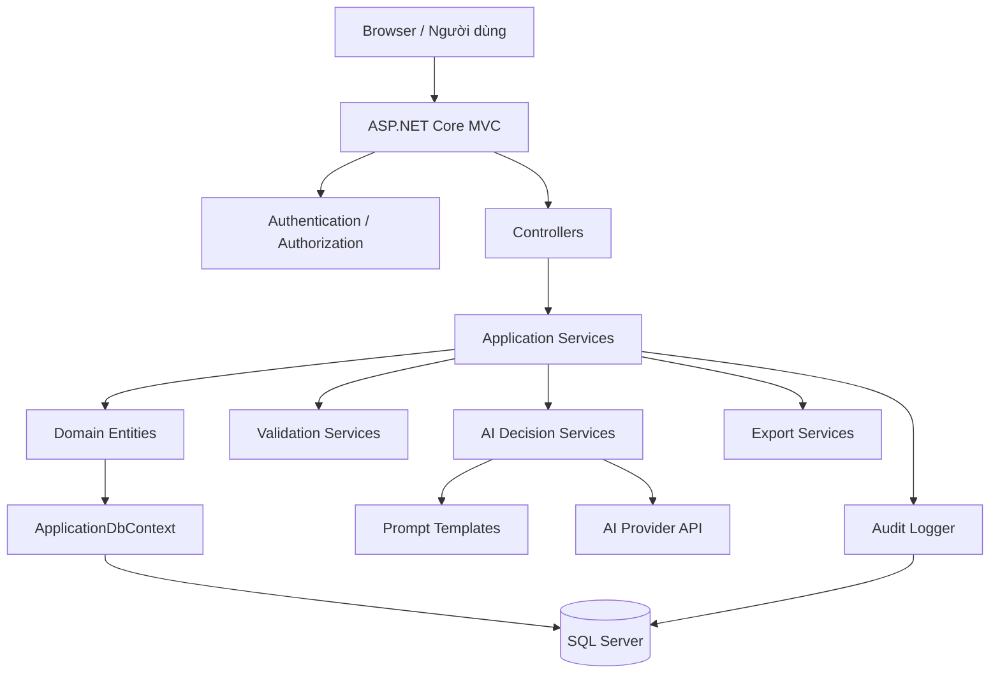
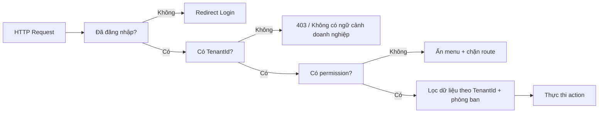
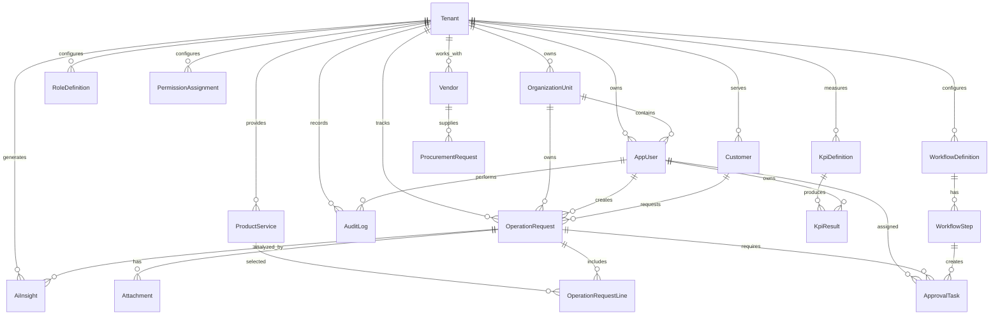
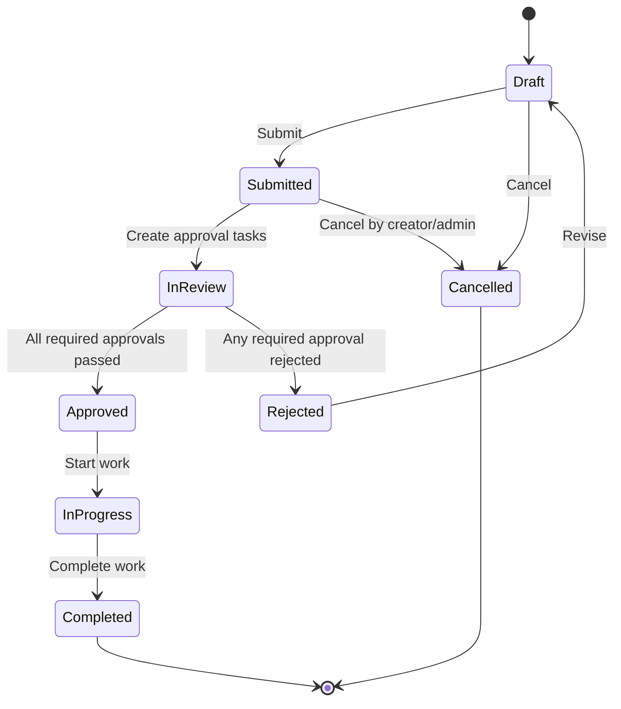
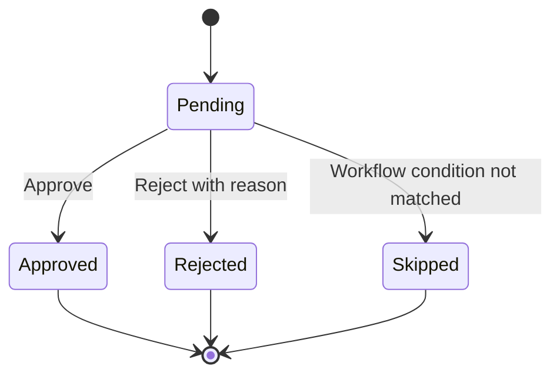
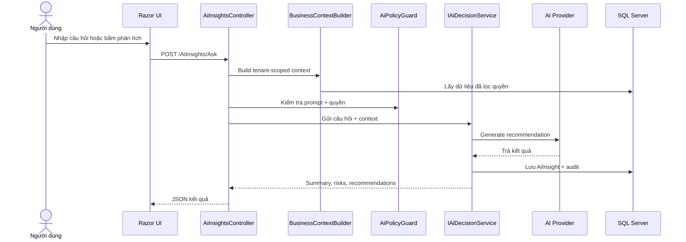
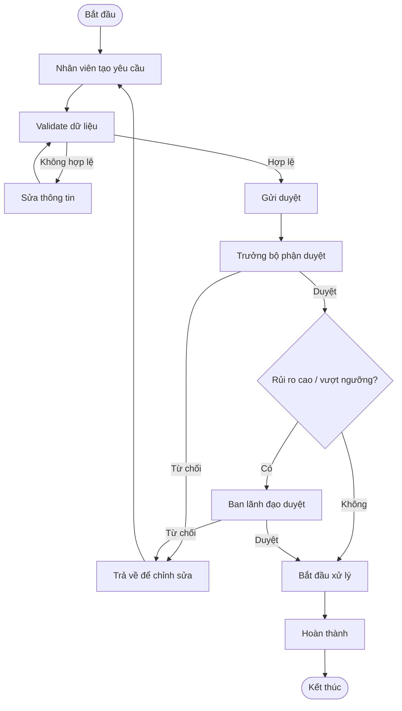
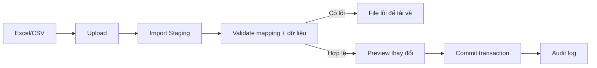

# OmniBizAI - Tài liệu kỹ thuật triển khai

> Đề tài: **Hệ thống vận hành thông minh cho doanh nghiệp vừa và nhỏ, hỗ trợ quản lý đa cấp và đưa ra quyết định bằng AI**  
> Mục tiêu của tài liệu: đủ chi tiết để nhóm backend, frontend và tester chia task, tạo model, viết service/controller/view và kiểm thử ngay.  
> Deadline dự kiến: **11/08/2026**.

## 1. Tóm tắt kỹ thuật

| Mục | Quyết định |
| --- | --- |
| Kiến trúc | ASP.NET Core MVC, Razor Views, service layer, EF Core, SQL Server |
| Target framework hiện tại | `net10.0` theo `OmniBizAI.csproj` |
| UI | Razor + Bootstrap, dashboard theo vai trò, form có validation |
| Database | SQL Server, **EF Core Code First**, migration là nguồn tạo schema |
| Auth | ASP.NET Core Identity, cookie auth, role + permission policy |
| Multi-tenant | Mỗi bản ghi nghiệp vụ có `TenantId`; mọi query nghiệp vụ phải lọc tenant |
| AI | Service trừu tượng `IAiDecisionService`, prompt cấu hình, có audit và fallback |
| Báo cáo | Dashboard, export CSV/Excel/PDF tùy giai đoạn |
| Nguyên tắc | Configuration-first, không hard-code tenant, vai trò, trạng thái, prompt |

### 1.1. Quyết định Code First EF Core

OmniBizAI dùng **EF Core Code First**. Entity, enum, `ApplicationDbContext` và các lớp cấu hình trong `Data/Configurations` là nguồn sự thật của schema. Database SQL Server, database diagram và file `.sql` nộp kèm đều phải được sinh/đối chiếu từ migration, không thiết kế bảng thủ công rồi scaffold ngược vào code.

Quy trình chuẩn khi đổi database:

1. Sửa entity trong `Models/Entities`.
2. Sửa mapping trong `Data/Configurations` hoặc `OnModelCreating`.
3. Chạy migration:

```powershell
dotnet ef migrations add <MigrationName>
```

4. Kiểm tra migration và snapshot.
5. Cập nhật database local/demo:

```powershell
dotnet ef database update
```

6. Sinh SQL script idempotent để nộp kèm hoặc triển khai có kiểm soát:

```powershell
dotnet ef migrations script --idempotent -o docs\sql\Create_Database.sql
```

Không chỉnh tay file migration/snapshot nếu không thật sự cần. Nếu bắt buộc patch migration, phải giữ `ApplicationDbContextModelSnapshot` khớp với model hiện tại.

## 2. Kiến trúc tổng thể



### 2.1. Phân lớp code mục tiêu

```text
Controllers/
  AccountController.cs
  AdminController.cs
  TenantsController.cs
  OrganizationUnitsController.cs
  UsersController.cs
  RolesController.cs
  OperationsController.cs
  ApprovalsController.cs
  ReportsController.cs
  AiInsightsController.cs

Data/
  ApplicationDbContext.cs
  Configurations/
  Migrations/
  Seed/

Models/
  Entities/
  Enums/
  Validation/

Services/
  Abstractions/
  Implementations/
  AI/
  Export/
  Workflow/

ViewModels/
  Account/
  Admin/
  Organization/
  Operations/
  Reports/
  AI/

Views/
  Shared/
  Account/
  Admin/
  OrganizationUnits/
  Operations/
  Reports/
  AiInsights/

wwwroot/
  css/
  js/
  images/
```

## 3. Vai trò và phân quyền

### 3.1. Vai trò hệ thống

| Role | Mục đích | Quyền chính |
| --- | --- | --- |
| `SYSTEM_ADMIN` | Quản trị toàn hệ thống khi demo nhiều tenant | Quản lý tenant, cấu hình toàn cục, xem audit hệ thống |
| `TENANT_ADMIN` | Quản trị doanh nghiệp | Quản lý người dùng, vai trò, phòng ban, cấu hình module |
| `EXECUTIVE` | Ban lãnh đạo | Xem dashboard tổng hợp, duyệt cấp cao, dùng AI insight |
| `DEPARTMENT_MANAGER` | Trưởng bộ phận | Quản lý nhân sự bộ phận, duyệt công việc, xem KPI bộ phận |
| `STAFF` | Nhân viên | Tạo yêu cầu, cập nhật công việc, xem dữ liệu được giao |
| `ACCOUNTANT` | Kế toán/tài chính | Quản lý chi phí, yêu cầu thanh toán, báo cáo tài chính cơ bản |
| `AUDITOR` | Kiểm soát/giảng viên demo | Xem audit, báo cáo, bằng chứng hoạt động |

### 3.2. Quyền chức năng

| Permission | Mô tả |
| --- | --- |
| `TENANTS_MANAGE` | Tạo/sửa/khoá tenant |
| `ORG_UNITS_MANAGE` | Quản lý phòng ban, cấp bậc |
| `USERS_MANAGE` | Quản lý tài khoản người dùng |
| `ROLES_MANAGE` | Quản lý vai trò và gán quyền |
| `OPERATIONS_VIEW` | Xem dữ liệu vận hành |
| `OPERATIONS_EDIT` | Tạo/sửa dữ liệu vận hành |
| `APPROVALS_APPROVE` | Phê duyệt hoặc từ chối yêu cầu |
| `FINANCE_MANAGE` | Quản lý chi phí/thanh toán |
| `REPORTS_VIEW` | Xem báo cáo |
| `REPORTS_EXPORT` | Xuất báo cáo |
| `AI_INSIGHTS_USE` | Gọi trợ lý AI và xem đề xuất |
| `AUDIT_VIEW` | Xem nhật ký hệ thống |

### 3.3. Quy tắc phân quyền bắt buộc



## 4. Multi-tenant và cấu hình

### 4.1. Nguyên tắc tenant

- Bảng nghiệp vụ bắt buộc có `TenantId`.
- Không lấy dữ liệu nghiệp vụ bằng query không lọc `TenantId`.
- Người dùng có thể thuộc một tenant chính; nếu mở rộng nhiều tenant, cần bảng `UserTenants`.
- Seed dữ liệu demo nằm trong file JSON hoặc lớp seeder riêng, không nhúng vào controller.

### 4.2. Cấu hình có thể tùy biến

| Nhóm cấu hình | Ví dụ | Lưu ở đâu |
| --- | --- | --- |
| Vai trò/quyền | Role, permission, menu visibility | Database + seed JSON |
| Workflow | Trạng thái, bước duyệt, điều kiện chuyển trạng thái | Database |
| Form | Field hiển thị/required theo loại nghiệp vụ | Database hoặc JSON profile |
| Dashboard | Widget, chỉ số, thứ tự hiển thị | Database |
| AI prompt | System prompt, prompt template, guardrail | Database hoặc file cấu hình |
| Import mapping | Mapping cột Excel/CSV vào entity | JSON profile |

## 5. Domain model mục tiêu

### 5.1. Phạm vi domain và số lượng bảng

Domain model mục tiêu không chỉ gồm vài bảng CRUD. Với đề tài tốt nghiệp này, thiết kế Code First đặt mục tiêu **64 bảng** để đủ phản ánh quản lý đa cấp, vận hành nội bộ, phê duyệt, tài chính cơ bản, KPI, báo cáo, AI, audit, import và notification.

| Nhóm domain | Số bảng | Lý do cần có trong hệ thống |
| --- | ---: | --- |
| Tenant & cấu hình nền | 6 | Cho phép nhiều doanh nghiệp và cấu hình theo từng doanh nghiệp |
| Auth/RBAC/Security | 8 | Đảm bảo đăng nhập, role, permission, session, phân quyền dữ liệu |
| Tổ chức & nhân sự | 6 | Quản lý cây phòng ban, chức danh, hồ sơ nhân sự và phân công |
| CRM, đối tác, danh mục dịch vụ | 7 | Là dữ liệu đầu vào cho vận hành và báo cáo |
| Vận hành & công việc | 9 | Bao phủ yêu cầu, dòng chi tiết, công việc, checklist, bình luận, file |
| Workflow & phê duyệt | 6 | Cho phép quy trình động thay vì hard-code trạng thái trong controller |
| Mua hàng & tài chính cơ bản | 8 | Đủ theo dõi đề nghị mua, PO, thanh toán, ngân sách, chi phí |
| KPI, báo cáo, dashboard | 6 | Phục vụ quản lý đa cấp và dashboard theo vai trò |
| AI, audit, import, notification | 8 | Tạo nền cho AI insight, truy vết, nhập liệu và thông báo |
| **Tổng** | **64** | Vượt yêu cầu tối thiểu trên 50 bảng |

Danh sách 64 bảng và ERD theo bounded context được mô tả chi tiết trong [06-Database-Design.md](./06-Database-Design.md). Khi code, backend triển khai entity/mapping theo thứ tự ưu tiên: tenant/RBAC/organization trước, operation/workflow tiếp theo, sau đó finance/KPI/AI/audit/import.

### 5.2. ERD tổng quan



### 5.3. Entity cốt lõi

#### Tenant

| Field | Type | Required | Ghi chú |
| --- | --- | --- | --- |
| `Id` | `Guid` | Yes | Khóa chính |
| `Code` | `string(50)` | Yes | Unique, dùng trong seed/import |
| `Name` | `string(200)` | Yes | Tên doanh nghiệp |
| `BusinessType` | `string(100)` | No | Ví dụ: bán lẻ, dịch vụ, catering |
| `Status` | `TenantStatus` | Yes | `Active`, `Suspended` |
| `CreatedAt` | `DateTimeOffset` | Yes | UTC |
| `UpdatedAt` | `DateTimeOffset?` | No | UTC |

#### OrganizationUnit

| Field | Type | Required | Ghi chú |
| --- | --- | --- | --- |
| `Id` | `Guid` | Yes | Khóa chính |
| `TenantId` | `Guid` | Yes | Index |
| `ParentId` | `Guid?` | No | Tạo cây phòng ban |
| `Code` | `string(50)` | Yes | Unique theo tenant |
| `Name` | `string(200)` | Yes | Tên phòng ban |
| `Level` | `int` | Yes | 0: công ty, 1: khối, 2: phòng |
| `ManagerUserId` | `Guid?` | No | Trưởng bộ phận |
| `IsActive` | `bool` | Yes | Không xóa cứng nếu đã có dữ liệu |

#### AppUser

| Field | Type | Required | Ghi chú |
| --- | --- | --- | --- |
| `Id` | `Guid` | Yes | Đồng bộ với Identity user nếu dùng Identity |
| `TenantId` | `Guid` | Yes | Index |
| `OrganizationUnitId` | `Guid?` | No | Phòng ban chính |
| `FullName` | `string(200)` | Yes | Tên hiển thị |
| `Email` | `string(255)` | Yes | Unique theo tenant |
| `JobTitle` | `string(150)` | No | Chức danh |
| `Status` | `UserStatus` | Yes | `Active`, `Locked`, `Inactive` |

#### OperationRequest

| Field | Type | Required | Ghi chú |
| --- | --- | --- | --- |
| `Id` | `Guid` | Yes | Khóa chính |
| `TenantId` | `Guid` | Yes | Index |
| `RequestNo` | `string(50)` | Yes | Unique theo tenant |
| `Type` | `string(50)` | Yes | Cấu hình theo business profile |
| `Title` | `string(250)` | Yes | Tối đa 250 ký tự |
| `CustomerId` | `Guid?` | No | Có thể trống với yêu cầu nội bộ |
| `OrganizationUnitId` | `Guid` | Yes | Bộ phận phụ trách |
| `CreatedByUserId` | `Guid` | Yes | Người tạo |
| `Priority` | `PriorityLevel` | Yes | `Low`, `Normal`, `High`, `Critical` |
| `Status` | `OperationStatus` | Yes | Xem state machine |
| `DueDate` | `DateOnly?` | No | Không nhỏ hơn ngày tạo nếu có |
| `TotalAmount` | `decimal(18,2)` | No | Tổng giá trị nếu có |
| `Description` | `string(2000)` | No | Nội dung chi tiết |

#### ApprovalTask

| Field | Type | Required | Ghi chú |
| --- | --- | --- | --- |
| `Id` | `Guid` | Yes | Khóa chính |
| `TenantId` | `Guid` | Yes | Index |
| `TargetType` | `string(80)` | Yes | Ví dụ: `OperationRequest`, `PaymentRequest` |
| `TargetId` | `Guid` | Yes | Id bản ghi cần duyệt |
| `StepCode` | `string(80)` | Yes | Theo workflow definition |
| `AssignedToUserId` | `Guid?` | No | Người duyệt cụ thể |
| `AssignedRole` | `string(80)` | No | Duyệt theo vai trò |
| `Status` | `ApprovalStatus` | Yes | `Pending`, `Approved`, `Rejected`, `Skipped` |
| `DecisionNote` | `string(1000)` | No | Bắt buộc khi từ chối |
| `DecidedAt` | `DateTimeOffset?` | No | UTC |

#### AiInsight

| Field | Type | Required | Ghi chú |
| --- | --- | --- | --- |
| `Id` | `Guid` | Yes | Khóa chính |
| `TenantId` | `Guid` | Yes | Index |
| `ContextType` | `string(80)` | Yes | `Dashboard`, `OperationRequest`, `Kpi` |
| `ContextId` | `Guid?` | No | Bản ghi liên quan |
| `Question` | `string(1000)` | Yes | Câu hỏi/yêu cầu người dùng |
| `Summary` | `string(2000)` | Yes | Tóm tắt câu trả lời |
| `Recommendation` | `string(4000)` | No | Đề xuất hành động |
| `RiskLevel` | `RiskLevel` | Yes | `Low`, `Medium`, `High` |
| `ModelName` | `string(100)` | No | Model/provider đã dùng |
| `Status` | `AiInsightStatus` | Yes | `Draft`, `Reviewed`, `Applied`, `Dismissed` |

### 5.4. Enum bắt buộc

```csharp
public enum TenantStatus { Active = 1, Suspended = 2 }
public enum UserStatus { Active = 1, Locked = 2, Inactive = 3 }
public enum PriorityLevel { Low = 1, Normal = 2, High = 3, Critical = 4 }
public enum OperationStatus { Draft = 1, Submitted = 2, InReview = 3, Approved = 4, InProgress = 5, Completed = 6, Rejected = 7, Cancelled = 8 }
public enum ApprovalStatus { Pending = 1, Approved = 2, Rejected = 3, Skipped = 4 }
public enum RiskLevel { Low = 1, Medium = 2, High = 3 }
public enum AiInsightStatus { Draft = 1, Reviewed = 2, Applied = 3, Dismissed = 4 }
```

## 6. State machine nghiệp vụ

### 6.1. OperationRequest



### 6.2. ApprovalTask



## 7. Service contracts

Các interface dưới đây là hợp đồng tối thiểu để backend chia task độc lập với UI.

```csharp
public interface ITenantContext
{
    Guid TenantId { get; }
    Guid UserId { get; }
    IReadOnlyCollection<string> Roles { get; }
    IReadOnlyCollection<string> Permissions { get; }
}

public interface IOperationRequestService
{
    Task<PagedResult<OperationRequestListItem>> SearchAsync(OperationRequestQuery query, CancellationToken ct);
    Task<OperationRequestDetails?> GetDetailsAsync(Guid id, CancellationToken ct);
    Task<Result<Guid>> CreateAsync(OperationRequestCreateInput input, CancellationToken ct);
    Task<Result> UpdateAsync(Guid id, OperationRequestUpdateInput input, CancellationToken ct);
    Task<Result> SubmitAsync(Guid id, CancellationToken ct);
    Task<Result> CancelAsync(Guid id, string reason, CancellationToken ct);
}

public interface IApprovalService
{
    Task<IReadOnlyList<ApprovalTaskListItem>> GetMyPendingTasksAsync(CancellationToken ct);
    Task<Result> ApproveAsync(Guid taskId, string? note, CancellationToken ct);
    Task<Result> RejectAsync(Guid taskId, string reason, CancellationToken ct);
}

public interface IAiDecisionService
{
    Task<Result<AiInsightResult>> AnalyzeDashboardAsync(AiDashboardQuestion input, CancellationToken ct);
    Task<Result<AiInsightResult>> AnalyzeOperationAsync(Guid operationRequestId, string question, CancellationToken ct);
    Task<Result> MarkReviewedAsync(Guid insightId, string reviewerNote, CancellationToken ct);
}

public interface IAuditLogger
{
    Task LogAsync(AuditEvent auditEvent, CancellationToken ct);
}
```

## 8. Controller và route matrix

| Controller | Route | Permission | View/API | Ghi chú |
| --- | --- | --- | --- | --- |
| `AccountController` | `/Account/Login` | Anonymous | View | Layout riêng, không dùng shell quản trị |
| `AdminController` | `/Admin` | `TENANTS_MANAGE` hoặc `AUDIT_VIEW` | View | Dashboard quản trị |
| `OrganizationUnitsController` | `/OrganizationUnits` | `ORG_UNITS_MANAGE` | View + JSON | Cây phòng ban |
| `UsersController` | `/Users` | `USERS_MANAGE` | View | Tài khoản, reset password, khóa/mở |
| `RolesController` | `/Roles` | `ROLES_MANAGE` | View | Role, permission, menu visibility |
| `OperationsController` | `/Operations` | `OPERATIONS_VIEW` | View | Danh sách yêu cầu/công việc |
| `OperationsController` | `/Operations/Create` | `OPERATIONS_EDIT` | View | Tạo yêu cầu |
| `ApprovalsController` | `/Approvals/MyTasks` | `APPROVALS_APPROVE` | View | Việc cần duyệt |
| `ReportsController` | `/Reports/Dashboard` | `REPORTS_VIEW` | View | KPI/dữ liệu vận hành |
| `ReportsController` | `/Reports/Export` | `REPORTS_EXPORT` | File | CSV/Excel/PDF |
| `AiInsightsController` | `/AiInsights` | `AI_INSIGHTS_USE` | View + JSON | Hỏi đáp, insight, đề xuất |

## 9. ViewModel và validation

### 9.1. OperationRequestCreateInput

```csharp
public sealed class OperationRequestCreateInput
{
    [Required, StringLength(250)]
    public string Title { get; set; } = string.Empty;

    [Required, StringLength(50)]
    public string Type { get; set; } = string.Empty;

    [Required]
    public Guid OrganizationUnitId { get; set; }

    public Guid? CustomerId { get; set; }

    [Required]
    public PriorityLevel Priority { get; set; } = PriorityLevel.Normal;

    public DateOnly? DueDate { get; set; }

    [StringLength(2000)]
    public string? Description { get; set; }

    public List<OperationRequestLineInput> Lines { get; set; } = new();
}
```

### 9.2. Quy tắc validation

| Luồng | Quy tắc |
| --- | --- |
| Tạo yêu cầu | `Title`, `Type`, `OrganizationUnitId` bắt buộc; `DueDate` không nhỏ hơn ngày hiện tại |
| Cập nhật | Chỉ sửa khi `Draft` hoặc `Rejected`; không sửa yêu cầu đã `Completed` |
| Submit | Phải có người tạo, bộ phận phụ trách, loại yêu cầu hợp lệ, workflow tương ứng |
| Reject approval | Bắt buộc nhập lý do từ chối tối thiểu 10 ký tự |
| Export report | Chặn export nếu người dùng không có quyền hoặc range ngày quá lớn |
| AI | Prompt không được chứa secret; câu hỏi tối đa 1000 ký tự; log lỗi provider |

## 10. AI Decision Support

### 10.1. Luồng AI



### 10.2. Prompt template

Prompt phải là template có biến, không nối chuỗi tuỳ tiện trong controller.

```text
Bạn là trợ lý phân tích vận hành cho doanh nghiệp vừa và nhỏ.
Chỉ sử dụng dữ liệu trong CONTEXT.
Không bịa số liệu. Nếu thiếu dữ liệu, nói rõ dữ liệu còn thiếu.

CONTEXT:
{{business_context}}

QUESTION:
{{user_question}}

Trả lời theo JSON:
{
  "summary": "...",
  "risks": [{"level": "Low|Medium|High", "description": "..."}],
  "recommendations": [{"action": "...", "reason": "...", "ownerRole": "..."}],
  "missingData": ["..."]
}
```

### 10.3. Guardrail

- AI không được tự ghi thay đổi vào dữ liệu nghiệp vụ nếu chưa có người dùng xác nhận.
- Kết quả AI phải ghi `ModelName`, `PromptVersion`, `CreatedByUserId`, `CreatedAt`.
- Nếu provider lỗi/timeout, UI hiển thị thông báo thân thiện và không làm mất thao tác người dùng.
- Dữ liệu gửi sang provider phải lọc theo quyền người dùng, không gửi toàn bộ database.

## 11. Workflow phê duyệt

### 11.1. Workflow definition mẫu

```json
{
  "code": "OPERATION_REQUEST_DEFAULT",
  "name": "Duyệt yêu cầu vận hành mặc định",
  "targetType": "OperationRequest",
  "steps": [
    {
      "code": "DEPARTMENT_REVIEW",
      "name": "Trưởng bộ phận duyệt",
      "assignedRole": "DEPARTMENT_MANAGER",
      "required": true,
      "order": 1
    },
    {
      "code": "EXECUTIVE_REVIEW",
      "name": "Ban lãnh đạo duyệt khi rủi ro cao",
      "assignedRole": "EXECUTIVE",
      "required": false,
      "condition": "RiskLevel == 'High' || TotalAmount >= 5000000",
      "order": 2
    }
  ]
}
```

### 11.2. Activity diagram



## 12. Dashboard và báo cáo

### 12.1. Widget bắt buộc

| Widget | Người xem | Dữ liệu |
| --- | --- | --- |
| Tổng yêu cầu theo trạng thái | Manager, Executive | `OperationRequest.Status` |
| Việc sắp quá hạn | Staff, Manager | `DueDate`, `Status` |
| Công việc cần duyệt | Manager, Executive | `ApprovalTask.Status = Pending` |
| KPI theo cấp | Executive, Manager | `KpiDefinition`, `KpiResult` |
| Rủi ro AI phát hiện | Executive | `AiInsight.RiskLevel` |
| Hoạt động gần đây | Admin, Auditor | `AuditLog` |

### 12.2. Report filters

| Filter | Type | Bắt buộc | Ghi chú |
| --- | --- | --- | --- |
| `FromDate` | `DateOnly` | Yes | Không vượt quá `ToDate` |
| `ToDate` | `DateOnly` | Yes | Range mặc định 30 ngày |
| `OrganizationUnitId` | `Guid?` | No | Lọc theo cây phòng ban |
| `Status` | `string?` | No | Có thể chọn nhiều |
| `OwnerUserId` | `Guid?` | No | Chỉ thấy user trong phạm vi quyền |

## 13. Import/export dữ liệu



Quy tắc:

- Không ghi thẳng file import vào bảng chính.
- Import phải qua staging, validate, preview, commit transaction.
- Mỗi import job lưu file gốc, người upload, thời gian, số dòng thành công/thất bại.

## 14. Security và audit

| Rủi ro | Cách xử lý |
| --- | --- |
| Người dùng xem dữ liệu tenant khác | Global query filter hoặc service-level tenant filter |
| Menu hiện chức năng không có quyền | Menu render theo permission |
| Route bị gọi trực tiếp | Attribute/policy authorization ở controller/action |
| Lộ secret AI/connection string | Dùng `.env`, user secret hoặc biến môi trường host |
| Prompt injection | Chặn secret, lọc context theo quyền, system prompt cố định |
| Mất lịch sử thay đổi | Audit log cho create/update/delete/approve/export/AI |
| Xóa nhầm dữ liệu | Soft delete cho dữ liệu nghiệp vụ quan trọng |

## 15. Non-functional requirements

| Nhóm | Yêu cầu đo được |
| --- | --- |
| Performance | Trang danh sách chính tải dưới 2 giây với dữ liệu demo; dashboard dưới 3 giây |
| Security | Chặn truy cập trái quyền ở cả UI và controller |
| Reliability | Không mất dữ liệu khi AI/provider lỗi |
| Usability | Luồng tạo yêu cầu và duyệt hoàn tất trong tối đa 5 bước chính |
| Maintainability | Mỗi module có entity, service, controller, viewmodel, view rõ ràng |
| Auditability | Có thể truy vết ai làm gì, lúc nào, trên bản ghi nào |
| Portability | Có hướng dẫn chạy local và seed demo |

## 16. Test plan kỹ thuật

### 16.1. Test matrix

| Loại test | Chủ trì | Nội dung |
| --- | --- | --- |
| Unit test | Backend | Service validation, state transition, permission check |
| Integration test | Backend + Tester | DbContext, seed, workflow, approval, report query |
| UI test thủ công | Frontend + Tester | Form, menu, responsive, validation message |
| UAT | PM + Tester | Demo theo kịch bản doanh nghiệp SME |
| Security smoke test | Backend + Tester | Truy cập sai quyền, sai tenant, route trực tiếp |
| AI smoke test | Backend + Tester | Prompt hợp lệ, provider lỗi, timeout, log insight |

### 16.2. Given-When-Then mẫu

```gherkin
Feature: Submit operation request

Scenario: Nhân viên gửi yêu cầu hợp lệ
  Given người dùng có quyền OPERATIONS_EDIT
  And yêu cầu đang ở trạng thái Draft
  When người dùng bấm Gửi duyệt
  Then hệ thống chuyển yêu cầu sang InReview
  And tạo ApprovalTask cho trưởng bộ phận
  And ghi AuditLog cho thao tác Submit

Scenario: Từ chối yêu cầu không có lý do
  Given người dùng có quyền APPROVALS_APPROVE
  And approval task đang Pending
  When người dùng bấm Từ chối mà không nhập lý do
  Then hệ thống không đổi trạng thái approval
  And hiển thị lỗi "Vui lòng nhập lý do từ chối"
```

## 17. Kế hoạch triển khai theo module

| Sprint | Mốc | Backend | Frontend | Tester/Tài liệu |
| --- | --- | --- | --- | --- |
| Sprint 0 | 11/05 - 18/05 | Khởi tạo solution, auth skeleton | Layout shell, theme | Đặc tả yêu cầu, test plan |
| Sprint 1 | 19/05 - 02/06 | Tenant, org, user, role, seed | Login, admin shell, menu quyền | Test auth/RBAC |
| Sprint 2 | 03/06 - 17/06 | OperationRequest, workflow, approval | CRUD vận hành, my tasks | Test workflow |
| Sprint 3 | 18/06 - 01/07 | KPI, report query, export | Dashboard, report filters | Test báo cáo |
| Sprint 4 | 02/07 - 16/07 | AI service, prompt, audit | AI panel, insight cards | Test AI/fallback |
| Sprint 5 | 17/07 - 31/07 | Hardening, migration, demo seed | Polish UI, responsive | Regression, UAT, evidence |
| Sprint 6 | 01/08 - 11/08 | Fix blocker | Demo freeze | Báo cáo, slide, tập dượt |

## 18. Checklist trước khi code

- [ ] Chốt tên database local và connection string trong `.env`.
- [ ] Thêm Identity/EF Core package phù hợp với target framework.
- [ ] Tạo `ApplicationDbContext`.
- [ ] Tạo entity cốt lõi theo mục 5 theo hướng EF Core Code First.
- [ ] Tạo mapping/index/constraint trong `Data/Configurations`.
- [ ] Tạo migration đầu tiên.
- [ ] Generate SQL script từ migration, không viết schema SQL thủ công làm nguồn chính.
- [ ] Tạo seed tenant demo, roles, permissions, users.
- [ ] Tạo auth layout riêng cho login.
- [ ] Tạo admin shell và sidebar theo permission.
- [ ] Tạo service layer trước khi viết controller phức tạp.
- [ ] Tạo test case cho workflow trước khi demo.

## 19. Checklist nghiệm thu kỹ thuật

- [ ] Build thành công.
- [ ] Migration tạo được database mới.
- [ ] Seed tạo được tài khoản demo.
- [ ] Login thành công theo vai trò.
- [ ] Menu ẩn đúng với user không có quyền.
- [ ] Route bị chặn khi gọi trực tiếp trái quyền.
- [ ] Tạo, sửa, gửi duyệt, duyệt, từ chối yêu cầu hoạt động.
- [ ] Dashboard hiển thị số liệu thật từ database.
- [ ] AI insight có lưu log và không làm sập trang khi provider lỗi.
- [ ] Export báo cáo hoạt động với filter ngày/phòng ban.
- [ ] Tester có bằng chứng test pass/fail.
