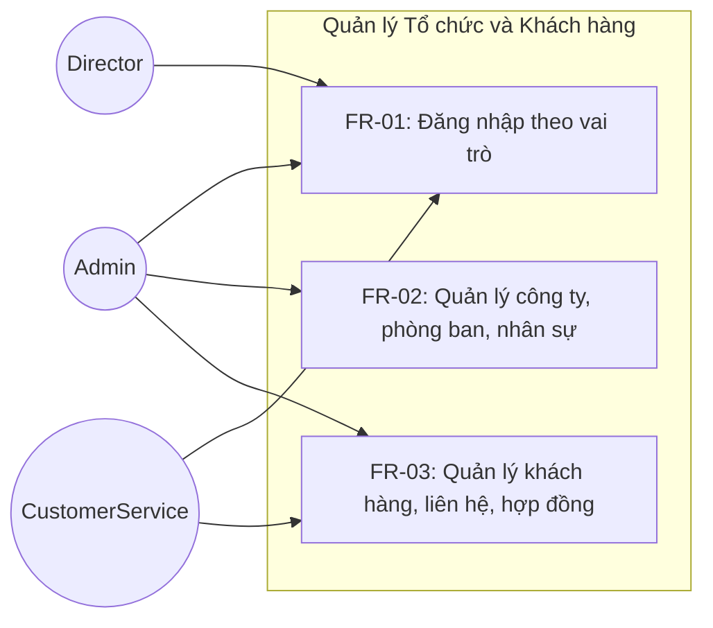
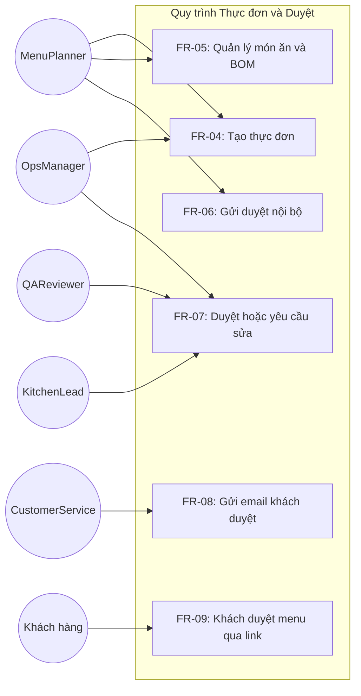
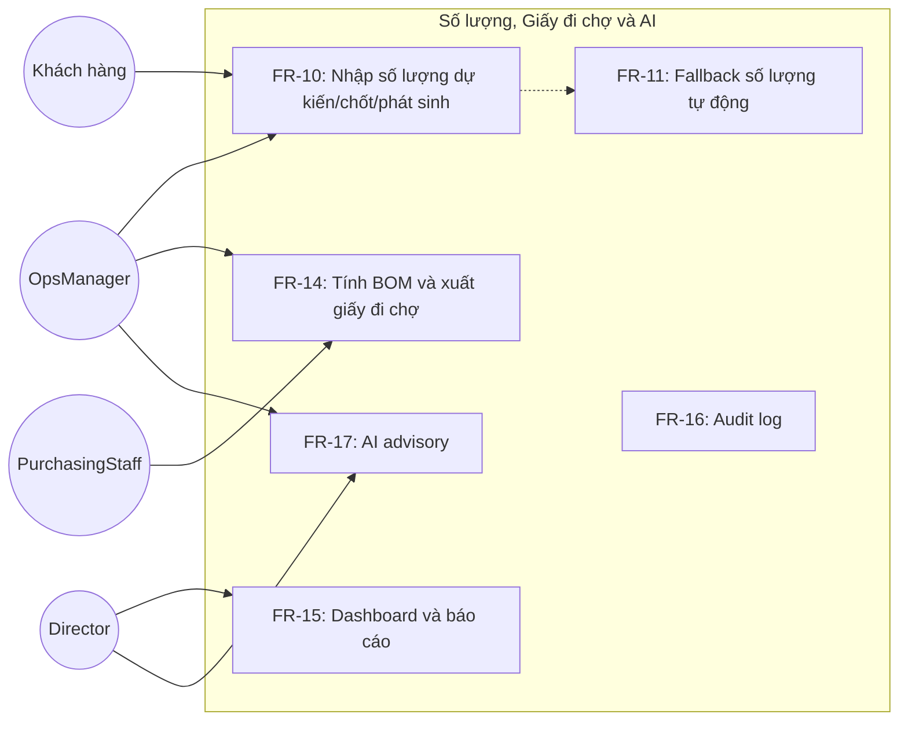
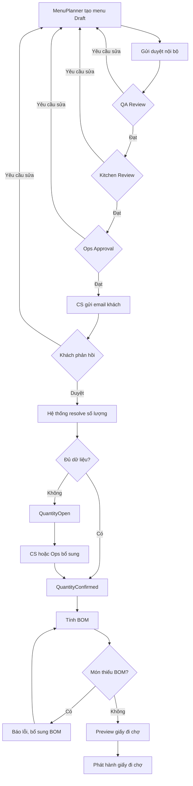
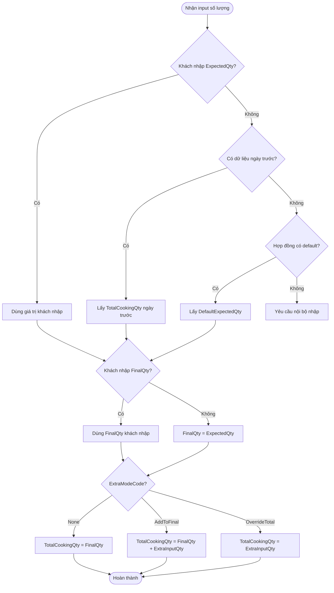
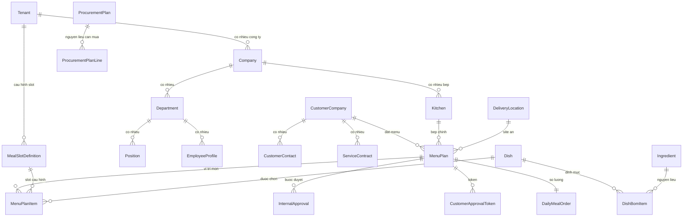
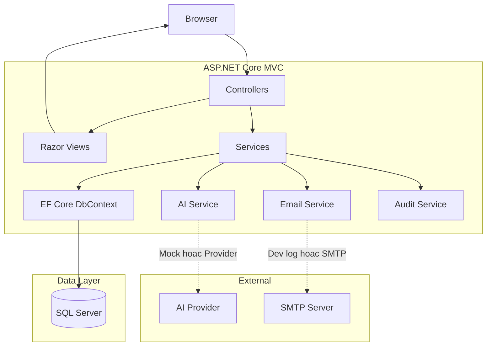
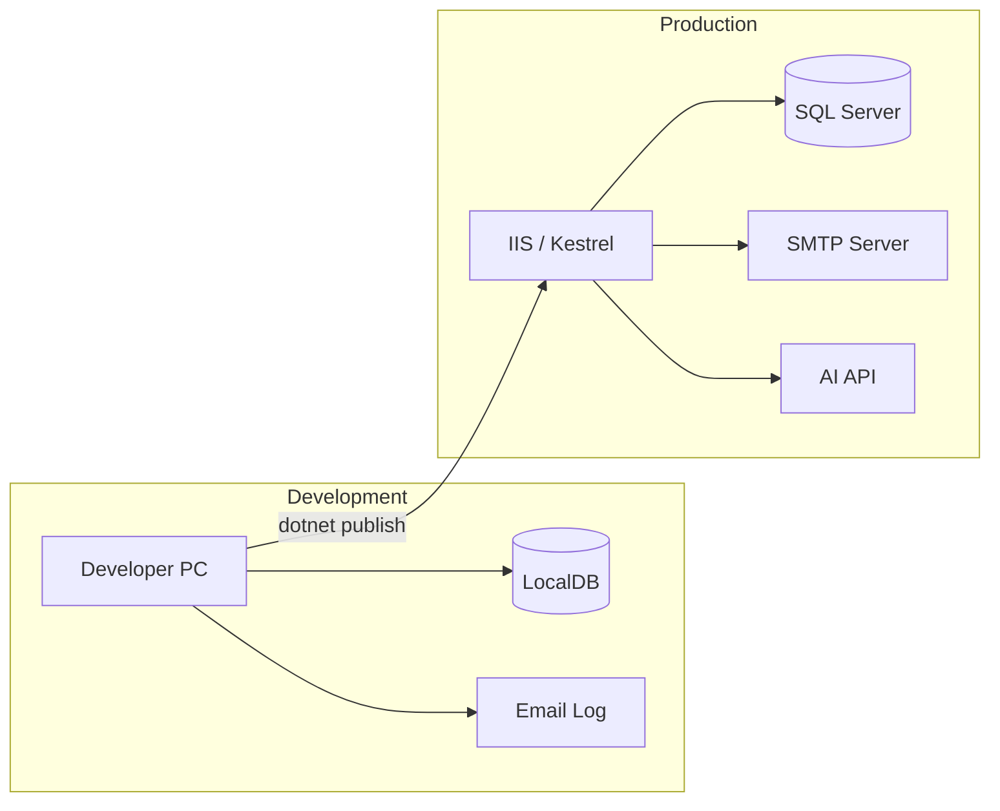

# OmniBizAI - Tài Liệu Báo Cáo Dự Án Tốt Nghiệp

> Ngày cập nhật: 2026-04-30
> Tên đề tài cố định: **"Hệ thống vận hành thông minh cho doanh nghiệp vừa và nhỏ, hỗ trợ quản lý đa cấp và đưa ra quyết định bằng AI"**
> Phạm vi minh họa: **OmniBizAI Catering Operations Platform**; Bizen Catering Services là tenant/case study đầu tiên dựa trên dữ liệu Lark thật.

## Hướng Dẫn Sử Dụng Tài Liệu Báo Cáo

Tài liệu này là khung báo cáo nộp trường. Khi xuất DOCX/PDF, nhóm có thể giữ cấu trúc chương như bên dưới, sau đó bổ sung ảnh chụp màn hình, biểu đồ ERD, use case diagram, activity diagram và kết quả kiểm thử thật sau khi code xong.

Tên đề tài không đổi. Trong báo cáo, cần giải thích rõ rằng nhóm chọn ngành suất ăn/catering làm phạm vi triển khai cụ thể cho doanh nghiệp vừa và nhỏ, dùng Bizen Catering Services làm case study đầu tiên. Điều này giúp đề tài không bị quá rộng, vẫn có dữ liệu nghiệp vụ thật và vẫn đáp ứng nội dung "quản lý đa cấp" và "đưa ra quyết định bằng AI".

## Mục Lục Gợi Ý Khi Xuất DOCX/PDF

1. Trang bìa.
2. Lời cam đoan.
3. Lời cảm ơn.
4. Tóm tắt và Abstract.
5. Mục lục.
6. Danh mục hình ảnh.
7. Danh mục bảng biểu.
8. Danh mục từ viết tắt và thuật ngữ.
9. Chương 1: Tổng quan đề tài.
10. Chương 2: Cơ sở lý thuyết và công nghệ.
11. Chương 3: Phân tích và thiết kế hệ thống.
12. Chương 4: Triển khai hệ thống.
13. Chương 5: Kiểm thử và đánh giá.
14. Chương 6: Kết luận và hướng phát triển.
15. Tài liệu tham khảo.
16. Phụ lục.

## Trạng Thái Sẵn Sàng Của Báo Cáo

Khung báo cáo này đủ để nhóm bắt đầu viết bản nộp trường. Trước khi nộp chính thức, nhóm phải thay các placeholder như `[Tên trường]`, `[Điền kết quả]`, bổ sung hình ảnh UI thật, ERD, use case diagram, activity diagram, kết quả kiểm thử và danh mục tài liệu tham khảo theo đúng template của khoa.

## Trang Bìa Gợi Ý

- Trường: [Tên trường]
- Khoa: [Tên khoa]
- Ngành: [Tên ngành]
- Tên đề tài: **Hệ thống vận hành thông minh cho doanh nghiệp vừa và nhỏ, hỗ trợ quản lý đa cấp và đưa ra quyết định bằng AI**
- Nhóm thực hiện: 7 thành viên
- Giảng viên hướng dẫn: [Tên GVHD]
- Thời gian thực hiện: [Thời gian học kỳ]
- Công nghệ chính: ASP.NET Core MVC, SQL Server, Entity Framework Core, Razor Views

## Lời Cam Đoan

Nhóm cam đoan đề tài được thực hiện dựa trên quá trình phân tích, thiết kế, lập trình và kiểm thử của nhóm. Các nội dung tham khảo, nếu có, sẽ được trích dẫn trong danh mục tài liệu tham khảo. Hệ thống có sử dụng dữ liệu nghiệp vụ thật làm dữ liệu tham chiếu và kiểm chứng; khi nộp/công bố báo cáo, nhóm dùng bản seed đã được phép sử dụng hoặc đã ẩn danh các thông tin nhạy cảm như email, số điện thoại, link nội bộ và dữ liệu định danh khách hàng.

## Lời Cảm Ơn

Nhóm xin cảm ơn giảng viên hướng dẫn, khoa, nhà trường và các cá nhân đã hỗ trợ góp ý trong quá trình thực hiện đề tài. Những góp ý về phạm vi nghiệp vụ, giao diện, kiểm thử và cách trình bày báo cáo giúp nhóm hoàn thiện hệ thống theo hướng thực tế hơn.

## Tóm Tắt

Đề tài xây dựng một nền tảng vận hành thông minh cho doanh nghiệp vừa và nhỏ trong lĩnh vực suất ăn/catering, có khả năng cấu hình theo từng khách hàng triển khai. Bizen Catering Services được dùng làm case study đầu tiên với dữ liệu Lark thật. Hệ thống tập trung vào quy trình lập thực đơn, kiểm duyệt nội bộ, gửi khách hàng duyệt qua email, ghi nhận số lượng suất ăn, tính toán nguyên vật liệu dựa trên BOM định mức và xuất giấy đi chợ. Bên cạnh các chức năng nghiệp vụ, hệ thống bổ sung lớp AI hỗ trợ ra quyết định nhằm cảnh báo số lượng biến động bất thường, phát hiện món thiếu định mức nguyên vật liệu và tóm tắt nhu cầu mua hàng cho quản lý.

Về kỹ thuật, hệ thống được xây dựng bằng ASP.NET Core MVC, Razor Views, Entity Framework Core và SQL Server. Runtime mặc định cho Sprint 1 là .NET 8 LTS; nhóm có thể nâng lên .NET 10 nếu môi trường phát triển/demo thống nhất. Kiến trúc được định hướng theo mô hình Modular MVC Monolith, giúp nhóm sinh viên có thể triển khai trong một project nhưng vẫn tách rõ controller, service, entity, ViewModel và rule nghiệp vụ. Kết quả kỳ vọng là một MVP có thể demo end-to-end từ lập menu đến xuất giấy đi chợ, có phân quyền theo vai trò, có audit log và có bằng chứng kiểm thử.

## Abstract

This project develops an intelligent and configurable catering operations platform for small and medium-sized enterprises. Bizen Catering Services is used as the first case study with real Lark-derived operational data. The system focuses on menu planning, internal approval, customer email approval, meal quantity confirmation, BOM-based ingredient calculation, and procurement list generation. An AI decision-support layer is included to detect abnormal quantity changes, identify missing BOM definitions, and summarize procurement needs for managers.

The system is implemented with ASP.NET Core MVC, Razor Views, Entity Framework Core, and SQL Server. Sprint 1 defaults to .NET 8 LTS, with .NET 10 as an optional upgrade if the team environment is aligned. The architecture follows a Modular MVC Monolith approach, allowing a student team to build a maintainable application within a single project while keeping controllers, services, entities, ViewModels, and business rules separated. The expected result is an end-to-end MVP with role-based access control, audit logging, test evidence, and a practical demonstration flow.

## Danh Mục Từ Viết Tắt Và Thuật Ngữ

| Thuật ngữ | Ý nghĩa |
|---|---|
| SME | Doanh nghiệp vừa và nhỏ |
| MVC | Model - View - Controller |
| BOM | Bill of Materials, định mức nguyên vật liệu |
| EF Core | Entity Framework Core |
| RBAC | Role-Based Access Control |
| AI Advisory | AI hỗ trợ phân tích/gợi ý, không tự thực thi nghiệp vụ |
| MenuPlan | Thực đơn theo ngày, ca ăn và khách hàng |
| DailyMealOrder | Dòng số lượng suất ăn sau khi áp dụng rule dự kiến/chốt/phát sinh |
| ProcurementPlan | Giấy đi chợ/nguyên liệu cần mua |
| Token | Chuỗi bảo mật gửi qua email để khách hàng duyệt mà không cần đăng nhập |
| Tenant | Doanh nghiệp triển khai độc lập trong hệ thống |
| Configuration | Tập cấu hình ca ăn, loại suất, vị trí món, workflow, rule theo tenant |
| Staging Import | Lớp trung gian để kiểm tra dữ liệu thật trước khi ghi vào bảng vận hành |

## Chương 1. Tổng Quan Đề Tài

### 1.1 Bối cảnh

Trong quá trình chuyển đổi số, nhiều doanh nghiệp vừa và nhỏ vẫn xử lý vận hành bằng bảng tính, email, tin nhắn và các file rời rạc. Đối với doanh nghiệp cung cấp suất ăn công nghiệp/catering như Bizen Catering Services, quy trình vận hành có nhiều điểm cần kiểm soát chặt chẽ: thực đơn phải được lập đúng, nội bộ phải kiểm duyệt trước khi gửi khách, khách hàng cần xác nhận thực đơn và số lượng, bộ phận bếp/thu mua cần biết chính xác nguyên liệu cần chuẩn bị.

Nếu các bước này không được quản lý tập trung, doanh nghiệp dễ gặp các vấn đề như gửi nhầm menu, khách duyệt chậm, số lượng chốt không rõ ràng, thiếu nguyên liệu, mua dư nguyên liệu, hoặc khó truy vết khi có thay đổi phút cuối. Đây là bài toán phù hợp để xây dựng một hệ thống vận hành thông minh theo hướng quản lý đa cấp và hỗ trợ ra quyết định.

### 1.2 Lý do chọn đề tài

Đề tài có ý nghĩa thực tiễn vì bám vào quy trình thật của một doanh nghiệp dịch vụ suất ăn. Thay vì xây dựng một hệ thống quản trị doanh nghiệp quá rộng, nhóm chọn một quy trình có giá trị rõ ràng: từ thực đơn đến giấy đi chợ. Quy trình này có đủ yếu tố để thể hiện kiến thức phân tích yêu cầu, thiết kế cơ sở dữ liệu, phân quyền, workflow phê duyệt, gửi email, tính toán BOM, kiểm thử và tích hợp AI.

Đề tài cũng có ý nghĩa học thuật vì cho phép nhóm trình bày cách thu hẹp một tên đề tài rộng thành một phạm vi triển khai khả thi. Hệ thống vẫn đáp ứng đúng tên đề tài: quản lý doanh nghiệp vừa và nhỏ, quản lý đa cấp qua phòng ban/vai trò/quy trình duyệt, và hỗ trợ quyết định bằng AI thông qua cảnh báo và khuyến nghị.

### 1.3 Vấn đề nghiên cứu

Câu hỏi nghiên cứu chính:

**Làm thế nào để xây dựng một hệ thống vận hành thông minh cho doanh nghiệp vừa và nhỏ, có khả năng quản lý quy trình thực đơn - số lượng - nguyên vật liệu theo nhiều cấp duyệt, đồng thời hỗ trợ nhà quản lý ra quyết định bằng AI?**

Các câu hỏi phụ:

| Mã | Câu hỏi | Nội dung cần giải quyết |
|---|---|---|
| RQ1 | Làm thế nào để quản lý thực đơn và kiểm duyệt nội bộ rõ ràng? | State machine menu, internal approval, audit log |
| RQ2 | Làm thế nào để khách hàng duyệt qua email an toàn và dễ dùng? | Token bảo mật, email approval, public review page |
| RQ3 | Làm thế nào để xử lý số lượng dự kiến/chốt/phát sinh nhất quán? | Rule fallback ngày trước, rule final, rule phát sinh |
| RQ4 | Làm thế nào để tính nguyên vật liệu từ thực đơn và BOM? | Dish BOM, ingredient aggregation, procurement plan |
| RQ5 | Làm thế nào để AI hỗ trợ quyết định mà không làm sai nghiệp vụ? | AI advisory, citation nội bộ, fallback rule-based |
| RQ6 | Làm thế nào để kiểm thử hệ thống trong phạm vi đồ án? | Unit test, manual test, Playwright smoke, evidence |

### 1.4 Mục tiêu đề tài

Mục tiêu tổng quát:

Xây dựng một web application bằng ASP.NET Core MVC và SQL Server để hỗ trợ doanh nghiệp suất ăn/catering quản lý quy trình vận hành từ lập thực đơn đến xuất giấy đi chợ, có tenant/configuration để tùy biến theo khách hàng triển khai, có phân quyền theo vai trò, có kiểm duyệt đa cấp, có hỗ trợ duyệt qua email và có AI hỗ trợ ra quyết định.

Mục tiêu cụ thể:

| Mã | Mục tiêu |
|---|---|
| O1 | Xây dựng chức năng đăng nhập, phân quyền và quản lý công ty/phòng ban/nhân sự cơ bản |
| O2 | Xây dựng chức năng quản lý khách hàng, hợp đồng, địa điểm giao và người liên hệ |
| O3 | Xây dựng chức năng tạo thực đơn, quản lý món ăn và BOM nguyên vật liệu |
| O4 | Xây dựng quy trình duyệt nội bộ cho thực đơn |
| O5 | Xây dựng cơ chế gửi email để khách hàng duyệt menu và nhập số lượng |
| O6 | Xây dựng rule tính số lượng dự kiến, số lượng chốt và phát sinh |
| O7 | Xây dựng chức năng tính BOM và xuất giấy đi chợ |
| O8 | Xây dựng dashboard, báo cáo cơ bản và AI advisory |
| O9 | Xây dựng import staging cho dữ liệu thật từ Lark/CSV |
| O10 | Đảm bảo nghiệp vụ biến đổi theo khách hàng đều nằm trong cấu hình, không hard-code |
| O11 | Kiểm thử và chuẩn bị bằng chứng demo cho báo cáo tốt nghiệp |

### 1.5 Phạm vi đề tài

Trong phạm vi:

- Quản lý một tenant SME đầu tiên: Bizen Catering Services.
- Có nền tảng `TenantId` và cấu hình để triển khai thêm doanh nghiệp catering khác.
- Không hard-code role, workflow, form, vị trí món, rule số lượng, BOM, template hoặc prompt AI.
- Quản lý phòng ban, chức vụ, nhân sự nội bộ cơ bản.
- Quản lý khách hàng doanh nghiệp và người liên hệ.
- Import dữ liệu Lark/CSV qua staging, validation và mapping.
- Tạo thực đơn theo ngày, ca ăn, khách hàng.
- Kiểm duyệt nội bộ trước khi gửi khách.
- Khách duyệt qua email bằng link token.
- Nhập số lượng dự kiến/chốt/phát sinh.
- Tính nguyên vật liệu dựa trên BOM định mức.
- Xuất giấy đi chợ và dashboard cơ bản.
- AI hỗ trợ cảnh báo và gợi ý.

Ngoài phạm vi:

- Kế toán, thanh toán, hóa đơn, công nợ.
- KPI/OKR nhân sự.
- Payroll.
- Kho nâng cao theo lô/hạn dùng.
- App mobile native.
- Self-service SaaS/billing/subscription cho nhiều khách hàng tự đăng ký.
- Tự động đặt hàng nhà cung cấp.
- AI training riêng hoặc RAG phức tạp.

### 1.6 Phương pháp thực hiện

Nhóm thực hiện đề tài theo hướng phân tích - thiết kế - triển khai - kiểm thử:

| Giai đoạn | Nội dung | Kết quả |
|---|---|---|
| Khảo sát và phân tích | Xác định nghiệp vụ suất ăn/catering từ case Bizen, actor, use case, rule số lượng | Danh sách yêu cầu và quy trình nghiệp vụ |
| Thiết kế | Thiết kế kiến trúc MVC, database, state machine, route map | Tài liệu kỹ thuật, ERD, activity diagram |
| Triển khai | Lập trình ASP.NET Core MVC, SQL Server, Razor Views | Source code MVP |
| Kiểm thử | Unit test, manual test, UI smoke, security check | Test report và bug list |
| Đánh giá | So sánh kết quả với mục tiêu và tiêu chí nghiệm thu | Kết luận, hạn chế, hướng phát triển |

## Chương 2. Cơ Sở Lý Thuyết Và Công Nghệ

### 2.1 ASP.NET Core MVC

ASP.NET Core MVC là framework xây dựng ứng dụng web theo mô hình Model - View - Controller. Trong đề tài, MVC phù hợp vì nhóm cần xây dựng một hệ thống quản trị có nhiều form nhập liệu, trang danh sách, trang duyệt và dashboard. Razor Views giúp phát triển giao diện nhanh, dễ kiểm soát quyền truy cập và phù hợp với nhóm sinh viên triển khai trong thời gian ngắn.

### 2.2 Entity Framework Core Và SQL Server

Entity Framework Core được sử dụng làm ORM để ánh xạ entity C# với bảng trong SQL Server. SQL Server phù hợp với bài toán cần dữ liệu quan hệ rõ ràng như khách hàng, thực đơn, món ăn, nguyên liệu, BOM, số lượng và giấy đi chợ. EF Core Migration giúp quản lý thay đổi schema trong quá trình phát triển.

### 2.3 Workflow phê duyệt

Workflow phê duyệt là chuỗi bước xử lý có trạng thái rõ ràng. Trong hệ thống, workflow được áp dụng cho thực đơn: Draft, InternalReview, InternalApproved, SentToCustomer, CustomerApproved, QuantityConfirmed, BomCalculated, ProcurementIssued. Việc thiết kế state machine giúp hệ thống tránh các thao tác sai thứ tự, ví dụ chưa duyệt nội bộ nhưng đã gửi khách, hoặc chưa chốt số lượng nhưng đã phát hành giấy đi chợ.

### 2.4 BOM Và bài toán tính nguyên vật liệu

BOM là định mức nguyên vật liệu cần thiết để tạo ra một đơn vị sản phẩm. Với suất ăn, mỗi món có danh sách nguyên liệu và định mức cho một khẩu phần. Khi biết tổng số suất cần nấu, hệ thống nhân định mức với số suất, cộng hao hụt và gom các nguyên liệu trùng nhau để tạo giấy đi chợ.

Công thức cơ bản:

```text
RequiredQty = QuantityPerServing * TotalCookingQty
WasteQty = RequiredQty * WasteRatePercent / 100
PurchaseQty = RequiredQty + WasteQty
```

### 2.5 Email approval token

Khách hàng có thể không có tài khoản trong hệ thống. Vì vậy, hệ thống gửi email chứa link duyệt có token bảo mật. Token được lưu dạng hash trong database, có thời hạn sử dụng và chỉ gắn với một menu cụ thể. Cách này giúp khách hàng duyệt nhanh mà vẫn giảm rủi ro lộ dữ liệu.

### 2.6 AI hỗ trợ ra quyết định

Trong đề tài, AI không thay con người quyết định. AI chỉ đọc dữ liệu đã được hệ thống tổng hợp và đưa ra gợi ý như:

- Số lượng hôm nay tăng bất thường so với ngày trước.
- Một món trong menu chưa có BOM.
- Nguyên liệu nào có nhu cầu mua lớn nhất.
- Giấy đi chợ hôm nay tăng vì khách nhập phát sinh.

Để tránh overclaim, báo cáo cần nêu rõ AI là decision support layer, không phải hệ thống tự động ra quyết định.

### 2.7 Kiểm thử phần mềm

Đề tài áp dụng các mức kiểm thử:

- Unit test cho rule tính số lượng và BOM.
- Manual test cho quy trình nghiệp vụ.
- Playwright smoke test cho luồng giao diện chính.
- Kiểm thử bảo mật cơ bản: phân quyền, anti-forgery, token expiry.
- Kiểm thử hiệu năng smoke cho một số route MVC.

## Chương 3. Phân Tích Và Thiết Kế Hệ Thống

### 3.1 Stakeholder

| Stakeholder | Nhu cầu |
|---|---|
| Ban giám đốc | Theo dõi vận hành, cảnh báo bất thường, ra quyết định |
| Quản lý vận hành | Điều phối menu, duyệt, số lượng, giấy đi chợ |
| Bộ phận thực đơn | Tạo menu, quản lý món và định mức BOM |
| Bếp | Xem menu đã duyệt, kiểm tra khả năng sản xuất |
| QA | Kiểm tra chất lượng, dị ứng, tiêu chuẩn món ăn |
| Thu mua | Nhận giấy đi chợ và xử lý mua nguyên liệu |
| CS | Gửi menu cho khách, theo dõi khách duyệt và nhập số lượng |
| Khách hàng | Duyệt menu, nhập số lượng qua email |
| Admin | Quản lý tài khoản, phòng ban, cấu hình |

### 3.2 Yêu cầu chức năng

| Mã | Yêu cầu |
|---|---|
| FR-01 | Người dùng nội bộ đăng nhập và sử dụng chức năng theo vai trò |
| FR-02 | Admin quản lý công ty, phòng ban, chức vụ và nhân sự cơ bản |
| FR-03 | CS/Ops quản lý khách hàng, người liên hệ, hợp đồng và địa điểm giao |
| FR-04 | MenuPlanner/Ops tạo thực đơn theo ngày, ca ăn và khách hàng |
| FR-05 | Hệ thống cho phép quản lý món ăn và BOM nguyên vật liệu |
| FR-06 | Người lập menu gửi thực đơn vào luồng duyệt nội bộ |
| FR-07 | Người duyệt nội bộ có thể duyệt hoặc yêu cầu chỉnh sửa |
| FR-08 | CS gửi email cho khách hàng sau khi menu được duyệt nội bộ |
| FR-09 | Khách hàng mở link email để duyệt menu hoặc yêu cầu chỉnh sửa |
| FR-10 | Khách hàng nhập số lượng dự kiến, số lượng chốt và phát sinh |
| FR-11 | Hệ thống tự lấy số lượng ngày trước đó nếu khách không nhập dự kiến |
| FR-12 | Hệ thống lấy số lượng dự kiến làm số lượng chốt nếu khách không nhập chốt |
| FR-13 | Hệ thống cho phép phát sinh theo hai mode: cộng thêm hoặc tổng mới |
| FR-14 | Hệ thống tính BOM và tạo giấy đi chợ |
| FR-15 | Hệ thống hiển thị dashboard và báo cáo cơ bản |
| FR-16 | Hệ thống ghi audit log cho thao tác quan trọng |
| FR-17 | Hệ thống cung cấp AI advisory/fallback cho quản lý |

### 3.3 Yêu cầu phi chức năng

| Mã | Yêu cầu |
|---|---|
| NFR-01 | Giao diện rõ ràng, dễ demo, chạy tốt trên desktop |
| NFR-02 | Route thay đổi dữ liệu phải có authorization và anti-forgery |
| NFR-03 | Token khách hàng phải có thời hạn và lưu dạng hash |
| NFR-04 | Rule nghiệp vụ phải có unit test |
| NFR-05 | Không lưu secret thật trong source code hoặc tài liệu |
| NFR-06 | Danh sách có phân trang hoặc giới hạn dữ liệu |
| NFR-07 | AI lỗi thì hệ thống vẫn hoạt động bằng fallback |

### 3.4 Actor và use case

| Actor | Use case chính |
|---|---|
| Admin | Quản lý tài khoản, phòng ban, nhân sự |
| Director | Xem dashboard, xem AI advisory, duyệt ngoại lệ |
| OperationsManager | Duyệt vận hành, chốt số lượng, phát hành giấy đi chợ |
| MenuPlanner | Tạo menu, quản lý món, quản lý BOM |
| KitchenLead | Duyệt khả năng sản xuất, xem menu và giấy đi chợ |
| QAReviewer | Kiểm duyệt chất lượng thực đơn |
| PurchasingStaff | Xem/tạo/phát hành giấy đi chợ |
| CustomerService | Quản lý khách, gửi email, theo dõi phản hồi |
| CustomerContact | Duyệt menu và nhập số lượng qua email |

#### 3.4.1 Sơ đồ Use Case — Quản lý tổ chức và khách hàng



#### 3.4.2 Sơ đồ Use Case — Quy trình thực đơn và duyệt



#### 3.4.3 Sơ đồ Use Case — Số lượng, BOM và AI



### 3.5 Quy trình nghiệp vụ chính

```text
MenuPlanner tạo menu
  -> Gửi duyệt nội bộ
  -> QA/Kitchen/Ops duyệt hoặc yêu cầu sửa
  -> CS gửi email cho khách
  -> Khách duyệt menu và nhập số lượng trên cùng link email
  -> Hệ thống áp dụng rule dự kiến/chốt/phát sinh
  -> Hệ thống tự chốt nếu đủ dữ liệu hoặc Ops bổ sung nếu thiếu fallback
  -> Hệ thống tính BOM
  -> Purchasing phát hành giấy đi chợ
  -> Director xem dashboard/AI advisory
```

#### 3.5.1 Activity Diagram — Luồng chính từ thực đơn đến giấy đi chợ



#### 3.5.2 Activity Diagram — Rule tính số lượng



### 3.6 Thiết kế dữ liệu tổng quan

Nhóm bảng chính:

| Nhóm | Bảng |
|---|---|
| Tenant & cấu hình | Tenant, TenantSetting, MealSlotDefinition, KitchenAssignmentRule, ApprovalWorkflowConfig, QuantityRuleConfig |
| Tổ chức | Company, Department, Position, EmployeeProfile, Kitchen |
| Khách hàng | CustomerCompany, CustomerContact, ServiceContract, DeliveryLocation |
| Menu | Dish, MenuPlan, MenuPlanItem, MenuPlanRevision |
| Duyệt | InternalApproval, CustomerApprovalToken, ApprovalTimeline |
| Số lượng | DailyMealOrder, QuantitySubmission |
| BOM | Ingredient, DishBomItem |
| Giấy đi chợ | ProcurementPlan, ProcurementPlanMenu, ProcurementPlanLine |
| Import dữ liệu thật | ImportBatch, ImportStagingRow, ImportValidationIssue, ImportCommitLog |
| AI/Audit | AiDecisionInsight, AiRequestLog, AuditLog, Notification |

#### 3.6.1 ERD tổng quan — Quan hệ giữa các nhóm entity



Chi tiết từng nhóm ERD và schema đầy đủ xem tại [01-Technical-Implementation-Blueprint.md](01-Technical-Implementation-Blueprint.md) mục 5.10 – 5.13.

#### 3.6.2 Cấu trúc thực đơn theo vị trí món (MealSlotDefinition)

Mỗi thực đơn (MenuPlan) bao gồm các vị trí món cấu hình theo tenant. Hệ thống nạp bộ vị trí template từ dữ liệu Lark của Bizen qua seed/import profile, nhưng tenant khác có thể thêm/bớt/đổi tên mà không sửa code:

| Nhóm | Vị trí | Số lượng |
|---|---|---:|
| Món mặn | Món mặn 1, 2, 3, 4, 5, 6 | 6 |
| Món chay | Món chay 1, 2, 3 | 3 |
| Món nước | Món nước 1, 2, 3 | 3 |
| Rau | Món xào/luộc 1, 2 | 2 |
| Đơn lẻ | Canh, Tráng miệng, Buffet, Cơm trắng, Cháo, Ăn sáng, Mì/sữa | 7 |

Ngoài ra, MenuPlan lưu các trường thời gian được tính tự động từ `ServiceDate` để hỗ trợ lọc và báo cáo:

| Trường | Ý nghĩa | Ví dụ |
|---|---|---|
| WeekNumber | Tuần trong năm (ISO 8601) | 18 |
| DayOfWeek | Thứ trong tuần (1=T2, 7=CN) | 4 |
| MonthNumber | Tháng | 5 |
| WeekInMonth | Thứ tự tuần trong tháng | 1 |

Mỗi MenuPlan còn tham chiếu `PrimaryKitchenId` nếu có bếp chính và `DeliveryLocationId` (site ăn). Với dữ liệu thực tế, một site có thể dùng bếp khác nhau theo nhóm món, nên `MenuPlanItem` có thể có `KitchenId` riêng được suy ra từ `KitchenAssignmentRule`.

### 3.7 Kiến trúc phần mềm

Hệ thống dùng kiến trúc Modular MVC Monolith:

- Controllers xử lý request MVC.
- Services chứa business logic.
- ViewModels dùng cho form và trang Razor.
- Entities dùng cho EF Core.
- DbContext quản lý truy vấn SQL Server.
- AI service là abstraction để MVP có thể chạy bằng mock/fallback trước khi nối provider thật.

Lý do chọn kiến trúc này:

- Phù hợp quy mô nhóm sinh viên và thời gian triển khai.
- Không cần chia microservice phức tạp.
- Dễ demo end-to-end trong một project.
- Vẫn đủ tách lớp để bảo trì và kiểm thử.

#### 3.7.1 Sơ đồ kiến trúc hệ thống



#### 3.7.2 Sơ đồ triển khai



## Chương 4. Triển Khai Hệ Thống

### 4.1 Môi trường phát triển

| Thành phần | Công nghệ |
|---|---|
| Framework | ASP.NET Core MVC |
| Ngôn ngữ | C# |
| Database | SQL Server |
| ORM | Entity Framework Core theo runtime đã chốt |
| UI | Razor Views, Bootstrap |
| Auth | ASP.NET Core Identity |
| Test | xUnit, Playwright/manual QA |
| AI | Mock/fallback trong MVP, có thể tích hợp provider sau |

### 4.2 Các module triển khai

| Module | Kết quả cần có |
|---|---|
| Auth/RBAC | Login, role seed, 403 theo quyền |
| Tenant/Company | Tenant Bizen, danh sách phòng ban, nhân sự cơ bản |
| Configuration | Cấu hình ca ăn, loại suất, slot món, bếp theo site/món, workflow |
| Customer | CRUD khách hàng và contact |
| Menu | CRUD món, BOM, tạo menu |
| Internal Approval | Queue duyệt và timeline |
| Customer Approval | Gửi email/link, trang public review |
| Quantity | Form nhập số lượng và rule fallback |
| Procurement | Preview/tạo/phát hành giấy đi chợ |
| Import | Staging import CSV Lark, validation issue, commit dữ liệu sạch |
| Dashboard | Thống kê menu chờ duyệt, chờ khách, thiếu BOM, giấy đi chợ |
| AI | Cảnh báo/fallback có citation nội bộ |

### 4.3 Thuật toán xử lý số lượng

```text
Input:
  ExpectedQtyInput, FinalQtyInput, ExtraInputQty, ExtraModeCode

Step 1:
  Nếu ExpectedQtyInput có giá trị thì dùng giá trị này.
  Nếu không, tìm TotalCookingQty của ngày trước đó.
  Nếu không có, dùng DefaultExpectedQty trong hợp đồng.

Step 2:
  Nếu FinalQtyInput có giá trị thì dùng giá trị này.
  Nếu không, FinalQty = ExpectedQty.

Step 3:
  Nếu ExtraModeCode = none, TotalCookingQty = FinalQty.
  Nếu ExtraModeCode = add_to_final, TotalCookingQty = FinalQty + ExtraInputQty.
  Nếu ExtraModeCode = override_total, TotalCookingQty = ExtraInputQty.

Step 4:
  Nếu biến động lớn hơn ngưỡng cấu hình, tạo cảnh báo.
```

### 4.4 Thuật toán tính giấy đi chợ

```text
For each selected MenuPlan:
  Lấy TotalCookingQty
  For each Dish in MenuPlan:
    Lấy DishBomItems
    For each BomItem:
      RequiredQty = QuantityPerServing * TotalCookingQty
      WasteQty = RequiredQty * WasteRatePercent / 100
      PurchaseQty = RequiredQty + WasteQty
      Cộng dồn theo IngredientId + Unit
```

### 4.5 Code minh họa: Service tính số lượng

Dưới đây là đoạn code C# tiêu biểu của service tính số lượng suất ăn, minh họa cách hệ thống áp dụng rule fallback:

```csharp
public async Task<ResolvedQuantityResult> ResolveAsync(
    ResolveQuantityRequest request,
    CancellationToken cancellationToken = default)
{
    var warnings = new List<string>();

    // Step 1: Resolve ExpectedQty
    int expectedQty;
    string expectedSourceCode;

    if (request.ExpectedQtyInput.HasValue)
    {
        expectedQty = request.ExpectedQtyInput.Value;
        expectedSourceCode = "customer_input";
    }
    else
    {
        var previousDay = await FindPreviousDayOrderAsync(
            request.MenuPlanId, cancellationToken);
        if (previousDay != null)
        {
            expectedQty = previousDay.TotalCookingQty;
            expectedSourceCode = "previous_day_fallback";
        }
        else
        {
            var contract = await GetContractAsync(
                request.MenuPlanId, cancellationToken);
            expectedQty = contract?.DefaultExpectedQty ?? 0;
            expectedSourceCode = "contract_default_fallback";
        }
    }

    // Step 2: Resolve FinalQty
    int finalQty = request.FinalQtyInput ?? expectedQty;

    // Step 3: Resolve TotalCookingQty
    int totalCookingQty = request.ExtraModeCode switch
    {
        "add_to_final"
            => finalQty + (request.ExtraInputQty ?? 0),
        "override_total"
            => request.ExtraInputQty ?? finalQty,
        _ => finalQty
    };

    return new ResolvedQuantityResult { /* ... */ };
}
```

### 4.6 Code minh họa: Tính BOM giấy đi chợ

```csharp
public async Task<IReadOnlyList<ProcurementLineDto>> PreviewAsync(
    GenerateProcurementPlanRequest request,
    CancellationToken cancellationToken = default)
{
    var lines = new Dictionary<(Guid IngredientId, string Unit),
                               ProcurementLineDto>();

    foreach (var menuPlanId in request.MenuPlanIds)
    {
        var menuPlan = await _db.MenuPlans
            .Include(m => m.Items).ThenInclude(i => i.Dish)
                .ThenInclude(d => d.BomItems)
                    .ThenInclude(b => b.Ingredient)
            .Include(m => m.DailyMealOrder)
            .FirstAsync(m => m.Id == menuPlanId, cancellationToken);

        int totalQty = menuPlan.DailyMealOrder.TotalCookingQty;

        foreach (var item in menuPlan.Items)
        foreach (var bom in item.Dish.BomItems)
        {
            decimal required = bom.QuantityPerServing * totalQty;
            decimal waste = required * bom.WasteRatePercent / 100m;
            decimal purchase = required + waste;

            var key = (bom.IngredientId, bom.Ingredient.Unit);
            if (lines.TryGetValue(key, out var existing))
            {
                // Cộng dồn nguyên liệu trùng
                lines[key] = existing with
                {
                    RequiredQty = existing.RequiredQty + required,
                    WasteQty = existing.WasteQty + waste,
                    PurchaseQty = existing.PurchaseQty + purchase
                };
            }
            else
            {
                lines[key] = new ProcurementLineDto { /* ... */ };
            }
        }
    }

    return lines.Values.ToList();
}
```

### 4.7 Code minh họa: State machine MenuPlan

```csharp
public async Task ApplyMenuActionAsync(
    Guid menuPlanId, string actionCode, string actorUserId,
    CancellationToken cancellationToken = default)
{
    var menu = await _db.MenuPlans
        .FirstOrDefaultAsync(m => m.Id == menuPlanId, cancellationToken)
        ?? throw new NotFoundException("MenuPlan not found");

    await _stateMachineService.ApplyAsync(
        tenantId: menu.TenantId,
        stateMachine: "menu_plan",
        entityId: menu.Id,
        currentStateCode: menu.StatusCode,
        actionCode,
        actorUserId,
        cancellationToken);

    menu.UpdatedAt = DateTimeOffset.UtcNow;
    menu.UpdatedByUserId = actorUserId;

    // Bước duyệt nội bộ lấy từ ApprovalWorkflowConfig theo tenant.
    var steps = await _approvalWorkflowConfigService.GetStepsAsync(
        menu.TenantId,
        workflowType: "MENU_INTERNAL_APPROVAL",
        cancellationToken);

    for (int i = 0; i < steps.Length; i++)
    {
        _db.InternalApprovals.Add(new InternalApproval
        {
            MenuPlanId = menuPlanId,
            SequenceNo = i + 1,
            StepName = steps[i].StepName,
            RequiredRoleDefinitionId = steps[i].RequiredRoleDefinitionId,
            StatusCode = steps[i].InitialStatusCode
        });
    }

    await _db.SaveChangesAsync(cancellationToken);
}
```

### 4.8 Hình ảnh cần chèn sau khi có UI

1. Màn hình đăng nhập.
2. Dashboard vận hành.
3. Màn hình quản lý phòng ban.
4. Màn hình quản lý khách hàng.
5. Màn hình tạo thực đơn.
6. Màn hình duyệt nội bộ.
7. Email/link khách hàng duyệt menu.
8. Màn hình khách nhập số lượng.
9. Màn hình quản lý BOM món ăn.
10. Màn hình preview giấy đi chợ.
11. Màn hình AI advisory.
12. Màn hình báo cáo/menu daily.

## Chương 5. Kiểm Thử Và Đánh Giá

### 5.1 Chiến lược kiểm thử

| Mức | Nội dung |
|---|---|
| Unit test | Rule số lượng, rule BOM, state machine |
| Integration/manual | Luồng menu -> duyệt -> email -> số lượng -> giấy đi chợ |
| UI smoke | Login, dashboard, tạo menu, duyệt, procurement |
| Security check | Role, anti-forgery, token expiry |
| Evidence | Screenshot, test log, bug list, demo script |

### 5.2 Test case tiêu biểu

| Mã | Given | When | Then |
|---|---|---|---|
| TC-01 | User chưa đăng nhập | Vào `/MenuPlans` | Chuyển tới login |
| TC-02 | Menu Draft | Submit internal | Status thành InternalReview |
| TC-03 | QA duyệt menu | Approve | Tạo timeline, chuyển bước tiếp theo |
| TC-04 | Menu đã nội bộ duyệt | CS gửi email | Tạo token và log email |
| TC-05 | Token hết hạn | Khách mở link | Hệ thống báo link hết hạn |
| TC-06 | Khách không nhập dự kiến | Submit số lượng | Dự kiến lấy ngày trước đó |
| TC-07 | Khách không nhập chốt | Submit số lượng | Chốt bằng dự kiến |
| TC-08 | Phát sinh cộng thêm | Final 520, extra 30 | TotalCookingQty 550 |
| TC-09 | Phát sinh tổng mới | Final 520, extra 600 | TotalCookingQty 600 |
| TC-10 | Món thiếu BOM | Tạo giấy đi chợ | Hệ thống chặn và báo món thiếu BOM |
| TC-11 | BOM đầy đủ | Generate procurement | Có dòng nguyên liệu cộng dồn |
| TC-12 | AI provider lỗi | Hỏi AI | Trả fallback có citation |

### 5.3 Tiêu chí đánh giá

| Tiêu chí | Cách đo |
|---|---|
| Đúng nghiệp vụ | Luồng end-to-end chạy theo demo script |
| Đúng rule số lượng | Unit test pass cho fallback/final/extra |
| Đúng BOM | So sánh kết quả tính với bảng mẫu thủ công |
| Bảo mật cơ bản | Route nhạy cảm yêu cầu login/role, token có expiry |
| Dễ sử dụng | Người demo thao tác được trong 5-7 phút |
| Có AI hợp lý | AI không tự quyết định, có fallback và bằng chứng dữ liệu |

### 5.4 Kết quả thực nghiệm cần điền sau khi code

| Hạng mục | Kết quả |
|---|---|
| `dotnet build` | [Điền kết quả] |
| Unit test số lượng | [Điền số pass/fail] |
| Unit test BOM | [Điền số pass/fail] |
| Manual E2E | [Điền pass/fail] |
| UI smoke | [Điền pass/fail] |
| Bug còn lại | [Điền danh sách] |
| Screenshot evidence | [Điền đường dẫn] |

## Chương 6. Kết Luận Và Hướng Phát Triển

### 6.1 Kết luận

Đề tài đã xác định được phạm vi triển khai cụ thể cho một hệ thống vận hành thông minh trong doanh nghiệp vừa và nhỏ. Với ngành suất ăn/catering và tenant đầu tiên là Bizen Catering Services, hệ thống tập trung vào quy trình có giá trị thực tế cao: lập thực đơn, duyệt nội bộ, khách duyệt qua email, chốt số lượng, tính BOM và xuất giấy đi chợ. Cách tiếp cận này giúp đề tài vừa giữ đúng tên gọi ban đầu, vừa có hướng phát triển thành sản phẩm có thể bán nhờ tenant/configuration và import dữ liệu thật.

Về mặt kỹ thuật, hệ thống sử dụng ASP.NET Core MVC và SQL Server, phù hợp với yêu cầu coding thuần MVC. Runtime Sprint 1 ưu tiên .NET 8 LTS để giảm rủi ro môi trường; có thể nâng .NET 10 nếu nhóm đã chốt. Kiến trúc Modular MVC Monolith giúp nhóm chia việc rõ ràng, dễ kiểm thử và dễ demo. Lớp AI được thiết kế như công cụ hỗ trợ ra quyết định, không thay thế người dùng và không làm sai lệch quy trình nghiệp vụ.

### 6.2 Hạn chế

- MVP chưa triển khai kho nâng cao theo lô và hạn sử dụng.
- Chưa tự động đặt hàng nhà cung cấp.
- AI ở giai đoạn đầu có thể dùng mock/fallback, chưa cần tích hợp provider thật.
- Chưa có mobile app cho khách hàng.
- Báo cáo chi phí nguyên liệu có thể để giai đoạn sau nếu chưa nhập đơn giá.
- Chưa triển khai self-service SaaS, billing/subscription và provisioning tự động cho khách mới.

### 6.3 Hướng phát triển

- Bổ sung quản lý tồn kho, nhập/xuất kho và hạn sử dụng.
- Bổ sung quản lý nhà cung cấp và đơn mua hàng.
- Bổ sung cost estimation theo menu.
- Bổ sung dự báo số lượng dựa trên lịch sử.
- Bổ sung dashboard nâng cao cho ban giám đốc.
- Tích hợp email thật và AI provider thật khi deploy.
- Bổ sung export PDF/XLSX cho giấy đi chợ và báo cáo.
- Bổ sung màn hình cấu hình tenant nâng cao để triển khai khách mới mà không cần sửa code.
- Bổ sung import API trực tiếp từ Lark hoặc hệ thống khách hàng khác thay vì chỉ CSV.
- Bổ sung quy trình ẩn danh dữ liệu demo và bộ công cụ onboarding khách hàng mới.

## Phụ Lục A. Ma Trận Traceability

| Requirement | Use case | Module | Test |
|---|---|---|---|
| FR-04 | Tạo thực đơn | Menu | TC-02 |
| FR-06 | Duyệt nội bộ | Approval | TC-03 |
| FR-08 | Gửi email khách | Customer Approval | TC-04 |
| FR-09 | Khách duyệt | Customer Approval | TC-05 |
| FR-10 | Nhập số lượng | Quantity | TC-06, TC-07 |
| FR-13 | Phát sinh | Quantity | TC-08, TC-09 |
| FR-14 | Giấy đi chợ | Procurement | TC-10, TC-11 |
| FR-17 | AI advisory | AI | TC-12 |

## Tài Liệu Tham Khảo Gợi Ý

Khi nộp chính thức, nhóm cần thay mục này bằng tài liệu tham khảo thật theo chuẩn của khoa. Danh sách tối thiểu nên có:

1. Tài liệu chính thức Microsoft về ASP.NET Core MVC.
2. Tài liệu chính thức Microsoft về Entity Framework Core.
3. Tài liệu chính thức Microsoft về SQL Server.
4. Tài liệu về role-based access control và web application security.
5. Tài liệu cơ sở về workflow/state machine trong hệ thống thông tin.
6. Tài liệu cơ sở về Bill of Materials và hoạch định nguyên vật liệu.
7. Tài liệu về kiểm thử phần mềm và acceptance testing.

## Phụ Lục B. Danh Sách Tài Liệu Nội Bộ

- [01-Technical-Implementation-Blueprint.md](01-Technical-Implementation-Blueprint.md)
- [03-User-Guide.md](03-User-Guide.md)
- [04-Project-Work-Plan-7-Members.md](04-Project-Work-Plan-7-Members.md)
