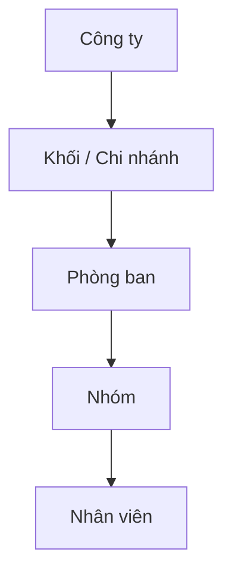
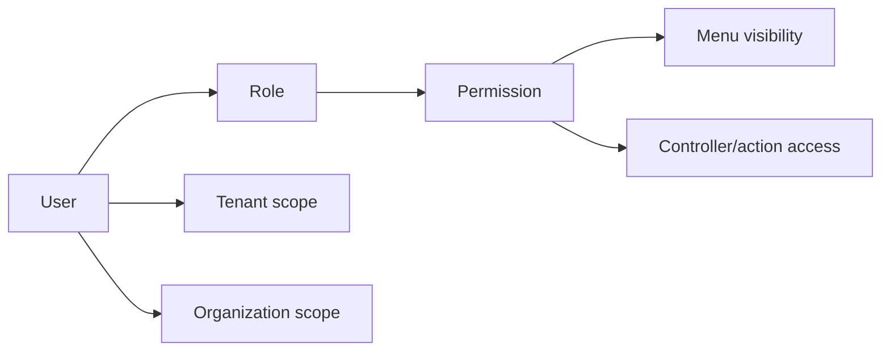
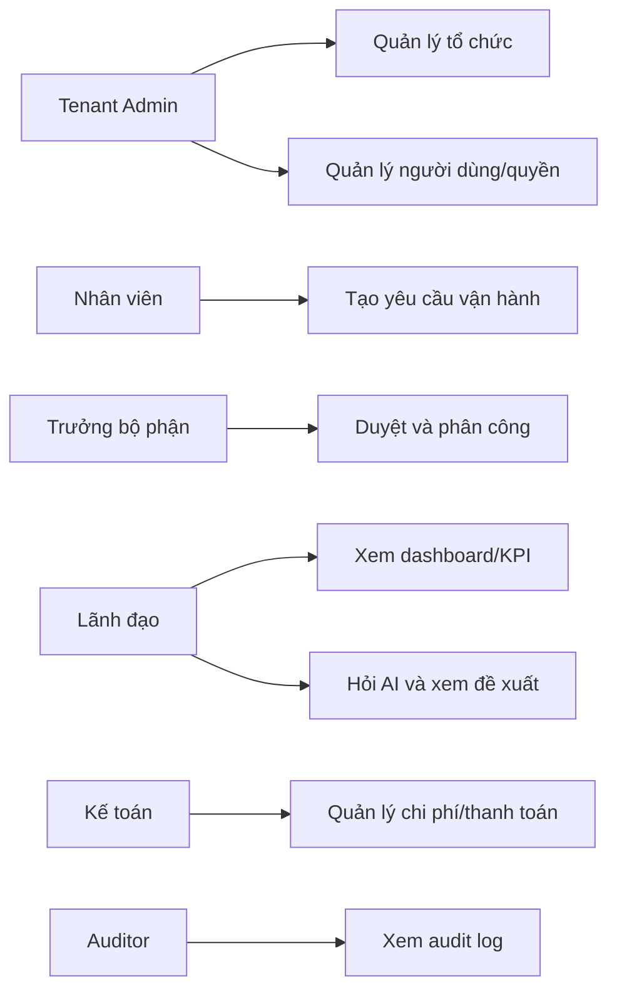
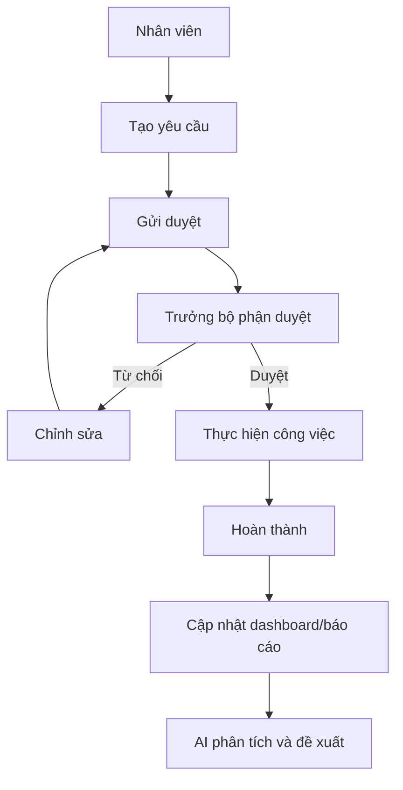
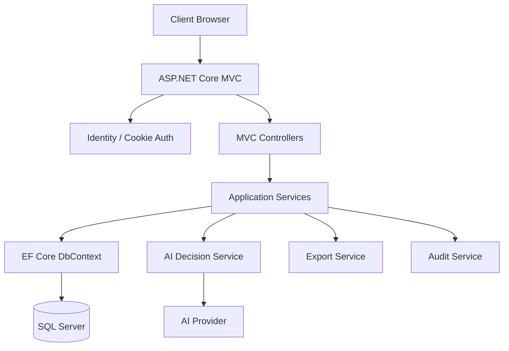
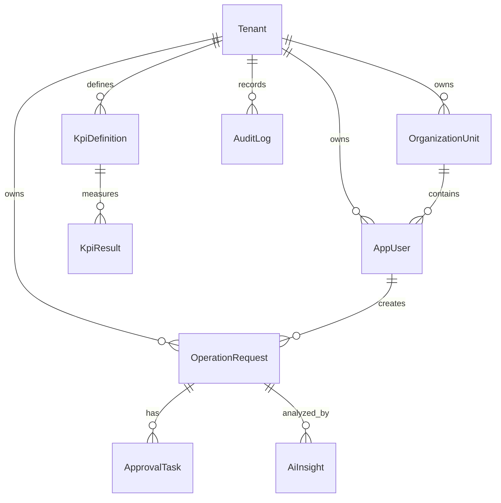
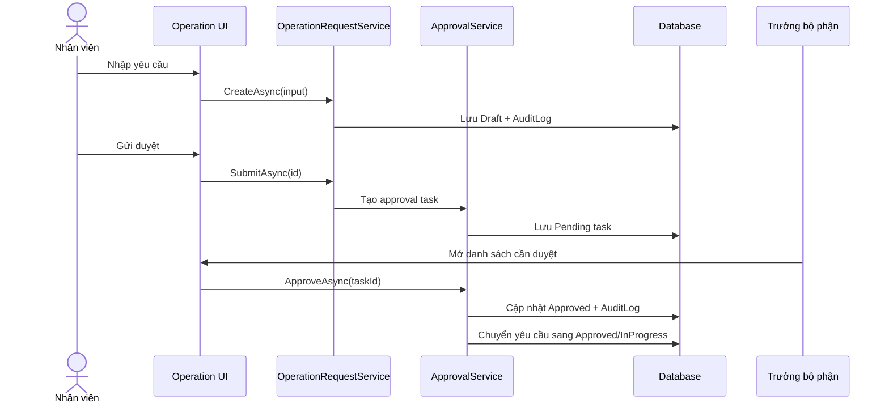
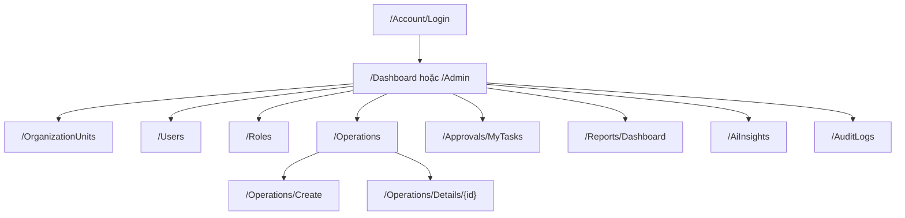
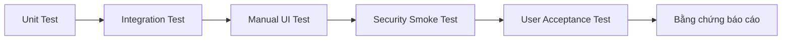
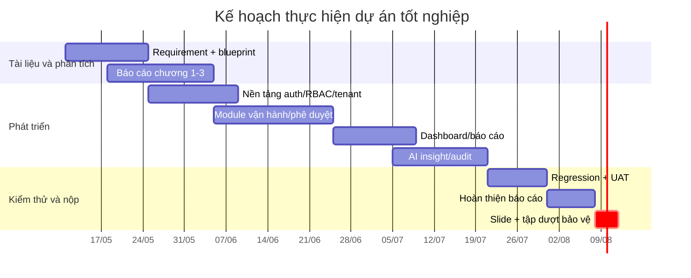

# Báo cáo dự án tốt nghiệp - OmniBizAI

> Đề tài: **Hệ thống vận hành thông minh cho doanh nghiệp vừa và nhỏ, hỗ trợ quản lý đa cấp và đưa ra quyết định bằng AI**  
> Giáo viên hướng dẫn: **Thầy Khải**  
> Nhóm thực hiện: **Quân, Như, Nhật, An, Bảo, Phong, Khánh**  
> Deadline dự kiến: **11/08/2026**

Tài liệu này là khung báo cáo tốt nghiệp có thể phát triển trực tiếp thành bản nộp về trường. Những phần ghi `Cần bổ sung bằng chứng` phải được cập nhật bằng ảnh màn hình, kết quả test, dữ liệu demo hoặc đường dẫn commit trước khi nộp chính thức.

## Trang bìa

```text
TRƯỜNG: .........................................................
KHOA: ...........................................................
NGÀNH: ..........................................................

BÁO CÁO DỰ ÁN TỐT NGHIỆP

Đề tài:
HỆ THỐNG VẬN HÀNH THÔNG MINH CHO DOANH NGHIỆP VỪA VÀ NHỎ,
HỖ TRỢ QUẢN LÝ ĐA CẤP VÀ ĐƯA RA QUYẾT ĐỊNH BẰNG AI

Giáo viên hướng dẫn: Thầy Khải
Nhóm sinh viên thực hiện:
- Quân: PM, BA, tài liệu
- Như: Frontend developer
- Nhật: Frontend developer
- An: Backend developer
- Bảo: Backend developer
- Phong: Backend developer
- Khánh: Tester

Thời gian thực hiện: 11/05/2026 - 11/08/2026
```

## Tóm tắt

OmniBizAI là hệ thống web hỗ trợ doanh nghiệp vừa và nhỏ quản lý hoạt động theo nhiều cấp tổ chức, từ cấp lãnh đạo, phòng ban đến nhân viên. Hệ thống tập trung vào các nghiệp vụ quản trị tổ chức, người dùng, phân quyền, yêu cầu vận hành, phê duyệt, KPI, báo cáo và AI hỗ trợ ra quyết định. Điểm nổi bật của đề tài là thiết kế theo hướng multi-tenant, cấu hình linh hoạt và tích hợp AI để tóm tắt dữ liệu, cảnh báo rủi ro và đề xuất hành động.

Kết quả kỳ vọng của dự án là một ứng dụng ASP.NET Core MVC có khả năng chạy demo với dữ liệu mẫu, phân quyền theo vai trò, dashboard vận hành, quy trình phê duyệt và trợ lý AI. Báo cáo trình bày cơ sở lý thuyết, phân tích yêu cầu, thiết kế hệ thống, quá trình cài đặt, kiểm thử, đánh giá và hướng phát triển.

Từ khóa: `SME`, `multi-tenant`, `RBAC`, `workflow`, `dashboard`, `AI decision support`, `ASP.NET Core MVC`.

## Abstract

OmniBizAI is a web-based intelligent operation management system for small and medium-sized enterprises. The system supports hierarchical organization management, role-based access control, operational requests, approval workflows, KPI tracking, reporting, and AI-assisted decision support. The project emphasizes configurable business behavior, tenant-scoped data, auditability, and practical decision support through summarized insights, risk detection, and recommended actions.

## Lời cam đoan

Nhóm cam đoan đề tài được thực hiện bởi các thành viên trong nhóm dưới sự hướng dẫn của giáo viên hướng dẫn. Các tài liệu, số liệu, hình ảnh và mã nguồn sử dụng trong báo cáo sẽ được trích dẫn hoặc ghi rõ nguồn khi không do nhóm tự xây dựng.

## Lời cảm ơn

Nhóm xin cảm ơn thầy Khải đã hướng dẫn, góp ý phạm vi và hỗ trợ nhóm trong quá trình thực hiện dự án. Nhóm cũng cảm ơn nhà trường, khoa và các giảng viên đã cung cấp nền tảng kiến thức để nhóm hoàn thành đề tài.

## Danh mục hình

| Mã | Tên hình | Trạng thái |
| --- | --- | --- |
| Hình 1.1 | Bối cảnh quản lý SME | Có sơ đồ |
| Hình 3.1 | Use case tổng quan | Có sơ đồ |
| Hình 3.2 | Class Diagram | Có sơ đồ |
| Hình 3.3 | Sequence Diagram đăng nhập/tạo yêu cầu/AI | Có sơ đồ |
| Hình 4.1 | Kiến trúc hệ thống | Có sơ đồ |
| Hình 4.2 | ERD tổng quan 64 bảng theo bounded context | Có sơ đồ |
| Hình 4.3 | Luồng phê duyệt | Có sơ đồ |
| Hình 4.4 | Deployment Diagram | Có sơ đồ |
| Hình 5.1 | Giao diện dashboard | Cần bổ sung ảnh màn hình |
| Hình 5.2 | Giao diện AI insight | Cần bổ sung ảnh màn hình |
| Hình 6.1 | Kết quả kiểm thử | Cần bổ sung bằng chứng |

## Chương 1. Giới thiệu đề tài

### 1.1. Lý do chọn đề tài

Doanh nghiệp vừa và nhỏ thường gặp khó khăn khi quản lý vận hành bằng file rời, nhóm chat hoặc quy trình thủ công. Khi quy mô tăng lên, dữ liệu bị phân tán giữa nhiều phòng ban, việc phê duyệt thiếu minh bạch, báo cáo chậm và lãnh đạo khó có đủ thông tin để ra quyết định kịp thời.

Trong bối cảnh AI ngày càng phổ biến, một hệ thống vận hành có thể kết hợp dữ liệu nội bộ với AI để tóm tắt tình hình, cảnh báo rủi ro và đề xuất hành động sẽ giúp doanh nghiệp tiết kiệm thời gian và nâng cao chất lượng quản lý. Vì vậy, nhóm chọn đề tài OmniBizAI nhằm xây dựng một hệ thống thực tế, có khả năng demo và có hướng phát triển thành sản phẩm.

### 1.2. Mục tiêu đề tài

| Mục tiêu | Mô tả |
| --- | --- |
| Quản lý đa cấp | Mô hình hóa doanh nghiệp, phòng ban, nhân sự và tuyến báo cáo |
| Phân quyền | Kiểm soát chức năng và dữ liệu theo vai trò/quyền |
| Vận hành | Tạo, xử lý, phê duyệt và theo dõi yêu cầu/công việc |
| Báo cáo | Cung cấp dashboard, KPI và báo cáo lọc theo thời gian/phòng ban |
| AI | Tóm tắt dữ liệu, cảnh báo rủi ro và đề xuất hành động |
| Audit | Lưu lịch sử thao tác quan trọng để truy vết |

### 1.3. Phạm vi đề tài

Phạm vi thực hiện trong 3 tháng tập trung vào hệ thống web chạy demo, bao gồm:

- Đăng nhập, phân quyền, quản lý người dùng và tổ chức.
- Module yêu cầu vận hành và phê duyệt.
- Dashboard/KPI/báo cáo cơ bản.
- AI insight ở mức hỗ trợ quyết định.
- Seed dữ liệu demo và hướng dẫn sử dụng.
- Test case và bằng chứng nghiệm thu các luồng chính.

Các chức năng nằm ngoài phạm vi giai đoạn này:

- Mobile app native.
- Tích hợp kế toán/ERP thật của bên thứ ba.
- AI tự động ra quyết định thay con người.
- Phân tích dữ liệu lớn thời gian thực.

### 1.4. Phương pháp thực hiện

Nhóm áp dụng cách làm theo sprint ngắn:

1. Phân tích yêu cầu và viết blueprint.
2. Thiết kế database, phân quyền, workflow.
3. Xây dựng module nền tảng.
4. Xây dựng module nghiệp vụ và dashboard.
5. Tích hợp AI, audit, báo cáo.
6. Kiểm thử, hoàn thiện báo cáo và demo.

### 1.5. Phân công nhóm

| Thành viên | Vai trò | Sản phẩm bàn giao |
| --- | --- | --- |
| Quân | PM, BA, tài liệu | Requirement, blueprint, báo cáo, demo script |
| Như | Frontend | Layout, dashboard, form chính |
| Nhật | Frontend | UI module nghiệp vụ, chart, responsive |
| An | Backend | Auth, tenant, RBAC, domain model |
| Bảo | Backend | Operation, approval, report/export |
| Phong | Backend | AI insight, audit, notification |
| Khánh | Tester | Test plan, test case, bug report, evidence |

## Chương 2. Cơ sở lý thuyết và công nghệ

### 2.1. Doanh nghiệp vừa và nhỏ

Doanh nghiệp vừa và nhỏ có đặc điểm nguồn lực hạn chế, quy trình linh hoạt nhưng thường thiếu hệ thống số hóa thống nhất. Hệ thống quản lý phù hợp cần dễ triển khai, dễ tùy biến, chi phí vừa phải và hỗ trợ ra quyết định nhanh.

### 2.2. Quản lý đa cấp

Quản lý đa cấp trong đề tài không phải mô hình bán hàng đa cấp, mà là mô hình quản trị nhiều cấp tổ chức:



Hệ thống cần cho phép phân quyền theo cấp để lãnh đạo xem dữ liệu tổng hợp, trưởng bộ phận xem dữ liệu phòng ban và nhân viên chỉ thao tác dữ liệu liên quan.

### 2.3. Role-Based Access Control

RBAC là mô hình phân quyền dựa trên vai trò. Người dùng được gán vai trò, vai trò được gán quyền. Trong OmniBizAI, RBAC được mở rộng bằng tenant scope và organization scope để kiểm soát dữ liệu theo doanh nghiệp/phòng ban.



### 2.4. Workflow phê duyệt

Workflow là chuỗi bước xử lý nghiệp vụ. Một yêu cầu vận hành có thể cần trưởng bộ phận duyệt, sau đó lãnh đạo duyệt nếu giá trị lớn hoặc rủi ro cao. Thiết kế workflow giúp hệ thống minh bạch, truy vết được trách nhiệm.

### 2.5. AI hỗ trợ ra quyết định

AI trong đề tài đóng vai trò trợ lý phân tích:

- Tóm tắt tình hình vận hành.
- Cảnh báo yêu cầu quá hạn, rủi ro cao.
- Gợi ý hành động tiếp theo.
- Trả lời câu hỏi dựa trên dữ liệu người dùng có quyền xem.

AI không tự phê duyệt, không thay đổi dữ liệu nếu chưa có xác nhận từ người dùng.

### 2.6. Công nghệ sử dụng

| Công nghệ | Vai trò |
| --- | --- |
| ASP.NET Core MVC | Xây dựng web application |
| Razor Views | Giao diện server-rendered |
| Bootstrap | Responsive UI |
| Entity Framework Core Code First | Định nghĩa entity/model trước, sinh migration và schema SQL Server |
| SQL Server | Database |
| ASP.NET Core Identity | Đăng nhập, người dùng, role |
| Mermaid | Sơ đồ trong Markdown |
| AI Provider API | Sinh insight và đề xuất |

## Chương 3. Phân tích yêu cầu

### 3.1. Stakeholder

| Stakeholder | Nhu cầu |
| --- | --- |
| Ban lãnh đạo | Xem tổng quan, phát hiện rủi ro, ra quyết định |
| Quản trị doanh nghiệp | Cấu hình người dùng, phòng ban, quyền |
| Trưởng bộ phận | Phân công, duyệt yêu cầu, theo dõi KPI |
| Nhân viên | Tạo yêu cầu, cập nhật công việc |
| Kế toán | Theo dõi chi phí và thanh toán |
| Tester/giảng viên | Xem demo, kiểm tra log, đánh giá chức năng |

### 3.2. Use case tổng quan



Mô tả chi tiết từng use case, bao gồm actor, tiền điều kiện, hậu điều kiện, luồng chính và luồng phụ, được tách riêng tại [04-Requirements-and-Use-Cases.md](./04-Requirements-and-Use-Cases.md) để nhóm dễ cập nhật trong quá trình code.

### 3.3. Functional requirements

| Mã | Yêu cầu | Độ ưu tiên |
| --- | --- | --- |
| FR-01 | Người dùng đăng nhập và đăng xuất an toàn | Must |
| FR-02 | Admin quản lý tenant, phòng ban, người dùng, vai trò | Must |
| FR-03 | Sidebar chỉ hiển thị chức năng người dùng có quyền | Must |
| FR-04 | Nhân viên tạo/sửa/gửi yêu cầu vận hành | Must |
| FR-05 | Trưởng bộ phận/lãnh đạo duyệt hoặc từ chối yêu cầu | Must |
| FR-06 | Hệ thống ghi audit log cho thao tác quan trọng | Must |
| FR-07 | Dashboard hiển thị số liệu theo vai trò | Must |
| FR-08 | Báo cáo có bộ lọc thời gian/phòng ban/trạng thái | Should |
| FR-09 | AI tóm tắt dữ liệu và đề xuất hành động | Should |
| FR-10 | Import/export dữ liệu mẫu | Could |

### 3.4. Non-functional requirements

| Mã | Yêu cầu |
| --- | --- |
| NFR-01 | Dữ liệu tenant này không được lộ sang tenant khác |
| NFR-02 | Trang dashboard tải dưới 3 giây với dữ liệu demo |
| NFR-03 | Lỗi AI/provider không làm sập hệ thống |
| NFR-04 | Giao diện dùng được trên desktop và tablet |
| NFR-05 | Có log để truy vết thao tác create/update/approve/export/AI |
| NFR-06 | Báo cáo và code phải khớp nhau tại thời điểm nộp |

### 3.5. Luồng nghiệp vụ chính



## Chương 4. Thiết kế hệ thống

### 4.1. Kiến trúc hệ thống



### 4.2. Thiết kế dữ liệu



Chi tiết field, enum, validation và service contract được trình bày trong [tài liệu kỹ thuật](./01-Technical-Implementation-Blueprint.md).

Tài liệu database đầy đủ, gồm ERD mục tiêu **64 bảng**, database diagram SQL Server theo bounded context, danh sách bảng, data dictionary, ràng buộc khóa chính/khóa ngoại/index và SQL script sinh từ EF Core migration, được đặt tại [06-Database-Design.md](./06-Database-Design.md). Dự án dùng **EF Core Code First**, vì vậy entity/model và `ApplicationDbContext` là nguồn sự thật của schema.

### 4.3. Thiết kế module

| Module | Chức năng | Thành phần chính |
| --- | --- | --- |
| Auth/RBAC | Đăng nhập, quyền, sidebar | Identity, Role, Permission |
| Organization | Phòng ban, nhân sự | OrganizationUnit, AppUser |
| CRM/Catalog | Khách hàng, site, nhà cung cấp, sản phẩm/dịch vụ | Customer, Vendor, ProductService |
| Operation | Yêu cầu/công việc, checklist, bình luận, file | OperationRequest, WorkItem, Attachment |
| Workflow/Approval | Duyệt/từ chối, lịch sử trạng thái | WorkflowDefinition, WorkflowInstance, ApprovalTask |
| Finance/Procurement | Đề nghị mua, PO, thanh toán, ngân sách, chi phí | ProcurementRequest, PurchaseOrder, PaymentRequest, Budget |
| Report/KPI | Dashboard/KPI/export | KpiDefinition, KpiResult, ReportDefinition, DashboardWidget |
| AI | Prompt, provider, insight, rủi ro, đề xuất | AiPromptTemplate, AiProviderConfiguration, AiInsight |
| Audit/Import/Notification | Nhật ký thao tác, import staging, thông báo | AuditLog, ImportJob, Notification |

### 4.4. Sequence tạo và duyệt yêu cầu



### 4.5. Sitemap giao diện



## Chương 5. Cài đặt hệ thống

### 5.1. Môi trường phát triển

| Thành phần | Phiên bản/ghi chú |
| --- | --- |
| OS | Windows 10/11 |
| .NET SDK | Theo `TargetFramework` của project |
| IDE | Visual Studio hoặc VS Code |
| Database | SQL Server hoặc LocalDB |
| Browser | Microsoft Edge/Chrome |

Chi tiết triển khai IIS, biến môi trường, publish app, tạo database, smoke test, backup/restore và bảo trì được tách tại [07-Testing-Deployment-Maintenance.md](./07-Testing-Deployment-Maintenance.md).

### 5.2. Cấu trúc project

Ứng dụng được tổ chức theo mô hình ASP.NET Core MVC:

- `Controllers`: nhận request, gọi service, trả view/json.
- `Models/Entities`: entity database.
- `ViewModels`: dữ liệu phục vụ form/view.
- `Services`: nghiệp vụ, workflow, AI, report.
- `Data`: `ApplicationDbContext`, cấu hình Code First, migration, seed.
- `Views`: giao diện Razor.
- `wwwroot`: CSS, JS, ảnh, thư viện tĩnh.

### 5.3. Cài đặt các module

| Module | Cách cài đặt trong code | Trạng thái báo cáo |
| --- | --- | --- |
| Auth/RBAC | Identity + policy authorization | Cần bổ sung bằng chứng |
| Organization | Entity + CRUD + tree UI | Cần bổ sung bằng chứng |
| Operation | Service + controller + Razor form | Cần bổ sung bằng chứng |
| Approval | Workflow service + approval tasks | Cần bổ sung bằng chứng |
| Report | Query service + dashboard | Cần bổ sung bằng chứng |
| AI | AI provider service + prompt template | Cần bổ sung bằng chứng |
| Audit | Audit logger + audit viewer | Cần bổ sung bằng chứng |

### 5.4. Giao diện cần chụp cho báo cáo

| Màn hình | Ảnh cần chèn |
| --- | --- |
| Login | Form đăng nhập và tài khoản demo |
| Dashboard | Số liệu tổng quan theo vai trò |
| Quản lý người dùng | Danh sách, tạo/sửa/khóa |
| Quản lý phòng ban | Cây tổ chức |
| Tạo yêu cầu | Form có validation |
| Duyệt yêu cầu | Danh sách task pending |
| AI insight | Câu hỏi, kết quả tóm tắt, đề xuất |
| Báo cáo | Filter và kết quả |
| Audit log | Lịch sử thao tác |

## Chương 6. Kiểm thử và đánh giá

### 6.1. Chiến lược kiểm thử



### 6.2. Test case mẫu

| Mã | Chức năng | Bước kiểm thử | Kỳ vọng | Trạng thái |
| --- | --- | --- | --- | --- |
| TC-01 | Login | Đăng nhập bằng tài khoản hợp lệ | Vào dashboard đúng vai trò | Cần chạy |
| TC-02 | Permission | User không có quyền mở `/Users` | Bị chặn 403 hoặc redirect | Cần chạy |
| TC-03 | Menu | User không có quyền quản trị | Không thấy menu quản trị | Cần chạy |
| TC-04 | Create request | Nhập thiếu tiêu đề | Hiển thị validation | Cần chạy |
| TC-05 | Submit request | Gửi yêu cầu hợp lệ | Tạo approval task | Cần chạy |
| TC-06 | Reject | Từ chối thiếu lý do | Báo lỗi bắt buộc | Cần chạy |
| TC-07 | Dashboard | Mở dashboard | Số liệu khớp database demo | Cần chạy |
| TC-08 | AI | Hỏi AI với dữ liệu hợp lệ | Có summary/recommendation | Cần chạy |
| TC-09 | AI fallback | Tắt API key/provider lỗi | UI báo lỗi thân thiện | Cần chạy |
| TC-10 | Export | Xuất báo cáo theo ngày | Tải được file đúng filter | Cần chạy |

### 6.3. Bảng bằng chứng cần thu

| Loại bằng chứng | File/ảnh | Người phụ trách |
| --- | --- | --- |
| Build thành công | Ảnh terminal hoặc log | An |
| Migration/seed | Ảnh DB hoặc log seed | An, Bảo |
| Test case | File test report | Khánh |
| UI chính | Ảnh màn hình | Như, Nhật |
| AI insight | Ảnh kết quả và log | Phong |
| Demo script | Markdown/PDF | Quân |

### 6.4. Đánh giá kết quả

Tiêu chí đánh giá:

- Mức độ hoàn thành yêu cầu chức năng.
- Tính đúng đắn của phân quyền và tenant scope.
- Khả năng vận hành end-to-end của luồng tạo, duyệt, báo cáo.
- Chất lượng giao diện và trải nghiệm demo.
- Độ hữu ích của AI insight.
- Mức độ đầy đủ của test evidence và báo cáo.

## Chương 7. Kết luận và hướng phát triển

### 7.1. Kết luận

Đề tài OmniBizAI hướng đến bài toán thực tế của doanh nghiệp vừa và nhỏ: quản lý vận hành phân tán, thiếu minh bạch và thiếu công cụ hỗ trợ quyết định. Hệ thống đề xuất giải pháp web có quản lý đa cấp, phân quyền, workflow, dashboard và AI insight. Nếu triển khai đúng blueprint, đề tài có đủ cơ sở để demo một sản phẩm hoàn chỉnh ở mức tốt nghiệp.

### 7.2. Hạn chế

- Dữ liệu demo có thể chưa phản ánh đầy đủ từng ngành nghề.
- AI phụ thuộc chất lượng dữ liệu và provider bên ngoài.
- Chưa có mobile app native.
- Chưa tích hợp sâu với hệ thống kế toán/ERP thật.

### 7.3. Hướng phát triển

- Xây dựng marketplace module theo ngành.
- Thêm mobile app hoặc PWA.
- Tích hợp OCR/import hóa đơn/chứng từ.
- Tích hợp lịch làm việc, email, chat nội bộ.
- Nâng cấp AI thành agent có khả năng đề xuất workflow, nhưng vẫn cần người duyệt.

## Kế hoạch quản lý dự án



## Quản lý rủi ro

| Rủi ro | Tác động | Xác suất | Phương án xử lý |
| --- | --- | --- | --- |
| Scope quá rộng | Không kịp deadline | Cao | Chốt MVP, ưu tiên auth, vận hành, report, AI demo |
| AI provider lỗi/API key chưa có | Demo AI thất bại | Trung bình | Có mock/fallback và dữ liệu insight mẫu |
| Database/migration lỗi máy local | Chậm tiến độ backend | Trung bình | Docker/SQL Server thống nhất, ghi log lỗi rõ |
| UI thiếu thống nhất | Demo kém chuyên nghiệp | Trung bình | Dùng layout chung, component/style guide |
| Báo cáo lệch code | Bị hỏi khó khi bảo vệ | Cao | Mỗi sprint cập nhật ảnh, test evidence, chức năng thật |
| Thành viên trễ task | Ảnh hưởng tích hợp | Trung bình | Daily check ngắn, chia task nhỏ, có owner phụ |

## Tài liệu tham khảo dự kiến

> Cần chuẩn hóa lại theo mẫu trích dẫn của nhà trường trước khi nộp bản Word/PDF.

1. Microsoft Learn - [Overview of ASP.NET Core MVC](https://learn.microsoft.com/en-us/aspnet/core/mvc/overview?view=aspnetcore-10.0).
2. Microsoft Learn - [Host and deploy ASP.NET Core](https://learn.microsoft.com/en-us/aspnet/core/host-and-deploy/?view=aspnetcore-10.0).
3. Microsoft Learn - Entity Framework Core.
4. Microsoft Learn - ASP.NET Core Identity.
5. Tài liệu về Role-Based Access Control.
6. Tài liệu về workflow management.
7. Tài liệu về AI decision support systems.
8. Tài liệu về quản trị doanh nghiệp vừa và nhỏ.

## Phụ lục

### Phụ lục A. Tài khoản demo

| Vai trò | Email | Password | Trạng thái |
| --- | --- | --- | --- |
| Tenant Admin | `admin@demo.local` | `123` hoặc theo seed | Cần xác nhận khi seed |
| Executive | `executive@demo.local` | `123` hoặc theo seed | Cần xác nhận khi seed |
| Manager | `manager@demo.local` | `123` hoặc theo seed | Cần xác nhận khi seed |
| Staff | `staff@demo.local` | `123` hoặc theo seed | Cần xác nhận khi seed |

### Phụ lục B. Demo script 10 phút

1. Đăng nhập bằng Tenant Admin, giới thiệu cấu trúc tổ chức và phân quyền.
2. Đăng nhập Staff, tạo yêu cầu vận hành.
3. Đăng nhập Manager, duyệt hoặc từ chối yêu cầu.
4. Mở dashboard, xem KPI và trạng thái.
5. Hỏi AI: "Những rủi ro vận hành nổi bật tuần này là gì?"
6. Mở audit log để chứng minh hệ thống có truy vết.
7. Xuất báo cáo hoặc hiển thị report filter.

### Phụ lục C. Checklist trước khi nộp

- [ ] Báo cáo có đủ chương.
- [ ] Tất cả sơ đồ render được trong Markdown.
- [ ] Ảnh màn hình là ảnh của hệ thống thật.
- [ ] Test case có trạng thái và bằng chứng.
- [ ] Code build được trên máy demo.
- [ ] Database có seed demo.
- [ ] Slide bảo vệ khớp với báo cáo.
- [ ] Thành viên nắm rõ phần mình phụ trách.
