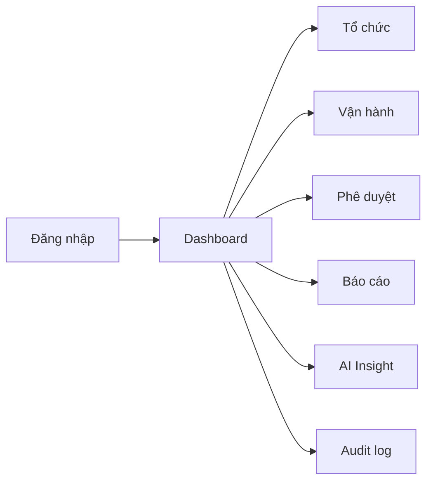
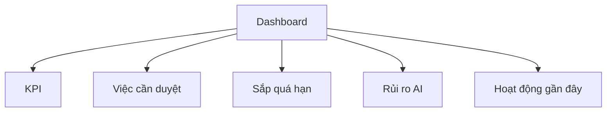
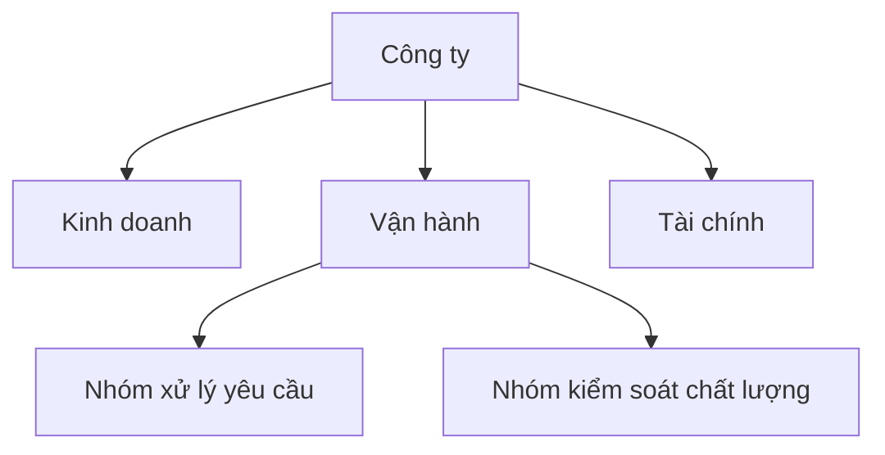
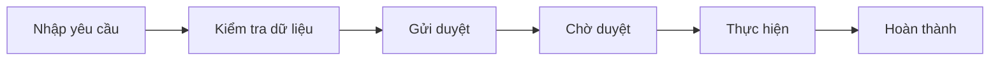
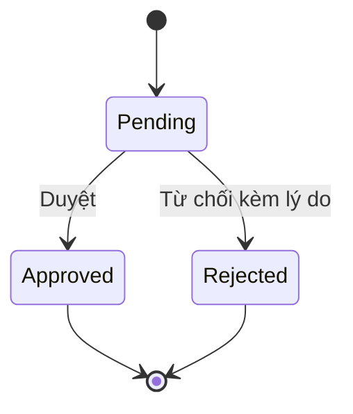
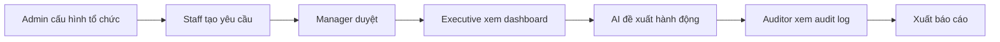

# OmniBizAI - Hướng dẫn sử dụng

> Dành cho người dùng demo, giảng viên, tester và nhóm phát triển khi chạy nghiệm thu.  
> Hệ thống: **Hệ thống vận hành thông minh cho doanh nghiệp vừa và nhỏ, hỗ trợ quản lý đa cấp và đưa ra quyết định bằng AI**.

## 1. Tổng quan

OmniBizAI giúp doanh nghiệp quản lý tổ chức, người dùng, yêu cầu vận hành, phê duyệt, báo cáo và AI insight trên một hệ thống thống nhất. Người dùng chỉ thấy chức năng phù hợp với vai trò và quyền được cấp.

## 2. Vai trò người dùng

| Vai trò | Nên dùng khi demo | Chức năng chính |
| --- | --- | --- |
| System Admin | Demo quản trị toàn hệ thống | Tenant, cấu hình toàn cục |
| Tenant Admin | Demo quản trị doanh nghiệp | Người dùng, phòng ban, vai trò, quyền |
| Executive | Demo lãnh đạo | Dashboard, KPI, phê duyệt cấp cao, AI |
| Department Manager | Demo trưởng bộ phận | Duyệt yêu cầu, quản lý công việc, xem KPI bộ phận |
| Staff | Demo nhân viên | Tạo yêu cầu, cập nhật công việc |
| Accountant | Demo kế toán | Chi phí, thanh toán, báo cáo tài chính cơ bản |
| Auditor | Demo kiểm soát | Audit log, báo cáo, bằng chứng |

## 3. Đăng nhập và đăng xuất

### 3.1. Đăng nhập

1. Mở trang `/Account/Login`.
2. Nhập email và mật khẩu demo.
3. Bấm **Đăng nhập**.
4. Hệ thống chuyển đến dashboard phù hợp với vai trò.

Nếu đăng nhập thất bại:

- Kiểm tra email/mật khẩu.
- Kiểm tra tài khoản có bị khóa không.
- Kiểm tra seed dữ liệu đã chạy chưa.

### 3.2. Đăng xuất

1. Bấm tên người dùng ở góc phải.
2. Chọn **Đăng xuất**.
3. Hệ thống quay về màn hình đăng nhập.

## 4. Dashboard

Dashboard là màn hình đầu tiên sau khi đăng nhập. Nội dung dashboard thay đổi theo vai trò:

| Vai trò | Widget thường thấy |
| --- | --- |
| Admin | Số người dùng, phòng ban, role, audit gần đây |
| Executive | KPI tổng quan, rủi ro, yêu cầu quá hạn, AI insight |
| Manager | Việc cần duyệt, công việc bộ phận, KPI phòng ban |
| Staff | Công việc của tôi, yêu cầu đã tạo, hạn xử lý |
| Auditor | Audit log, báo cáo hoạt động |

## 5. Quản lý tổ chức

> Dành cho Tenant Admin hoặc người có quyền `ORG_UNITS_MANAGE`.

### 5.1. Tạo phòng ban

1. Vào **Tổ chức**.
2. Bấm **Thêm phòng ban**.
3. Nhập mã, tên, cấp cha và trưởng bộ phận.
4. Bấm **Lưu**.

Quy tắc nhập liệu:

- Mã phòng ban không được trùng trong cùng doanh nghiệp.
- Không được chọn phòng ban cha là chính nó.
- Không nên xóa phòng ban đã có dữ liệu; dùng trạng thái ngừng hoạt động.

### 5.2. Cây tổ chức

## 6. Quản lý người dùng và vai trò

> Dành cho Tenant Admin hoặc người có quyền `USERS_MANAGE`, `ROLES_MANAGE`.

### 6.1. Tạo người dùng

1. Vào **Người dùng**.
2. Bấm **Thêm người dùng**.
3. Nhập họ tên, email, phòng ban, chức danh.
4. Chọn vai trò.
5. Bấm **Lưu**.

### 6.2. Khóa hoặc mở khóa tài khoản

1. Vào chi tiết người dùng.
2. Chọn **Khóa tài khoản** hoặc **Mở khóa**.
3. Nhập lý do nếu hệ thống yêu cầu.

### 6.3. Gán quyền

1. Vào **Vai trò**.
2. Chọn vai trò cần sửa.
3. Tích quyền chức năng.
4. Lưu thay đổi.

Lưu ý: quyền phải ảnh hưởng cả menu và route. Nếu người dùng không có quyền, họ không thấy menu và cũng không mở được link trực tiếp.

## 7. Tạo yêu cầu vận hành

> Dành cho Staff, Manager hoặc người có quyền `OPERATIONS_EDIT`.

### 7.1. Luồng tổng quan

### 7.2. Các bước tạo yêu cầu

1. Vào **Vận hành**.
2. Bấm **Tạo yêu cầu**.
3. Nhập tiêu đề, loại yêu cầu, bộ phận phụ trách, mức ưu tiên, hạn xử lý.
4. Nhập mô tả và dòng chi tiết nếu có.
5. Bấm **Lưu nháp** hoặc **Gửi duyệt**.

### 7.3. Lỗi thường gặp

| Lỗi | Cách xử lý |
| --- | --- |
| Thiếu tiêu đề | Nhập tiêu đề ngắn gọn, tối đa 250 ký tự |
| Chưa chọn bộ phận | Chọn phòng ban phụ trách |
| Hạn xử lý không hợp lệ | Chọn ngày hiện tại hoặc tương lai |
| Không gửi duyệt được | Kiểm tra yêu cầu còn ở trạng thái nháp hoặc bị trả về |

## 8. Phê duyệt yêu cầu

> Dành cho Manager, Executive hoặc người có quyền `APPROVALS_APPROVE`.

### 8.1. Xem danh sách cần duyệt

1. Vào **Phê duyệt** hoặc **Việc cần duyệt** trên dashboard.
2. Mở yêu cầu cần xem.
3. Kiểm tra nội dung, lịch sử, file đính kèm và gợi ý AI nếu có.

### 8.2. Duyệt

1. Bấm **Duyệt**.
2. Nhập ghi chú nếu cần.
3. Xác nhận.

### 8.3. Từ chối

1. Bấm **Từ chối**.
2. Nhập lý do rõ ràng.
3. Xác nhận.

Quy tắc: khi từ chối, hệ thống bắt buộc lưu lý do để người tạo biết cần sửa gì.

## 9. Báo cáo và KPI

> Dành cho Executive, Manager, Auditor hoặc người có quyền `REPORTS_VIEW`.

### 9.1. Xem dashboard báo cáo

1. Vào **Báo cáo**.
2. Chọn khoảng thời gian.
3. Chọn phòng ban hoặc trạng thái nếu cần.
4. Bấm **Lọc**.

### 9.2. Xuất báo cáo

1. Sau khi lọc dữ liệu, bấm **Xuất file**.
2. Chọn định dạng nếu hệ thống hỗ trợ.
3. Kiểm tra file tải về.

### 9.3. Chỉ số nên xem khi demo

| Chỉ số | Ý nghĩa |
| --- | --- |
| Tổng yêu cầu | Khối lượng công việc |
| Yêu cầu đang chờ duyệt | Điểm nghẽn phê duyệt |
| Yêu cầu quá hạn | Rủi ro vận hành |
| Tỷ lệ hoàn thành | Hiệu quả xử lý |
| KPI theo bộ phận | Hiệu quả quản lý đa cấp |

## 10. AI Insight

> Dành cho người có quyền `AI_INSIGHTS_USE`.

AI Insight giúp người dùng hỏi dữ liệu và nhận tóm tắt, rủi ro, đề xuất hành động.

### 10.1. Hỏi AI

1. Vào **AI Insight** hoặc panel AI trên dashboard.
2. Nhập câu hỏi, ví dụ:
   - "Tuần này có yêu cầu nào rủi ro cao không?"
   - "Bộ phận nào đang có nhiều việc quá hạn nhất?"
   - "Tôi nên ưu tiên xử lý vấn đề nào trước?"
3. Bấm **Phân tích**.
4. Đọc tóm tắt, rủi ro và đề xuất.

### 10.2. Nguyên tắc sử dụng AI

- AI chỉ dựa trên dữ liệu người dùng có quyền xem.
- Nếu thiếu dữ liệu, AI phải nói rõ thiếu gì.
- Người dùng cần kiểm tra lại trước khi ra quyết định.
- AI không tự phê duyệt hoặc thay đổi dữ liệu.

### 10.3. Khi AI lỗi

| Tình huống | Cách xử lý |
| --- | --- |
| Chưa cấu hình API key | Báo quản trị viên cấu hình provider |
| Provider timeout | Thử lại sau hoặc xem dashboard thủ công |
| Câu hỏi quá dài | Rút gọn câu hỏi |
| Không có dữ liệu | Kiểm tra filter thời gian/phòng ban |

## 11. Audit log

Audit log ghi lại thao tác quan trọng như tạo/sửa/xóa, gửi duyệt, duyệt/từ chối, export báo cáo và gọi AI.

### 11.1. Xem audit

1. Vào **Audit log**.
2. Lọc theo người dùng, loại thao tác, thời gian hoặc bản ghi.
3. Mở chi tiết để xem dữ liệu trước/sau nếu có.

### 11.2. Dùng audit khi demo

Sau khi tạo và duyệt yêu cầu, mở audit log để chứng minh hệ thống có truy vết đầy đủ:

- Ai tạo yêu cầu.
- Ai gửi duyệt.
- Ai phê duyệt/từ chối.
- AI insight nào đã được tạo.
- Báo cáo nào đã được export.

## 12. Kịch bản demo nhanh

### 12.1. Demo 5 phút

1. Đăng nhập Tenant Admin, giới thiệu quản lý người dùng và phòng ban.
2. Đăng nhập Staff, tạo yêu cầu vận hành.
3. Đăng nhập Manager, duyệt yêu cầu.
4. Mở dashboard, xem số liệu cập nhật.
5. Hỏi AI về rủi ro hoặc ưu tiên xử lý.

### 12.2. Demo 10 phút

## 13. FAQ

### Tôi không thấy menu quản trị?

Tài khoản của bạn chưa có quyền quản trị. Hãy dùng tài khoản Tenant Admin hoặc nhờ quản trị viên gán role phù hợp.

### Tôi mở link trực tiếp nhưng bị 403?

Bạn không có quyền truy cập chức năng đó. Đây là hành vi đúng của hệ thống.

### Tôi tạo yêu cầu nhưng không gửi duyệt được?

Kiểm tra các trường bắt buộc, trạng thái yêu cầu và workflow của loại yêu cầu.

### Dashboard không có số liệu?

Kiểm tra dữ liệu demo đã seed chưa, filter ngày có đúng không và tài khoản có quyền xem dữ liệu không.

### AI trả lời "thiếu dữ liệu"?

Điều đó có nghĩa context gửi cho AI chưa đủ. Hãy kiểm tra dữ liệu vận hành, khoảng thời gian hoặc quyền truy cập.

## 14. Checklist nghiệm thu người dùng

- [ ] Đăng nhập được bằng tài khoản demo.
- [ ] Sidebar hiển thị đúng theo vai trò.
- [ ] Tạo yêu cầu vận hành thành công.
- [ ] Validation hiển thị khi nhập thiếu dữ liệu.
- [ ] Gửi duyệt tạo task cho người duyệt.
- [ ] Duyệt/từ chối cập nhật đúng trạng thái.
- [ ] Dashboard hiển thị số liệu thật.
- [ ] AI trả về tóm tắt và đề xuất.
- [ ] Audit log ghi lại thao tác.
- [ ] Xuất báo cáo hoặc xem báo cáo theo filter.

## 15. Quy tắc nhập liệu tốt

| Trường | Quy tắc |
| --- | --- |
| Tiêu đề | Ngắn gọn, thể hiện rõ việc cần xử lý |
| Mô tả | Ghi đủ bối cảnh, mong muốn, hạn chế |
| Hạn xử lý | Chọn ngày thực tế, không để quá xa nếu là việc khẩn |
| Mức ưu tiên | Dùng `Critical` cho việc có tác động lớn hoặc deadline gấp |
| Lý do từ chối | Ghi rõ cần sửa gì, tránh ghi chung chung |
| Câu hỏi AI | Hỏi cụ thể theo thời gian, phòng ban hoặc loại vấn đề |
