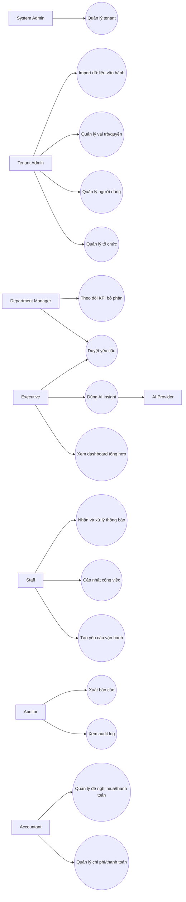

# OmniBizAI - Tài liệu yêu cầu và Use Case

> Dùng cho Chương 2 của báo cáo tốt nghiệp và làm đầu vào trực tiếp cho backend, frontend, tester.  
> Công nghệ mục tiêu: **ASP.NET Core MVC .NET 10 + SQL Server**.

## 1. Mục tiêu hệ thống

OmniBizAI là hệ thống vận hành thông minh cho doanh nghiệp vừa và nhỏ, hỗ trợ quản lý đa cấp, phân quyền theo vai trò, quản lý yêu cầu/công việc, phê duyệt, báo cáo và AI hỗ trợ ra quyết định.

Mục tiêu triển khai trong 3 tháng:

- Quản lý doanh nghiệp, phòng ban, nhân sự và vai trò.
- Đăng nhập, phân quyền chức năng và phân quyền dữ liệu.
- Theo dõi yêu cầu vận hành từ lúc tạo đến lúc hoàn thành.
- Có dashboard, báo cáo, KPI và audit log phục vụ quản lý.
- Có AI insight để tóm tắt, cảnh báo rủi ro và đề xuất hành động.
- Có tài liệu, test case, script dữ liệu và hướng dẫn triển khai đủ để nộp đồ án.

## 2. Phạm vi

### 2.1. Trong phạm vi

| Nhóm | Nội dung |
| --- | --- |
| Authentication | Đăng nhập, đăng xuất, kiểm soát phiên |
| Authorization | Role, permission, menu visibility, route protection |
| Organization | Tenant, phòng ban, chức danh, người dùng |
| Operations | Yêu cầu vận hành, công việc, trạng thái, file đính kèm |
| Approval | Phê duyệt/từ chối, ghi lý do, lưu lịch sử |
| Procurement/Finance | Đề nghị mua, đơn mua, đề nghị thanh toán, ngân sách, chi phí |
| Reporting | Dashboard, filter báo cáo, export dữ liệu |
| AI | Tóm tắt tình hình, rủi ro, đề xuất hành động |
| Audit/Import/Notification | Nhật ký thao tác, import staging, thông báo nghiệp vụ |
| Documentation | Báo cáo, hướng dẫn sử dụng, hướng dẫn triển khai |

### 2.2. Phân rã chức năng theo ERD 64 bảng

| Nhóm chức năng | Chức năng chi tiết | Bảng phục vụ |
| --- | --- | --- |
| Quản trị nền tảng | Tenant, module, tham số, mã chứng từ | `Tenants`, `TenantSettings`, `TenantModules`, `SystemParameters`, `NumberSequences` |
| Bảo mật và phân quyền | Đăng nhập, phiên, role, permission, gán quyền | `AppUsers`, `UserSessions`, `RoleDefinitions`, `PermissionDefinitions`, `PermissionAssignments`, `UserRoleAssignments` |
| Tổ chức đa cấp | Cây phòng ban, chức danh, hồ sơ nhân sự, phân công | `OrganizationUnits`, `Positions`, `EmployeeProfiles`, `EmployeeDepartmentAssignments` |
| CRM và danh mục | Khách hàng, điểm giao dịch, nhà cung cấp, sản phẩm/dịch vụ | `Customers`, `CustomerSites`, `Vendors`, `ProductCategories`, `ProductServices` |
| Vận hành | Yêu cầu, dòng chi tiết, work item, checklist, bình luận, file | `OperationRequests`, `OperationRequestLines`, `WorkItems`, `WorkItemAssignments`, `Attachments` |
| Workflow/Approval | Cấu hình quy trình, instance, lịch sử, task duyệt | `WorkflowDefinitions`, `WorkflowSteps`, `WorkflowInstances`, `WorkflowHistory`, `ApprovalTasks` |
| Mua hàng/Tài chính | Đề nghị mua, PO, đề nghị thanh toán, ngân sách, chi phí | `ProcurementRequests`, `PurchaseOrders`, `PaymentRequests`, `Budgets`, `Expenses` |
| KPI/Báo cáo | KPI, target, result, check-in, report, dashboard | `KpiDefinitions`, `KpiTargets`, `KpiResults`, `KpiCheckIns`, `ReportDefinitions`, `DashboardWidgets` |
| AI/Audit/Import/Notification | Prompt, provider, insight, audit log, import staging, notification | `AiPromptTemplates`, `AiProviderConfigurations`, `AiInsights`, `AuditLogs`, `ImportJobs`, `Notifications` |

### 2.3. Ngoài phạm vi giai đoạn tốt nghiệp

- Mobile app native.
- Tích hợp kế toán/ERP thật.
- AI tự động phê duyệt thay con người.
- Dữ liệu lớn thời gian thực.
- Marketplace module theo ngành.

## 3. Actor

| Actor | Mô tả | Chức năng chính |
| --- | --- | --- |
| `System Admin` | Quản trị toàn hệ thống demo nhiều tenant | Quản lý tenant, cấu hình toàn cục |
| `Tenant Admin` | Quản trị một doanh nghiệp | Quản lý người dùng, vai trò, phòng ban |
| `Executive` | Ban lãnh đạo | Xem dashboard, báo cáo, AI insight, duyệt cấp cao |
| `Department Manager` | Trưởng bộ phận | Duyệt yêu cầu, quản lý công việc, xem KPI bộ phận |
| `Staff` | Nhân viên | Tạo yêu cầu, cập nhật công việc |
| `Accountant` | Kế toán | Theo dõi chi phí, thanh toán, báo cáo tài chính cơ bản |
| `Auditor` | Người kiểm soát/giảng viên demo | Xem audit log, báo cáo và bằng chứng |
| `AI Provider` | Dịch vụ AI bên ngoài | Sinh tóm tắt, rủi ro và đề xuất |

## 4. Use Case Diagram

## 5. Danh sách Use Case

| Mã | Tên Use Case | Actor chính | Độ ưu tiên |
| --- | --- | --- | --- |
| UC-01 | Đăng nhập hệ thống | Tất cả người dùng | Must |
| UC-02 | Quản lý tenant | System Admin | Should |
| UC-03 | Quản lý phòng ban | Tenant Admin | Must |
| UC-04 | Quản lý người dùng | Tenant Admin | Must |
| UC-05 | Quản lý vai trò và quyền | Tenant Admin | Must |
| UC-06 | Tạo yêu cầu vận hành | Staff | Must |
| UC-07 | Gửi yêu cầu duyệt | Staff | Must |
| UC-08 | Phê duyệt/từ chối yêu cầu | Manager, Executive | Must |
| UC-09 | Theo dõi dashboard/KPI | Manager, Executive | Must |
| UC-10 | Hỏi AI và xem đề xuất | Executive, Manager | Should |
| UC-11 | Xuất báo cáo | Executive, Auditor | Should |
| UC-12 | Xem audit log | Admin, Auditor | Should |
| UC-13 | Xuất báo cáo | Executive, Auditor | Should |
| UC-14 | Quản lý đề nghị mua/thanh toán | Accountant, Manager | Should |
| UC-15 | Import dữ liệu vận hành | Tenant Admin, Staff | Could |
| UC-16 | Nhận và xử lý thông báo | Tất cả người dùng | Should |

## 6. Use Case Description

### UC-01. Đăng nhập hệ thống

| Thuộc tính | Nội dung |
| --- | --- |
| Actor | Tất cả người dùng |
| Mục tiêu | Người dùng truy cập được hệ thống theo đúng vai trò |
| Tiền điều kiện | Tài khoản đã được tạo, chưa bị khóa |
| Hậu điều kiện | Tạo phiên đăng nhập, có tenant context và permission context |
| Trigger | Người dùng mở `/Account/Login` |

Luồng chính:

1. Người dùng nhập email và mật khẩu.
2. Hệ thống kiểm tra tài khoản.
3. Hệ thống nạp tenant, role và permission.
4. Hệ thống chuyển đến dashboard phù hợp.

Luồng phụ:

- Sai mật khẩu: hiển thị lỗi, không tiết lộ tài khoản có tồn tại hay không.
- Tài khoản bị khóa: hiển thị thông báo liên hệ quản trị viên.
- Thiếu tenant context: chặn đăng nhập nghiệp vụ và ghi audit.

### UC-03. Quản lý phòng ban

| Thuộc tính | Nội dung |
| --- | --- |
| Actor | Tenant Admin |
| Mục tiêu | Tạo và cập nhật cơ cấu tổ chức nhiều cấp |
| Tiền điều kiện | Người dùng có quyền `ORG_UNITS_MANAGE` |
| Hậu điều kiện | Phòng ban được lưu theo `TenantId` |

Luồng chính:

1. Admin mở màn hình tổ chức.
2. Admin bấm thêm phòng ban.
3. Admin nhập mã, tên, cấp cha và trưởng bộ phận.
4. Hệ thống validate mã không trùng trong tenant.
5. Hệ thống lưu phòng ban và ghi audit.

Luồng phụ:

- Mã trùng: hiển thị lỗi tại field `Code`.
- Chọn cấp cha không hợp lệ: không cho lưu để tránh vòng lặp cây tổ chức.
- Phòng ban đã có dữ liệu: chỉ cho ngừng hoạt động, không xóa cứng.

### UC-04. Quản lý người dùng

| Thuộc tính | Nội dung |
| --- | --- |
| Actor | Tenant Admin |
| Mục tiêu | Tạo, sửa, khóa/mở tài khoản người dùng |
| Tiền điều kiện | Có quyền `USERS_MANAGE` |
| Hậu điều kiện | User có role, phòng ban và trạng thái hợp lệ |

Luồng chính:

1. Admin mở danh sách người dùng.
2. Admin tạo người dùng mới.
3. Hệ thống kiểm tra email không trùng trong tenant.
4. Admin gán phòng ban, chức danh và role.
5. Hệ thống lưu người dùng, tạo audit log.

Luồng phụ:

- Email đã tồn tại: báo lỗi.
- Role không tồn tại: chặn lưu.
- Khóa tài khoản: yêu cầu nhập lý do nếu đã có dữ liệu phát sinh.

### UC-05. Quản lý vai trò và quyền

| Thuộc tính | Nội dung |
| --- | --- |
| Actor | Tenant Admin |
| Mục tiêu | Cấu hình vai trò, quyền chức năng và menu |
| Tiền điều kiện | Có quyền `ROLES_MANAGE` |
| Hậu điều kiện | Quyền ảnh hưởng cả sidebar và controller/action |

Luồng chính:

1. Admin mở màn hình vai trò.
2. Admin chọn role cần sửa.
3. Admin tích/bỏ quyền.
4. Hệ thống lưu permission assignment.
5. Hệ thống cập nhật menu visibility và policy check.

Luồng phụ:

- Không cho xóa role hệ thống đang có user.
- Không cho role thường tự cấp quyền quản trị toàn hệ thống.

### UC-06. Tạo yêu cầu vận hành

| Thuộc tính | Nội dung |
| --- | --- |
| Actor | Staff, Manager |
| Mục tiêu | Tạo yêu cầu/công việc vận hành cần theo dõi |
| Tiền điều kiện | Có quyền `OPERATIONS_EDIT` |
| Hậu điều kiện | Yêu cầu ở trạng thái `Draft` hoặc `Submitted` |

Luồng chính:

1. Người dùng mở `/Operations/Create`.
2. Người dùng nhập tiêu đề, loại yêu cầu, bộ phận phụ trách, ưu tiên, hạn xử lý.
3. Hệ thống validate dữ liệu.
4. Người dùng bấm lưu nháp hoặc gửi duyệt.
5. Hệ thống lưu yêu cầu và ghi audit.

Luồng phụ:

- Thiếu tiêu đề: hiển thị lỗi bắt buộc.
- Hạn xử lý trong quá khứ: hiển thị lỗi.
- Không có workflow cho loại yêu cầu: cho lưu nháp nhưng không cho gửi duyệt.

### UC-08. Phê duyệt/từ chối yêu cầu

| Thuộc tính | Nội dung |
| --- | --- |
| Actor | Department Manager, Executive |
| Mục tiêu | Ra quyết định duyệt/từ chối yêu cầu |
| Tiền điều kiện | Có pending approval task |
| Hậu điều kiện | ApprovalTask đổi trạng thái, OperationRequest đổi trạng thái nếu đủ điều kiện |

Luồng chính:

1. Người duyệt mở danh sách việc cần duyệt.
2. Người duyệt xem chi tiết yêu cầu.
3. Người duyệt bấm duyệt.
4. Hệ thống cập nhật approval task.
5. Nếu đủ bước duyệt, hệ thống chuyển yêu cầu sang `Approved` hoặc `InProgress`.

Luồng phụ:

- Từ chối: bắt buộc nhập lý do.
- Người dùng không phải người được giao duyệt: chặn thao tác.
- Yêu cầu đã được xử lý bởi người khác: hiển thị trạng thái mới nhất.

### UC-09. Theo dõi dashboard/KPI

| Thuộc tính | Nội dung |
| --- | --- |
| Actor | Manager, Executive |
| Mục tiêu | Xem tình hình vận hành và chỉ số KPI |
| Tiền điều kiện | Có quyền `REPORTS_VIEW` |
| Hậu điều kiện | Người dùng nhìn thấy dữ liệu đúng phạm vi quyền |

Luồng chính:

1. Người dùng mở dashboard.
2. Hệ thống nạp dữ liệu theo tenant, phòng ban và quyền.
3. Hệ thống hiển thị số yêu cầu, việc quá hạn, KPI, rủi ro.
4. Người dùng lọc theo ngày/phòng ban/trạng thái.

Luồng phụ:

- Không có dữ liệu: hiển thị trạng thái rỗng có hướng dẫn.
- Range ngày quá lớn: yêu cầu thu hẹp filter.

### UC-10. Hỏi AI và xem đề xuất

| Thuộc tính | Nội dung |
| --- | --- |
| Actor | Executive, Manager |
| Mục tiêu | Nhận tóm tắt, rủi ro và đề xuất hành động từ AI |
| Tiền điều kiện | Có quyền `AI_INSIGHTS_USE`, provider đã cấu hình hoặc có fallback |
| Hậu điều kiện | Kết quả được lưu vào `AiInsight` và audit log |

Luồng chính:

1. Người dùng nhập câu hỏi.
2. Hệ thống tạo business context theo quyền.
3. Hệ thống gửi prompt đã kiểm soát sang AI provider.
4. Hệ thống nhận summary, risks, recommendations.
5. Hệ thống lưu insight và hiển thị kết quả.

Luồng phụ:

- Provider lỗi: hiển thị thông báo thân thiện, không làm mất dữ liệu người dùng.
- Thiếu dữ liệu: AI trả về danh sách dữ liệu còn thiếu.
- Prompt quá dài: yêu cầu rút gọn câu hỏi.

## 7. Functional Requirements

| Mã | Yêu cầu | Use Case | Ưu tiên |
| --- | --- | --- | --- |
| FR-01 | Đăng nhập/đăng xuất an toàn | UC-01 | Must |
| FR-02 | Quản lý phòng ban nhiều cấp | UC-03 | Must |
| FR-03 | Quản lý người dùng theo tenant | UC-04 | Must |
| FR-04 | Gán role và permission | UC-05 | Must |
| FR-05 | Sidebar hiển thị theo quyền | UC-05 | Must |
| FR-06 | Tạo và cập nhật yêu cầu vận hành | UC-06 | Must |
| FR-07 | Gửi duyệt, duyệt, từ chối yêu cầu | UC-07, UC-08 | Must |
| FR-08 | Dashboard và KPI theo vai trò | UC-09 | Must |
| FR-09 | AI insight hỗ trợ quyết định | UC-10 | Should |
| FR-10 | Xuất báo cáo | UC-11 | Should |
| FR-11 | Xem audit log | UC-12 | Should |
| FR-12 | Quản lý đề nghị mua, thanh toán, ngân sách, chi phí | UC-14 | Should |
| FR-13 | Import dữ liệu qua staging, validate trước khi commit | UC-15 | Could |
| FR-14 | Gửi thông báo theo sự kiện workflow/công việc | UC-16 | Should |
| FR-15 | Cấu hình module, workflow, prompt, dashboard theo tenant | UC-02 | Must |
| FR-16 | ERD Code First tối thiểu trên 50 bảng, mục tiêu hiện tại 64 bảng | Tất cả | Must |

## 8. Non-functional Requirements

| Mã | Nhóm | Yêu cầu đo được |
| --- | --- | --- |
| NFR-01 | Security | Chặn truy cập route trái quyền và ẩn menu tương ứng |
| NFR-02 | Security | Mọi query nghiệp vụ phải lọc theo `TenantId` |
| NFR-03 | Performance | Dashboard demo tải dưới 3 giây |
| NFR-04 | Reliability | AI/provider lỗi không làm sập luồng chính |
| NFR-05 | Maintainability | Business logic nằm trong service, không nhồi vào controller |
| NFR-06 | Auditability | Có log cho create/update/approve/reject/export/AI |
| NFR-07 | Usability | Form có validation message rõ ràng |
| NFR-08 | Deployability | Có hướng dẫn publish IIS và cấu hình SQL Server |

## 9. Traceability Matrix

| Requirement | Use Case | Module | Test Case gợi ý |
| --- | --- | --- | --- |
| FR-01 | UC-01 | Auth | TC-01, TC-02 |
| FR-02 | UC-03 | Organization | TC-03 |
| FR-03 | UC-04 | Users | TC-04 |
| FR-04 | UC-05 | RBAC | TC-05 |
| FR-06 | UC-06 | Operations | TC-06, TC-07 |
| FR-07 | UC-08 | Approvals | TC-08, TC-09 |
| FR-08 | UC-09 | Reports | TC-10 |
| FR-09 | UC-10 | AI | TC-11, TC-12 |
| FR-11 | UC-12 | Audit | TC-13 |
| FR-12 | UC-14 | Finance/Procurement | TC-14 |
| FR-13 | UC-15 | Import | TC-15 |
| FR-14 | UC-16 | Notification | TC-16 |
