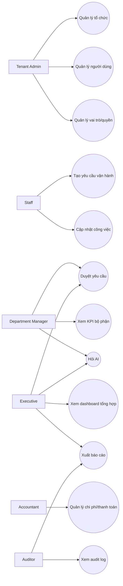
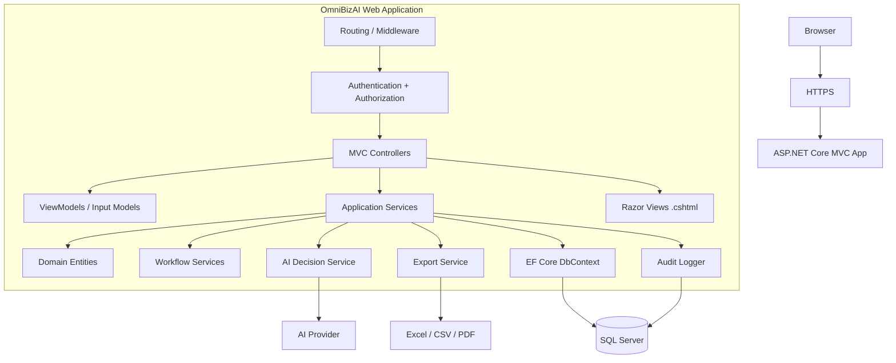
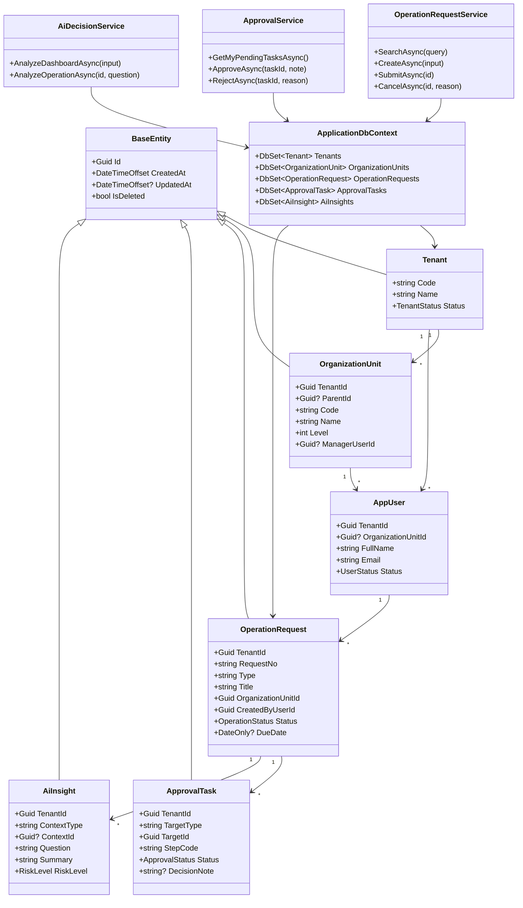
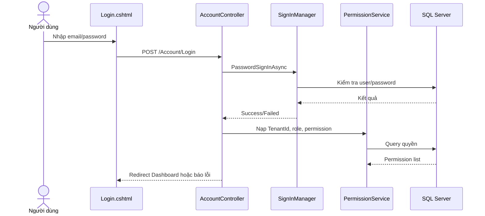
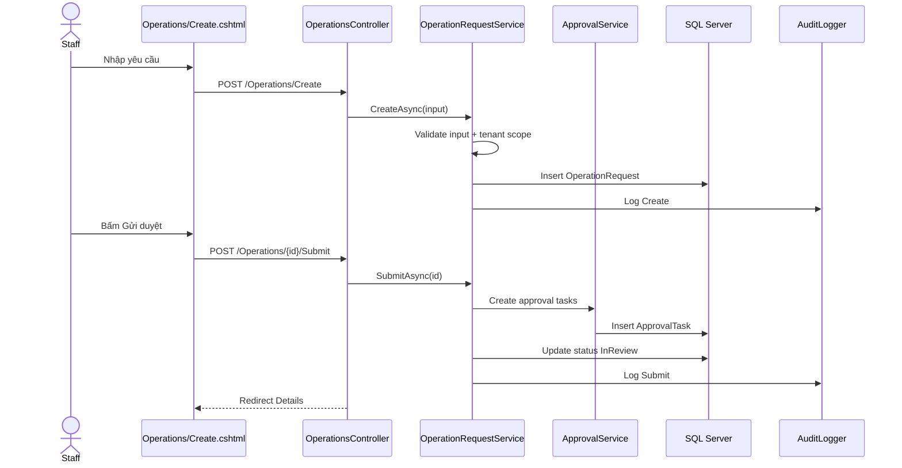
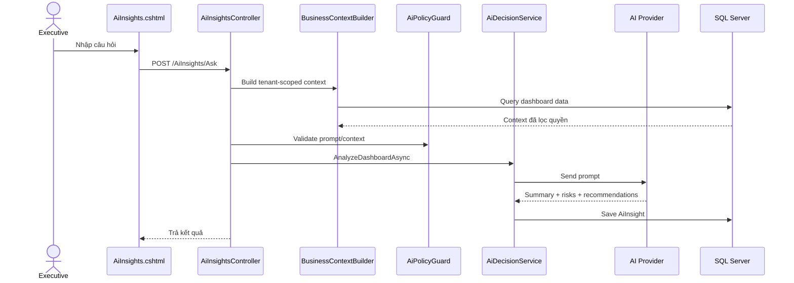
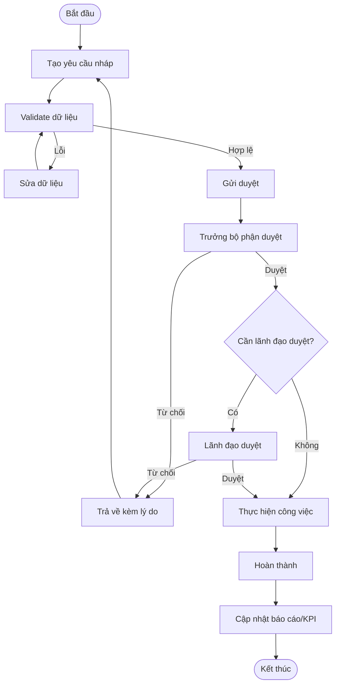
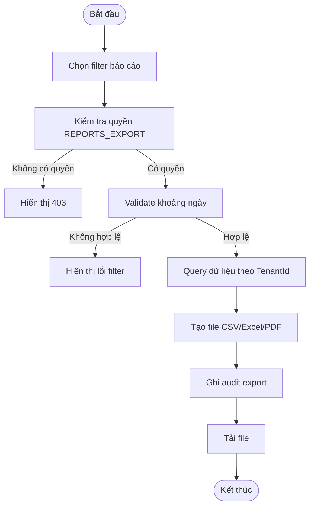
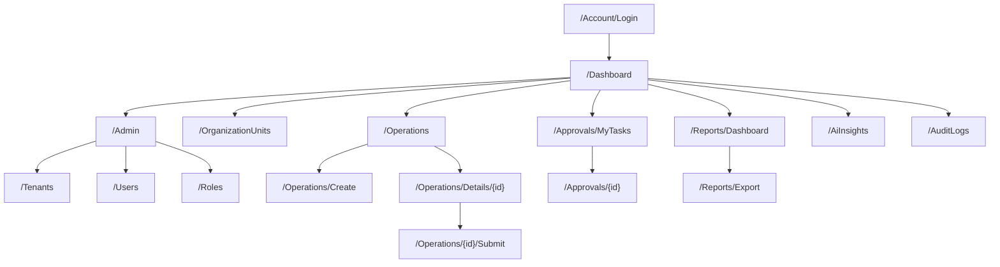
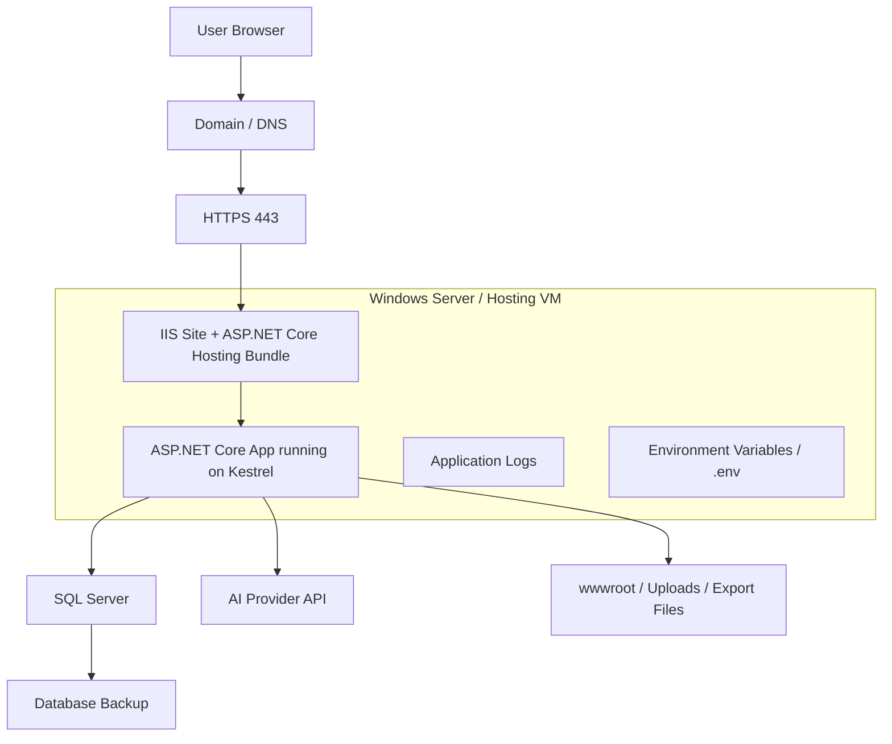

# OmniBizAI - Thiết kế hệ thống và catalog sơ đồ

> Tài liệu này gom các sơ đồ bắt buộc/nên có cho đồ án ASP.NET Core MVC .NET 10 + SQL Server.  
> Các sơ đồ dùng Mermaid để render trực tiếp trong Markdown. Khi cần nộp Word/PDF, có thể export từng sơ đồ thành PNG.

## 1. Catalog sơ đồ

| STT | Sơ đồ | Mục đích | Mức độ | Vị trí |
| --- | --- | --- | --- | --- |
| 1 | Use Case Diagram | Người dùng nào dùng chức năng nào | Bắt buộc | Mục 2 |
| 2 | Use Case Description | Chi tiết luồng chính/phụ/điều kiện | Bắt buộc | [04-Requirements-and-Use-Cases.md](./04-Requirements-and-Use-Cases.md) |
| 3 | ERD | Thiết kế thực thể, quan hệ nghiệp vụ | Bắt buộc | [06-Database-Design.md](./06-Database-Design.md) |
| 4 | Database Diagram | Sơ đồ bảng SQL Server thực tế | Bắt buộc | [06-Database-Design.md](./06-Database-Design.md) |
| 5 | Class Diagram | Model, Entity, ViewModel, Service | Nên có | Mục 4 |
| 6 | Sequence Diagram | Luồng xử lý chức năng quan trọng | Nên có | Mục 5 |
| 7 | Activity Diagram | Quy trình nghiệp vụ | Nên có | Mục 6 |
| 8 | Architecture Diagram | Browser -> Controller -> Service -> DbContext -> SQL Server | Bắt buộc | Mục 3 |
| 9 | Sitemap / Navigation Diagram | Trang và luồng điều hướng | Nên có | Mục 7 |
| 10 | Deployment Diagram | IIS/server, app, SQL Server, HTTPS | Nên có | Mục 8 |

## 2. Use Case Diagram



## 3. Architecture Diagram

ASP.NET Core MVC tách trách nhiệm thành Model, View và Controller. Trong dự án này, Controller nhận request, Service xử lý business logic, DbContext làm việc với SQL Server, View `.cshtml` hiển thị UI bằng Razor.



## 4. Class Diagram



## 5. Sequence Diagram

### 5.1. Đăng nhập



### 5.2. Tạo và gửi yêu cầu vận hành



### 5.3. AI phân tích dashboard



## 6. Activity Diagram

### 6.1. Quy trình duyệt yêu cầu



### 6.2. Quy trình export báo cáo



## 7. Sitemap / Navigation Diagram



## 8. Deployment Diagram



## 9. Source Code Structure

```text
Controllers/        MVC controllers, route/action handling
Data/               ApplicationDbContext, Code First configurations, migrations, seed
Models/             Code First entity, enum, validation models
Services/           Business logic, workflow, AI, export, audit
ViewModels/         Input/output models for Razor Views
Views/              .cshtml Razor pages grouped by controller
wwwroot/            Static files: CSS, JS, images, libraries
docs/               Project documents and diagrams
```

## 10. Controller/API Document mẫu

| Controller | Action | Method | Route | Input | Output |
| --- | --- | --- | --- | --- | --- |
| AccountController | Login | GET | `/Account/Login` | None | Login view |
| AccountController | Login | POST | `/Account/Login` | Email, Password | Redirect/Error |
| OperationsController | Index | GET | `/Operations` | Query filter | List view |
| OperationsController | Create | GET | `/Operations/Create` | None | Create view |
| OperationsController | Create | POST | `/Operations/Create` | OperationRequestCreateInput | Redirect/Error |
| OperationsController | Submit | POST | `/Operations/{id}/Submit` | Id | Redirect/Error |
| ApprovalsController | MyTasks | GET | `/Approvals/MyTasks` | None | Pending tasks view |
| ApprovalsController | Approve | POST | `/Approvals/{id}/Approve` | Note | Redirect/Error |
| AiInsightsController | Ask | POST | `/AiInsights/Ask` | Question, ContextType | JSON result |
| ReportsController | Export | GET/POST | `/Reports/Export` | Report filter | File |

## 11. Coding Convention

| Thành phần | Quy ước |
| --- | --- |
| Controller | Tên số nhiều theo module, hậu tố `Controller`, ví dụ `OperationsController` |
| Action | Động từ rõ nghĩa: `Index`, `Details`, `Create`, `Edit`, `Submit`, `Approve` |
| Entity | Danh từ số ít: `OperationRequest`, `ApprovalTask` |
| ViewModel | Hậu tố theo mục đích: `CreateInput`, `UpdateInput`, `ListItem`, `DetailsViewModel` |
| Service interface | Bắt đầu bằng `I`, ví dụ `IOperationRequestService` |
| Service implementation | Bỏ chữ `I`, ví dụ `OperationRequestService` |
| Permission | Viết hoa snake case: `OPERATIONS_EDIT`, `REPORTS_EXPORT` |
| Async method | Hậu tố `Async` và nhận `CancellationToken` ở service |
| Validation | Validate ở cả ViewModel attribute và service rule |

## 12. Ghi chú công nghệ ASP.NET Core MVC

- `Model`: đại diện dữ liệu/nghiệp vụ.
- `View`: file `.cshtml` dùng Razor để render HTML.
- `Controller`: nhận request, gọi service, trả View/Redirect/JSON.
- `DbContext`: làm việc với SQL Server qua EF Core Code First; `DbSet`, Fluent API mapping, migration snapshot là nguồn tạo schema.
- `Service`: xử lý business logic, validation nghiệp vụ, workflow, AI.
- `Repository`: chỉ dùng nếu dự án cần tách truy vấn phức tạp; nếu không, service có thể dùng `DbContext` trực tiếp nhưng vẫn phải tránh nhồi logic vào controller.

Tham khảo chính thức:

- Microsoft Learn: [Overview of ASP.NET Core MVC](https://learn.microsoft.com/en-us/aspnet/core/mvc/overview?view=aspnetcore-10.0)
- Microsoft Learn: [Host and deploy ASP.NET Core](https://learn.microsoft.com/en-us/aspnet/core/host-and-deploy/?view=aspnetcore-10.0)
