# 🗄️ OmniBiz AI — Database Design (ERD & Schema) — Part 1: Identity & Organization & Finance

> **Version**: 1.1 | **Updated**: 2026-04-25  
> **Database**: SQL Server 2022  
> **Naming**: PascalCase (tables), PascalCase (columns) | **Collation**: Vietnamese_CI_AS | **Timezone**: UTC (datetime2)

---

## 0. ERD Overview — Mermaid Diagram (Tổng quan)

```mermaid
erDiagram
    %% ===== IDENTITY =====
    users ||--o{ user_roles : has
    roles ||--o{ user_roles : has
    roles ||--o{ role_permissions : has
    permissions ||--o{ role_permissions : has
    users ||--o{ user_sessions : has
    users ||--o{ user_login_attempts : has
    users ||--o{ refresh_tokens : has

    %% ===== ORGANIZATION =====
    companies ||--o{ departments : has
    departments ||--o{ departments : parent
    departments ||--o{ employees : has
    positions ||--o{ employees : has
    employees ||--|| users : linked
    employees ||--o{ employee_history : has

    %% ===== FINANCE =====
    fiscal_periods ||--o{ budgets : has
    departments ||--o{ budgets : has
    budget_categories ||--o{ budgets : has
    budget_categories ||--o{ budget_categories : parent
    budgets ||--o{ budget_adjustments : has
    budgets ||--o{ budget_line_items : has

    employees ||--o{ payment_requests : creates
    departments ||--o{ payment_requests : belongs
    vendors ||--o{ payment_requests : from
    payment_requests ||--o{ payment_request_items : has
    payment_requests ||--o{ payment_request_attachments : has
    payment_requests ||--o{ payment_request_comments : has

    wallets ||--o{ transactions : has
    budget_categories ||--o{ transactions : categorized
    departments ||--o{ transactions : belongs
    payment_requests ||--o{ transactions : linked

    vendors ||--o{ vendor_contacts : has
    vendors ||--o{ vendor_bank_accounts : has
    vendors ||--o{ vendor_ratings : has

    %% ===== KPI/OKR =====
    evaluation_periods ||--o{ objectives : has
    objectives ||--o{ objectives : parent
    objectives ||--o{ key_results : has
    departments ||--o{ objectives : owns

    evaluation_periods ||--o{ kpis : has
    kpi_templates ||--o{ kpis : from
    departments ||--o{ kpis : assigned
    employees ||--o{ kpis : assigned
    kpis ||--o{ kpi_check_ins : has
    key_results ||--o{ kr_check_ins : has

    evaluation_periods ||--o{ performance_evaluations : has
    employees ||--o{ performance_evaluations : evaluated
    performance_evaluations ||--o{ evaluation_scores : has

    %% ===== WORKFLOW =====
    workflow_templates ||--o{ workflow_steps : has
    workflow_templates ||--o{ workflow_conditions : has
    workflow_templates ||--o{ workflow_instances : uses
    workflow_instances ||--o{ workflow_instance_steps : has
    workflow_instance_steps ||--o{ approval_actions : has

    %% ===== AI =====
    users ||--o{ ai_chat_sessions : has
    ai_chat_sessions ||--o{ ai_messages : has
    users ||--o{ ai_generation_history : has
    ai_risk_assessments }o--|| payment_requests : analyzes

    %% ===== NOTIFICATIONS =====
    users ||--o{ notifications : receives
    users ||--o{ notification_preferences : has

    %% ===== AUDIT =====
    users ||--o{ audit_logs : creates

    %% ===== FILES =====
    file_uploads }o--|| users : uploaded_by
```

---

## 1. IDENTITY MODULE (8 tables)

### 1.1 `Users`
| Column | Type | Constraints | Description |
|--------|------|-------------|-------------|
| Id | uniqueidentifier | PK, DEFAULT NEWID() | |
| Email | nvarchar(255) | UNIQUE, NOT NULL | Email đăng nhập |
| PasswordHash | nvarchar(500) | NOT NULL | Bcrypt hash |
| FullName | nvarchar(200) | NOT NULL | |
| Phone | nvarchar(20) | | |
| AvatarUrl | nvarchar(500) | | |
| IsActive | bit | DEFAULT 1 | |
| IsLocked | bit | DEFAULT 0 | Khóa sau login fail |
| LockedUntil | datetime2 | | Thời gian unlock |
| FailedLoginCount | int | DEFAULT 0 | Đếm login fail |
| LastLoginAt | datetime2 | | |
| EmailConfirmed | bit | DEFAULT 0 | |
| TwoFactorEnabled | bit | DEFAULT 0 | |
| CreatedAt | datetime2 | DEFAULT GETUTCDATE() | |
| UpdatedAt | datetime2 | | |
| IsDeleted | bit | DEFAULT 0 | |
| DeletedAt | datetime2 | | |

**Indexes**: `IX_Users_Email` (UNIQUE), `IX_Users_IsActive`

### 1.2 `Roles`
| Column | Type | Constraints | Description |
|--------|------|-------------|-------------|
| Id | uniqueidentifier | PK, DEFAULT NEWID() | |
| Name | nvarchar(50) | UNIQUE, NOT NULL | Admin, Director, Manager, Accountant, HR, Staff |
| DisplayName | nvarchar(100) | NOT NULL | Tên hiển thị tiếng Việt |
| Description | nvarchar(max) | | |
| Level | int | NOT NULL | Cấp bậc (1=Admin, 2=Director...) |
| IsSystem | bit | DEFAULT 0 | Role hệ thống, không xóa |
| CreatedAt | datetime2 | DEFAULT GETUTCDATE() | |

### 1.3 `Permissions`
| Column | Type | Constraints | Description |
|--------|------|-------------|-------------|
| Id | uniqueidentifier | PK, DEFAULT NEWID() | |
| Module | nvarchar(50) | NOT NULL | finance, kpi, workflow, hr, ai, report |
| Action | nvarchar(50) | NOT NULL | create, read, update, delete, approve, export |
| Resource | nvarchar(100) | NOT NULL | budget, payment_request, kpi, etc. |
| Description | nvarchar(max) | | |

**Indexes**: `IX_Permissions_Module_Action_Resource` (UNIQUE)

### 1.4 `UserRoles`
| Column | Type | Constraints |
|--------|------|-------------|
| UserId | uniqueidentifier | PK, FK→Users |
| RoleId | uniqueidentifier | PK, FK→Roles |
| AssignedAt | datetime2 | DEFAULT GETUTCDATE() |
| AssignedBy | uniqueidentifier | FK→Users |

### 1.5 `RolePermissions`
| Column | Type | Constraints |
|--------|------|-------------|
| RoleId | uniqueidentifier | PK, FK→Roles |
| PermissionId | uniqueidentifier | PK, FK→Permissions |

### 1.6 `RefreshTokens`
| Column | Type | Constraints |
|--------|------|-------------|
| Id | uniqueidentifier | PK, DEFAULT NEWID() |
| UserId | uniqueidentifier | FK→Users, NOT NULL |
| Token | nvarchar(500) | UNIQUE, NOT NULL |
| ExpiresAt | datetime2 | NOT NULL |
| CreatedAt | datetime2 | DEFAULT GETUTCDATE() |
| RevokedAt | datetime2 | |
| ReplacedByToken | nvarchar(500) | |
| CreatedByIp | nvarchar(45) | |

### 1.7 `UserSessions`
| Column | Type | Constraints |
|--------|------|-------------|
| Id | uniqueidentifier | PK, DEFAULT NEWID() |
| UserId | uniqueidentifier | FK→Users |
| IpAddress | nvarchar(45) | |
| UserAgent | nvarchar(500) | |
| StartedAt | datetime2 | DEFAULT GETUTCDATE() |
| EndedAt | datetime2 | |
| IsActive | bit | DEFAULT 1 |

### 1.8 `UserLoginAttempts`
| Column | Type | Constraints |
|--------|------|-------------|
| Id | bigint | PK, IDENTITY(1,1) |
| Email | nvarchar(255) | NOT NULL |
| IpAddress | nvarchar(45) | |
| IsSuccessful | bit | NOT NULL |
| FailureReason | nvarchar(200) | |
| AttemptedAt | datetime2 | DEFAULT GETUTCDATE() |

---

## 2. ORGANIZATION MODULE (6 tables)

### 2.1 `companies`
| Column | Type | Constraints | Description |
|--------|------|-------------|-------------|
| id | uniqueidentifier | PK | |
| name | nvarchar(200) | NOT NULL | Tên công ty |
| short_name | nvarchar(50) | | |
| tax_code | nvarchar(20) | UNIQUE | Mã số thuế |
| address | nvarchar(max) | | |
| phone | nvarchar(20) | | |
| email | nvarchar(255) | | |
| website | nvarchar(255) | | |
| logo_url | nvarchar(500) | | |
| founded_date | date | | |
| industry | nvarchar(100) | | |
| employee_count_range | nvarchar(20) | | 1-10, 11-50, 51-200, 200+ |
| fiscal_year_start_month | int | DEFAULT 1 | Tháng bắt đầu năm tài chính |
| default_currency | nvarchar(3) | DEFAULT 'VND' | |
| settings | nvarchar(max) | DEFAULT '{}' | Company-wide settings |
| created_at | datetime2 | DEFAULT GETUTCDATE() | |
| updated_at | datetime2 | | |

### 2.2 `departments`
| Column | Type | Constraints | Description |
|--------|------|-------------|-------------|
| id | uniqueidentifier | PK | |
| company_id | uniqueidentifier | FK→Companies, NOT NULL | |
| parent_department_id | uniqueidentifier | FK→Departments | Phòng ban cha (tree) |
| name | nvarchar(200) | NOT NULL | |
| code | nvarchar(20) | UNIQUE | VD: DEPT-MKT |
| description | nvarchar(max) | | |
| manager_id | uniqueidentifier | FK→Employees | Trưởng phòng |
| budget_limit | decimal(18,2) | DEFAULT 0 | Budget mặc định |
| level | int | DEFAULT 1 | Cấp trong org chart |
| sort_order | int | DEFAULT 0 | Thứ tự hiển thị |
| is_active | bit | DEFAULT 1 | |
| created_at | datetime2 | DEFAULT GETUTCDATE() | |
| updated_at | datetime2 | | |
| is_deleted | bit | DEFAULT 0 | |

**Indexes**: `IX_departments_company_id`, `IX_departments_parent_id`, `IX_departments_code` (UNIQUE)

### 2.3 `positions`
| Column | Type | Constraints |
|--------|------|-------------|
| id | uniqueidentifier | PK |
| company_id | uniqueidentifier | FK→Companies |
| name | nvarchar(200) | NOT NULL |
| level | int | NOT NULL | Cấp bậc cho workflow |
| department_id | uniqueidentifier | FK→Departments |
| description | nvarchar(max) | |
| is_active | bit | DEFAULT 1 |
| created_at | datetime2 | DEFAULT GETUTCDATE() |

### 2.4 `employees`
| Column | Type | Constraints | Description |
|--------|------|-------------|-------------|
| id | uniqueidentifier | PK | |
| user_id | uniqueidentifier | FK→Users, UNIQUE | Link tới user account |
| company_id | uniqueidentifier | FK→Companies, NOT NULL | |
| department_id | uniqueidentifier | FK→Departments | |
| position_id | uniqueidentifier | FK→Positions | |
| manager_id | uniqueidentifier | FK→Employees | Quản lý trực tiếp |
| employee_code | nvarchar(20) | UNIQUE, NOT NULL | EMP-001 |
| full_name | nvarchar(200) | NOT NULL | |
| email | nvarchar(255) | NOT NULL | |
| phone | nvarchar(20) | | |
| date_of_birth | date | | |
| gender | nvarchar(10) | | Male/Female/Other |
| address | nvarchar(max) | | |
| join_date | date | NOT NULL | Ngày vào công ty |
| leave_date | date | | Ngày nghỉ việc |
| employment_type | nvarchar(20) | DEFAULT 'FullTime' | FullTime/PartTime/Contract |
| status | nvarchar(20) | DEFAULT 'Active' | Active/OnLeave/Resigned/Terminated |
| avatar_url | nvarchar(500) | | |
| bank_account | nvarchar(30) | | |
| bank_name | nvarchar(100) | | |
| tax_code | nvarchar(20) | | MST cá nhân |
| emergency_contact | nvarchar(max) | | {name, phone, relationship} |
| created_at | datetime2 | DEFAULT GETUTCDATE() | |
| updated_at | datetime2 | | |
| is_deleted | bit | DEFAULT 0 | |

**Indexes**: `IX_employees_user_id` (UNIQUE), `IX_employees_department_id`, `IX_employees_employee_code` (UNIQUE), `IX_employees_status`

### 2.5 `employee_history`
| Column | Type | Constraints | Description |
|--------|------|-------------|-------------|
| id | uniqueidentifier | PK | |
| employee_id | uniqueidentifier | FK→Employees | |
| change_type | nvarchar(50) | NOT NULL | Department/Position/Manager/Status |
| old_value | nvarchar(max) | | |
| new_value | nvarchar(max) | | |
| effective_date | date | NOT NULL | |
| reason | nvarchar(max) | | |
| changed_by | uniqueidentifier | FK→Users | |
| created_at | datetime2 | DEFAULT GETUTCDATE() | |

### 2.6 `department_budget_allocation`
| Column | Type | Constraints |
|--------|------|-------------|
| id | uniqueidentifier | PK |
| department_id | uniqueidentifier | FK→Departments |
| fiscal_year | int | NOT NULL |
| fiscal_quarter | int | |
| allocated_amount | decimal(18,2) | NOT NULL |
| approved_by | uniqueidentifier | FK→Users |
| approved_at | datetime2 | |
| notes | nvarchar(max) | |
| created_at | datetime2 | DEFAULT GETUTCDATE() |

---

## 3. FINANCE MODULE (16 tables)

### 3.1 `fiscal_periods`
| Column | Type | Constraints |
|--------|------|-------------|
| id | uniqueidentifier | PK |
| company_id | uniqueidentifier | FK→Companies |
| name | nvarchar(100) | NOT NULL |
| type | nvarchar(20) | NOT NULL | Monthly/Quarterly/Yearly |
| start_date | date | NOT NULL |
| end_date | date | NOT NULL |
| status | nvarchar(20) | DEFAULT 'Open' | Open/Closed/Locked |
| closed_by | uniqueidentifier | FK→Users |
| closed_at | datetime2 | |
| created_at | datetime2 | DEFAULT GETUTCDATE() |

### 3.2 `budget_categories`
| Column | Type | Constraints | Description |
|--------|------|-------------|-------------|
| id | uniqueidentifier | PK | |
| company_id | uniqueidentifier | FK→Companies | |
| parent_id | uniqueidentifier | FK→BudgetCategories | Tree structure |
| name | nvarchar(200) | NOT NULL | |
| code | nvarchar(20) | UNIQUE | CAT-MKT-DIG |
| type | nvarchar(20) | NOT NULL | Income/Expense |
| description | nvarchar(max) | | |
| icon | nvarchar(50) | | Icon name |
| color | nvarchar(7) | | Hex color |
| sort_order | int | DEFAULT 0 | |
| is_active | bit | DEFAULT 1 | |
| created_at | datetime2 | DEFAULT GETUTCDATE() | |

### 3.3 `budgets`
| Column | Type | Constraints | Description |
|--------|------|-------------|-------------|
| id | uniqueidentifier | PK | |
| company_id | uniqueidentifier | FK→Companies | |
| fiscal_period_id | uniqueidentifier | FK→FiscalPeriods | |
| department_id | uniqueidentifier | FK→Departments | |
| category_id | uniqueidentifier | FK→BudgetCategories | |
| name | nvarchar(200) | NOT NULL | |
| allocated_amount | decimal(18,2) | NOT NULL | Ngân sách phân bổ |
| spent_amount | decimal(18,2) | DEFAULT 0 | Đã chi (auto-calc) |
| committed_amount | decimal(18,2) | DEFAULT 0 | Đang chờ duyệt |
| remaining_amount | decimal(18,2) | GENERATED | allocated - spent - committed |
| utilization_pct | decimal(5,2) | GENERATED | (spent/allocated)*100 |
| warning_threshold | decimal(5,2) | DEFAULT 80.00 | % cảnh báo |
| status | nvarchar(20) | DEFAULT 'Active' | Active/Frozen/Closed |
| notes | nvarchar(max) | | |
| created_by | uniqueidentifier | FK→Users | |
| approved_by | uniqueidentifier | FK→Users | |
| created_at | datetime2 | DEFAULT GETUTCDATE() | |
| updated_at | datetime2 | | |

**Indexes**: `IX_budgets_dept_period`, `IX_budgets_category`, `IX_budgets_status`

### 3.4 `budget_adjustments`
| Column | Type | Constraints |
|--------|------|-------------|
| id | uniqueidentifier | PK |
| budget_id | uniqueidentifier | FK→Budgets |
| adjustment_type | nvarchar(20) | NOT NULL | Increase/Decrease/Transfer |
| amount | decimal(18,2) | NOT NULL |
| previous_amount | decimal(18,2) | NOT NULL |
| new_amount | decimal(18,2) | NOT NULL |
| reason | nvarchar(max) | NOT NULL |
| transfer_to_budget_id | uniqueidentifier | FK→Budgets |
| requested_by | uniqueidentifier | FK→Users |
| approved_by | uniqueidentifier | FK→Users |
| status | nvarchar(20) | DEFAULT 'Pending' |
| created_at | datetime2 | DEFAULT GETUTCDATE() |

### 3.5 `budget_line_items`
| Column | Type | Constraints |
|--------|------|-------------|
| id | uniqueidentifier | PK |
| budget_id | uniqueidentifier | FK→Budgets |
| description | nvarchar(500) | NOT NULL |
| planned_amount | decimal(18,2) | NOT NULL |
| actual_amount | decimal(18,2) | DEFAULT 0 |
| notes | nvarchar(max) | |
| sort_order | int | DEFAULT 0 |

### 3.6 `vendors`
| Column | Type | Constraints |
|--------|------|-------------|
| id | uniqueidentifier | PK |
| company_id | uniqueidentifier | FK→Companies |
| name | nvarchar(300) | NOT NULL |
| short_name | nvarchar(100) | |
| tax_code | nvarchar(20) | |
| vendor_type | nvarchar(50) | | Supplier/Contractor/Service |
| industry | nvarchar(100) | |
| address | nvarchar(max) | |
| city | nvarchar(100) | |
| country | nvarchar(50) | DEFAULT 'Vietnam' |
| website | nvarchar(255) | |
| notes | nvarchar(max) | |
| rating | decimal(3,2) | | 0.00-5.00 |
| total_transactions | int | DEFAULT 0 |
| total_amount | decimal(18,2) | DEFAULT 0 |
| status | nvarchar(20) | DEFAULT 'Active' |
| created_at | datetime2 | DEFAULT GETUTCDATE() |
| updated_at | datetime2 | |
| is_deleted | bit | DEFAULT 0 |

### 3.7 `vendor_contacts`
| Column | Type | Constraints |
|--------|------|-------------|
| id | uniqueidentifier | PK |
| vendor_id | uniqueidentifier | FK→Vendors |
| contact_name | nvarchar(200) | NOT NULL |
| position | nvarchar(100) | |
| phone | nvarchar(20) | |
| email | nvarchar(255) | |
| is_primary | bit | DEFAULT 0 |

### 3.8 `vendor_bank_accounts`
| Column | Type | Constraints |
|--------|------|-------------|
| id | uniqueidentifier | PK |
| vendor_id | uniqueidentifier | FK→Vendors |
| bank_name | nvarchar(200) | NOT NULL |
| account_number | nvarchar(30) | NOT NULL |
| account_holder | nvarchar(200) | |
| branch | nvarchar(200) | |
| swift_code | nvarchar(20) | |
| is_default | bit | DEFAULT 0 |

### 3.9 `vendor_ratings`
| Column | Type | Constraints |
|--------|------|-------------|
| id | uniqueidentifier | PK |
| vendor_id | uniqueidentifier | FK→Vendors |
| rated_by | uniqueidentifier | FK→Users |
| score | decimal(3,2) | NOT NULL | 0.00-5.00 |
| criteria | nvarchar(50) | | Quality/Price/Delivery/Service |
| comment | nvarchar(max) | |
| created_at | datetime2 | DEFAULT GETUTCDATE() |

### 3.10 `payment_requests`
| Column | Type | Constraints | Description |
|--------|------|-------------|-------------|
| id | uniqueidentifier | PK | |
| company_id | uniqueidentifier | FK→Companies | |
| request_number | nvarchar(20) | UNIQUE, NOT NULL | PR-2026-0001 |
| title | nvarchar(300) | NOT NULL | |
| description | nvarchar(max) | | |
| department_id | uniqueidentifier | FK→Departments | |
| requester_id | uniqueidentifier | FK→Employees, NOT NULL | Người tạo |
| vendor_id | uniqueidentifier | FK→Vendors | |
| budget_id | uniqueidentifier | FK→Budgets | |
| category_id | uniqueidentifier | FK→BudgetCategories | |
| total_amount | decimal(18,2) | NOT NULL | |
| currency | nvarchar(3) | DEFAULT 'VND' | |
| payment_method | nvarchar(30) | | Cash/BankTransfer/Card |
| payment_due_date | date | | |
| priority | nvarchar(20) | DEFAULT 'Normal' | Low/Normal/High/Urgent |
| status | nvarchar(20) | DEFAULT 'Draft' | Draft/Submitted/PendingApproval/Approved/Rejected/Paid/Cancelled |
| ai_risk_score | decimal(5,2) | | 0-100 |
| ai_risk_flags | nvarchar(max) | | AI risk analysis results |
| submitted_at | datetime2 | | |
| approved_at | datetime2 | | |
| paid_at | datetime2 | | |
| rejected_at | datetime2 | | |
| rejection_reason | nvarchar(max) | | |
| notes | nvarchar(max) | | |
| created_at | datetime2 | DEFAULT GETUTCDATE() | |
| updated_at | datetime2 | | |
| is_deleted | bit | DEFAULT 0 | |

**Indexes**: `IX_pr_request_number` (UNIQUE), `IX_pr_department`, `IX_pr_requester`, `IX_pr_status`, `IX_pr_created_at`

### 3.11 `payment_request_items`
| Column | Type | Constraints |
|--------|------|-------------|
| id | uniqueidentifier | PK |
| payment_request_id | uniqueidentifier | FK→PaymentRequests |
| description | nvarchar(500) | NOT NULL |
| quantity | decimal(10,2) | NOT NULL |
| unit | nvarchar(20) | | Item/Hour/Set/Lot |
| unit_price | decimal(18,2) | NOT NULL |
| total_price | decimal(18,2) | NOT NULL |
| tax_rate | decimal(5,2) | DEFAULT 0 |
| tax_amount | decimal(18,2) | DEFAULT 0 |
| notes | nvarchar(max) | |
| sort_order | int | DEFAULT 0 |

### 3.12 `payment_request_attachments`
| Column | Type | Constraints |
|--------|------|-------------|
| id | uniqueidentifier | PK |
| payment_request_id | uniqueidentifier | FK→PaymentRequests |
| file_name | nvarchar(300) | NOT NULL |
| file_path | nvarchar(500) | NOT NULL |
| file_size | bigint | NOT NULL |
| content_type | nvarchar(100) | NOT NULL |
| uploaded_by | uniqueidentifier | FK→Users |
| uploaded_at | datetime2 | DEFAULT GETUTCDATE() |

### 3.13 `payment_request_comments`
| Column | Type | Constraints |
|--------|------|-------------|
| id | uniqueidentifier | PK |
| payment_request_id | uniqueidentifier | FK→PaymentRequests |
| user_id | uniqueidentifier | FK→Users |
| comment | nvarchar(max) | NOT NULL |
| comment_type | nvarchar(20) | DEFAULT 'Comment' | Comment/Approval/Rejection |
| created_at | datetime2 | DEFAULT GETUTCDATE() |
| updated_at | datetime2 | |

### 3.14 `wallets`
| Column | Type | Constraints |
|--------|------|-------------|
| id | uniqueidentifier | PK |
| company_id | uniqueidentifier | FK→Companies |
| name | nvarchar(200) | NOT NULL |
| type | nvarchar(20) | NOT NULL | Cash/BankAccount/EWallet/CreditCard |
| balance | decimal(18,2) | DEFAULT 0 |
| currency | nvarchar(3) | DEFAULT 'VND' |
| bank_name | nvarchar(200) | |
| account_number | nvarchar(30) | |
| account_holder | nvarchar(200) | |
| description | nvarchar(max) | |
| is_active | bit | DEFAULT 1 |
| created_at | datetime2 | DEFAULT GETUTCDATE() |
| updated_at | datetime2 | |

### 3.15 `transactions`
| Column | Type | Constraints | Description |
|--------|------|-------------|-------------|
| id | uniqueidentifier | PK | |
| company_id | uniqueidentifier | FK→Companies | |
| transaction_number | nvarchar(20) | UNIQUE | TXN-2026-0001 |
| type | nvarchar(20) | NOT NULL | Income/Expense |
| amount | decimal(18,2) | NOT NULL | |
| currency | nvarchar(3) | DEFAULT 'VND' | |
| wallet_id | uniqueidentifier | FK→Wallets | |
| department_id | uniqueidentifier | FK→Departments | |
| category_id | uniqueidentifier | FK→BudgetCategories | |
| budget_id | uniqueidentifier | FK→Budgets | |
| payment_request_id | uniqueidentifier | FK→PaymentRequests | Linked PR |
| vendor_id | uniqueidentifier | FK→Vendors | |
| transaction_date | date | NOT NULL | |
| reference_number | nvarchar(100) | | Số tham chiếu |
| description | nvarchar(max) | | |
| payment_method | nvarchar(30) | | |
| status | nvarchar(20) | DEFAULT 'Completed' | Pending/Completed/Cancelled/Reversed |
| reconciled | bit | DEFAULT 0 | |
| reconciled_at | datetime2 | | |
| recorded_by | uniqueidentifier | FK→Users | |
| created_at | datetime2 | DEFAULT GETUTCDATE() | |
| updated_at | datetime2 | | |
| is_deleted | bit | DEFAULT 0 | |

**Indexes**: `IX_txn_number` (UNIQUE), `IX_txn_date`, `IX_txn_department`, `IX_txn_category`, `IX_txn_type_date`

### 3.16 `transaction_tags`
| Column | Type | Constraints |
|--------|------|-------------|
| transaction_id | uniqueidentifier | PK, FK→transactions |
| tag | nvarchar(50) | PK |
