# 🗄️ OmniBiz AI — Database Design (ERD & Schema) — Part 1: Identity & Organization & Finance

> **Version**: 1.0 | **Updated**: 2026-04-24  
> **Database**: PostgreSQL 16 + pgvector  
> **Naming**: snake_case | **Charset**: UTF-8 | **Timezone**: UTC

---

## 0. ERD Overview — Mermaid Diagram (Tổng quan)

```mermaid
erDiagram
    %% ===== IDENTITY =====
    users ||--o{ user_roles : has
    roles ||--o{ user_roles : has
    roles ||--o{ role_permissions : has
    permissions ||--o{ role_permissions : has
    users ||--o{ user_sessions : has
    users ||--o{ user_login_attempts : has
    users ||--o{ refresh_tokens : has

    %% ===== ORGANIZATION =====
    companies ||--o{ departments : has
    departments ||--o{ departments : parent
    departments ||--o{ employees : has
    positions ||--o{ employees : has
    employees ||--|| users : linked
    employees ||--o{ employee_history : has

    %% ===== FINANCE =====
    fiscal_periods ||--o{ budgets : has
    departments ||--o{ budgets : has
    budget_categories ||--o{ budgets : has
    budget_categories ||--o{ budget_categories : parent
    budgets ||--o{ budget_adjustments : has
    budgets ||--o{ budget_line_items : has

    employees ||--o{ payment_requests : creates
    departments ||--o{ payment_requests : belongs
    vendors ||--o{ payment_requests : from
    payment_requests ||--o{ payment_request_items : has
    payment_requests ||--o{ payment_request_attachments : has
    payment_requests ||--o{ payment_request_comments : has

    wallets ||--o{ transactions : has
    budget_categories ||--o{ transactions : categorized
    departments ||--o{ transactions : belongs
    payment_requests ||--o{ transactions : linked

    vendors ||--o{ vendor_contacts : has
    vendors ||--o{ vendor_bank_accounts : has
    vendors ||--o{ vendor_ratings : has

    %% ===== KPI/OKR =====
    evaluation_periods ||--o{ objectives : has
    objectives ||--o{ objectives : parent
    objectives ||--o{ key_results : has
    departments ||--o{ objectives : owns

    evaluation_periods ||--o{ kpis : has
    kpi_templates ||--o{ kpis : from
    departments ||--o{ kpis : assigned
    employees ||--o{ kpis : assigned
    kpis ||--o{ kpi_check_ins : has
    key_results ||--o{ kr_check_ins : has

    evaluation_periods ||--o{ performance_evaluations : has
    employees ||--o{ performance_evaluations : evaluated
    performance_evaluations ||--o{ evaluation_scores : has

    %% ===== WORKFLOW =====
    workflow_templates ||--o{ workflow_steps : has
    workflow_templates ||--o{ workflow_conditions : has
    workflow_templates ||--o{ workflow_instances : uses
    workflow_instances ||--o{ workflow_instance_steps : has
    workflow_instance_steps ||--o{ approval_actions : has

    %% ===== AI =====
    users ||--o{ ai_chat_sessions : has
    ai_chat_sessions ||--o{ ai_messages : has
    users ||--o{ ai_generation_history : has
    ai_risk_assessments }o--|| payment_requests : analyzes

    %% ===== NOTIFICATIONS =====
    users ||--o{ notifications : receives
    users ||--o{ notification_preferences : has

    %% ===== AUDIT =====
    users ||--o{ audit_logs : creates

    %% ===== FILES =====
    file_uploads }o--|| users : uploaded_by
```

---

## 1. IDENTITY MODULE (8 tables)

### 1.1 `users`
| Column | Type | Constraints | Description |
|--------|------|-------------|-------------|
| id | uuid | PK, DEFAULT gen_random_uuid() | |
| email | varchar(255) | UNIQUE, NOT NULL | Email đăng nhập |
| password_hash | varchar(500) | NOT NULL | Bcrypt hash |
| full_name | varchar(200) | NOT NULL | |
| phone | varchar(20) | | |
| avatar_url | varchar(500) | | |
| is_active | boolean | DEFAULT true | |
| is_locked | boolean | DEFAULT false | Khóa sau login fail |
| locked_until | timestamptz | | Thời gian unlock |
| failed_login_count | int | DEFAULT 0 | Đếm login fail |
| last_login_at | timestamptz | | |
| email_confirmed | boolean | DEFAULT false | |
| two_factor_enabled | boolean | DEFAULT false | |
| created_at | timestamptz | DEFAULT NOW() | |
| updated_at | timestamptz | | |
| is_deleted | boolean | DEFAULT false | |
| deleted_at | timestamptz | | |

**Indexes**: `IX_users_email` (UNIQUE), `IX_users_is_active`

### 1.2 `roles`
| Column | Type | Constraints | Description |
|--------|------|-------------|-------------|
| id | uuid | PK | |
| name | varchar(50) | UNIQUE, NOT NULL | Admin, Director, Manager, Accountant, HR, Staff |
| display_name | varchar(100) | NOT NULL | Tên hiển thị tiếng Việt |
| description | text | | |
| level | int | NOT NULL | Cấp bậc (1=Admin, 2=Director...) |
| is_system | boolean | DEFAULT false | Role hệ thống, không xóa |
| created_at | timestamptz | DEFAULT NOW() | |

### 1.3 `permissions`
| Column | Type | Constraints | Description |
|--------|------|-------------|-------------|
| id | uuid | PK | |
| module | varchar(50) | NOT NULL | finance, kpi, workflow, hr, ai, report |
| action | varchar(50) | NOT NULL | create, read, update, delete, approve, export |
| resource | varchar(100) | NOT NULL | budget, payment_request, kpi, etc. |
| description | text | | |

**Indexes**: `IX_permissions_module_action_resource` (UNIQUE)

### 1.4 `user_roles`
| Column | Type | Constraints |
|--------|------|-------------|
| user_id | uuid | PK, FK→users |
| role_id | uuid | PK, FK→roles |
| assigned_at | timestamptz | DEFAULT NOW() |
| assigned_by | uuid | FK→users |

### 1.5 `role_permissions`
| Column | Type | Constraints |
|--------|------|-------------|
| role_id | uuid | PK, FK→roles |
| permission_id | uuid | PK, FK→permissions |

### 1.6 `refresh_tokens`
| Column | Type | Constraints |
|--------|------|-------------|
| id | uuid | PK |
| user_id | uuid | FK→users, NOT NULL |
| token | varchar(500) | UNIQUE, NOT NULL |
| expires_at | timestamptz | NOT NULL |
| created_at | timestamptz | DEFAULT NOW() |
| revoked_at | timestamptz | |
| replaced_by_token | varchar(500) | |
| created_by_ip | varchar(45) | |

### 1.7 `user_sessions`
| Column | Type | Constraints |
|--------|------|-------------|
| id | uuid | PK |
| user_id | uuid | FK→users |
| ip_address | varchar(45) | |
| user_agent | varchar(500) | |
| started_at | timestamptz | DEFAULT NOW() |
| ended_at | timestamptz | |
| is_active | boolean | DEFAULT true |

### 1.8 `user_login_attempts`
| Column | Type | Constraints |
|--------|------|-------------|
| id | bigint | PK, GENERATED ALWAYS AS IDENTITY |
| email | varchar(255) | NOT NULL |
| ip_address | varchar(45) | |
| is_successful | boolean | NOT NULL |
| failure_reason | varchar(200) | |
| attempted_at | timestamptz | DEFAULT NOW() |

---

## 2. ORGANIZATION MODULE (6 tables)

### 2.1 `companies`
| Column | Type | Constraints | Description |
|--------|------|-------------|-------------|
| id | uuid | PK | |
| name | varchar(200) | NOT NULL | Tên công ty |
| short_name | varchar(50) | | |
| tax_code | varchar(20) | UNIQUE | Mã số thuế |
| address | text | | |
| phone | varchar(20) | | |
| email | varchar(255) | | |
| website | varchar(255) | | |
| logo_url | varchar(500) | | |
| founded_date | date | | |
| industry | varchar(100) | | |
| employee_count_range | varchar(20) | | 1-10, 11-50, 51-200, 200+ |
| fiscal_year_start_month | int | DEFAULT 1 | Tháng bắt đầu năm tài chính |
| default_currency | varchar(3) | DEFAULT 'VND' | |
| settings | jsonb | DEFAULT '{}' | Company-wide settings |
| created_at | timestamptz | DEFAULT NOW() | |
| updated_at | timestamptz | | |

### 2.2 `departments`
| Column | Type | Constraints | Description |
|--------|------|-------------|-------------|
| id | uuid | PK | |
| company_id | uuid | FK→companies, NOT NULL | |
| parent_department_id | uuid | FK→departments | Phòng ban cha (tree) |
| name | varchar(200) | NOT NULL | |
| code | varchar(20) | UNIQUE | VD: DEPT-MKT |
| description | text | | |
| manager_id | uuid | FK→employees | Trưởng phòng |
| budget_limit | decimal(18,2) | DEFAULT 0 | Budget mặc định |
| level | int | DEFAULT 1 | Cấp trong org chart |
| sort_order | int | DEFAULT 0 | Thứ tự hiển thị |
| is_active | boolean | DEFAULT true | |
| created_at | timestamptz | DEFAULT NOW() | |
| updated_at | timestamptz | | |
| is_deleted | boolean | DEFAULT false | |

**Indexes**: `IX_departments_company_id`, `IX_departments_parent_id`, `IX_departments_code` (UNIQUE)

### 2.3 `positions`
| Column | Type | Constraints |
|--------|------|-------------|
| id | uuid | PK |
| company_id | uuid | FK→companies |
| name | varchar(200) | NOT NULL |
| level | int | NOT NULL | Cấp bậc cho workflow |
| department_id | uuid | FK→departments |
| description | text | |
| is_active | boolean | DEFAULT true |
| created_at | timestamptz | DEFAULT NOW() |

### 2.4 `employees`
| Column | Type | Constraints | Description |
|--------|------|-------------|-------------|
| id | uuid | PK | |
| user_id | uuid | FK→users, UNIQUE | Link tới user account |
| company_id | uuid | FK→companies, NOT NULL | |
| department_id | uuid | FK→departments | |
| position_id | uuid | FK→positions | |
| manager_id | uuid | FK→employees | Quản lý trực tiếp |
| employee_code | varchar(20) | UNIQUE, NOT NULL | EMP-001 |
| full_name | varchar(200) | NOT NULL | |
| email | varchar(255) | NOT NULL | |
| phone | varchar(20) | | |
| date_of_birth | date | | |
| gender | varchar(10) | | Male/Female/Other |
| address | text | | |
| join_date | date | NOT NULL | Ngày vào công ty |
| leave_date | date | | Ngày nghỉ việc |
| employment_type | varchar(20) | DEFAULT 'FullTime' | FullTime/PartTime/Contract |
| status | varchar(20) | DEFAULT 'Active' | Active/OnLeave/Resigned/Terminated |
| avatar_url | varchar(500) | | |
| bank_account | varchar(30) | | |
| bank_name | varchar(100) | | |
| tax_code | varchar(20) | | MST cá nhân |
| emergency_contact | jsonb | | {name, phone, relationship} |
| created_at | timestamptz | DEFAULT NOW() | |
| updated_at | timestamptz | | |
| is_deleted | boolean | DEFAULT false | |

**Indexes**: `IX_employees_user_id` (UNIQUE), `IX_employees_department_id`, `IX_employees_employee_code` (UNIQUE), `IX_employees_status`

### 2.5 `employee_history`
| Column | Type | Constraints | Description |
|--------|------|-------------|-------------|
| id | uuid | PK | |
| employee_id | uuid | FK→employees | |
| change_type | varchar(50) | NOT NULL | Department/Position/Manager/Status |
| old_value | jsonb | | |
| new_value | jsonb | | |
| effective_date | date | NOT NULL | |
| reason | text | | |
| changed_by | uuid | FK→users | |
| created_at | timestamptz | DEFAULT NOW() | |

### 2.6 `department_budget_allocation`
| Column | Type | Constraints |
|--------|------|-------------|
| id | uuid | PK |
| department_id | uuid | FK→departments |
| fiscal_year | int | NOT NULL |
| fiscal_quarter | int | |
| allocated_amount | decimal(18,2) | NOT NULL |
| approved_by | uuid | FK→users |
| approved_at | timestamptz | |
| notes | text | |
| created_at | timestamptz | DEFAULT NOW() |

---

## 3. FINANCE MODULE (16 tables)

### 3.1 `fiscal_periods`
| Column | Type | Constraints |
|--------|------|-------------|
| id | uuid | PK |
| company_id | uuid | FK→companies |
| name | varchar(100) | NOT NULL |
| type | varchar(20) | NOT NULL | Monthly/Quarterly/Yearly |
| start_date | date | NOT NULL |
| end_date | date | NOT NULL |
| status | varchar(20) | DEFAULT 'Open' | Open/Closed/Locked |
| closed_by | uuid | FK→users |
| closed_at | timestamptz | |
| created_at | timestamptz | DEFAULT NOW() |

### 3.2 `budget_categories`
| Column | Type | Constraints | Description |
|--------|------|-------------|-------------|
| id | uuid | PK | |
| company_id | uuid | FK→companies | |
| parent_id | uuid | FK→budget_categories | Tree structure |
| name | varchar(200) | NOT NULL | |
| code | varchar(20) | UNIQUE | CAT-MKT-DIG |
| type | varchar(20) | NOT NULL | Income/Expense |
| description | text | | |
| icon | varchar(50) | | Icon name |
| color | varchar(7) | | Hex color |
| sort_order | int | DEFAULT 0 | |
| is_active | boolean | DEFAULT true | |
| created_at | timestamptz | DEFAULT NOW() | |

### 3.3 `budgets`
| Column | Type | Constraints | Description |
|--------|------|-------------|-------------|
| id | uuid | PK | |
| company_id | uuid | FK→companies | |
| fiscal_period_id | uuid | FK→fiscal_periods | |
| department_id | uuid | FK→departments | |
| category_id | uuid | FK→budget_categories | |
| name | varchar(200) | NOT NULL | |
| allocated_amount | decimal(18,2) | NOT NULL | Ngân sách phân bổ |
| spent_amount | decimal(18,2) | DEFAULT 0 | Đã chi (auto-calc) |
| committed_amount | decimal(18,2) | DEFAULT 0 | Đang chờ duyệt |
| remaining_amount | decimal(18,2) | GENERATED | allocated - spent - committed |
| utilization_pct | decimal(5,2) | GENERATED | (spent/allocated)*100 |
| warning_threshold | decimal(5,2) | DEFAULT 80.00 | % cảnh báo |
| status | varchar(20) | DEFAULT 'Active' | Active/Frozen/Closed |
| notes | text | | |
| created_by | uuid | FK→users | |
| approved_by | uuid | FK→users | |
| created_at | timestamptz | DEFAULT NOW() | |
| updated_at | timestamptz | | |

**Indexes**: `IX_budgets_dept_period`, `IX_budgets_category`, `IX_budgets_status`

### 3.4 `budget_adjustments`
| Column | Type | Constraints |
|--------|------|-------------|
| id | uuid | PK |
| budget_id | uuid | FK→budgets |
| adjustment_type | varchar(20) | NOT NULL | Increase/Decrease/Transfer |
| amount | decimal(18,2) | NOT NULL |
| previous_amount | decimal(18,2) | NOT NULL |
| new_amount | decimal(18,2) | NOT NULL |
| reason | text | NOT NULL |
| transfer_to_budget_id | uuid | FK→budgets |
| requested_by | uuid | FK→users |
| approved_by | uuid | FK→users |
| status | varchar(20) | DEFAULT 'Pending' |
| created_at | timestamptz | DEFAULT NOW() |

### 3.5 `budget_line_items`
| Column | Type | Constraints |
|--------|------|-------------|
| id | uuid | PK |
| budget_id | uuid | FK→budgets |
| description | varchar(500) | NOT NULL |
| planned_amount | decimal(18,2) | NOT NULL |
| actual_amount | decimal(18,2) | DEFAULT 0 |
| notes | text | |
| sort_order | int | DEFAULT 0 |

### 3.6 `vendors`
| Column | Type | Constraints |
|--------|------|-------------|
| id | uuid | PK |
| company_id | uuid | FK→companies |
| name | varchar(300) | NOT NULL |
| short_name | varchar(100) | |
| tax_code | varchar(20) | |
| vendor_type | varchar(50) | | Supplier/Contractor/Service |
| industry | varchar(100) | |
| address | text | |
| city | varchar(100) | |
| country | varchar(50) | DEFAULT 'Vietnam' |
| website | varchar(255) | |
| notes | text | |
| rating | decimal(3,2) | | 0.00-5.00 |
| total_transactions | int | DEFAULT 0 |
| total_amount | decimal(18,2) | DEFAULT 0 |
| status | varchar(20) | DEFAULT 'Active' |
| created_at | timestamptz | DEFAULT NOW() |
| updated_at | timestamptz | |
| is_deleted | boolean | DEFAULT false |

### 3.7 `vendor_contacts`
| Column | Type | Constraints |
|--------|------|-------------|
| id | uuid | PK |
| vendor_id | uuid | FK→vendors |
| contact_name | varchar(200) | NOT NULL |
| position | varchar(100) | |
| phone | varchar(20) | |
| email | varchar(255) | |
| is_primary | boolean | DEFAULT false |

### 3.8 `vendor_bank_accounts`
| Column | Type | Constraints |
|--------|------|-------------|
| id | uuid | PK |
| vendor_id | uuid | FK→vendors |
| bank_name | varchar(200) | NOT NULL |
| account_number | varchar(30) | NOT NULL |
| account_holder | varchar(200) | |
| branch | varchar(200) | |
| swift_code | varchar(20) | |
| is_default | boolean | DEFAULT false |

### 3.9 `vendor_ratings`
| Column | Type | Constraints |
|--------|------|-------------|
| id | uuid | PK |
| vendor_id | uuid | FK→vendors |
| rated_by | uuid | FK→users |
| score | decimal(3,2) | NOT NULL | 0.00-5.00 |
| criteria | varchar(50) | | Quality/Price/Delivery/Service |
| comment | text | |
| created_at | timestamptz | DEFAULT NOW() |

### 3.10 `payment_requests`
| Column | Type | Constraints | Description |
|--------|------|-------------|-------------|
| id | uuid | PK | |
| company_id | uuid | FK→companies | |
| request_number | varchar(20) | UNIQUE, NOT NULL | PR-2026-0001 |
| title | varchar(300) | NOT NULL | |
| description | text | | |
| department_id | uuid | FK→departments | |
| requester_id | uuid | FK→employees, NOT NULL | Người tạo |
| vendor_id | uuid | FK→vendors | |
| budget_id | uuid | FK→budgets | |
| category_id | uuid | FK→budget_categories | |
| total_amount | decimal(18,2) | NOT NULL | |
| currency | varchar(3) | DEFAULT 'VND' | |
| payment_method | varchar(30) | | Cash/BankTransfer/Card |
| payment_due_date | date | | |
| priority | varchar(20) | DEFAULT 'Normal' | Low/Normal/High/Urgent |
| status | varchar(20) | DEFAULT 'Draft' | Draft/Submitted/PendingApproval/Approved/Rejected/Paid/Cancelled |
| ai_risk_score | decimal(5,2) | | 0-100 |
| ai_risk_flags | jsonb | | AI risk analysis results |
| submitted_at | timestamptz | | |
| approved_at | timestamptz | | |
| paid_at | timestamptz | | |
| rejected_at | timestamptz | | |
| rejection_reason | text | | |
| notes | text | | |
| created_at | timestamptz | DEFAULT NOW() | |
| updated_at | timestamptz | | |
| is_deleted | boolean | DEFAULT false | |

**Indexes**: `IX_pr_request_number` (UNIQUE), `IX_pr_department`, `IX_pr_requester`, `IX_pr_status`, `IX_pr_created_at`

### 3.11 `payment_request_items`
| Column | Type | Constraints |
|--------|------|-------------|
| id | uuid | PK |
| payment_request_id | uuid | FK→payment_requests |
| description | varchar(500) | NOT NULL |
| quantity | decimal(10,2) | NOT NULL |
| unit | varchar(20) | | Item/Hour/Set/Lot |
| unit_price | decimal(18,2) | NOT NULL |
| total_price | decimal(18,2) | NOT NULL |
| tax_rate | decimal(5,2) | DEFAULT 0 |
| tax_amount | decimal(18,2) | DEFAULT 0 |
| notes | text | |
| sort_order | int | DEFAULT 0 |

### 3.12 `payment_request_attachments`
| Column | Type | Constraints |
|--------|------|-------------|
| id | uuid | PK |
| payment_request_id | uuid | FK→payment_requests |
| file_name | varchar(300) | NOT NULL |
| file_path | varchar(500) | NOT NULL |
| file_size | bigint | NOT NULL |
| content_type | varchar(100) | NOT NULL |
| uploaded_by | uuid | FK→users |
| uploaded_at | timestamptz | DEFAULT NOW() |

### 3.13 `payment_request_comments`
| Column | Type | Constraints |
|--------|------|-------------|
| id | uuid | PK |
| payment_request_id | uuid | FK→payment_requests |
| user_id | uuid | FK→users |
| comment | text | NOT NULL |
| comment_type | varchar(20) | DEFAULT 'Comment' | Comment/Approval/Rejection |
| created_at | timestamptz | DEFAULT NOW() |
| updated_at | timestamptz | |

### 3.14 `wallets`
| Column | Type | Constraints |
|--------|------|-------------|
| id | uuid | PK |
| company_id | uuid | FK→companies |
| name | varchar(200) | NOT NULL |
| type | varchar(20) | NOT NULL | Cash/BankAccount/EWallet/CreditCard |
| balance | decimal(18,2) | DEFAULT 0 |
| currency | varchar(3) | DEFAULT 'VND' |
| bank_name | varchar(200) | |
| account_number | varchar(30) | |
| account_holder | varchar(200) | |
| description | text | |
| is_active | boolean | DEFAULT true |
| created_at | timestamptz | DEFAULT NOW() |
| updated_at | timestamptz | |

### 3.15 `transactions`
| Column | Type | Constraints | Description |
|--------|------|-------------|-------------|
| id | uuid | PK | |
| company_id | uuid | FK→companies | |
| transaction_number | varchar(20) | UNIQUE | TXN-2026-0001 |
| type | varchar(20) | NOT NULL | Income/Expense |
| amount | decimal(18,2) | NOT NULL | |
| currency | varchar(3) | DEFAULT 'VND' | |
| wallet_id | uuid | FK→wallets | |
| department_id | uuid | FK→departments | |
| category_id | uuid | FK→budget_categories | |
| budget_id | uuid | FK→budgets | |
| payment_request_id | uuid | FK→payment_requests | Linked PR |
| vendor_id | uuid | FK→vendors | |
| transaction_date | date | NOT NULL | |
| reference_number | varchar(100) | | Số tham chiếu |
| description | text | | |
| payment_method | varchar(30) | | |
| status | varchar(20) | DEFAULT 'Completed' | Pending/Completed/Cancelled/Reversed |
| reconciled | boolean | DEFAULT false | |
| reconciled_at | timestamptz | | |
| recorded_by | uuid | FK→users | |
| created_at | timestamptz | DEFAULT NOW() | |
| updated_at | timestamptz | | |
| is_deleted | boolean | DEFAULT false | |

**Indexes**: `IX_txn_number` (UNIQUE), `IX_txn_date`, `IX_txn_department`, `IX_txn_category`, `IX_txn_type_date`

### 3.16 `transaction_tags`
| Column | Type | Constraints |
|--------|------|-------------|
| transaction_id | uuid | PK, FK→transactions |
| tag | varchar(50) | PK |
