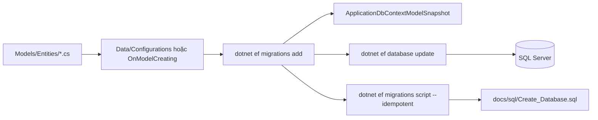
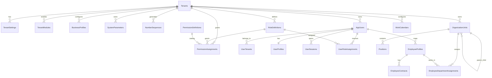
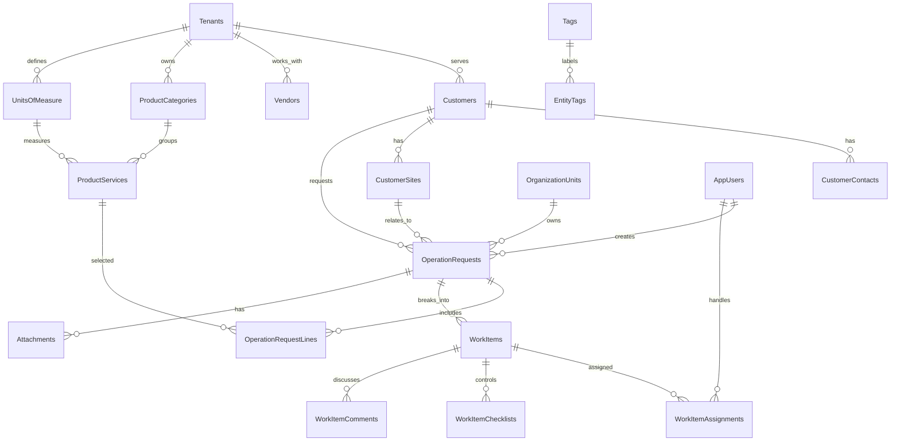
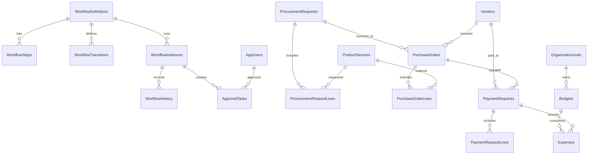
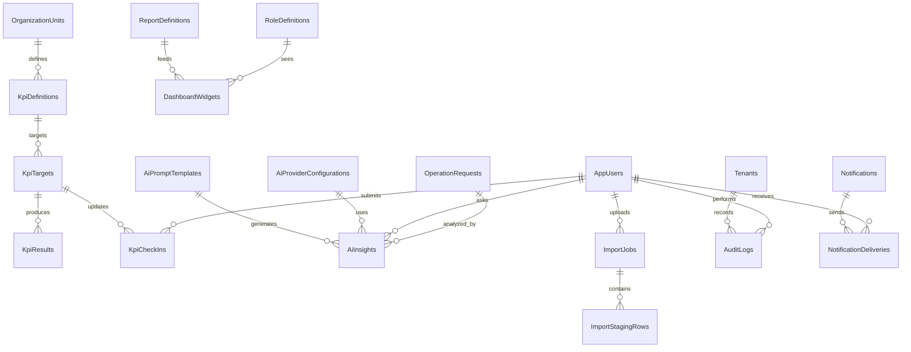
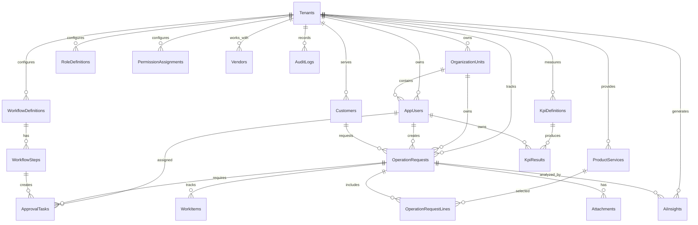
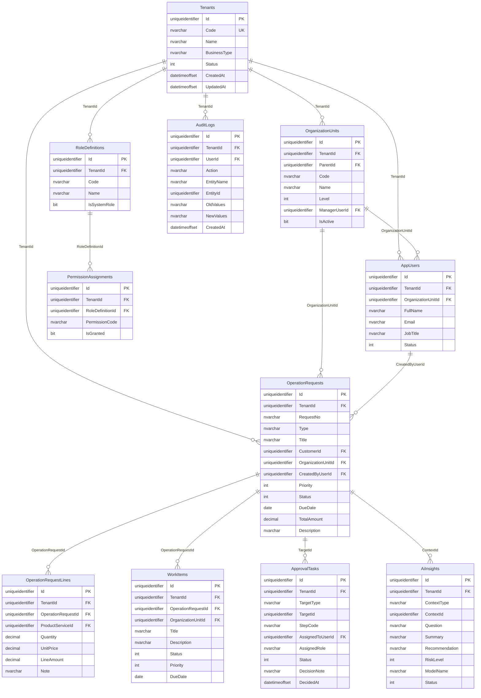

# OmniBizAI - EF Core Code First Database Design, Data Dictionary và SQL Script

> Database mục tiêu: **SQL Server**.  
> ORM mục tiêu: **Entity Framework Core Code First**.  
> Tài liệu này là bản thiết kế CSDL để triển khai entity, mapping, migration và tạo script nộp kèm đồ án.

## 1. Nguyên tắc thiết kế CSDL

- Dự án dùng **EF Core Code First**: schema bắt nguồn từ entity, enum, `ApplicationDbContext` và Fluent API mapping.
- Không scaffold database thủ công vào code. SQL script chỉ là artifact sinh từ migration để nộp hoặc triển khai.
- Mọi bảng nghiệp vụ phải có `TenantId`.
- Dùng `unique index` theo `TenantId` cho các mã nghiệp vụ như `Code`, `RequestNo`.
- Không xóa cứng dữ liệu nghiệp vụ quan trọng; ưu tiên `IsDeleted` hoặc `IsActive`.
- Mọi thao tác quan trọng cần ghi `AuditLogs`.
- Trạng thái phải dùng enum hoặc bảng cấu hình, không dùng chuỗi tùy tiện trong controller.
- Dữ liệu demo ưu tiên seed bằng code/service hoặc JSON profile idempotent; SQL seed chỉ là artifact demo khi cần nộp kèm.

## 2. Code First workflow



Quy ước:

- Tên migration phải mô tả thay đổi, ví dụ `AddOperationWorkflow`, `AddAiInsights`.
- Không sửa database trực tiếp bằng SQL rồi quên migration.
- Nếu cần tối ưu index/constraint, thêm trong Fluent API để migration sinh ra thay đổi.
- Khi đổi enum/trạng thái, phải có backfill hoặc default rõ ràng trong migration.

## 3. Phạm vi ERD mở rộng: 64 bảng Code First

Với đề tài OmniBizAI, ERD chỉ 15-20 bảng là chưa tương xứng vì hệ thống không phải CRUD đơn giản. Để phù hợp với phạm vi **quản lý đa cấp + vận hành SME + phê duyệt + báo cáo + AI hỗ trợ quyết định**, bản thiết kế Code First đặt mục tiêu **64 bảng**.

Nguyên tắc mở rộng:

- Không tách bảng chỉ để tăng số lượng.
- Mỗi bảng phải phục vụ một chức năng, một cấu hình hoặc một log/tracking có ý nghĩa.
- Bảng nghiệp vụ phải có `TenantId` để đảm bảo multi-tenant.
- Bảng cấu hình như workflow, form, prompt, dashboard giúp tránh hard-code.
- Các bảng AI/audit/import/notification là phần bắt buộc để chứng minh hệ thống thông minh, có truy vết và có khả năng vận hành thật.

| Nhóm module | Số bảng | Chức năng hệ thống được hỗ trợ |
| --- | ---: | --- |
| Tenant & cấu hình nền | 6 | Quản lý doanh nghiệp, module bật/tắt, tham số, mã chứng từ |
| Auth/RBAC/Security | 8 | Đăng nhập, role, permission, session, phân quyền đa tenant |
| Tổ chức & nhân sự | 6 | Cây phòng ban, chức danh, hồ sơ nhân sự, phân công phòng ban |
| CRM, đối tác, danh mục dịch vụ | 7 | Khách hàng, nhà cung cấp, sản phẩm/dịch vụ, đơn vị tính |
| Vận hành & công việc | 9 | Yêu cầu vận hành, dòng chi tiết, Kanban công việc, checklist, bình luận, file |
| Workflow & phê duyệt | 6 | Quy trình động, trạng thái, lịch sử, việc cần duyệt |
| Mua hàng & tài chính cơ bản | 8 | Đề nghị mua, đơn mua, thanh toán, ngân sách, chi phí |
| KPI, báo cáo, dashboard | 6 | KPI, check-in, định nghĩa báo cáo, widget dashboard |
| AI, audit, import, notification | 8 | Prompt, provider, insight, audit, import staging, thông báo |
| **Tổng** | **64** | Vượt yêu cầu tối thiểu trên 50 bảng |

## 4. Table catalog 64 bảng

| STT | Bảng Code First | Module | Chức năng | Quan hệ chính |
| ---: | --- | --- | --- | --- |
| 1 | `Tenants` | Tenant | Doanh nghiệp/đơn vị sử dụng hệ thống | Gốc của dữ liệu tenant |
| 2 | `TenantSettings` | Tenant | Cấu hình theo doanh nghiệp | `TenantId` |
| 3 | `TenantModules` | Tenant | Bật/tắt module theo doanh nghiệp | `TenantId` |
| 4 | `BusinessProfiles` | Tenant | Hồ sơ ngành/nghiệp vụ để tùy biến field/workflow | `TenantId` |
| 5 | `SystemParameters` | Config | Tham số hệ thống có hiệu lực theo tenant | `TenantId` |
| 6 | `NumberSequences` | Config | Sinh mã chứng từ/yêu cầu theo tenant | `TenantId` |
| 7 | `AppUsers` | Auth/RBAC | Hồ sơ người dùng đăng nhập/nghiệp vụ | `TenantId`, `OrganizationUnitId` |
| 8 | `UserTenants` | Auth/RBAC | Người dùng thuộc nhiều tenant nếu mở rộng | `UserId`, `TenantId` |
| 9 | `UserProfiles` | Auth/RBAC | Thông tin hồ sơ mở rộng, ảnh đại diện, liên hệ | `UserId` |
| 10 | `UserSessions` | Security | Phiên đăng nhập, thiết bị, IP, hết hạn | `UserId`, `TenantId` |
| 11 | `RoleDefinitions` | RBAC | Vai trò theo tenant | `TenantId` |
| 12 | `PermissionDefinitions` | RBAC | Danh mục quyền chuẩn của hệ thống | Global/Module |
| 13 | `PermissionAssignments` | RBAC | Quyền được gán cho role | `RoleDefinitionId`, `PermissionDefinitionId` |
| 14 | `UserRoleAssignments` | RBAC | Gán role cho user theo tenant/phòng ban | `UserId`, `RoleDefinitionId` |
| 15 | `OrganizationUnits` | Organization | Cây công ty, khối, phòng ban, nhóm | `TenantId`, `ParentId` |
| 16 | `Positions` | Organization | Chức danh/vị trí công việc | `TenantId`, `OrganizationUnitId` |
| 17 | `EmployeeProfiles` | HR | Hồ sơ nhân sự nghiệp vụ | `UserId`, `TenantId` |
| 18 | `EmployeeContracts` | HR | Hợp đồng/thông tin làm việc | `EmployeeProfileId` |
| 19 | `EmployeeDepartmentAssignments` | HR | Lịch sử phân công nhân sự vào phòng ban | `EmployeeProfileId`, `OrganizationUnitId` |
| 20 | `WorkCalendars` | HR/Operation | Lịch làm việc theo tenant/phòng ban | `TenantId` |
| 21 | `Customers` | CRM | Khách hàng/doanh nghiệp đối tác | `TenantId` |
| 22 | `CustomerContacts` | CRM | Người liên hệ của khách hàng | `CustomerId` |
| 23 | `CustomerSites` | CRM | Địa điểm/chi nhánh giao dịch của khách hàng | `CustomerId` |
| 24 | `Vendors` | Procurement | Nhà cung cấp | `TenantId` |
| 25 | `ProductCategories` | Catalog | Danh mục sản phẩm/dịch vụ | `TenantId`, `ParentId` |
| 26 | `ProductServices` | Catalog | Sản phẩm/dịch vụ cung cấp | `TenantId`, `ProductCategoryId` |
| 27 | `UnitsOfMeasure` | Catalog | Đơn vị tính | `TenantId` |
| 28 | `OperationRequests` | Operation | Yêu cầu vận hành/công việc cấp cao | `TenantId`, `CustomerId`, `OrganizationUnitId` |
| 29 | `OperationRequestLines` | Operation | Dòng chi tiết yêu cầu | `OperationRequestId`, `ProductServiceId` |
| 30 | `WorkItems` | Operation | Công việc phát sinh từ yêu cầu, hiển thị theo Kanban | `OperationRequestId`, `OrganizationUnitId` |
| 31 | `WorkItemAssignments` | Operation | Phân công nhân sự xử lý công việc | `WorkItemId`, `AssignedToUserId` |
| 32 | `WorkItemChecklists` | Operation | Checklist kiểm soát chất lượng/tiến độ | `WorkItemId` |
| 33 | `WorkItemComments` | Operation | Trao đổi nội bộ trên công việc | `WorkItemId`, `UserId` |
| 34 | `Attachments` | Shared | File đính kèm cho nhiều loại bản ghi | `TenantId`, `EntityName`, `EntityId` |
| 35 | `Tags` | Shared | Nhãn phân loại dữ liệu | `TenantId` |
| 36 | `EntityTags` | Shared | Gán nhãn cho bản ghi bất kỳ | `TagId`, `EntityName`, `EntityId` |
| 37 | `WorkflowDefinitions` | Workflow | Định nghĩa quy trình theo loại nghiệp vụ | `TenantId` |
| 38 | `WorkflowSteps` | Workflow | Các bước trong workflow | `WorkflowDefinitionId` |
| 39 | `WorkflowTransitions` | Workflow | Điều kiện chuyển bước/trạng thái | `WorkflowDefinitionId`, `FromStepId`, `ToStepId` |
| 40 | `WorkflowInstances` | Workflow | Một lần chạy workflow cho bản ghi cụ thể | `WorkflowDefinitionId`, `EntityName`, `EntityId` |
| 41 | `WorkflowHistory` | Workflow | Lịch sử chuyển bước/trạng thái | `WorkflowInstanceId` |
| 42 | `ApprovalTasks` | Approval | Việc cần duyệt | `WorkflowInstanceId`, `AssignedToUserId` |
| 43 | `ProcurementRequests` | Procurement | Đề nghị mua hàng/dịch vụ | `TenantId`, `RequestedByUserId` |
| 44 | `ProcurementRequestLines` | Procurement | Dòng chi tiết đề nghị mua | `ProcurementRequestId`, `ProductServiceId` |
| 45 | `PurchaseOrders` | Procurement | Đơn đặt mua với nhà cung cấp | `VendorId`, `ProcurementRequestId` |
| 46 | `PurchaseOrderLines` | Procurement | Dòng chi tiết đơn mua | `PurchaseOrderId`, `ProductServiceId` |
| 47 | `PaymentRequests` | Finance | Đề nghị thanh toán | `TenantId`, `VendorId`, `RequestedByUserId` |
| 48 | `PaymentRequestLines` | Finance | Chi tiết khoản thanh toán | `PaymentRequestId` |
| 49 | `Budgets` | Finance | Ngân sách theo kỳ/phòng ban | `TenantId`, `OrganizationUnitId` |
| 50 | `Expenses` | Finance | Chi phí thực tế/ghi nhận | `BudgetId`, `PaymentRequestId` |
| 51 | `KpiDefinitions` | KPI | Định nghĩa KPI theo cấp | `TenantId`, `OrganizationUnitId` |
| 52 | `KpiTargets` | KPI | Chỉ tiêu KPI theo kỳ | `KpiDefinitionId` |
| 53 | `KpiResults` | KPI | Kết quả KPI thực tế | `KpiTargetId`, `OwnerUserId` |
| 54 | `KpiCheckIns` | KPI | Check-in tiến độ KPI | `KpiTargetId`, `UserId` |
| 55 | `ReportDefinitions` | Report | Định nghĩa báo cáo động | `TenantId` |
| 56 | `DashboardWidgets` | Report | Widget dashboard theo role/module | `TenantId`, `ReportDefinitionId` |
| 57 | `AiPromptTemplates` | AI | Prompt template có version | `TenantId`, `ContextType` |
| 58 | `AiProviderConfigurations` | AI | Cấu hình provider/model, không lưu secret thô | `TenantId` |
| 59 | `AiInsights` | AI | Kết quả phân tích/đề xuất AI | `TenantId`, `ContextType`, `ContextId` |
| 60 | `AuditLogs` | Audit | Nhật ký thao tác quan trọng | `TenantId`, `UserId` |
| 61 | `ImportJobs` | Import | Một lần import Excel/CSV | `TenantId`, `UploadedByUserId` |
| 62 | `ImportStagingRows` | Import | Dòng staging và lỗi validate trước khi commit | `ImportJobId` |
| 63 | `Notifications` | Notification | Thông báo nghiệp vụ | `TenantId`, `EntityName`, `EntityId` |
| 64 | `NotificationDeliveries` | Notification | Trạng thái gửi/đọc thông báo theo user | `NotificationId`, `UserId` |

## 5. Chức năng hệ thống theo module

| Module | Chức năng người dùng nhìn thấy | Bảng chính | Ghi chú Code First |
| --- | --- | --- | --- |
| Quản trị tenant | Tạo tenant, cấu hình module, cấu hình tham số | `Tenants`, `TenantSettings`, `TenantModules`, `SystemParameters` | Cấu hình không hard-code trong controller |
| Auth/RBAC | Login, role, quyền, ẩn/hiện menu, session | `AppUsers`, `RoleDefinitions`, `PermissionDefinitions`, `PermissionAssignments`, `UserRoleAssignments` | Permission phải kiểm tra cả UI và controller |
| Tổ chức đa cấp | Cây phòng ban, chức danh, nhân sự, lịch làm việc | `OrganizationUnits`, `Positions`, `EmployeeProfiles`, `EmployeeDepartmentAssignments` | Dữ liệu nhân sự lọc theo `TenantId` và phòng ban |
| CRM/Catalog | Khách hàng, site, người liên hệ, sản phẩm/dịch vụ | `Customers`, `CustomerContacts`, `CustomerSites`, `ProductServices` | Là nền cho request, báo cáo, AI context |
| Vận hành | Tạo yêu cầu, tách công việc, Kanban workflow, checklist, bình luận, file | `OperationRequests`, `WorkItems`, `WorkItemAssignments`, `Attachments` | Đây là luồng demo chính |
| Workflow/Approval | Gửi duyệt, duyệt/từ chối, xem lịch sử | `WorkflowDefinitions`, `WorkflowInstances`, `WorkflowHistory`, `ApprovalTasks` | Workflow động để tránh hard-code trạng thái |
| Mua hàng/Tài chính | Đề nghị mua, PO, đề nghị thanh toán, ngân sách, chi phí | `ProcurementRequests`, `PurchaseOrders`, `PaymentRequests`, `Budgets`, `Expenses` | Đủ cho SME quản lý chi phí cơ bản |
| KPI/Báo cáo | KPI theo cấp, check-in, dashboard, báo cáo động | `KpiDefinitions`, `KpiTargets`, `KpiResults`, `DashboardWidgets` | Dữ liệu phục vụ lãnh đạo và AI |
| AI Insight | Prompt template, provider config, insight, risk, recommendation | `AiPromptTemplates`, `AiProviderConfigurations`, `AiInsights` | AI chỉ đề xuất, không tự phê duyệt |
| Audit/Import/Notification | Audit log, import staging, thông báo | `AuditLogs`, `ImportJobs`, `ImportStagingRows`, `Notifications` | Chứng minh hệ thống vận hành thật |

## 6. ERD theo bounded context

### 6.1. Tenant, cấu hình, RBAC và tổ chức



### 6.2. CRM, danh mục và vận hành



### 6.3. Workflow, mua hàng và tài chính



### 6.4. KPI, báo cáo, AI, import, audit và notification



## 7. ERD lõi rút gọn để nhìn nhanh



## 8. Database Diagram SQL Server - lõi rút gọn

Sơ đồ dưới đây mô tả bảng triển khai thực tế theo hướng Code First. Khi đã có migration thật, cần đối chiếu lại tên bảng/cột với migration snapshot hoặc script EF sinh ra.



## 9. Danh sách bảng lõi rút gọn

| Bảng | Chức năng | Module |
| --- | --- | --- |
| `Tenants` | Lưu doanh nghiệp/đơn vị sử dụng hệ thống | Multi-tenant |
| `OrganizationUnits` | Lưu cây phòng ban, bộ phận | Organization |
| `AppUsers` | Lưu hồ sơ người dùng nghiệp vụ | Identity/RBAC |
| `RoleDefinitions` | Cấu hình vai trò theo tenant | RBAC |
| `PermissionAssignments` | Gán quyền cho vai trò | RBAC |
| `Customers` | Khách hàng | Operations |
| `Vendors` | Nhà cung cấp | Procurement/Finance |
| `ProductServices` | Sản phẩm/dịch vụ | Operations |
| `OperationRequests` | Yêu cầu vận hành/công việc chính | Operations |
| `OperationRequestLines` | Dòng chi tiết của yêu cầu | Operations |
| `WorkItems` | Thẻ công việc dùng cho Kanban workflow | Operations |
| `WorkflowDefinitions` | Định nghĩa workflow | Workflow |
| `WorkflowSteps` | Bước trong workflow | Workflow |
| `ApprovalTasks` | Việc cần duyệt | Approval |
| `KpiDefinitions` | Định nghĩa KPI | Reporting |
| `KpiResults` | Kết quả KPI | Reporting |
| `AiInsights` | Kết quả AI phân tích | AI |
| `AuditLogs` | Nhật ký thao tác | Audit |
| `Attachments` | File đính kèm | Shared |

## 10. Data Dictionary

### 10.1. `Tenants`

| Cột | Kiểu SQL Server | Null | Key | Mô tả |
| --- | --- | --- | --- | --- |
| `Id` | `uniqueidentifier` | No | PK | Khóa chính |
| `Code` | `nvarchar(50)` | No | UK | Mã doanh nghiệp |
| `Name` | `nvarchar(200)` | No |  | Tên doanh nghiệp |
| `BusinessType` | `nvarchar(100)` | Yes |  | Lĩnh vực hoạt động |
| `Status` | `int` | No |  | Trạng thái tenant |
| `CreatedAt` | `datetimeoffset` | No |  | Thời điểm tạo |
| `UpdatedAt` | `datetimeoffset` | Yes |  | Thời điểm cập nhật |

### 10.2. `OrganizationUnits`

| Cột | Kiểu SQL Server | Null | Key | Mô tả |
| --- | --- | --- | --- | --- |
| `Id` | `uniqueidentifier` | No | PK | Khóa chính |
| `TenantId` | `uniqueidentifier` | No | FK | Doanh nghiệp sở hữu |
| `ParentId` | `uniqueidentifier` | Yes | FK | Phòng ban cha |
| `Code` | `nvarchar(50)` | No | UK theo tenant | Mã phòng ban |
| `Name` | `nvarchar(200)` | No |  | Tên phòng ban |
| `Level` | `int` | No |  | Cấp tổ chức |
| `ManagerUserId` | `uniqueidentifier` | Yes | FK | Trưởng bộ phận |
| `IsActive` | `bit` | No |  | Còn hoạt động không |

### 10.3. `AppUsers`

| Cột | Kiểu SQL Server | Null | Key | Mô tả |
| --- | --- | --- | --- | --- |
| `Id` | `uniqueidentifier` | No | PK | Khóa chính hồ sơ người dùng |
| `TenantId` | `uniqueidentifier` | No | FK | Doanh nghiệp |
| `OrganizationUnitId` | `uniqueidentifier` | Yes | FK | Phòng ban chính |
| `FullName` | `nvarchar(200)` | No |  | Họ tên |
| `Email` | `nvarchar(255)` | No | UK theo tenant | Email đăng nhập/liên hệ |
| `JobTitle` | `nvarchar(150)` | Yes |  | Chức danh |
| `Status` | `int` | No |  | Active/Locked/Inactive |

### 10.4. `OperationRequests`

| Cột | Kiểu SQL Server | Null | Key | Mô tả |
| --- | --- | --- | --- | --- |
| `Id` | `uniqueidentifier` | No | PK | Khóa chính |
| `TenantId` | `uniqueidentifier` | No | FK | Doanh nghiệp |
| `RequestNo` | `nvarchar(50)` | No | UK theo tenant | Số yêu cầu |
| `Type` | `nvarchar(50)` | No |  | Loại yêu cầu |
| `Title` | `nvarchar(250)` | No |  | Tiêu đề |
| `CustomerId` | `uniqueidentifier` | Yes | FK | Khách hàng liên quan |
| `OrganizationUnitId` | `uniqueidentifier` | No | FK | Bộ phận phụ trách |
| `CreatedByUserId` | `uniqueidentifier` | No | FK | Người tạo |
| `Priority` | `int` | No |  | Low/Normal/High/Critical |
| `Status` | `int` | No |  | Draft/InReview/Approved/... |
| `DueDate` | `date` | Yes |  | Hạn xử lý |
| `TotalAmount` | `decimal(18,2)` | Yes |  | Tổng giá trị |
| `Description` | `nvarchar(2000)` | Yes |  | Mô tả |

### 10.5. `WorkItems`

| Cột | Kiểu SQL Server | Null | Key | Mô tả |
| --- | --- | --- | --- | --- |
| `Id` | `uniqueidentifier` | No | PK | Khóa chính thẻ công việc |
| `TenantId` | `uniqueidentifier` | No | FK | Doanh nghiệp |
| `OperationRequestId` | `uniqueidentifier` | No | FK | Yêu cầu vận hành nguồn |
| `OrganizationUnitId` | `uniqueidentifier` | No | FK | Bộ phận phụ trách |
| `Title` | `nvarchar(250)` | No |  | Tiêu đề công việc |
| `Description` | `nvarchar(2000)` | Yes |  | Mô tả xử lý |
| `Status` | `int` | No | Index | Todo/InProgress/Blocked/Done/Cancelled |
| `Priority` | `int` | No |  | Low/Normal/High/Critical |
| `DueDate` | `date` | Yes | Index | Hạn xử lý |

### 10.6. `ApprovalTasks`

| Cột | Kiểu SQL Server | Null | Key | Mô tả |
| --- | --- | --- | --- | --- |
| `Id` | `uniqueidentifier` | No | PK | Khóa chính |
| `TenantId` | `uniqueidentifier` | No | FK | Doanh nghiệp |
| `TargetType` | `nvarchar(80)` | No |  | Loại bản ghi cần duyệt |
| `TargetId` | `uniqueidentifier` | No | Index | Id bản ghi cần duyệt |
| `StepCode` | `nvarchar(80)` | No |  | Mã bước workflow |
| `AssignedToUserId` | `uniqueidentifier` | Yes | FK | Người duyệt cụ thể |
| `AssignedRole` | `nvarchar(80)` | Yes |  | Role được duyệt |
| `Status` | `int` | No |  | Pending/Approved/Rejected/Skipped |
| `DecisionNote` | `nvarchar(1000)` | Yes |  | Ghi chú duyệt/từ chối |
| `DecidedAt` | `datetimeoffset` | Yes |  | Thời điểm quyết định |

### 10.7. `AiInsights`

| Cột | Kiểu SQL Server | Null | Key | Mô tả |
| --- | --- | --- | --- | --- |
| `Id` | `uniqueidentifier` | No | PK | Khóa chính |
| `TenantId` | `uniqueidentifier` | No | FK | Doanh nghiệp |
| `ContextType` | `nvarchar(80)` | No |  | Dashboard/Operation/KPI |
| `ContextId` | `uniqueidentifier` | Yes | Index | Bản ghi liên quan |
| `Question` | `nvarchar(1000)` | No |  | Câu hỏi |
| `Summary` | `nvarchar(2000)` | No |  | Tóm tắt |
| `Recommendation` | `nvarchar(4000)` | Yes |  | Đề xuất |
| `RiskLevel` | `int` | No |  | Low/Medium/High |
| `ModelName` | `nvarchar(100)` | Yes |  | Model/provider |
| `Status` | `int` | No |  | Draft/Reviewed/Applied/Dismissed |

## 11. Ràng buộc và index

| Bảng | Ràng buộc/index | Mục đích |
| --- | --- | --- |
| `Tenants` | `UX_Tenants_Code` | Không trùng mã tenant |
| `OrganizationUnits` | `UX_OrganizationUnits_TenantId_Code` | Không trùng mã phòng ban trong tenant |
| `AppUsers` | `UX_AppUsers_TenantId_Email` | Không trùng email trong tenant |
| `OperationRequests` | `UX_OperationRequests_TenantId_RequestNo` | Không trùng số yêu cầu |
| `OperationRequests` | `IX_OperationRequests_TenantId_Status_DueDate` | Tối ưu dashboard |
| `WorkItems` | `IX_WorkItems_TenantId_Status_DueDate` | Tối ưu Kanban theo cột trạng thái và hạn xử lý |
| `ApprovalTasks` | `IX_ApprovalTasks_TenantId_Status_AssignedToUserId` | Tối ưu danh sách cần duyệt |
| `AiInsights` | `IX_AiInsights_TenantId_ContextType_ContextId` | Tối ưu truy vấn insight |
| `AuditLogs` | `IX_AuditLogs_TenantId_CreatedAt` | Tối ưu audit theo thời gian |

## 12. SQL Script sinh từ migration

Khi EF migration đã ổn định, generate script thật bằng:

```powershell
dotnet ef migrations script --idempotent -o docs\sql\Create_Database.sql
```

Đoạn dưới là script khung để báo cáo hiểu cấu trúc. Script nộp cuối cùng phải sinh từ migration, không dùng script viết tay làm nguồn chính.

```sql
CREATE TABLE Tenants (
    Id uniqueidentifier NOT NULL PRIMARY KEY,
    Code nvarchar(50) NOT NULL,
    Name nvarchar(200) NOT NULL,
    BusinessType nvarchar(100) NULL,
    Status int NOT NULL,
    CreatedAt datetimeoffset NOT NULL,
    UpdatedAt datetimeoffset NULL,
    CONSTRAINT UX_Tenants_Code UNIQUE (Code)
);

CREATE TABLE OrganizationUnits (
    Id uniqueidentifier NOT NULL PRIMARY KEY,
    TenantId uniqueidentifier NOT NULL,
    ParentId uniqueidentifier NULL,
    Code nvarchar(50) NOT NULL,
    Name nvarchar(200) NOT NULL,
    Level int NOT NULL,
    ManagerUserId uniqueidentifier NULL,
    IsActive bit NOT NULL DEFAULT 1,
    CONSTRAINT FK_OrganizationUnits_Tenants FOREIGN KEY (TenantId) REFERENCES Tenants(Id),
    CONSTRAINT FK_OrganizationUnits_Parent FOREIGN KEY (ParentId) REFERENCES OrganizationUnits(Id)
);

CREATE UNIQUE INDEX UX_OrganizationUnits_TenantId_Code
ON OrganizationUnits(TenantId, Code);

CREATE TABLE OperationRequests (
    Id uniqueidentifier NOT NULL PRIMARY KEY,
    TenantId uniqueidentifier NOT NULL,
    RequestNo nvarchar(50) NOT NULL,
    Type nvarchar(50) NOT NULL,
    Title nvarchar(250) NOT NULL,
    CustomerId uniqueidentifier NULL,
    OrganizationUnitId uniqueidentifier NOT NULL,
    CreatedByUserId uniqueidentifier NOT NULL,
    Priority int NOT NULL,
    Status int NOT NULL,
    DueDate date NULL,
    TotalAmount decimal(18,2) NULL,
    Description nvarchar(2000) NULL,
    CONSTRAINT FK_OperationRequests_Tenants FOREIGN KEY (TenantId) REFERENCES Tenants(Id),
    CONSTRAINT FK_OperationRequests_OrganizationUnits FOREIGN KEY (OrganizationUnitId) REFERENCES OrganizationUnits(Id)
);

CREATE UNIQUE INDEX UX_OperationRequests_TenantId_RequestNo
ON OperationRequests(TenantId, RequestNo);

CREATE INDEX IX_OperationRequests_TenantId_Status_DueDate
ON OperationRequests(TenantId, Status, DueDate);
```

## 13. Seed data tối thiểu cho demo

| Dữ liệu | Số lượng tối thiểu | Ghi chú |
| --- | --- | --- |
| Tenant demo | 1 | Ví dụ `DEMO_SME` |
| OrganizationUnit | 5 | Công ty, vận hành, kinh doanh, tài chính, kiểm soát |
| User demo | 5 | Admin, Executive, Manager, Staff, Auditor |
| Role | 6 | Tenant Admin, Executive, Manager, Staff, Accountant, Auditor |
| Permission | 10+ | Theo blueprint kỹ thuật |
| OperationRequest | 20 | Đủ trạng thái Draft/InReview/Approved/Completed/Rejected |
| WorkItem | 12 | Đủ cột Kanban Todo/InProgress/Blocked/Done/Cancelled |
| ApprovalTask | 10 | Có pending và completed |
| KpiResult | 12 | Theo tháng/phòng ban |
| AiInsight | 5 | Insight mẫu khi chưa có API key |
| AuditLog | 30 | Chứng minh truy vết |

## 14. Checklist database trước khi nộp

- [ ] Có ERD.
- [ ] ERD mục tiêu có tối thiểu trên 50 bảng; bản thiết kế hiện tại là 64 bảng.
- [ ] Có Database Diagram theo bảng SQL Server.
- [ ] Có danh sách bảng 64 bảng theo module.
- [ ] Có data dictionary.
- [ ] Có khóa chính/khóa ngoại/index.
- [ ] Có entity và Fluent API mapping Code First tương ứng.
- [ ] Có migration đầu tiên và migration bổ sung nếu schema thay đổi.
- [ ] Có script SQL sinh từ migration.
- [ ] Có seed dữ liệu demo.
- [ ] Có ảnh chụp database/schema nếu nhà trường yêu cầu.
