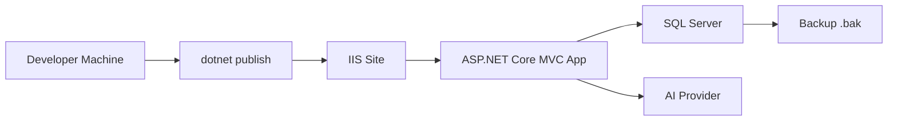

# OmniBizAI - Kiểm thử, triển khai và bảo trì

> Tài liệu này gom các hồ sơ cần có ở giai đoạn nghiệm thu: Test Plan, Test Case, Bug Report, Deployment Guide, Maintenance Guide và checklist nộp đồ án.

## 1. Test Plan

### 1.1. Mục tiêu kiểm thử

- Đảm bảo người dùng đăng nhập và truy cập đúng quyền.
- Đảm bảo dữ liệu được lọc theo tenant/phòng ban.
- Đảm bảo luồng yêu cầu vận hành và phê duyệt hoạt động end-to-end.
- Đảm bảo dashboard, báo cáo và export hiển thị dữ liệu thật.
- Đảm bảo AI insight có fallback khi provider lỗi.
- Đảm bảo audit log ghi nhận thao tác quan trọng.

### 1.2. Phạm vi kiểm thử

| Nhóm | Nội dung |
| --- | --- |
| Auth/RBAC | Login, logout, role, permission, sidebar |
| Organization | Phòng ban, người dùng, role |
| Operation | CRUD yêu cầu, validation, trạng thái |
| Approval | Duyệt, từ chối, lý do, quyền duyệt |
| Report | Dashboard, filter, export |
| AI | Hỏi AI, provider lỗi, insight log |
| Audit | Create/update/approve/export/AI log |
| Deployment | Publish, IIS, SQL Server, cấu hình môi trường |

### 1.3. Loại kiểm thử

| Loại test | Người phụ trách | Bằng chứng |
| --- | --- | --- |
| Unit test | Backend | Log test hoặc ảnh terminal |
| Integration test | Backend + Tester | Log chạy test/database |
| Manual UI test | Frontend + Tester | Ảnh màn hình |
| Security smoke test | Backend + Tester | Kết quả 403/redirect |
| UAT | PM + Tester | Biên bản nghiệm thu |
| Deployment smoke test | Backend + Tester | Ảnh app chạy trên IIS/local publish |

## 2. Test Cases

| Mã test | Chức năng | Dữ liệu vào | Kết quả mong đợi | Actual result | Trạng thái |
| --- | --- | --- | --- | --- | --- |
| TC-01 | Đăng nhập | Email/password đúng | Vào dashboard đúng vai trò | Cần chạy | Pending |
| TC-02 | Đăng nhập | Sai mật khẩu | Báo lỗi đăng nhập | Cần chạy | Pending |
| TC-03 | Phân quyền menu | User Staff | Không thấy menu quản trị | Cần chạy | Pending |
| TC-04 | Route protection | Staff mở `/Users` | Bị chặn 403/redirect | Cần chạy | Pending |
| TC-05 | Tạo phòng ban | Code/Name hợp lệ | Lưu vào SQL Server | Cần chạy | Pending |
| TC-06 | Tạo phòng ban | Code trùng | Báo lỗi trùng mã | Cần chạy | Pending |
| TC-07 | Tạo user | Email hợp lệ, role hợp lệ | User được tạo và có role | Cần chạy | Pending |
| TC-08 | Tạo yêu cầu | Thiếu Title | Hiển thị validation | Cần chạy | Pending |
| TC-09 | Tạo yêu cầu | Dữ liệu hợp lệ | Lưu Draft vào SQL Server | Cần chạy | Pending |
| TC-10 | Gửi duyệt | Yêu cầu hợp lệ | Tạo ApprovalTask | Cần chạy | Pending |
| TC-11 | Duyệt yêu cầu | Task pending | Task Approved, request đổi trạng thái | Cần chạy | Pending |
| TC-12 | Từ chối yêu cầu | Không nhập lý do | Báo lỗi bắt buộc lý do | Cần chạy | Pending |
| TC-13 | Dashboard | Filter 30 ngày | Số liệu khớp database demo | Cần chạy | Pending |
| TC-14 | Export | Có quyền export | Tải được file đúng filter | Cần chạy | Pending |
| TC-15 | AI insight | Câu hỏi hợp lệ | Có summary/risk/recommendation | Cần chạy | Pending |
| TC-16 | AI fallback | Tắt API key/provider lỗi | UI báo lỗi thân thiện | Cần chạy | Pending |
| TC-17 | Audit log | Sau thao tác approve | Có log user/action/entity/time | Cần chạy | Pending |
| TC-18 | Tenant isolation | User tenant A truy cập dữ liệu tenant B | Không xem được | Cần chạy | Pending |

## 3. Bug Report Template

| Trường | Nội dung |
| --- | --- |
| Bug ID | `BUG-001` |
| Tiêu đề | Mô tả ngắn lỗi |
| Module | Auth/Operation/Approval/Report/AI/... |
| Môi trường | Local/IIS, browser, database |
| Bước tái hiện | 1. ... 2. ... 3. ... |
| Kết quả thực tế | Hệ thống đang xảy ra gì |
| Kết quả mong đợi | Hệ thống nên hoạt động thế nào |
| Mức độ | Critical/High/Medium/Low |
| Người phát hiện | Tên tester |
| Người xử lý | Tên dev |
| Trạng thái | Open/In Progress/Resolved/Closed |
| Bằng chứng | Ảnh/log/link commit |

## 4. Deployment Guide

### 4.1. Mô hình triển khai mục tiêu



### 4.2. Chuẩn bị server

1. Cài .NET SDK/Runtime phù hợp với target framework.
2. Cài ASP.NET Core Hosting Bundle nếu deploy IIS.
3. Cài hoặc chuẩn bị SQL Server.
4. Tạo database và user SQL Server.
5. Cấu hình HTTPS/domain nếu demo trên server thật.

### 4.3. Cấu hình môi trường

Không đưa secret thật vào Git. Các giá trị cần cấu hình bằng biến môi trường, user secrets hoặc `.env` local:

| Key | Mục đích | Ví dụ |
| --- | --- | --- |
| `ConnectionStrings__DefaultConnection` | Chuỗi kết nối SQL Server | `Server=.;Database=OmniBizAI;Trusted_Connection=True;...` |
| `ASPNETCORE_ENVIRONMENT` | Môi trường chạy | `Production` |
| `AI__Provider` | Provider AI | `Gemini`, `OpenAI`, `Mock` |
| `AI__ApiKey` | API key provider | Không commit |
| `Seed__ProfilePath` | File seed demo | `Data/Seed/demo.seed.json` |

### 4.4. Publish ASP.NET Core app

```powershell
dotnet restore
dotnet build
dotnet publish -c Release -o .\publish
```

### 4.5. Tạo database bằng EF Core Code First

Quy trình chính thức của dự án là **EF Core Code First**. Database được tạo/cập nhật từ migration:

```powershell
dotnet ef database update
dotnet ef migrations script --idempotent -o docs\sql\Create_Database.sql
```

Khi nộp đồ án hoặc triển khai trên môi trường không chạy trực tiếp `dotnet ef`, dùng file SQL đã sinh từ migration:

1. Mở SQL Server Management Studio.
2. Chạy script `Create_Database.sql` đã sinh bằng `dotnet ef migrations script --idempotent`.
3. Chạy script seed dữ liệu demo nếu có.

Không tạo/sửa bảng thủ công trên SQL Server rồi bỏ qua migration.

### 4.6. Cấu hình IIS

1. Tạo Application Pool mới, chọn **No Managed Code**.
2. Tạo IIS Site trỏ đến thư mục publish.
3. Gán domain/port/HTTPS binding.
4. Cấp quyền đọc/ghi cần thiết cho thư mục log/upload.
5. Cấu hình environment variables cho app pool hoặc server.
6. Restart IIS Site.

### 4.7. Smoke test sau deploy

| Bước | Kỳ vọng |
| --- | --- |
| Mở trang chủ | App phản hồi HTTP 200 hoặc redirect login |
| Đăng nhập demo | Vào dashboard |
| Mở `/Operations` | Danh sách tải được |
| Tạo yêu cầu | Lưu vào SQL Server |
| Mở dashboard | Số liệu cập nhật |
| Gọi AI | Có kết quả hoặc fallback rõ ràng |
| Export báo cáo | Tải được file |

## 5. Maintenance Guide

### 5.1. Sao lưu database

| Tần suất | Nội dung |
| --- | --- |
| Trước demo | Backup database demo ổn định |
| Trước migration | Backup database hiện tại |
| Hàng tuần nếu chạy thật | Full backup SQL Server |

### 5.2. Phục hồi database

1. Dừng app hoặc chuyển sang maintenance mode nếu cần.
2. Restore file `.bak` bằng SQL Server Management Studio.
3. Kiểm tra connection string.
4. Chạy smoke test login/dashboard.

### 5.3. Cập nhật phiên bản

1. Pull source code hoặc lấy bản publish mới.
2. Chạy build.
3. Backup database.
4. Chạy migration/script nếu có.
5. Publish app.
6. Restart IIS.
7. Chạy smoke test.

### 5.4. Theo dõi vận hành

| Hạng mục | Cách kiểm tra |
| --- | --- |
| App lỗi 500 | Xem application logs |
| Không kết nối DB | Kiểm tra connection string, SQL service, firewall |
| Mất đăng nhập | Kiểm tra cookie/DataProtection/environment |
| AI lỗi | Kiểm tra API key, quota, provider timeout |
| Export lỗi | Kiểm tra quyền ghi thư mục tạm/export |

## 6. Bộ hồ sơ tối thiểu nộp đồ án

| STT | Hồ sơ | File gợi ý | Trạng thái |
| --- | --- | --- | --- |
| 1 | Báo cáo Word/PDF | Export từ `02-Graduation-Project-Report.md` | Cần export |
| 2 | Source code ASP.NET Core MVC | Repository hiện tại | Đang phát triển |
| 3 | File SQL tạo database | `docs/sql/Create_Database.sql` | Sinh từ EF Core migration khi model ổn định |
| 4 | ERD/Database Diagram | `06-Database-Design.md` | Đã có bản thiết kế |
| 5 | Use Case Diagram | `04-Requirements-and-Use-Cases.md` | Đã có |
| 6 | Class Diagram | `05-System-Design-and-Diagrams.md` | Đã có |
| 7 | Sequence Diagram 2-3 chức năng | `05-System-Design-and-Diagrams.md` | Đã có |
| 8 | Hướng dẫn cài đặt/triển khai | File này | Đã có bản khung |
| 9 | Hướng dẫn sử dụng | `03-User-Guide.md` | Đã có |
| 10 | Test case | File này | Đã có bản khung |

## 7. Cấu trúc thư mục tài liệu đề xuất

Vì dự án ưu tiên Markdown, dùng `docs/` thay cho `Documents/`:

```text
docs/
├── 00-Project-Documentation-Index.md
├── 01-Technical-Implementation-Blueprint.md
├── 02-Graduation-Project-Report.md
├── 03-User-Guide.md
├── 04-Requirements-and-Use-Cases.md
├── 05-System-Design-and-Diagrams.md
├── 06-Database-Design.md
├── 07-Testing-Deployment-Maintenance.md
└── sql/
    ├── Create_Database.sql
    └── Seed_Demo_Data.sql
```

## 8. Tài liệu tham khảo

- Microsoft Learn: [Overview of ASP.NET Core MVC](https://learn.microsoft.com/en-us/aspnet/core/mvc/overview?view=aspnetcore-10.0)
- Microsoft Learn: [Host and deploy ASP.NET Core](https://learn.microsoft.com/en-us/aspnet/core/host-and-deploy/?view=aspnetcore-10.0)
