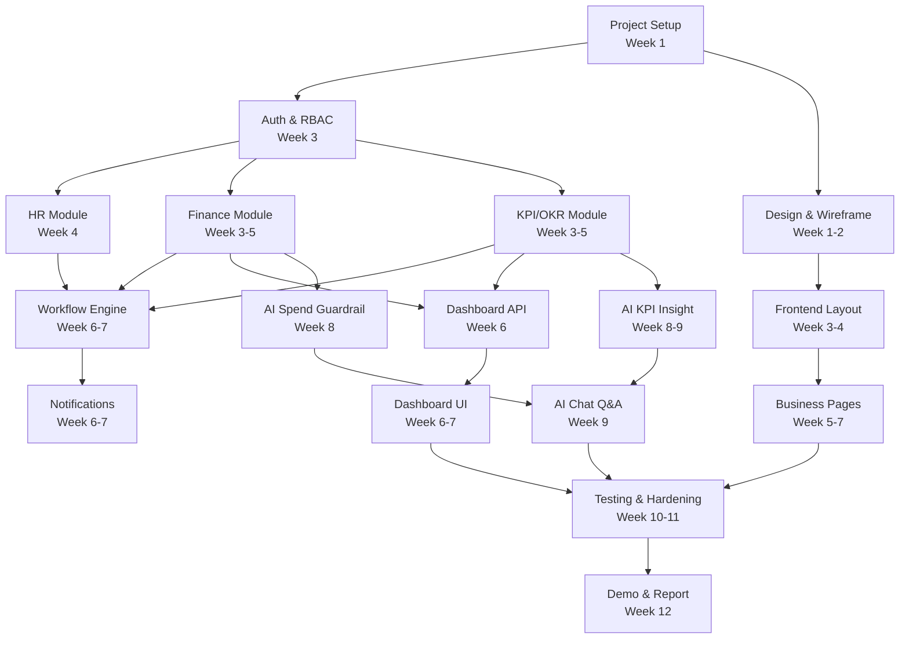

# 📅 OmniBiz AI — Project Plan / Roadmap

> **Version**: 1.0 | **Updated**: 2026-04-25  
> **Team Size**: 7 người | **Duration**: 12 tuần

---

## 1. Milestone Overview

```
Week:  1   2   3   4   5   6   7   8   9   10  11  12
       ├───┤   ├───────────┤   ├───────┤   ├───────┤   ├───────┤   ├───┤
       │ M1│   │    M2     │   │  M3   │   │  M4   │   │  M5   │   │M6 │
       │   │   │           │   │       │   │       │   │       │   │   │
       │ 📋│   │   ⚙️      │   │  🔄   │   │  🤖   │   │  🧪   │   │ 🎬│
       │Plan│   │ Full-stack│   │WorkFlow│   │  AI   │   │ Test  │   │Demo│
       │    │   │ MVC Core  │   │+ Dash  │   │ Layer │   │Harden │   │   │
       └───┘   └───────────┘   └───────┘   └───────┘   └───────┘   └───┘
```

---

## 2. Milestone Details

### M1: Phân tích & Thiết kế (Tuần 1–2)

| Task | Owner | Deliverable | Done Criteria |
|------|-------|------------|--------------|
| Chốt scope MVP, feature list | All | PRD document | Team review & approve |
| Use case diagrams | Member 3 | Use case docs | Cover 5 modules |
| ERD & database schema | Member 1 | Database design doc | 61 tables defined |
| MVC/API specification draft | Member 1 | Route + API spec doc | MVC actions and JSON endpoints listed |
| Architecture design | Member 1 | Architecture doc | Stack decisions final |
| Wireframe dashboard | Member 5 | Figma wireframes | 6 main screens |
| Wireframe business screens | Member 6 | Figma wireframes | Forms + tables |
| Permission matrix | Member 1 | Security doc | 6 roles defined |
| Project setup (Git, Docker) | Member 7 | Repository ready | All can clone & run |
| Development guidelines | Member 1 | Dev guide doc | Conventions agreed |

**Exit Criteria**: Tất cả tài liệu design đã review, repo đã setup, team biết phải code gì.

---

### M2: Full-stack MVC Core (Tuần 3–5)

| Task | Owner | Week | Dependencies |
|------|-------|------|-------------|
| **Infrastructure Setup** | | | |
| Project structure (Clean Arch) | Member 1 | W3 | - |
| EF Core setup + migrations | Member 1 | W3 | - |
| Docker Compose (DB, Redis) | Member 7 | W3 | - |
| **Auth & RBAC** | | | |
| User entity + Identity setup | Member 1 | W3 | Project structure |
| ASP.NET Identity cookie auth (login/register/logout) | Member 1 | W3 | User entity |
| Optional JWT auth for external API clients | Member 1 | W3 | User entity |
| Role & Permission system | Member 1 | W3-4 | Identity auth |
| Data scoping middleware | Member 1 | W4 | RBAC |
| **HR Module** | | | |
| Company, Department CRUD | Member 1 | W4 | Auth done |
| Position, Employee CRUD | Member 1 | W4 | Department |
| Org chart MVC page + JSON endpoint | Member 1 | W4 | Employee |
| **Finance Module** | | | |
| Budget Category (tree) CRUD | Member 2 | W3 | Project structure |
| Budget CRUD + validation | Member 2 | W3-4 | Category |
| Vendor CRUD | Member 2 | W4 | Project structure |
| Payment Request CRUD | Member 2 | W4-5 | Budget, Vendor |
| Payment Request Items & Attachments | Member 2 | W5 | Payment Request |
| Wallet CRUD | Member 2 | W4 | Project structure |
| Transaction CRUD + budget impact | Member 2 | W5 | Budget, Wallet |
| **KPI/OKR Module** | | | |
| Evaluation Period CRUD | Member 3 | W3 | Project structure |
| Objective (OKR) CRUD + cascade | Member 3 | W3-4 | Period |
| Key Result CRUD + progress calc | Member 3 | W4 | Objective |
| KPI CRUD + assignment | Member 3 | W4-5 | Period, Employee |
| Check-in CRUD + approval | Member 3 | W5 | KPI, Key Result |
| Performance Evaluation | Member 3 | W5 | KPI, OKR |
| **MVC UI Setup** | | | |
| ASP.NET Core MVC project + Razor layout | Member 5 | W3 | - |
| Design system (Razor partials, CSS, components) | Member 5 | W3-4 | MVC setup |
| Layout (Sidebar, Header) | Member 5 | W4 | Design system |
| Auth pages (Login) | Member 6 | W3-4 | MVC setup |
| AJAX helpers + validation scripts | Member 6 | W3 | MVC setup |
| Department/Employee Razor pages | Member 6 | W5 | HR actions done |
| Budget list/create Razor pages | Member 6 | W5 | Finance actions done |
| **Testing & DevOps** | | | |
| Unit test framework setup | Member 7 | W3 | Project structure |
| CI pipeline (GitHub Actions) | Member 7 | W3-4 | - |
| Seed data service | Member 7 | W4-5 | All entities |

**Exit Criteria**: Auth works, CRUD cho tất cả entities, MVC layout ready, CI running.

---

### M3: Workflow & Dashboard (Tuần 6–7)

| Task | Owner | Week | Dependencies |
|------|-------|------|-------------|
| **Workflow Engine** | | | |
| Workflow Template + Steps CRUD | Member 3 | W6 | All entities |
| Workflow Conditions engine | Member 3 | W6 | Template |
| Workflow Instance creation | Member 3 | W6-7 | Conditions |
| Approval flow (approve/reject) | Member 3 | W7 | Instance |
| PR submit → auto workflow | Member 2 | W7 | Workflow engine |
| **Notifications** | | | |
| Notification entity + MVC/API endpoints | Member 1 | W6 | - |
| SignalR hub setup | Member 1 | W6 | - |
| Notify on approval events | Member 1 | W6-7 | Workflow |
| **Dashboard** | | | |
| Director dashboard MVC/API endpoints | Member 2 | W6 | Finance data |
| KPI dashboard MVC/API endpoints | Member 3 | W6 | KPI data |
| Dashboard Razor views + charts | Member 5 | W6-7 | Dashboard endpoints |
| Role-based dashboard views | Member 5 | W7 | Data scoping |
| **Business UI** | | | |
| Payment Request form + flow | Member 6 | W6 | PR actions |
| KPI/OKR management pages | Member 6 | W6-7 | KPI actions |
| Approval queue page | Member 6 | W7 | Workflow actions |
| Check-in form + review | Member 6 | W7 | Check-in actions |
| **Audit** | | | |
| Audit log middleware | Member 1 | W6 | - |
| Audit log viewer (Admin) | Member 7 | W7 | Audit actions |
| **Testing** | | | |
| Workflow unit tests | Member 7 | W7 | Workflow done |
| Integration tests (MVC/API) | Member 7 | W7 | MVC/API endpoints done |

**Exit Criteria**: Workflow hoạt động E2E, dashboard hiển thị đúng data, approval flow complete.

---

### M4: AI Layer (Tuần 8–9)

| Task | Owner | Week | Dependencies |
|------|-------|------|-------------|
| **AI Infrastructure** | | | |
| AI Provider abstraction | Member 4 | W8 | - |
| Groq/OpenAI integration | Member 4 | W8 | Provider |
| Prompt template system | Member 4 | W8 | Provider |
| **AI Features** | | | |
| AI Spend Guardrail | Member 4 | W8 | Finance data |
| AI KPI Insight | Member 4 | W8-9 | KPI data |
| AI Chat Q&A | Member 4 | W9 | All data |
| AI Report Writer | Member 4 | W9 | All data |
| **RAG Pipeline** | | | |
| vector search (SQL Server) setup + embeddings | Member 4 | W8 | SQL Server |
| Embedding sync job | Member 4 | W8-9 | Data seeded |
| RAG retrieval + citation | Member 4 | W9 | Embeddings |
| **AI Frontend** | | | |
| AI Copilot panel (chat UI) | Member 5 | W8-9 | AI Chat endpoint |
| AI risk display in PR form | Member 6 | W8 | Guardrail endpoint |
| AI insight cards on dashboard | Member 5 | W9 | Insight endpoint |
| AI report generation page | Member 6 | W9 | Report endpoint |
| **AI History** | | | |
| Generation history storage | Member 4 | W9 | AI features |
| History viewer + reuse UI | Member 6 | W9 | History endpoint |
| **Testing** | | | |
| AI unit tests (mocked) | Member 7 | W9 | AI service |
| AI integration tests | Member 4 | W9 | AI features |

**Exit Criteria**: AI chat trả lời đúng, risk analysis hoạt động, RAG có citation.

---

### M5: Testing & Hardening (Tuần 10–11)

| Task | Owner | Week |
|------|-------|------|
| E2E test: Payment cycle | Member 7 | W10 |
| E2E test: KPI check-in cycle | Member 7 | W10 |
| E2E test: AI chat Q&A | Member 7 | W10 |
| E2E test: Role-based access | Member 7 | W10 |
| Performance testing (k6) | Member 7 | W10 |
| Security scan (OWASP ZAP) | Member 7 | W11 |
| Bug fixing (all team) | All | W10-11 |
| UI polish & responsive | Member 5, 6 | W10-11 |
| Error handling improvements | Member 1, 2, 3 | W10-11 |
| Loading states & skeletons | Member 5, 6 | W11 |
| Export PDF/Excel | Member 2 | W10 |
| Seed realistic demo data | Member 7 | W11 |
| Production deployment setup | Member 7 | W11 |
| SSL certificate setup | Member 7 | W11 |
| Database backup automation | Member 7 | W11 |

**Exit Criteria**: All E2E tests pass, 0 P0 bugs, production deployed, demo data ready.

---

### M6: Demo & Báo cáo (Tuần 12)

| Task | Owner | Day |
|------|-------|-----|
| Demo script preparation | All | Mon-Tue |
| Demo rehearsal #1 | All | Wed |
| Final bug fixes | All | Wed-Thu |
| Demo rehearsal #2 | All | Thu |
| Slide deck finalization | Member 7 | Mon-Thu |
| Video backup recording | Member 7 | Thu |
| User manual finalization | Member 7 | Wed-Thu |
| Test accounts verification | Member 7 | Fri |
| **DEMO DAY** | All | Fri/Sat |

**Exit Criteria**: Demo chạy mượt, slide rõ ràng, video backup sẵn, tài khoản test hoạt động.

---

## 3. Team Responsibility Matrix (RACI)

| Deliverable | M1 (Lead) | M2 (Finance) | M3 (KPI/WF) | M4 (AI) | M5 (FE Dash) | M6 (FE Biz) | M7 (QA/DevOps) |
|------------|-----------|-------------|------------|---------|-------------|------------|--------------|
| Architecture | **R** | C | C | C | I | I | C |
| Auth/RBAC | **R** | I | I | I | I | C | I |
| Finance MVC/API | C | **R** | I | I | I | C | I |
| KPI/OKR MVC/API | C | I | **R** | I | I | C | I |
| Workflow Engine | C | I | **R** | I | I | C | I |
| AI Copilot | C | I | I | **R** | C | C | I |
| Dashboard UI | I | C | C | I | **R** | C | I |
| Business UI | I | C | C | I | C | **R** | I |
| Testing | C | C | C | C | I | I | **R** |
| Deployment | C | I | I | I | I | I | **R** |
| Documentation | C | I | I | I | I | I | **R** |

R = Responsible, A = Accountable, C = Consulted, I = Informed

---

## 4. Dependencies Graph



---

## 5. Risk Items Affecting Schedule

| Risk | Impact | Probability | Mitigation |
|------|--------|------------|-----------|
| AI API rate limits / costs | Delay AI features | Medium | Use free tier, mock for dev |
| Team member unavailable | Delay assigned tasks | Low | Cross-training, documentation |
| Scope creep | Exceed timeline | High | Strict MVP scope, no new features after W5 |
| Complex workflow bugs | Delay testing | Medium | Start simple, iterate |
| Database performance | Slow demo | Low | Index optimization, caching |
