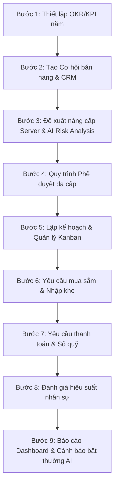

# Kịch Bản Demo Luồng Nghiệp Vụ Hệ Thống OmniBizAI

Tài liệu này hướng dẫn chi tiết luồng chạy thử (demo flow) tích hợp toàn bộ các module nghiệp vụ trong hệ thống **OmniBizAI** (ERP & Quản lý doanh nghiệp thông minh tích hợp AI). 

Kịch bản demo được xây dựng dựa trên một tình huống thực tế của doanh nghiệp: **"Triển khai dự án ERP cho Tập đoàn Vingroup và thực hiện mua sắm nâng cấp hạ tầng Server IT để phục vụ dự án."**

---

## 🔑 Danh Sách Tài Khoản Thử Nghiệm (Seed Data Accounts)

Tất cả tài khoản dưới đây đều sử dụng mật khẩu mặc định là: `123`

| Vai trò trong hệ thống (Role) | Họ và tên | Email đăng nhập | Bộ phận (Org Unit) |
| :--- | :--- | :--- | :--- |
| **Giám Đốc (Executive)** | Nguyễn Minh Tuấn | `giamdoc@omnibiz.vn` | Ban Giám Đốc (BOD) |
| **Phó GĐ Kinh Doanh (Executive)** | Trần Thị Hồng Nhung | `pgd.kinhdoanh@omnibiz.vn` | Ban Giám Đốc (BOD) |
| **Trưởng Phòng IT (Dept Manager)** | Phạm Đức Anh | `tp.it@omnibiz.vn` | Phòng CNTT (IT) |
| **Trưởng Phòng Tài Chính (Dept Manager)** | Võ Thị Lan Anh | `tp.finance@omnibiz.vn` | Phòng Tài Chính (FIN) |
| **Trưởng Phòng Kinh Doanh (Dept Manager)** | Hoàng Thị Mai | `tp.sales@omnibiz.vn` | Phòng Kinh Doanh (SALE) |
| **Nhân Viên Kinh Doanh (Staff)** | Vũ Ngọc Hải | `vu.ngoc.hai@omnibiz.vn` | Phòng Kinh Doanh (SALE) |
| **Kế Toán Trưởng (Accountant)** | Nguyễn Thị Hạnh | `ketoan.truong@omnibiz.vn` | Phòng Tài Chính (FIN) |
| **Quản trị hệ thống (System Admin)** | System Administrator | `sysadmin@omnibiz.vn` | Phòng CNTT (IT) |

---

## 📋 Sơ đồ Luồng Nghiệp Vụ End-to-End



---

## 🛠️ Chi Tiết Các Bước Thực Hiện Demo

### 🚀 Bước 1: Thiết lập mục tiêu chiến lược (OKRs / KPIs)
*Doanh nghiệp thiết lập mục tiêu doanh thu năm và liên kết mục tiêu này với các chỉ số hiệu suất phòng ban.*

* **Người thực hiện:** Giám Đốc (Nguyễn Minh Tuấn - `giamdoc@omnibiz.vn`)
* **Chức năng chính:** Quản lý OKRs, KPIs.
* **Đường dẫn trên UI:** `/Okr/Dashboard` hoặc `/Okr/Index` và `/KpiSetup`
* **Các bước thao tác:**
  1. Đăng nhập với tài khoản `giamdoc@omnibiz.vn`.
  2. Truy cập vào mục **Mục tiêu (OKRs)** -> Chọn **Tạo OKR mới** để thiết lập mục tiêu năm:
     * **Tiêu đề:** *Tăng trưởng doanh thu 30% trong năm 2026*
     * **Chu kỳ:** *2026*
     * **Cấp độ:** *Công ty (Company)*
  3. Thêm các **Kết quả then chốt (Key Results - KRs)** liên kết:
     * *Đạt mốc doanh thu 50 tỷ VNĐ* (Target: 50.0 tỷ VNĐ)
     * *Có 20 khách hàng doanh nghiệp mới* (Target: 20 khách hàng)
  4. Truy cập **KPI Setup** -> Thiết lập chỉ tiêu cho **Trưởng phòng Kinh doanh (Hoàng Thị Mai)**:
     * **KPI:** *Doanh số bán hàng hàng tháng*
     * **Chỉ tiêu:** *2.000 triệu VNĐ/tháng*

> [!TIP]
> Việc liên kết OKR cấp công ty xuống KPI của từng bộ phận giúp đảm bảo toàn bộ nhân sự trong doanh nghiệp đi đúng hướng chiến lược chung.

---

### 🤝 Bước 2: Quản lý khách hàng & Cơ hội bán hàng (CRM)
*Bộ phận kinh doanh tìm kiếm, chăm sóc và ghi nhận cơ hội bán hàng lớn từ Tập đoàn Vingroup.*

* **Người thực hiện:** Nhân Viên Kinh Doanh (Vũ Ngọc Hải - `vu.ngoc.hai@omnibiz.vn`)
* **Chức năng chính:** Quản lý Khách hàng, Cơ hội bán hàng, Lịch sử tương tác.
* **Đường dẫn trên UI:** `/Customers` và `/SalesOpportunity`
* **Các bước thao tác:**
  1. Đăng nhập với tài khoản `vu.ngoc.hai@omnibiz.vn`.
  2. Truy cập **Khách hàng** -> Chọn **Tập đoàn Vingroup** (`CUST-002`) để xem thông tin chi tiết.
  3. Truy cập **Cơ hội bán hàng (Sales Opportunities)** -> Chọn **Tạo cơ hội mới**:
     * **Tiêu đề:** *Triển khai ERP cho Vingroup*
     * **Giá trị ước tính:** *500.000.000 VNĐ*
     * **Giai đoạn:** *Đề xuất (Proposal)*
     * **Tỷ lệ thành công:** *70%*
     * **Mức độ nhiệt (Temperature):** *Ấm (Warm)*
  4. Ghi nhận một **Tương tác (Interaction)**: Tạo cuộc họp khởi động dự án trực tiếp với đại diện Vingroup để chốt yêu cầu kỹ thuật.

---

### 💻 Bước 3: Đề xuất yêu cầu vận hành & Phân tích rủi ro bằng AI
*Để chuẩn bị hạ tầng đáp ứng dự án ERP lớn của Vingroup, bộ phận IT cần nâng cấp hệ thống Server Core.*

* **Người thực hiện:** Trưởng Phòng IT (Phạm Đức Anh - `tp.it@omnibiz.vn`)
* **Chức năng chính:** Tạo Đề xuất vận hành, Sử dụng Gemini AI phân tích rủi ro.
* **Đường dẫn trên UI:** `/Operations` hoặc `/Operations/Create`
* **Các bước thao tác:**
  1. Đăng nhập với tài khoản `tp.it@omnibiz.vn`.
  2. Truy cập **Yêu cầu vận hành (Operation Requests)** -> Chọn **Tạo yêu cầu mới**:
     * **Tiêu đề:** *Nâng cấp hệ thống server core*
     * **Loại yêu cầu:** *IT-SUPPORT*
     * **Độ ưu tiên:** *Cao (High)*
     * **Tổng kinh phí dự kiến:** *50.000.000 VNĐ*
     * **Mô tả:** *Cần nâng cấp thêm RAM và ổ cứng cho cụm server database để đáp ứng tải tăng cao của hệ thống ERP.*
  3. Nhấp vào nút **AI Insights / Phân tích rủi ro AI** (sử dụng Gemini API tích hợp):
     * Hệ thống gửi ngữ cảnh yêu cầu qua Gemini để phân tích.
     * AI trả về báo cáo phân tích: *Việc nâng cấp server DB có thể gây downtime 2-4 tiếng ảnh hưởng đến giao dịch hiện tại. Khuyến nghị thực hiện nâng cấp vào 2h sáng Chủ Nhật và chuẩn bị sẵn phương án backup dữ liệu dự phòng.*
  4. Trưởng phòng IT ghi nhận đề xuất của AI vào kế hoạch và nhấn **Gửi duyệt (Submit)** yêu cầu để chuyển lên cấp trên.

---

### ✍️ Bước 4: Quy trình phê duyệt đa cấp (Approval Flow)
*Yêu cầu nâng cấp Server IT trị giá 50 triệu VNĐ cần được duyệt qua Trưởng phòng Tài chính (để kiểm tra ngân sách) và Giám đốc (để phê duyệt tối cao).*

* **Người thực hiện:** 
  1. Trưởng Phòng Tài Chính (Võ Thị Lan Anh - `tp.finance@omnibiz.vn`)
  2. Giám Đốc (Nguyễn Minh Tuấn - `giamdoc@omnibiz.vn`)
* **Chức năng chính:** Danh sách phê duyệt của tôi (My Tasks), Duyệt/Từ chối yêu cầu.
* **Đường dẫn trên UI:** `/Approvals/MyTasks`
* **Các bước thao tác:**
  1. **Duyệt cấp 1 (Tài chính):** 
     * Đăng nhập với tài khoản `tp.finance@omnibiz.vn`.
     * Truy cập mục **Phê duyệt của tôi (My Tasks)** -> Chọn yêu cầu *Nâng cấp hệ thống server core*.
     * Kiểm tra hạn mức ngân sách IT Quý 2 (`BD-IT-Q2` còn đủ hạn mức).
     * Nhập ghi chú: *"Đã kiểm tra ngân sách IT Q2, đủ hạn mức chi."* và bấm **Phê duyệt (Approve)**.
  2. **Duyệt cấp 2 (Lãnh đạo phê duyệt tối cao):**
     * Đăng nhập với tài khoản `giamdoc@omnibiz.vn`.
     * Truy cập mục **Phê duyệt của tôi (My Tasks)** -> Chọn yêu cầu đã qua bước Tài chính.
     * Xem chi tiết rủi ro AI đã phân tích.
     * Nhập ghi chú: *"Đồng ý triển khai gấp, chú ý sao lưu dữ liệu trước khi thực hiện."* và bấm **Phê duyệt (Approve)**.

---

### 📋 Bước 5: Chuyển đổi công việc & Quản lý Kanban (Workflow)
*Sau khi Yêu cầu Vận hành được duyệt, Trưởng phòng IT tiến hành lập kế hoạch chi tiết dưới dạng các thẻ công việc trên bảng Kanban.*

* **Người thực hiện:** Trưởng Phòng IT (Phạm Đức Anh - `tp.it@omnibiz.vn`)
* **Chức năng chính:** Kanban Board, Tạo/Cập nhật công việc, Giao việc, Viết Checklist và Bình luận.
* **Đường dẫn trên UI:** `/Workflow/Kanban`
* **Các bước thao tác:**
  1. Đăng nhập với tài khoản `tp.it@omnibiz.vn`.
  2. Truy cập **Quy trình & Kanban (Workflow)** -> Thấy các công việc được tự động chuyển đổi từ yêu cầu vận hành hoặc tạo thủ công:
     * *Khảo sát và đánh giá hệ thống hiện tại* (Trạng thái: *In Progress*)
     * *Lên kế hoạch mua sắm thiết bị* (Trạng thái: *Todo*)
  3. Chọn thẻ công việc *Khảo sát và đánh giá hệ thống hiện tại* để xem chi tiết:
     * **Giao việc (Assignee):** Gán cho bản thân (`tp.it@omnibiz.vn`).
     * **Tạo Checklist:**
       - [x] *Kiểm tra RAM usage server web*
       - [x] *Kiểm tra Disk IOPS server db*
       - [ ] *Tổng hợp report đánh giá cấu hình cần mua*
     * **Bình luận (Comments):** Ghi chú tiến độ: *"Đã hoàn thành kiểm tra RAM và Disk IOPS. Đang đợi báo giá linh kiện từ phía Vendor."*
  4. Thực hiện kéo thả thẻ công việc từ cột **Todo** sang **In Progress** hoặc **Done** trên giao diện trực quan.

---

### 📦 Bước 6: Yêu cầu mua sắm thiết bị & Nhập kho (Procurement & Inventory)
*Triển khai mua sắm linh kiện thiết bị Server Dell PowerEdge theo phê duyệt.*

* **Người thực hiện:** 
  1. Trưởng Phòng IT (`tp.it@omnibiz.vn`)
  2. Nhân Viên Kho / Trưởng Phòng Vận Hành (Ngô Thị Thanh Hằng - `tp.ops@omnibiz.vn`)
* **Chức năng chính:** Yêu cầu mua sắm, Đơn mua hàng (PO), Phiếu nhập kho, Cảnh báo kho.
* **Đường dẫn trên UI:** `/Procurement` và `/Inventory`
* **Các bước thao tác:**
  1. **Đề xuất mua sắm:** Trưởng phòng IT tạo **Đề xuất mua sắm (Procurement Request - PR)** cho sản phẩm *Dell PowerEdge Server* gửi đến nhà cung cấp *Dell Việt Nam* (`VND-DELL`).
  2. **Tạo Đơn mua hàng:** Bộ phận mua hàng/kế toán chuyển đổi PR thành **Đơn mua hàng (Purchase Order - PO)** gửi nhà cung cấp.
  3. **Nhập kho thiết bị:** 
     * Khi hàng được giao đến, Trưởng phòng Vận hành (`tp.ops@omnibiz.vn`) vào mục **Nhập kho (Goods Receipts)** -> Tạo phiếu nhập kho liên kết với PO.
     * Hệ thống tự động cập nhật số lượng tồn kho sản phẩm *Dell PowerEdge Server* trong kho.
     * Hệ thống giải tỏa trạng thái cảnh báo **Tồn kho thấp (Low Stock Alert)** của sản phẩm này thành trạng thái bình thường.

---

### 💵 Bước 7: Yêu cầu thanh toán & Ghi nhận sổ quỹ (Finance)
*Thực hiện thanh toán đợt 1 cho nhà cung cấp thiết bị và ghi nhận chi phí vào sổ quỹ tiền mặt.*

* **Người thực hiện:**
  1. Trưởng Phòng IT (`tp.it@omnibiz.vn`)
  2. Kế Toán Trưởng (Nguyễn Thị Hạnh - `ketoan.truong@omnibiz.vn`)
* **Chức năng chính:** Yêu cầu thanh toán (Payment Requests), Quản lý chi phí (Expenses), Sổ quỹ (Cash Book).
* **Đường dẫn trên UI:** `/Finance` hoặc `/CashBook`
* **Các bước thao tác:**
  1. **Tạo yêu cầu thanh toán:** Trưởng phòng IT đăng nhập, tạo **Yêu cầu thanh toán (Payment Request)** trị giá *25.000.000 VNĐ* đợt 1 cho thiết bị server.
  2. **Duyệt và Chi tiền:**
     * Kế toán trưởng đăng nhập `ketoan.truong@omnibiz.vn`.
     * Duyệt yêu cầu thanh toán trên.
     * Thực hiện chi tiền và ghi nhận giao dịch chi (TransactionType: *Expense*, Category: *Mua sắm trang thiết bị*) trị giá *25.000.000 VNĐ* vào **Sổ quỹ (Cash Book)**.
     * Số tiền này tự động khấu trừ vào **Ngân sách IT Q2/2026** (`BD-IT-Q2`), giúp kiểm soát ngân sách theo thời gian thực.

---

### 🎖️ Bước 8: Đánh giá hiệu suất nhân sự cuối kỳ (HR / Performance Evaluation)
*Cuối quý, hệ thống tự động tổng hợp kết quả OKR/KPI để đánh giá hiệu quả công việc của nhân sự.*

* **Người thực hiện:**
  1. Trưởng Phòng Nhân Sự (Đặng Văn Khôi - `tp.hr@omnibiz.vn`)
  2. Trưởng Phòng IT (`tp.it@omnibiz.vn`)
  3. Giám Đốc (`giamdoc@omnibiz.vn`)
* **Chức năng chính:** Check-in KPI, Đánh giá nhân sự.
* **Đường dẫn trên UI:** `/KpiCheckIn` và `/Evaluation`
* **Các bước thao tác:**
  1. **Check-in kết quả:** Trưởng phòng IT thực hiện **Check-in KPI** cuối tháng/quý: Báo cáo tỷ lệ uptime đạt 99.9%, hệ thống ghi nhận.
  2. **Tự đánh giá:** Trưởng phòng IT tự đánh giá năng lực trong kỳ đánh giá *Đánh giá hiệu suất Quý 1/2026*.
  3. **Đánh giá của Quản lý:** Giám đốc đăng nhập, chấm điểm đánh giá hiệu suất cho Trưởng phòng IT:
     * **Tổng điểm:** *85.0/100*
     * **Xếp loại:** *B+*
     * **Nhận xét:** *Hệ thống hạ tầng hoạt động ổn định, dự án server triển khai đúng tiến độ. Cần cải thiện thêm tốc độ hỗ trợ ticket nội bộ.*

---

### 📊 Bước 9: Phân tích Dashboard thông minh & Cảnh báo bất thường bằng AI
*Nhà lãnh đạo xem xét bức tranh toàn cảnh doanh nghiệp thông qua các biểu đồ phân tích thông minh và nhận cảnh báo sớm rủi ro tài chính.*

* **Người thực hiện:** Giám Đốc (Nguyễn Minh Tuấn - `giamdoc@omnibiz.vn`)
* **Chức năng chính:** Dashboard tổng hợp, AI Insights, Phát hiện bất thường chi phí (Anomaly Alerts).
* **Đường dẫn trên UI:** `/Dashboard` hoặc `/AnomalyAlerts`
* **Các bước thao tác:**
  1. Đăng nhập với tài khoản `giamdoc@omnibiz.vn`.
  2. Xem các chỉ số tài chính, doanh thu, tiến độ OKRs, ngân sách phòng ban trên **Dashboard tổng thể**.
  3. Hệ thống tích hợp dịch vụ **Phát hiện bất thường (Anomaly Detection Service)** tự động quét dữ liệu:
     * Phát hiện một chi phí tăng đột biến bất thường (như mua sắm server hoặc chi phí vượt ngân sách dự kiến).
     * Đưa ra **Cảnh báo bất thường (Anomaly Alerts)** kèm phân tích nguyên nhân để Giám đốc kịp thời kiểm soát rủi ro dòng tiền.

---

## 💡 Hướng Dẫn Validate Hệ Thống (Dành Cho Nhà Phát Triển)

Để đảm bảo dữ liệu sẵn sàng phục vụ buổi demo, vui lòng kiểm tra các điều kiện sau:

1. **Khởi chạy ứng dụng:** 
   Chạy lệnh `npm run dev` (hoặc khởi động server ASP.NET Core thông qua Visual Studio/VS Code) để chạy dự án tại local.
2. **Khởi tạo dữ liệu mẫu (Seed Data):**
   * Đảm bảo rằng file `Data/Seed/seed_data.sql` đã được import thành công vào database.
   * Khi khởi động dự án lần đầu, `Program.cs` sẽ tự động chạy migration và băm mật khẩu (`123`) cho các tài khoản mặc định.
3. **Cấu hình AI (Gemini API Key):**
   * Kiểm tra cấu hình API Key của Google Gemini trong file `appsettings.json` hoặc `appsettings.Development.json` tại mục:
     ```json
     "Gemini": {
       "ApiKey": "YOUR_GEMINI_API_KEY_HERE"
     }
     ```
   * Đảm bảo API Key hợp lệ để kiểm thử các tính năng phân tích rủi ro yêu cầu vận hành (AI Insights) và phát hiện bất thường hoạt động trơn tru.
