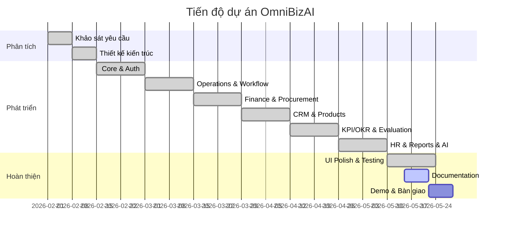

# TÀI LIỆU QUẢN LÝ DỰ ÁN — OMNIBIZAI

> Phiên bản: 1.0 | Ngày: 18/05/2026

---

## 1. Kế hoạch thực hiện

| Giai đoạn | Thời gian | Nội dung |
|---|---|---|
| Sprint 0 | Tuần 1–2 | Khảo sát, phân tích yêu cầu, thiết kế kiến trúc |
| Sprint 1 | Tuần 3–4 | Core: Tenant, Auth, Identity, Org Structure, Dashboard |
| Sprint 2 | Tuần 5–6 | Operations, Workflow, Kanban, Approvals |
| Sprint 3 | Tuần 7–8 | Finance, Procurement, PO, Goods Receipt/Issue |
| Sprint 4 | Tuần 9–10 | CRM, Customers, Vendors, Products, Sales Opportunity |
| Sprint 5 | Tuần 11–12 | KPI/OKR, Check-In, Evaluation, Mission/Vision |
| Sprint 6 | Tuần 13–14 | HR, Leave, Reports, AI Copilot, Notifications |
| Sprint 7 | Tuần 15–16 | UI Polish, Testing, Seed Data, Documentation |

---

## 2. Phân công thành viên

| STT | Thành viên | MSSV | Vai trò | Module phụ trách |
|---|---|---|---|---|
| 1 | [Thành viên 1] | [...] | Nhóm trưởng | Core, Auth, Dashboard, Settings |
| 2 | [Thành viên 2] | [...] | Thành viên | Operations, Workflow, Approvals |
| 3 | [Thành viên 3] | [...] | Thành viên | Finance, Procurement, Inventory |
| 4 | [Thành viên 4] | [...] | Thành viên | CRM, KPI/OKR, Reports, AI |

---

## 3. Timeline / Gantt Chart

---

## 4. Sprint Plan (Agile/Scrum)

### Quy trình mỗi Sprint (2 tuần)
1. **Sprint Planning** (Ngày 1): Xác định backlog, phân công task
2. **Daily Standup**: Báo cáo tiến độ hàng ngày
3. **Development**: Coding, code review
4. **Sprint Review** (Ngày 13): Demo chức năng
5. **Sprint Retrospective** (Ngày 14): Rút kinh nghiệm

### Công cụ quản lý
- **Source Control**: Git + GitHub
- **Task Management**: GitHub Issues / Trello
- **Communication**: Zalo Group / Discord
- **IDE**: Visual Studio 2022 / VS Code + Rider

---

## 5. Nhật ký công việc (tóm tắt)

| Tuần | Nội dung chính | Kết quả |
|---|---|---|
| 1–2 | Phân tích yêu cầu, khảo sát hệ thống tương tự | Hoàn thành SRS |
| 3–4 | Thiết kế DB (~95 bảng), cài đặt project, Identity | Core chạy được |
| 5–6 | CRUD Operations, Kanban drag-drop, Approval flow | Module vận hành OK |
| 7–8 | Procurement → PO → GR/GI pipeline, Cash Book | Tài chính & kho vận OK |
| 9–10 | CRM (Customer, Vendor, Product), Sales Opportunity | CRM hoàn thành |
| 11–12 | KPI/OKR (migrate từ hệ thống cũ), Evaluation | KPI/OKR tích hợp OK |
| 13–14 | HR, Leave, Reports (7 loại), AI Copilot, Notifications | Hệ thống đầy đủ |
| 15–16 | Apple Design System CSS, Seed Data, Bug fix, Docs | Sẵn sàng demo |

---

## 6. Rủi ro dự án

| # | Rủi ro | Mức độ | Xác suất | Tác động |
|---|---|---|---|---|
| 1 | .NET 10 Preview không ổn định | Cao | Trung bình | Lỗi runtime không mong muốn |
| 2 | Thiếu kinh nghiệm multi-tenant | Trung bình | Cao | Data leak giữa tenant |
| 3 | Tích hợp AI (Gemini) bị rate limit | Thấp | Trung bình | AI Copilot không hoạt động |
| 4 | Thành viên bận việc cá nhân | Trung bình | Cao | Trễ deadline sprint |
| 5 | SQL Server cascade delete conflicts | Cao | Cao | Migration thất bại |

---

## 7. Biện pháp xử lý rủi ro

| # | Rủi ro | Biện pháp |
|---|---|---|
| 1 | .NET 10 Preview | Pin phiên bản cụ thể, không upgrade giữa chừng |
| 2 | Multi-tenant leak | Global Query Filter + code review kỹ TenantId |
| 3 | AI rate limit | Implement fallback message, cache kết quả |
| 4 | Thành viên bận | Buffer 1 tuần mỗi sprint, cross-training |
| 5 | Cascade delete | `DeleteBehavior.Restrict` toàn cục |

---

## 8. Tiêu chí nghiệm thu

| # | Tiêu chí | Đạt/Không |
|---|---|---|
| 1 | Đăng nhập/đăng xuất thành công với 7 vai trò | ☐ |
| 2 | CRUD đầy đủ cho tất cả module chính | ☐ |
| 3 | Luồng phê duyệt hoạt động đúng | ☐ |
| 4 | Kanban drag-drop hoạt động | ☐ |
| 5 | Báo cáo hiển thị đúng dữ liệu | ☐ |
| 6 | AI Copilot trả lời được câu hỏi | ☐ |
| 7 | Phân quyền đúng theo vai trò | ☐ |
| 8 | Giao diện responsive, đẹp | ☐ |
| 9 | Seed data chạy không lỗi | ☐ |
| 10 | Tài liệu đầy đủ | ☐ |

---

## 9. Checklist bàn giao

- [ ] Source code đẩy lên GitHub (branch `main`)
- [ ] File `.gitignore` chuẩn
- [ ] Seed data script (`seed_data.sql`) chạy được
- [ ] Tài liệu kỹ thuật (File B)
- [ ] Hướng dẫn sử dụng (File C)
- [ ] Báo cáo tốt nghiệp (File A)
- [ ] Sơ đồ Mermaid (File F)
- [ ] Video demo (nếu có)
- [ ] Slide thuyết trình
- [ ] Database backup file
