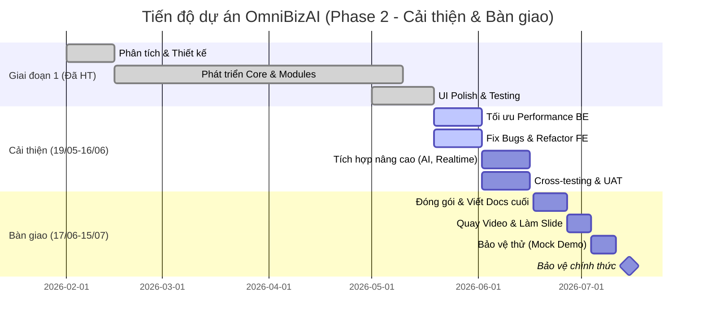

# TÀI LIỆU QUẢN LÝ DỰ ÁN — OMNIBIZAI

> Phiên bản: 1.1 | Ngày: 18/05/2026

---

## 1. Kế hoạch thực hiện (Đã hoàn thành đến 18/05/2026)

| Giai đoạn | Thời gian | Nội dung | Trạng thái |
|---|---|---|---|
| Sprint 0 | Tuần 1–2 | Khảo sát, phân tích yêu cầu, thiết kế kiến trúc | ✅ Đã hoàn thành |
| Sprint 1 | Tuần 3–4 | Core: Tenant, Auth, Identity, Org Structure, Dashboard | ✅ Đã hoàn thành |
| Sprint 2 | Tuần 5–6 | Operations, Workflow, Kanban, Approvals | ✅ Đã hoàn thành |
| Sprint 3 | Tuần 7–8 | Finance, Procurement, PO, Goods Receipt/Issue | ✅ Đã hoàn thành |
| Sprint 4 | Tuần 9–10 | CRM, Customers, Vendors, Products, Sales Opportunity | ✅ Đã hoàn thành |
| Sprint 5 | Tuần 11–12 | KPI/OKR, Check-In, Evaluation, Mission/Vision | ✅ Đã hoàn thành |
| Sprint 6 | Tuần 13–14 | HR, Leave, Reports, AI Copilot, Notifications | ✅ Đã hoàn thành |
| Sprint 7 | Tuần 15–16 | UI Polish, Testing, Seed Data, Documentation | ✅ Đã hoàn thành |

---

## 2. Phân công thành viên (Nhóm 7 người)

| STT | Thành viên | Vai trò | Chuyên môn | Mô tả công việc |
|---|---|---|---|---|
| 1 | Quân | Nhóm trưởng | Quản lý, Fullstack | Quản lý dự án, phân công task, review code, chuẩn bị Slide & Demo, hỗ trợ Core/Auth. |
| 2 | Như | Thành viên | Dev FE | UI/UX, Component Library, Dashboard, Responsive, Apple Design System. |
| 3 | Huy Nhật | Thành viên | Dev FE | UI/UX, Kanban Workflow drag-drop, Animations, Video Demo. |
| 4 | An | Thành viên | Dev BE | API Core, Authentication, Phân quyền RBAC, Multi-tenant. |
| 5 | Bảo | Thành viên | Dev BE | Operations, Workflow, Luồng phê duyệt (Approvals), Database Seed Data. |
| 6 | Phong | Thành viên | Dev BE | Tối ưu Database, Export Reports, Tích hợp AI Copilot (Gemini), Notifications. |
| 7 | Khánh | Thành viên | Tester | Xây dựng Test Plan, kịch bản test, QA, rà soát Tiêu chí nghiệm thu, Log bugs. |

---

## 3. Timeline / Gantt Chart (Cập nhật 19/05 - 15/07)

---

## 4. Sprint Plan (Agile/Scrum)

*(Các quy trình Scrum và công cụ vẫn giữ nguyên như giai đoạn 1, tập trung vào GitHub Issues để track bug do Tester báo cáo).*

---

## 5. Tiêu chí nghiệm thu (Trạng thái hiện tại)

| # | Tiêu chí | Đạt/Không |
|---|---|---|
| 1 | Đăng nhập/đăng xuất thành công với 7 vai trò | ✅ Đạt |
| 2 | CRUD đầy đủ cho tất cả module chính | ✅ Đạt |
| 3 | Luồng phê duyệt hoạt động đúng | ✅ Đạt |
| 4 | Kanban drag-drop hoạt động | ✅ Đạt |
| 5 | Báo cáo hiển thị đúng dữ liệu | ✅ Đạt |
| 6 | AI Copilot trả lời được câu hỏi | ✅ Đạt |
| 7 | Phân quyền đúng theo vai trò | ✅ Đạt |
| 8 | Giao diện responsive, đẹp | ✅ Đạt |
| 9 | Seed data chạy không lỗi | ✅ Đạt |
| 10 | Tài liệu đầy đủ | ✅ Đạt |

---

## 6. Checklist bàn giao (Trạng thái hiện tại)

- [x] Source code đẩy lên GitHub (branch `main`)
- [x] File `.gitignore` chuẩn
- [x] Seed data script (`seed_data.sql`) chạy được
- [x] Tài liệu kỹ thuật (File B)
- [x] Hướng dẫn sử dụng (File C)
- [x] Báo cáo tốt nghiệp (File A)
- [x] Sơ đồ Mermaid (File F)
- [ ] Video demo (Chưa quay)
- [ ] Slide thuyết trình (Đang chuẩn bị)
- [x] Database backup file

---

## 7. KẾ HOẠCH BỔ SUNG CHI TIẾT (19/05/2026 - 15/07/2026)

Giai đoạn này tập trung vào **Refactor code, Tối ưu hóa hiệu năng, Fix Bug mở rộng, và Hoàn thiện bảo vệ dự án**.

### Tháng 1: Tối ưu hóa và Mở rộng (19/05 - 16/06)

**Tuần 1 (19/05 - 25/05): Tối ưu Performance & UI/UX Fixes**
- **Hàng ngày:** Triage bugs từ Khánh (Tester). Daily standup 15p.
- **Quân:** Quản lý tiến độ, review code PRs, đánh giá lại kiến trúc DB.
- **Như & Huy Nhật:** Rà soát toàn bộ UI trên mobile/tablet. Fix các lỗi overflow, padding của thẻ Kanban. Nâng cấp CSS transitions cho mượt hơn.
- **An & Bảo:** Tối ưu hóa các query N+1 trong Entity Framework bằng `.Include()` hoặc Projection. Cải thiện tốc độ load Dashboard.
- **Phong:** Kiểm tra lại toàn bộ report logic. Cache kết quả báo cáo dùng Redis/MemoryCache (nếu cần).
- **Khánh:** Chạy Performance test cơ bản, ghi nhận các trang load chậm (> 3s). Test trên mobile.

**Tuần 2 (26/05 - 01/06): Nâng cấp AI Copilot & Real-time**
- **Hàng ngày:** Fix bugs tồn đọng.
- **Quân & Phong:** Nâng cấp AI Copilot — thêm ngữ cảnh (context) từ DB để AI trả lời chính xác hơn về dữ liệu công ty thay vì trả lời chung chung.
- **An & Bảo:** Tích hợp SignalR (hoặc Polling) cho thông báo (Notifications) để cập nhật real-time khi có người duyệt đơn.
- **Như & Huy Nhật:** Làm UI cho panel Notifications real-time. Nâng cấp giao diện Chat AI.
- **Khánh:** Viết Test case cho tính năng Real-time và AI Copilot nâng cao. Thực hiện Regression testing.

**Tuần 3 (02/06 - 08/06): Security & Data Integrity**
- **Quân & An:** Security audit. Rà soát lại JWT / Cookie Authentication. Kiểm tra kỹ CSRF, XSS. Đảm bảo 100% không leak data qua lại giữa các Tenant (Global Query Filter check).
- **Bảo & Phong:** Rà soát lại luồng xóa (Soft Delete) có bị lỗi Cascade không. Đảm bảo toàn bộ bảng đều tuân thủ `IsDeleted = true`.
- **Như & Huy Nhật:** Xử lý các màn hình báo lỗi (404, 500, Access Denied) cho đẹp mắt và chuẩn UX.
- **Khánh:** Test thâm nhập cơ bản (thử đổi ID trên URL xem có xem được data của tenant khác không).

**Tuần 4 (09/06 - 16/06): Code Freeze & UAT (User Acceptance Testing)**
- **Cả nhóm:** Code freeze (không thêm tính năng mới, chỉ fix bug).
- **Khánh:** Chạy toàn bộ test cases lần cuối (Full pass). Báo cáo UAT Report.
- **Quân:** Tổng hợp bug list. Đóng gói mã nguồn (Release v1.0).
- **Dev FE/BE:** Clear toàn bộ technical debt, comment code rõ ràng, xóa console.log / debug code.

### Tháng 2: Đóng gói và Bảo vệ (17/06 - 15/07)

**Tuần 5 (17/06 - 23/06): Hoàn thiện Tài liệu (Final Polish)**
- **Quân:** Rà soát lại toàn bộ File A (Báo cáo Word), File B (Technical Docs) lần cuối. Đảm bảo format chuẩn form nhà trường.
- **Khánh & Phong:** Hoàn thiện File E (Kiểm thử) bổ sung kết quả UAT và Performance.
- **Như & Huy Nhật:** Chụp screenshot đẹp nhất của ứng dụng đưa vào File C (Hướng dẫn sử dụng) và Slide.

**Tuần 6 (24/06 - 30/06): Chuẩn bị Media & Slide**
- **Huy Nhật & Như:** Lên kịch bản và quay Video Demo dự án (5-7 phút). Chỉnh sửa video, lồng tiếng/phụ đề.
- **Quân & An:** Làm Slide thuyết trình (Canva / PowerPoint). Cấu trúc: Đặt vấn đề -> Giải pháp -> Kiến trúc -> Demo -> Q&A.
- **Bảo & Phong:** Xây dựng lại bộ Seed Data "đẹp" nhất phục vụ cho việc Demo trực tiếp (có số liệu doanh thu, biểu đồ đẹp, Kanban có nhiều task).

**Tuần 7 (01/07 - 07/07): Mock Demo (Bảo vệ thử)**
- **Hàng ngày:** Tập luyện thuyết trình.
- **02/07:** Mock Demo lần 1 nội bộ nhóm. Căn thời gian thuyết trình (mỗi người 3-5 phút).
- **05/07:** Mock Demo lần 2. Mời GVHD hoặc bạn bè dự thính, đặt câu hỏi phản biện.
- **Khánh:** Chuẩn bị bộ câu hỏi "Q&A" dự phòng (GV thường hỏi gì về EF Core, Multi-tenant, AI?). Phân công người trả lời.

**Tuần 8 (08/07 - 15/07): Bảo vệ chính thức**
- **08/07 - 14/07:** Nộp toàn bộ file cứng (Báo cáo Word in bìa), file mềm (Source code, Database backup, Video).
- **15/07 (Dự kiến):** Lên Hội đồng bảo vệ dự án tốt nghiệp. Mặc trang phục lịch sự. Demo trực tiếp trên môi trường Local/Cloud ổn định nhất.
