# TỔNG HỢP SƠ ĐỒ MERMAID — HỆ THỐNG OMNIBIZAI

> Phiên bản: 1.0 | Ngày: 18/05/2026

---

## 1. Use Case Diagram — Tổng quan hệ thống

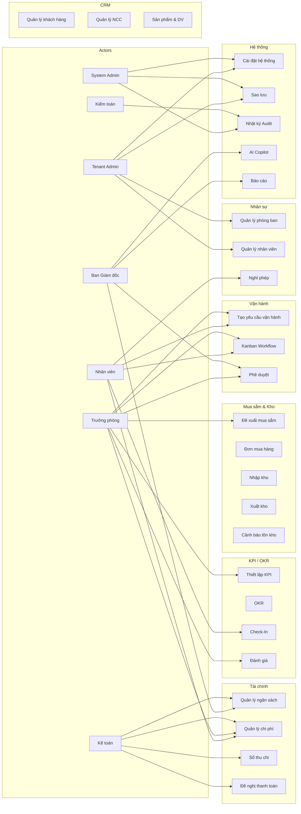

---

## 2. Use Case Diagram — Phân hệ Vận hành

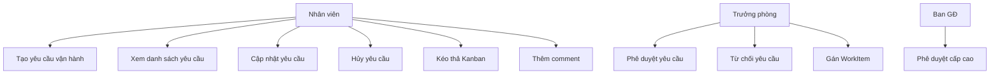

---

## 3. Activity Diagram — Luồng Yêu cầu vận hành

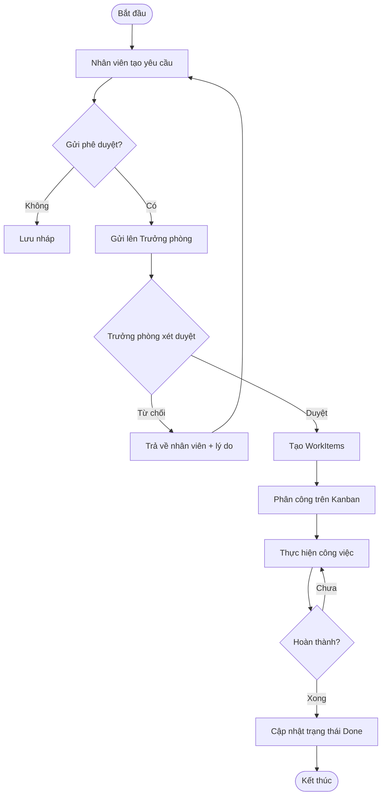

---

## 4. Activity Diagram — Luồng Mua sắm

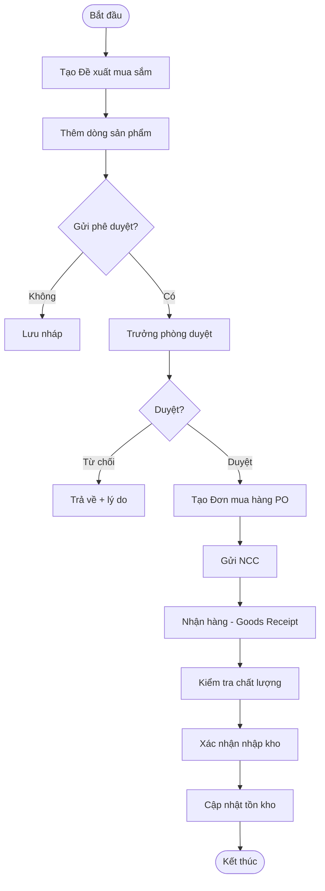

---

## 5. Activity Diagram — Luồng KPI Check-In

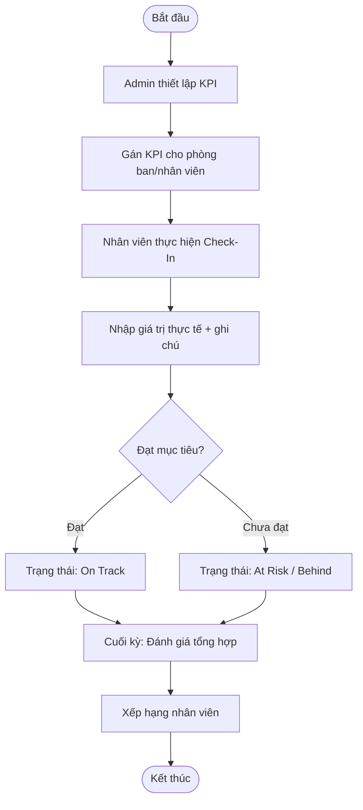

---

## 6. ERD Tổng quan

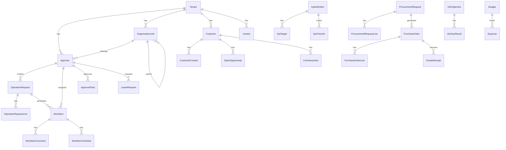

---

## 7. ERD — Phân hệ Tài chính & Mua sắm

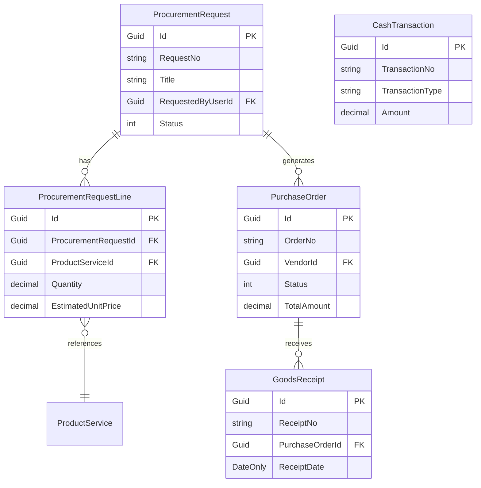

---

## 8. Sequence Diagram — Đăng nhập

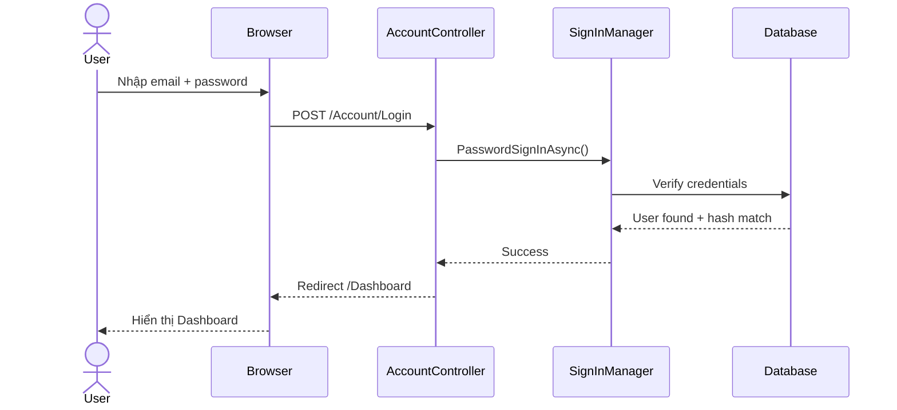

---

## 9. Sequence Diagram — Tạo yêu cầu vận hành

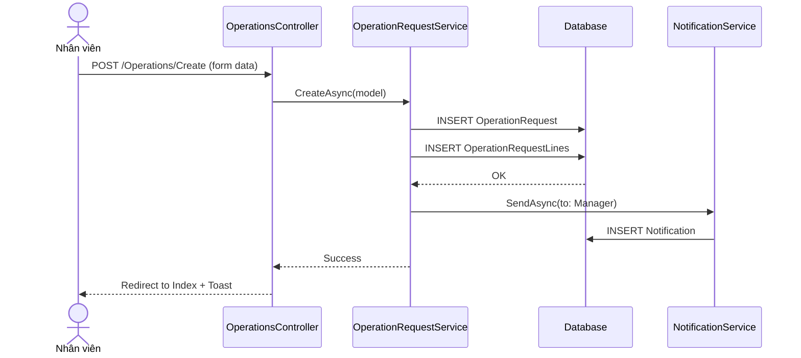

---

## 10. Sequence Diagram — Phê duyệt

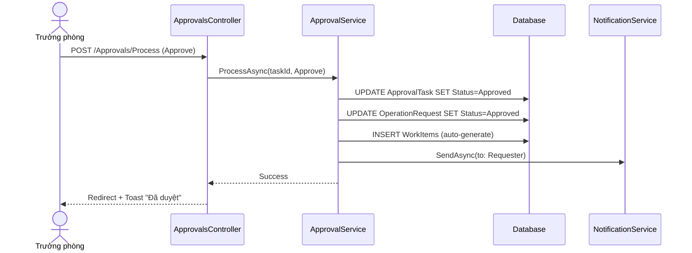

---

## 11. Component Diagram

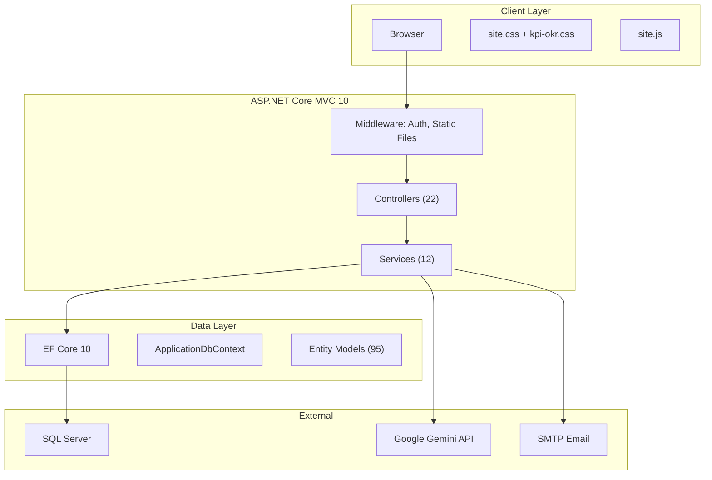

---

## 12. Deployment Diagram

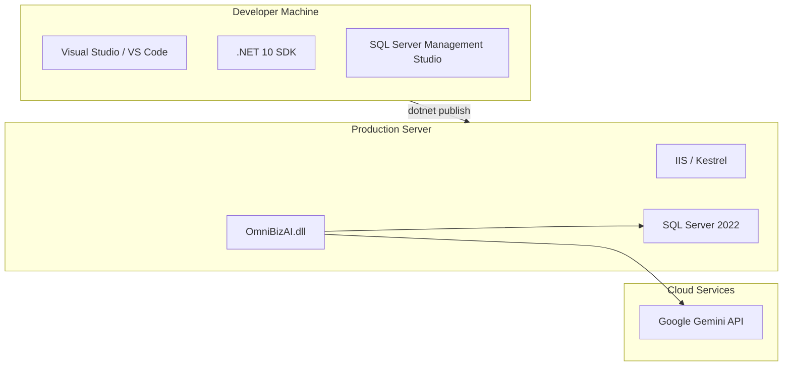

---

## 13. Package Diagram

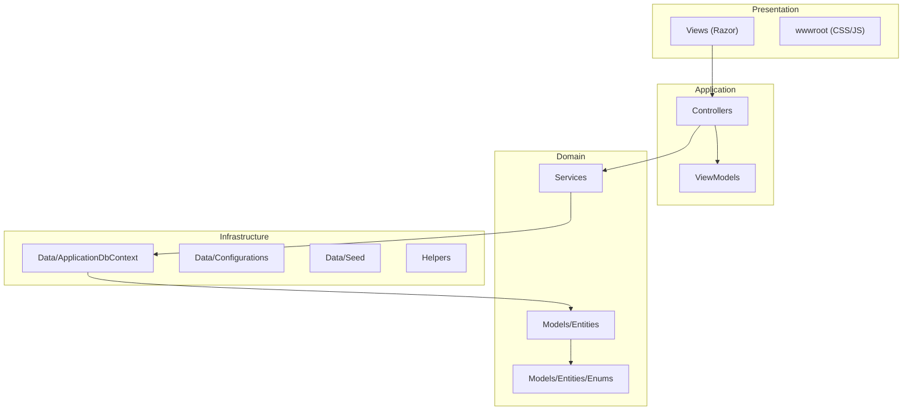

---

## 14. Sitemap / Sơ đồ giao diện

```mermaid
graph TD
    LOGIN["Đăng nhập"] --> DASH["Dashboard"]

    DASH --> VH["Vận hành"]
    VH --> VH1["Yêu cầu vận hành"]
    VH --> VH2["Kanban Workflow"]
    VH --> VH3["Phê duyệt"]

    DASH --> TC["Tài chính"]
    TC --> TC1["Tổng quan TC"]
    TC --> TC2["Ngân sách"]
    TC --> TC3["Chi phí"]
    TC --> TC4["Sổ thu chi"]
    TC --> TC5["Đề nghị thanh toán"]
    TC --> TC6["Mua sắm"]
    TC --> TC7["Đơn mua hàng"]
    TC --> TC8["Nhập kho"]
    TC --> TC9["Xuất kho"]
    TC --> TC10["Tồn kho"]

    DASH --> NS["Nhân sự"]
    NS --> NS1["Phòng ban"]
    NS --> NS2["Nhân viên"]
    NS --> NS3["Chức vụ"]
    NS --> NS4["Nghỉ phép"]

    DASH --> CRM["CRM"]
    CRM --> CRM1["Khách hàng"]
    CRM --> CRM2["NCC"]
    CRM --> CRM3["Sản phẩm"]

    DASH --> KPI["KPI/OKR"]
    KPI --> KPI1["OKR"]
    KPI --> KPI2["KPI Setup"]
    KPI --> KPI3["Check-In"]
    KPI --> KPI4["Đánh giá"]

    DASH --> SYS["Hệ thống"]
    SYS --> SYS1["Báo cáo"]
    SYS --> SYS2["AI Copilot"]
    SYS --> SYS3["Cài đặt"]
    SYS --> SYS4["Sao lưu"]
    SYS --> SYS5["Audit Log"]
```

---

## 15. Role-Permission Matrix

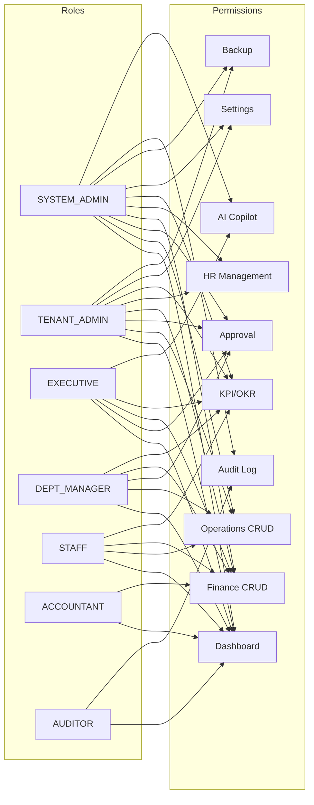
